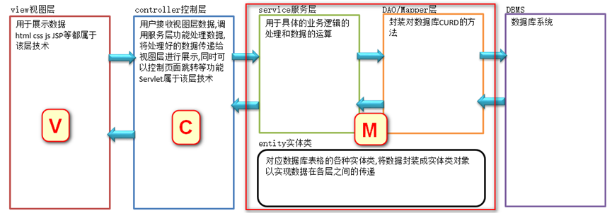

## MVC模式介绍

### 什么是MVC模式

**MVC是一种项目架构型模式**，它本身并不引入新的功能，只是用来指导我们改善应用程序的架构，使得应用的模型和视图相分离，从而得到更好的开发和维护效率。

在MVC模式中，应用程序被划分成了**模型（Model）**、 **视图（View）** 和 **控制器（Controller）** 三个部分。其中，模型部分包含了应用程序的业务逻辑和业务数据；视图部分封装了应用程序的输出形式，也就是通常所说的页面或者是界面；而控制器部分负责协调模型和视图，根据用户请求来选择要调用哪个模型来处理业务，以及最终由哪个视图为用户做出应答。

MVC模式的这三个部分的**职责非常明确，而且相互分离**，因此每个部分都可以独立的改变而不影响其他部分，从而大大提高了应用的灵活性和重用性。

## MVC的优势

### 耦合性低

视图层和业务层分离，这样就允许更改视图层代码而不用重新编译模型和控制器代码，同样，一个应用的业务流程或者业务规则的改变只需要改动MVC的模型层即可。因为模型与控制器和视图相分离，所以很容易改变应用程序的数据层和业务规则。

### 重用性高

MVC模式允许使用各种不同样式的视图来访问同一个服务器端的代码，因为多个视图能共享一个模型，它包括任何WEB（HTTP）浏览器或者无线浏览器（wap），比如，用户可以通过电脑也可通过手机来订购某样产品，虽然订购的方式不一样，但处理订购产品的方式是一样的。由于模型返回的数据没有进行格式化，所以同样的构件能被不同的界面使用。

MVC使开发和维护用户接口的技术含量降低。

### 开发效率提高,人员职责明确

使用MVC模式使开发时间得到较大的缩减，它使程序员（Java开发人员）集中精力于业务逻辑，界面程序员（HTML和JSP开发人员）集中精力于表现形式上。

### 耦合度低,可维护性高

分离视图层和业务逻辑层也使得WEB应用更易于维护和修改。每层代码修改可以达到无损替换的效果

### 有利软件工程化管理

由于不同的层各司其职，每一层不同的应用具有某些相同的特征，有利于通过工程化、工具化管理程序代码。控制器也提供了一个好处，就是可以使用控制器来联接不同的模型和视图去完成用户的需求，这样控制器可以为构造应用程序提供强有力的手段。给定一些可重用的模型和视图，控制器可以根据用户的需求选择模型进行处理，然后选择视图将处理结果显示给用户。

## MVC分层及责任划分 

### 项目分层结构设计

### 层次之间的特点

下层不知道上层的存在,仅完成自身的功能,不关心结果如何使用

每一层仅知道下层的存在，而忽略其他层的存在,只关心结果的取得,不关心结果的实现过程
