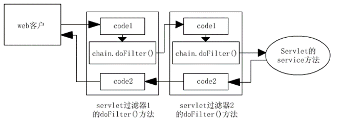
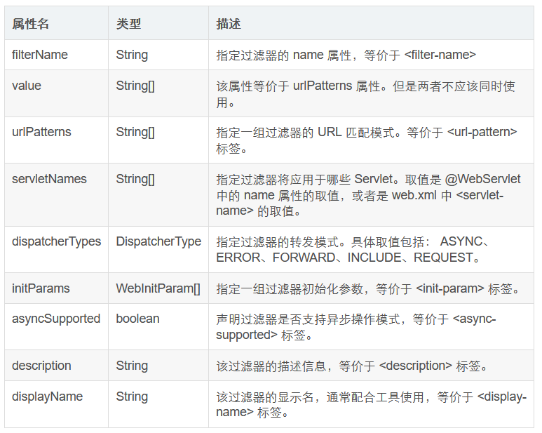

## 过滤器链的使用

### 什么是过滤链

在一个web应用中，可以开发编写**多个Filter，这些Filter组合起来称之为一个Filter链**。



web服务器根据Filter在`web.xml文件`中的注册顺序，决定先调用哪个Filter.

当第一个Filter的`doFilter方法`被调用时，web服务器会创建一个代表Filter链的`FilterChain对象`传递给该方法。在`doFilter方法`中，开发人员如果调用了`FilterChain对象`的`doFilter方法`，则web服务器会检查`FilterChain对象`中是否还有filter，如果有，则调用第2个filter，如果没有，则调用目标资源。

使用过滤器链的好处是我们可以将不同的过滤功能分散到多个过滤器中,分工明确,避免一个过滤器做太多的业务处理,**降低了代码的耦合度,这体现了单一职责的设计原则,应用了责任链的代码设计模式.**

### 代码案例

```Java
public class MyFilter1 implements Filter {
    @Override
    public void init(FilterConfig filterConfig) throws ServletException {
        
    }
    @Override
    public void doFilter(ServletRequest servletRequest, ServletResponse servletResponse, FilterChain filterChain) throws IOException, ServletException {
        System.out.println("MyFilter1   在过滤请求 ");
        filterChain.doFilter(servletRequest,servletResponse);
        System.out.println("MyFilter1   在过滤响应");
    }
    @Override
    public void destroy() {
    }
}
```

```Java
public class MyFilter2 implements Filter {
    @Override
    public void init(FilterConfig filterConfig) throws ServletException {
    }
    @Override
    public void doFilter(ServletRequest servletRequest, ServletResponse servletResponse, FilterChain filterChain) throws IOException, ServletException {
        System.out.println("MyFilter2   在过滤请求 ");
        filterChain.doFilter(servletRequest,servletResponse);
        System.out.println("MyFilter2   在过滤响应");
    }
    @Override
    public void destroy() {
    }
}
```

配置过滤链

**决定过滤器的执行顺序是由filter-mapping标签的顺序决定**
```XML
<?xml version="1.0" encoding="UTF-8"?>
<web-app xmlns="http://xmlns.jcp.org/xml/ns/javaee"
         xmlns:xsi="http://www.w3.org/2001/XMLSchema-instance"
         xsi:schemaLocation="http://xmlns.jcp.org/xml/ns/javaee http://xmlns.jcp.org/xml/ns/javaee/web-app_4_0.xsd"
         version="4.0">
    <filter>
        <filter-name>filter1</filter-name>
        <filter-class>com.meturing.filter.MyFilter1</filter-class>
    </filter>
    <filter>
        <filter-name>filter2</filter-name>
        <filter-class>com.meturing.filter.MyFilter2</filter-class>
    </filter>
    
    <!--这里的顺序决定了过滤器的顺序-->
    <filter-mapping>
        <filter-name>filter2</filter-name>
        <url-pattern>/myServlet1.do</url-pattern>
    </filter-mapping>
    <filter-mapping>
        <filter-name>filter1</filter-name>
        <url-pattern>/myServlet1.do</url-pattern>
    </filter-mapping>
</web-app>
```

## 过滤器初始化参数

同`servlet`一样,filter也可以通过`web.xml`进行初始化配置,在初始化时,将参数封装进入`FilterConfig`并在调用init方法时作为实参传入,我们可以在init方法中获取参数.`FilterConfig接口`为我们提供了如下功能

```Java
String getFilterName();//得到filter的名称。

String getInitParameter(String   name);//返回定名称的初始化参数的值。如果不存在返回null.

Enumeration   getInitParameterNames();//返回过滤器的所有初始化参数的名字的枚举集合。

public ServletContext   getServletContext();//返回Servlet上下文对象的引用。

```

### 使用案例

配置Filter初始化参数
```XMl
<filter>
	<filter-name>filter1</filter-name>
	<filter-class>com.meturing.filter.MyFilter1</filter-class>
	<init-param>
		<param-name>realname</param-name>
		<param-value>xiaoming</param-value>
	</init-param>
	<init-param>
		<param-name>gender</param-name>
		<param-value>boy</param-value>
	</init-param>
	<init-param>
		<param-name>age</param-name>
		<param-value>10</param-value>
	</init-param>
	<init-param>
		<param-name>charset</param-name>
		<param-value>UTF-8</param-value>
	</init-param>
</filter>
```

读取初始化参数
```Java
public class MyFilter1 implements Filter {
    @Override
    public void init(FilterConfig filterConfig) throws ServletException {
        // 获取初始化的一些参数
        String realname = filterConfig.getInitParameter("realname");
        System.out.println("realname:"+realname);
        Enumeration<String> pNames = filterConfig.getInitParameterNames();
        while(pNames.hasMoreElements()){
            String pName = pNames.nextElement();
            System.out.println(pName+":"+filterConfig.getInitParameter(pName));
        }
    }
```

## 过滤器注解的应用

过滤器注解可以使用 `@WebFilter`

### 注解的属性



### 注解的使用

```Java
@WebFilter(urlPatterns = "/myServlet1.do")
public class Filter0_MyFilter implements Filter {
    @Override
    public void init(FilterConfig filterConfig) throws ServletException {
    }
    @Override
    public void doFilter(ServletRequest servletRequest, ServletResponse servletResponse, FilterChain filterChain) throws IOException, ServletException {
        System.out.println("MyFilter0   在过滤请求 ");
        filterChain.doFilter(servletRequest,servletResponse);
        System.out.println("MyFilter0   在过滤响应");
    }
    @Override
    public void destroy() {
    }
}

```

```Java
@WebFilter(urlPatterns = "/myServlet1.do",initParams = {@WebInitParam(name="realname",value ="zhangsan"),@WebInitParam(name="charset",value ="utf-8")})
public class Filter1_MyFilter implements Filter {
    @Override
    public void init(FilterConfig filterConfig) throws ServletException {
        // 获取初始化的一些参数
        String realname = filterConfig.getInitParameter("realname");
        System.out.println("realname:"+realname);
        Enumeration<String> pNames = filterConfig.getInitParameterNames();
        while(pNames.hasMoreElements()){
            String pName = pNames.nextElement();
            System.out.println(pName+":"+filterConfig.getInitParameter(pName));
        }
    }
    @Override
    public void doFilter(ServletRequest servletRequest, ServletResponse servletResponse, FilterChain filterChain) throws IOException, ServletException {
        System.out.println("MyFilter1   在过滤请求 ");
        filterChain.doFilter(servletRequest,servletResponse);
        System.out.println("MyFilter1   在过滤响应");
    }
    @Override
    public void destroy() {
    }
}

```