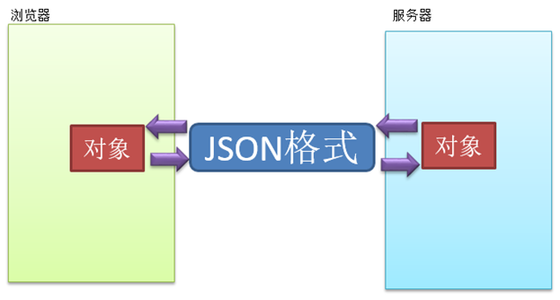

## AJAX数据格式处理

### 响应普通文本数据

如果服务器给我们响应的数据非常简答,那么使用字符串就好了,不需要我们做复杂的处理,后台编码也简单.

#### 前端代码

```JSP
<%@ page contentType="text/html;charset=UTF-8" language="java" %>
  <html>
  <head>
    <title>AJAX数据响应格式</title>
    <script>
        var xhr;
        function  getData(){
            xhr =new XMLHttpRequest();
            xhr.open("GET","testDataServlet",true)
            xhr.onreadystatechange=showData
            xhr.send(null)
        }
        function showData(){
           if(xhr.readyState==4&&xhr.status==200) {
                var text =xhr.responseText;
                console.info(text)
           }
        }
    </script>
  </head>
  <body>
  <button  type="button" onclick="getData()"  >触发</button>
  </body>
  </html>
```

####  后台代码

```JAVA
@WebServlet("/testDataServlet")

  public class TestDataServlet extends HttpServlet {
    @Override
    public void service(HttpServletRequest req, HttpServletResponse resp) throws ServletException, IOException {
        resp.setContentType("text/html;charset=UTF-8");
        resp.setCharacterEncoding("UTF-8");
        resp.getWriter().print("普通文本数据");
    }
}
```

#### 总结

如果响应的数据是一个对象或者对象集合,数据处理起来会非常麻烦,可以使用JSON格式处理

## JSON的介绍和应用

`JSON(JavaScriptObject Notation, JS 对象简谱)` **是一种轻量级的数据交换格式**。它基于`ECMAScript` (欧洲计算机协会制定的js规范)的一个子集，采用完全独立于编程语言的文本格式来存储和表示数据。简洁和清晰的层次结构使得JSON 成为理想的数据交换语言。 易于人阅读和编写，同时也易于机器解析和生成，并有效地提升网络传输效率。

### 优点

**轻量级**,在这里用它不是为了厉害的功能代码,而是为了实现数据转换

Json 格式**既能考虑到前端对象的特点 同时也能兼顾后台对象**信息的特点

Json 格式**可以被前端直接识别并解析成对象**

jQuery形式实现AJAX默认前后端传递数据的格式就是JSON



```JSP
<%@ page contentType="text/html;charset=UTF-8" language="java" %>
<html>
<head>
    <title>Title</title>
    <script>
        /*
        * JSON格式创建对象
        * {"属性名":"属性值","属性名":属性值 ... ... }
        * */
        var person ={"name":"zhangsan","age":10}
        alert(person.name)
        alert(person.age)
        var persons =[{"name":"zhangsan","age":10},{"name":"lisi","age":10},{"name":"wangwu","age":10}];
        for (var i = 0; i <persons.length ; i++) {
            var person =persons[i];
            console.log(person.name)
            console.log(person.age)
        }
        var personStr='{"name":"zhangsan","age":10}';// 是一个字符串
        // 可以直接把上面这种格式的字符串直接转换成对象
        var p =JSON.parse(personStr);
        console.log(p.name)
        console.log(p.age)
    </script>
</head>
<body>
</body>
</html>
```

### JSON 与 JS 对象的关系

很多人搞不清楚 JSON 和 JS 对象的关系，甚至连谁是谁都不清楚。其实，可以这么理解：**JSON 是 JS 对象的字符串表示法，它使用文本表示一个 JS 对象的信息，本质是一个字符串。**

```JS
var obj = {a: 'Hello', b: 'World'}; //这是一个对象，注意键名也是可以使用引号包裹的
var json = '{"a": "Hello", "b":   "World"}'; //这是一个 JSON 字符串，本质是一个字符串
```

### JSON和JS对象互转

要实现从JSON字符串转换为JS对象，使用 `JSON.parse()`

```JS
var obj = JSON.parse('{"a": "Hello", "b":   "World"}'); //结果是 {a: 'Hello', b: 'World'}
```

要实现从JS对象转换为JSON字符串，使用`JSON.stringify()` 方法

```JS
var json = JSON.stringify({a: 'Hello', b: 'World'}); //结果是  '{"a": "Hello", "b": "World"}'
```

JSON格式字符串,拼接比较麻烦,可以修改toString方法但是就破坏了toString原有的格式,而且一旦字段如果太多修改工作量大,后面可以使用**JSON工具类转换**

## GSON工具类的使用

gson工具类中已经给我们封装好了json格式和java对象之间转换的API,我们直接使用即可,再也不用手动去转换项目中

### 使用案例

添加gson-2.2.4.jar

页面代码
```JSP
<%@ page contentType="text/html;charset=UTF-8" language="java" %>
<html>
  <head>
    <title>$Title%sSourceCode%lt;/title>
    <script>
      var xhr ;
      function testData(){
        xhr =new XMLHttpRequest();
        xhr.open("GET","testServlet.do",true);
        xhr.onreadystatechange=showReturnInfo;
        xhr.send(null);
      }
      function showReturnInfo(){
        if(xhr.readyState==4 && xhr.status==200){
          var info =xhr.responseText;
          var users=JSON.parse(info)
          for (var i = 0; i <users.length ; i++) {
            var user =users[i];
            console.log(user.uname)
            console.log(user.age)
            console.log(user.gender)
            console.log(user.birthday)
          }
        }
      }
    </script>
  </head>
  <body>
  <input type="button" value="测试" onclick="testData()">
  </body>
</html>
```

后台代码
```Java
@WebServlet("/testServlet.do")
public class TestServlet extends HttpServlet {
    @Override
    protected void service(HttpServletRequest req, HttpServletResponse resp) throws ServletException, IOException {
        User user1 =new User("晓明1",10,"男",new Date());
        User user2 =new User("晓明2",10,"男",new Date());
        User user3 =new User("晓明3",10,"男",new Date());
        User user4 =new User("晓明4",10,"男",new Date());
        User user5 =new User("晓明5",10,"男",new Date());
        ArrayList<User> list =new ArrayList<>();
        Collections.addAll(list,user1,user2,user3,user4,user5);
        // 响应普通文本数据
        resp.setCharacterEncoding("UTF-8");
        resp.setContentType("text/html;charset=UTF-8");
        GsonBuilder gsonBuilder = new GsonBuilder().setDateFormat("yyyy-MM-dd HH:mm:ss");
        Gson gson = gsonBuilder.create();
        String str = gson.toJson(list);
        System.out.println(str);
        resp.getWriter().print(str);
    }
}
```