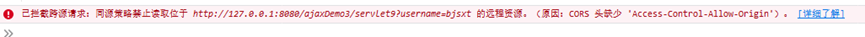

## 什么是跨域

出于浏览器的同源策略限制。同源策略（Sameoriginpolicy）是一种约定，它是浏览器最核心也最基本的安全功能，如果缺少了同源策略，则浏览器的正常功能可能都会受到影响。可以说Web是构建在同源策略基础之上的，浏览器只是针对同源策略的一种实现。同源策略会阻止一个域的javascript脚本和另外一个域的内容进行交互。所谓同源（即指在同一个域）就是两个页面**具有相同的协议（protocol），主机（host）和端口号（port）**

本地路径地址：`http://127.0.0.1:8080/meturing/index.jsp`

`https://127.0.0.1:8080/meturing/index.jsp` 协议不一样
`http://192.168.24.11:8080/meturing/index.jsp` IP不一致
`http://127.0.0.1:8888/meturing/index.jsp`端口不一致
`http://localhost:8080/meturing/index.jsp` IP不一致

## 测试跨域限制

前端代码
```JSP
<html>
<head>
    <title>$Title%sSourceCode%lt;/title>
    <meta charset="UTF-8"/>
    <script src="js/jquery.min.js"></script>
    <script>
        function checkUname(){
            // 获取输入框中的内容
            if(null == $("#unameI").val() || '' == $("#unameI").val()){
                $("#unameInfo").text("用户名不能为空");
                return;
            }
            $("#unameInfo").text("");
            // 通过jQuery.ajax() 发送异步请求
            $.ajax(
                    {
                        type:"GET",// 请求的方式 GET  POST
                        url:"http://localhost:8080/ajaxDemo3_war_exploded/unameCheckServlet.do?", // 请求的后台服务的路径
                        data:"uname="+$("#unameI").val(),// 提交的参数
                        success:function(info){ // 响应成功执行的函数
                            $("#unameInfo").text(info)
                        }
                    }
            )
        }
    </script>
</head>
<body>
<form action="myServlet1.do" >
    用户名:<input id="unameI" type="text" name="uname" onblur="checkUname()">
    <span id="unameInfo" style="color: red"></span><br/>
    密码:<input type="password" name="pwd"><br/>
    <input type="submit" value="提交按钮">
</form>
</body>
</html>
```

浏览器请求该资源的地址是:`http://127.0.0.1:8020/testa/index.html`
但是其内部ajax请求的资源的是:`http://localhost:8080/ajaxDemo3_war_exploded/unameCheckServlet.do? `

**二者端口号和IP其实是不一致的,这就受到同源策略的控制**


## jsonp实现跨域请求

我们发现Web页面上调用js文件时则不受是否跨域的影响,拥有”src”这个属性的标签都却拥有跨域的能力，比如`<\script>`、`<\img>`、`<\iframe>`。那么跨域访问数据就有了一种可能，那就是在远程服务器上设法把数据装进js格式的文件里，供客户端调用和进一步处理。就好比使用一个`<script>`,让其src属性指向我们要访问的跨域资源,然后以接收js文件的形式接收数据

**通过:dataType:'jsonp'属性实现跨域请求**
**通过 jsonp:'callback',属性简化回调函数处理**

通过 `jsonp:’callback’`,实现自动处理回调函数名,相当于在url地址栏最后后拼接一个`callback=函数名`,后台自动根据这个函数名处理JS脚本,jQuery也会根据这函数名自动在前端处理回调函数,这样我们直接在success方法中接收返回的数据即可,可以不用自己去自己定义回调函数.后台获取参数时,**参数名要要和jsonp:后面的函数名保持一致**

``` JSP
<html>
<head>
    <title>$Title%sSourceCode%lt;/title>
    <meta charset="UTF-8"/>
    <script src="http://localhost:8080/ajaxDemo3_war_exploded/js/jquery.min.js"></script>
    <script>
        function checkUname(){
            // 获取输入框中的内容
            if(null == $("#unameI").val() || '' == $("#unameI").val()){
                $("#unameInfo").text("用户名不能为空");
                return;
            }
            $("#unameInfo").text("");
            // 通过jQuery.ajax() 发送异步请求
            $.ajax(
                {
                    type:"GET",// 请求的方式 GET  POST
                    url:"http://localhost:8080/ajaxDemo3_war_exploded/unameCheckServlet.do?", // 请求的后台服务的路径
                    data:{uname:$("#unameI").val()},// 提交的参数
                    dataType:"jsonp",
                    jsonp:"aaa",
                    success:function(info){
                    	$("#unameInfo").text(info)
                    }
                }
            )
        }
    </script>
</head>
<body>
<form action="myServlet1.do" >
    用户名:<input id="unameI" type="text" name="uname" onblur="checkUname()">
    <span id="unameInfo" style="color: red"></span><br/>
    密码:<input type="password" name="pwd"><br/>
    <input type="submit" value="提交按钮">
</form>
</body>
</html>
```

后端代码
```Java
@WebServlet("/unameCheckServlet.do")
public class UnameCheckServlet extends HttpServlet {
    @Override
    protected void service(HttpServletRequest req, HttpServletResponse resp) throws ServletException, IOException {
        String uname = req.getParameter("uname");
        String callBack = req.getParameter("aaa");
        System.out.println(uname);
        String info="";
        if("meturing".equals(uname)){
            info="用户名已经占用";
        }else{
            info="用户名可用";
        }
        // 向浏览器响应数据
        resp.setCharacterEncoding("UTF-8");
        resp.setContentType("text/javaScript;charset=UTF-8");
        resp.getWriter().print(callBack+"('"+info+"')");
    }
}
```

## 通过getJson方实现跨域请求

`getJSON`方法是可以实现跨域请求的,在用该方法实现跨域请求时,在传递参数上应该注意在url后拼接一个`jsoncallback=?`,**jQuery会自动替换?为正确的回调函数名**,我们就可以不用单独定义回调函数了

前端代码
```JSP
<html>
<head>
    <title>$Title%sSourceCode%lt;/title>
    <meta charset="UTF-8"/>
    <script src="http://localhost:8080/ajaxDemo3_war_exploded/js/jquery.min.js"></script>
    <script>
        function checkUname(){
            // 获取输入框中的内容
            if(null == $("#unameI").val() || '' == $("#unameI").val()){
                $("#unameInfo").text("用户名不能为空");
                return;
            }
            $("#unameInfo").text("");
           $.getJSON(
           	"http://localhost:8080/ajaxDemo3_war_exploded/unameCheckServlet.do?jsoncallback=?",
           	{uname:$("#unameI").val()},
           	function(info){
           		$("#unameInfo").text(info)
           	}
           )
        }
    </script>
</head>
<body>
<form action="myServlet1.do" >
    用户名:<input id="unameI" type="text" name="uname" onblur="checkUname()">
    <span id="unameInfo" style="color: red"></span><br/>
    密码:<input type="password" name="pwd"><br/>
    <input type="submit" value="提交按钮">
</form>
</body>
</html>
```


后端代码
```Java
@WebServlet("/unameCheckServlet.do")
public class UnameCheckServlet extends HttpServlet {
    @Override
    protected void service(HttpServletRequest req, HttpServletResponse resp) throws ServletException, IOException {
        String uname = req.getParameter("uname");
        String callBack = req.getParameter("jsoncallback");
        System.out.println(uname);
        String info="";
        if("meturing".equals(uname)){
            info="用户名已经占用";
        }else{
            info="用户名可用";
        }
        // 向浏览器响应数据
        resp.setCharacterEncoding("UTF-8");
        resp.setContentType("text/javaScript;charset=UTF-8");
        resp.getWriter().print(callBack+"('"+info+"')");
    }
}
```


## 通过过滤器跨域

通过后台代码也可以实现跨域,一般在过滤器中添加如下代码,那么前端在请求时就不用考虑跨域问题了

```Java
/*请求地址白名单 *代表所有*/
resp.setHeader("Access-Control-Allow-Origin", "*");
/*请求方式白名单*/
resp.setHeader("Access-Control-Allow-Methods", "POST, GET, OPTIONS, DELETE");
resp.setHeader("Access-Control-Max-Age", "3600");
resp.setHeader("Access-Control-Allow-Headers", "x-requested-with");
```