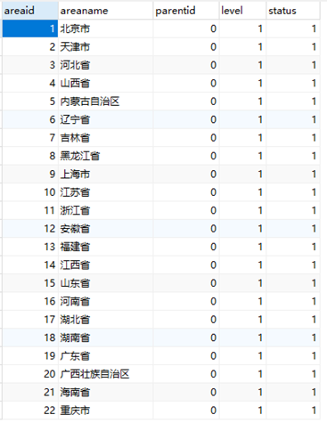
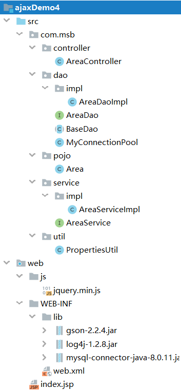
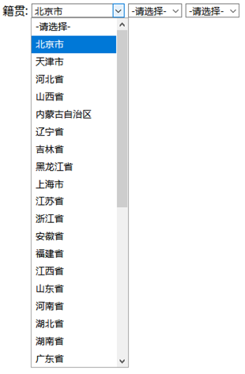
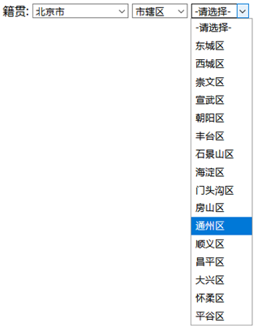

## 数据准备

使用china.sql生成area表格



## 项目搭建



## 项目代码

前端代码
```JSP
<%@ page contentType="text/html;charset=UTF-8" language="java" %>
<html>
  <head>
    <title>$Title%sSourceCode%lt;/title>
    <script src="js/jquery.min.js"></script>
    <script>
      $(function(){
        // 获取所有的省份信息
        showArea(0,"#provience")
      })
      function showArea(val,selectID){
        $.ajax({
          type:"GET",
          url:"areaController.do",
          data:{parentID:val},
          dataType:"json",
          success:function(areas){
            // 清除上一次选择省份时,遗留的城市
            $(selectID).html('<option>-请选择-</option>');
            $.each(areas,function(i,e){
              $(selectID).append('<option value="'+e.areaid+'">'+e.areaname+'</option>')
            })
            if(selectID== "#city"){
              $("#qu").html('<option>-请选择-</option>');
            }
          }
        })
      }
    </script>
  </head>
  <body>
  籍贯:
  <select id="provience" onchange="showArea(this.value,'#city')">
    <option>-请选择-</option>
  </select>
  <select id="city" onchange="showArea(this.value,'#qu')">
    <option>-请选择-</option>
  </select>
  <select id="qu">
    <option>-请选择-</option>
  </select>
  </body>
</html>
```

AreaController代码
```Java
@WebServlet("/areaController.do")
public class AreaController extends HttpServlet {
    private AreaService areaService=new AreaServiceImpl();
    @Override
    protected void service(HttpServletRequest req, HttpServletResponse resp) throws ServletException, IOException {
        Integer parentID=0;
        try {
            parentID= Integer.parseInt(req.getParameter("parentID"));
        } catch (NumberFormatException e) {
            e.printStackTrace();
        }
        List<Area> areas=areaService.findByParentID(parentID);
        String json = new Gson().toJson(areas);
        resp.setCharacterEncoding("UTF-8");
        resp.setContentType("text/html;charset=UTF-8");
        resp.getWriter().print(json);
    }
}
```

AreaService代码
```Java
public class AreaServiceImpl implements AreaService {
    private AreaDao areaDao =new AreaDaoImpl();
    @Override
    public List<Area> findByParentID(Integer parentID) {
        List<Area> areas = areaDao.findByParentID(parentID);
        return areas;
    }
}
```

AreaDao代码
```Java
public class AreaDaoImpl extends BaseDao implements AreaDao  {
    @Override
    public List<Area> findByParentID(int parentID) {
        String sql="select * from area where parentid= ?";
        return baseQuery(Area.class, sql, parentID);
    }
}
```

测试效果


