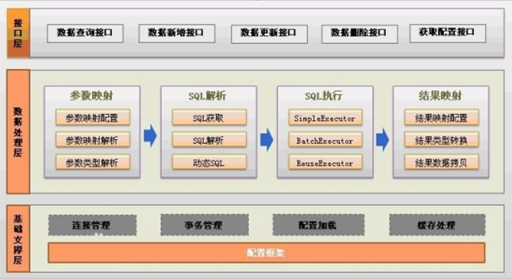
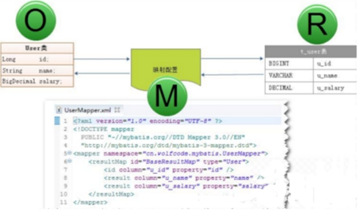

## 为什么要使用Mybatis

原生的JDBC使用中,我们存在以下痛点:
- 编码繁琐
- 需要我们自己将结果集映射成对象
- 性能不太好 : 连接池 及 缓存 需要我们自己管理
-  SQL语句和java代码的耦合度特别高

## 了解Mybatis

**MyBatis 本是Apache的一个开源项目iBatis**, 2010年这个项目由Apache Software Foundation 迁移到了Google Code，且改名为MyBatis 。2013年11月迁移到GitHub。iBATIS一词来源于“internet”和“abatis”的组合，是一个基于Java的持久层框架。

**MyBatis 是一款优秀的持久层框架，它支持定制化 SQL、存储过程以及高级映射。** MyBatis 避免了几乎所有的 JDBC 代码和手动设置参数以及获取结果集。MyBatis 可以使用简单的 XML 或注解来配置和映射原生信息，将接口和 Java 的 POJOs(Plain Ordinary Java Object,普通的 Java对象)映射成数据库中的记录。

 精简解释：**MyBatis是一个半自动ORM框架，其本质是对JDBC的封装。使用MyBatis重点需要程序员编写SQL命令，不需要写一行JDBC代码。**

### 什么是框架

`框架（Framework）`是一个框子——指其约束性，也是一个架子——指其支撑性。是一个基本概念上的结构，用于去解决或者处理复杂的问题。框架这个广泛的定义使用的十分流行，尤其在软件概念。

框架( Framework ) 对于java来说,就是**一系列为了解决特定问题而定义的一系列接口和实现类**,在组织框架代码时,使用了一系列优秀的设计模式,使代码无论在性能上还是API操作上得到很大提升.**框架可以看做是项目开发的半成品,基本的底层操作已经封装完毕,通过框架,程序员可以从底层代码中解脱出来,专注于业务逻辑的完成和性能的优化。** 框架规定了你的应用的体系结构。它定义了整体结构，类和对象的分割，各部分的主要责任，类和对象怎么协作，以及控制流程。框架预定义了这些设计参数，以便于应用设计者或实现者能集中精力于应用本身的特定细节。

如果将开发完成的软件比作是一套已经装修完毕的新房，那框架就好比是一套已经修建好的毛坯房。用户直接购买毛坯房，建筑质量和户型合理有保证，还省去了自己建造房屋的时间，一举多得。

在开发过程是使用框架，同样可以保证**减少开发时间、降低开发难度，并且还保证设计质量**。好比和世界上最优秀的软件工程师是一个项目的，并且他们完成的还是基础、全局的工作。想想是不是很嗨的一件事情。

框架还有一个作用是约束。莎士比亚说,"一千个观众眼中有一千个哈姆雷特" 即仁者见仁,智者见智.说每个人都会对作品有不同的理解，每个人对待任何事物都有自己的看法，一千个人就有可能有一千种不同的看法1000人心中有1000个哈姆雷特。同样的技术解决同样的问题会产生不同流程和风格的解决方案，而采用一种框架其实就是限制用户必须使用其规定的方案来实现，**可以降低程序员之间沟通以及日后维护的成本**。

常用的基于JavaEE的三大开源框架，已经从`SSH`、`SSH2`过渡到了`SSM`：`SpringMVC、Spring、MyBatis` >>> `springBoot`

**总之，框架是一个半成品，已经对基础的代码进行了封装并提供相应的API，开发者在使用框架是直接调用封装好的API可以省去很多代码编写，从而提高工作效率和开发速度。**

### 什么是ORM

JDBC的缺点：需要手动的完成面向对象的Java语言、面向关系的数据库之间数据的转换，代码繁琐无技术含量，影响了开发效率. (查询是需要手动的将结果集的列数据转换为Java对象的属性；而添加操作时需要手动将Java对象的属性转换为数据库表的列字段)

关于面向对象的Java语言、面向关系的数据库之间数据的转换必须要做，问题在于这个转换是否可以不由开发者来做。**ORM框架就是专门来做这个问题的，相当于在面向对象语言和关系数据库之间搭建一个桥梁。**

`ORM`，`Object-Relationl Mapping`，对象关系映射，它的作用是在关系型数据库和对象之间作一个映射，这样我们在具体的操作数据库的时候，只要像平时操作对象一样操作它就可以了，ORM框架会根据映射完成对数据库的操作，就不需要再去和复杂的SQL语句打交道了。

### 什么是持久层

**持久（Persistence）**，即把数据（如内存中的对象）保存到可永久保存的存储设备中（如磁盘）。持久化的主要应用是将内存中的数据存储在关系型的数据库中，当然也可以存储在磁盘文件中、XML数据文件中等等。

**持久层（Persistence Layer）**，即专注于实现数据持久化应用领域的某个特定系统的一个逻辑层面，将数据使用者和数据实体相关联。之前使用JDBC访问数据库的DAO层，后面采用MyBatis访问数据库的mapper层，就是持久层。