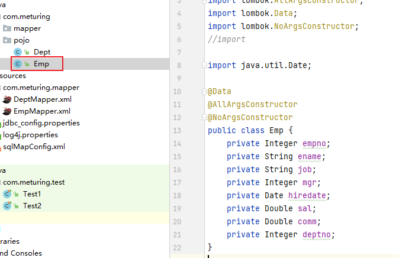
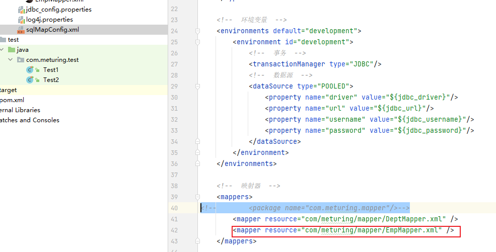
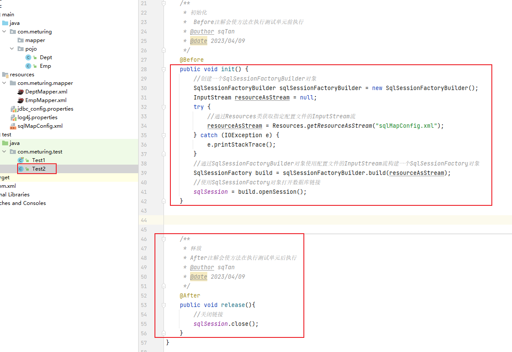

在前面的学习中,我们简单搭建了一个Mybatis的项目环境

[基础写法思路](../02_搭建Mybatis项目环境/搭建Mybatis项目环境.md#基础写法思路)

基于普通模式的开发,也成为传统DAO模式. 简单来讲就是创建对应的接口,然后在接口的实现类中使用SQLSession对象调用select insert delete update 等方法实现. 目前我们能开发中不再使用这种方式,但是我们仍需要了解SQLSession的基本API实现CRUD的功能以及参数的传递

## 构建环境

本次我们尝试对Emp表进行操作,所以需要执行以下操作:

#### 新增Emp实体类



#### 新增EmpMapper.xml


#### 新增XML文件映射

由于当前使用的是非接口式开发,所以Mappers标签中不可以使用Package标签进行扫描,只能一个一个mapper标签的对XML进行注册



#### 新增测试类




## SQLSession 查询的三种方式

SQLSession对象本身的API中存在三个查询方法,能够实现如下查询方式:

1. 返回单个对象 : `selectOne`
2. 返回对象的List集合 : `selectList`
3. 返回对象的Map集合 : `selectMap`

### 返回单个对象


#### Mapper层

正常情况下我们查询单个对象的Java代码如下

```Java
public emp findOne(){
   ......
}
```

所以EmpMapper.xml

```XMl
<select id="findOne" resultType="emp" >  
    select * from emp where EMPNO = '7499'
</select>
```

####  测试代码

Test2.Java

```Java
@Test  
public void test2(){  
    //执行查询方法  
    Emp emp = sqlSession.selectOne("findOne");  
    System.out.println(emp);  
}
```

如果多个Mapper.xml中出现相同的ID,则Mybatis会出现错误提示,找不到具体方法.
所以我们可以使用`Mapper名字.id名字`
```Java
@Test  
public void test2(){  
    //执行查询方法  
    Emp emp = sqlSession.selectOne("empMapper.findOne");  
    System.out.println(emp);  
}
```

### 返回对象的List集合

#### Mapper层

正常情况下我们查询多个对象集合的Java代码如下

```Java
public List<emp> findAll(){
   ......
}
```

所以EmpMapper.xml

```XMl
<select id="findAll" resultType="emp" >  
    select * from emp
</select>
```

####  测试代码

Test2.Java

```Java
@Test  
public void test2(){  
   //执行查询方法  
   List<Emp> deptList = sqlSession.selectList("empMapper.findAll");  
   deptList.stream().forEach(System.out::println);
}
```

### 返回对象的Map集合

#### Mapper层

正常情况下我们查询多个对象Map集合的Java代码如下

```Java
public Map<emp> findAll(){
   ......
}
```

所以EmpMapper.xml

```XMl
<select id="findMap" resultType="map" >  
    select * from emp
</select>
```

####  测试代码

Test2.Java

`selectMap("Id名字","作为Key的字段")`  注意:作为Key的字段大小写需要完全和DB中保持一致

```Java
@Test  
public void test3(){  
    //执行查询方法  
    Map<Object, Object> objectObjectMap = sqlSession.selectMap("findMap", "EMPNO");  
    for (Map.Entry<Object, Object> objectObjectEntry : objectObjectMap.entrySet()) {  
        System.out.println(objectObjectEntry.getKey()+":"+objectObjectEntry.getValue());  
    }  
}
```

## SQLSession的参数传递

Mapper中通过`parameterType`属性来控制参数的类型及数量
通常情况下`parameterType`属性可以不写,Mybatis可以根据自己的情况进行判断,但是**如果写就要写对**

使用`${}` 或 `#{}` 来进行参数的占位,两者区别如下:
 - `${}` 代表mybatis底层使用`Statment`语句对象,参数是以字符串拼接的形式设置
 - `#{}` 代表mybatis底层使用的`preparedStatment`语句对象,参数使用?作为占位符处理<font color="#ff0000">[常用]</font>

### 单一参数传递

#### Mapper层

Java伪代码

```Java
public emp findByEmpno(int empno){
   ......
}
```

所以EmpMapper.xml

```XMl
<select id="findByEmpno" resultType="emp" parameterType="int">  
    select  * from emp where empno = #{empno}  
</select>
```

####  测试代码

Test2.Java

```Java
@Test  
public void test1(){  
    //执行查询方法  
    Emp emp = sqlSession.selectOne("findByEmpno", 7499);  
    System.out.println(emp);  
}
```

### 多参数Map传递

Java伪代码

```Java
public List<Emp> findByEmpno(Map<String,String> empMap){
   ......
}
```

所以EmpMapper.xml

```XMl
<select id="findEmpByDeptnoAndSal" resultType="emp" parameterType="map">  
    select * from emp where deptno = #{deptno} and sal &gt;= #{sal}  
</select>
```

注意:对于SQL中的敏感符号,如`<` `> `通常参考HTML转义,w3school在线文档中有转译符号对应规则 

####  测试代码

Test2.Java

```Java
@Test  
public void test2(){  
    //执行查询方法  
    HashMap<String, Object> parameterMap = new HashMap<>();  
    parameterMap.put("deptno","30");  
    parameterMap.put("sal",1500.0);  
    List<Object> findEmp = sqlSession.selectList("findEmpByDeptnoAndSal", parameterMap);  
    findEmp.stream().forEach(System.out::println);  
}
```

### 多参数实体类对象传递

Java伪代码

```Java
public List<Emp> findByEmpno(emp){
   ......
}
```

所以EmpMapper.xml

```XMl
<select id="findEmpByDeptnoAndSal2" resultType="emp" parameterType="emp">  
    select * from emp where deptno = #{deptno} and sal &gt;= #{sal}  
</select>
```

注意:对于SQL中的敏感符号,如`<` `> `通常参考HTML转义,w3school在线文档中有转译符号对应规则 

####  测试代码

Test2.Java

```Java
@Test  
public void test3(){  
    //执行查询方法  
    Emp emp = new Emp();  
    emp.setDeptno(30);  
    emp.setSal(1500.0);  
    List<Object> findEmp = sqlSession.selectList("findEmpByDeptnoAndSal2", emp);  
    findEmp.stream().forEach(System.out::println);  
}
```

## SQLSession实现DML全部操作

在上面的案例中,我们实现了对数据查询的简场景和复杂场景,接下来我们继续学习对数据的`增` `删` `改`功能

由于`增` `删 ` `改` 方法都会返回受影响的行数,所以**标签中没有resultType**,默认会返回int类型数据

需要注意的是,由于对数据实行DML数据会涉及到数据的事务问题.
默认情况下`sqlSession = build.openSession();`是开启的手动提交,我们需要在执行操作后再次执行`sqlSession.commit();` 提交 或者 `sqlSession.rollback();` 回滚数据. 当然我们可以`sqlSession = build.openSession(true);` **设置事务的自动提交**


### 增加

Java伪代码

```Java
pubilc int addEmp(Emp emp){
  ...
}
```

#### Mapper层

```XML
<insert id="insertEmp" parameterType="emp">  
    INSERT INTO emp VALUES(#{empno},#{ename},#{job},#{mgr},#{hiredate},#{sal},#{comm},#{deptno});
</insert>
```

#### 测试代码

```Java
@Test  
public void testInsert(){  
    Emp emp = new Emp(8899,"张三","SALESMAN",7839,new Date(),3100.0, 200.0,10 );  
    sqlSession.insert("insertEmp", emp);  
}
```

### 修改

Java伪代码

```Java
pubilc int updateEmp(Emp emp){
  ...
}
```

#### Mapper层

```XMl
<update id="updateEmp" parameterType="emp">  
    UPDATE emp SET ENAME=#{ename} WHERE EMPNO=#{empno}</update>
```

#### 测试代码

```Java
@Test  
public void testUpdate(){  
    Emp emp = new Emp();  
    emp.setEmpno(8899);  
    emp.setEname("李四");  
    sqlSession.insert("updateEmp", emp);  
}
```

### 删除

Java伪代码

```Java
pubilc int deleteEmp(Emp emp){
  ...
}
```

#### Mapper层

```XMl
<delete id="deleteEmp" parameterType="int">  
    DELETE FROM emp WHERE EMPNO=#{empno}
</delete>
```

#### 测试代码

```Java
@Test  
public void testDelete(){  
    sqlSession.delete("deleteEmp", 8899);  
}
```