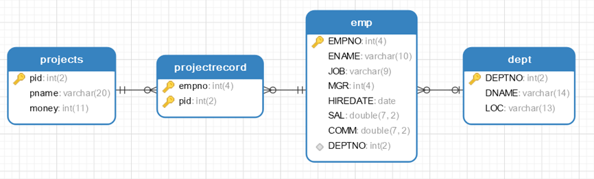
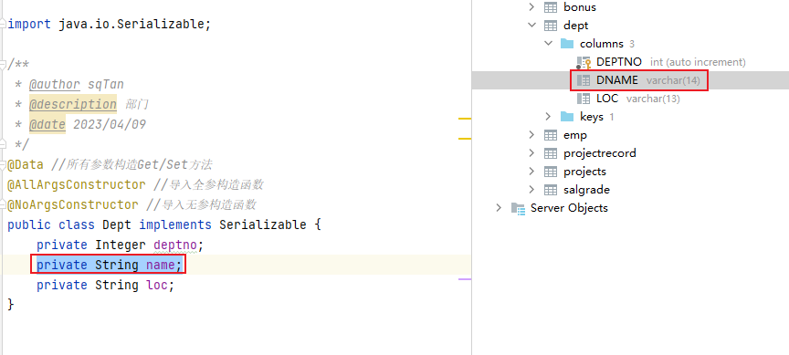

## 数据准备

```SQL
CREATE TABLE `projects`  (
  `pid` int(2) NOT NULL AUTO_INCREMENT,
  `pname` varchar(20) CHARACTER SET utf8mb4 COLLATE utf8mb4_0900_ai_ci NOT NULL,
  `money` int(11) NULL DEFAULT NULL,
  PRIMARY KEY (`pid`) USING BTREE
) ENGINE = InnoDB CHARACTER SET = utf8mb4 COLLATE = utf8mb4_0900_ai_ci ROW_FORMAT = Dynamic;

INSERT INTO `projects` VALUES (1, ' ***大学OA', 500000);
INSERT INTO `projects` VALUES (2, '学生选课系统', 100000);
INSERT INTO `projects` VALUES (3, '讲师测评系统', 20000);
INSERT INTO `projects` VALUES (4, '线上问答系统 ', 20000);
CREATE TABLE `projectrecord`  (
  `empno` int(4) NOT NULL,
  `pid` int(2) NOT NULL,
  PRIMARY KEY (`empno`, `pid`) USING BTREE,
  INDEX `fk_project_pro`(`pid`) USING BTREE,
  CONSTRAINT `fk_emp_pro` FOREIGN KEY (`empno`) REFERENCES `emp` (`EMPNO`) ON DELETE CASCADE ON UPDATE CASCADE,
  CONSTRAINT `fk_project_pro` FOREIGN KEY (`pid`) REFERENCES `projects` (`pid`) ON DELETE CASCADE ON UPDATE CASCADE
) ENGINE = InnoDB CHARACTER SET = utf8mb4 COLLATE = utf8mb4_0900_ai_ci ROW_FORMAT = Dynamic;

INSERT INTO `projectrecord` VALUES (7369, 1);
INSERT INTO `projectrecord` VALUES (7521, 1);
INSERT INTO `projectrecord` VALUES (7369, 2);
INSERT INTO `projectrecord` VALUES (7499, 2);
INSERT INTO `projectrecord` VALUES (7521, 2);
INSERT INTO `projectrecord` VALUES (7369, 3);
INSERT INTO `projectrecord` VALUES (7499, 3);
INSERT INTO `projectrecord` VALUES (7521, 3);
INSERT INTO `projectrecord` VALUES (7369, 4);
INSERT INTO `projectrecord` VALUES (7499, 4);
```



## resultMap标签

### resultType和resultMap

- resultType
	- resultType可以把查询结果封装到pojo类型中，但必须pojo类的属性名和查询到的数据库表的字段名一致。如果sql查询到的字段与pojo的属性名不一致，则需要使用resultMap将字段名和属性名对应起来，进行手动配置封装，将结果映射到pojo中
- resultMap
	- resultMap可以实现将查询结果映射为复杂类型的pojo，比如在查询结果映射对象中包括pojo和list实现一对一查询和一对多查询。

###  resultMap标签解析

-   resultMap元素属性
1.  `id`:映射规则集的唯一标识，可以被select元素的resultMap属性应用
2.  `type`:映射的结果类型，这里指定封装成userList实例

- resultMap元素包含以下子元素
1. ` id`:指定和数据表主键字段对应的标识属性。设置此项可以提升MyBatis框架的性能，特别是应用缓存和嵌套结果映射的时候。
2.  `result`:指定结果集字段和实体类属性的映射关系。
3.  `association`:映射到JavaBean某个“复杂类型”属性，比如JavaBean类
4.  `collection`:映射到JavaBean某个“复杂类型”属性，比如集合
## 关联查询

### 手动映射

如果实体类中的字段名字与数据库中的字段名字不符的话,我们可以通过`resultMap`标签进行手动映射

例如: **Dept在数据库中存在dname字段,但在实体类中叫做name**


- DeptMapper.Java接口
```JAVA
List<Dept> findDepts();
```

- DeptMapper.XML
```XML
<!--手动处理字段之间的映射关系-->  
<resultMap id="deptMap" type="dept">  
    <!--id标识当前字段为主键-->  
    <id column="deptno" property="deptno"></id>  
    <!--当属性名和查询出的数据表字段名相同 可以不写映射关系-->  
    <!--column表示数据库中的字段名 property表示实体类中的字段名-->  
    <result column="dname" property="name"></result>  
    <result column="loc" property="loc"></result>  
</resultMap>  
<select id="findDepts" resultMap="deptMap">  
    select * from dept
</select>
```

- 测试代码
```Java
@Test  
public void findDepts(){  
    DeptMapper deptMapper = sqlSession.getMapper(DeptMapper.class);  
    List<Dept> deptList = deptMapper.findDepts();  
    deptList.stream().forEach(System.out::println);  
}
```

### 一对一查询 : association子属性

根据编号查询员工信息及所在的部门信息

执行的SQL: 
```SQL
select * from  
emp e  
left join dept d  
on e.deptno =d.deptno  
where empno = '7499'
```

#### 分析

我们看到emp表与dept表存在一对一的关系,所以在构建实体类的时候可以为emp表中创建一个dept的私有属性

#### 代码

构建实体类
```Java
@Data  
@AllArgsConstructor  
@NoArgsConstructor  
public class Emp implements Serializable {  
    private Integer empno;  
    private String ename;  
    private String job;  
    private Integer mgr;  
    private Date hiredate;  
    private Double sal;  
    private Double comm;  
    private Integer deptno;  
    private Dept dept;  
}
```

```Java
@Data //所有参数构造Get/Set方法  
@AllArgsConstructor //导入全参构造函数  
@NoArgsConstructor //导入无参构造函数  
public class Dept implements Serializable {  
    private Integer deptno;  
    private String name;  
    private String loc;  
}
```

接口
```Java
List<Emp> findEmpJoinDeptByEmpno(String empno);
```

Mapper
```XML
<resultMap id="empMap" type="emp">  
    <!--设置emp本身的八个属性的映射关系-->  
    <id column="empno" property="empno"></id>  
    <result column="ename" property="ename"></result>  
    <result column="job" property="job"></result>  
    <result column="mgr" property="mgr"></result>  
    <result column="hiredate" property="hiredate"></result>  
    <result column="sal" property="sal"></result>  
    <result column="comm" property="comm"></result>  
    <result column="deptno" property="deptno"></result>  
    <!--  
        association 处理一对一 封装一对一信息关系的标签  
           property  emp类的属性名  
           javaType  用哪个类的对象给属性赋值  
   -->  
    <association property="dept" javaType="dept">  
        <id column="deptno" property="deptno"></id>  
        <result column="dname" property="name"></result>  
        <result column="loc" property="loc"></result>  
    </association>  
</resultMap>  
<select id="findEmpJoinDeptByEmpno" resultMap="empMap">  
    select * from    emp e    left join dept d    on e.deptno =d.deptno    where empno = #{empno}
</select>
```

测试
```Java
@Test  
public void  findEmpJoinDeptByEmpno(){  
    EmpMapper empMapper = sqlSession.getMapper(EmpMapper.class);  
    List<Emp> empList = empMapper.findEmpJoinDeptByEmpno("7499");  
    empList.stream().forEach(System.out::println);  
}
```

### 一对多查询 : collection子属性

根据部门号查询部门信息及该部门的所有员工信息

执行的SQL: 
```SQL
select * from dept d left join emp e on d.deptno =e.deptno where d.deptno = 20
```

#### 分析

我们看到emp表与dept表存在多对一的关系,所以在构建实体类的时候可以为dept表中创建一个emp集合的私有属性

#### 代码

构建实体类
```Java
@Data //所有参数构造Get/Set方法  
@AllArgsConstructor //导入全参构造函数  
@NoArgsConstructor //导入无参构造函数  
public class Dept1 implements Serializable {  
    private Integer deptno;  
    private String name;  
    private String loc;  
    private List<Emp1> emp1List;  
}
```

```Java
@Data  
@AllArgsConstructor  
@NoArgsConstructor  
public class Emp1 implements Serializable {  
    private Integer empno;  
    private String ename;  
    private String job;  
    private Integer mgr;  
    private Date hiredate;  
    private Double sal;  
    private Double comm;  
    private Integer deptno;  
}
```

接口
```Java
List<Dept1> findDeptLeftEmp(Integer deptno);
```

Mapper
```XML
<resultMap id="findDeptLeftEmp" type="dept1">  
    <!--id标识当前字段为主键-->  
    <id column="deptno" property="deptno"></id>  
    <!--当属性名和查询出的数据表字段名相同 可以不写映射关系-->  
    <!--column表示数据库中的字段名 property表示实体类中的字段名-->  
    <result column="dname" property="name"></result>  
    <result column="loc" property="loc"></result>  
    <collection property="emp1List" ofType="emp1">  
        <id column="empno" property="empno"></id>  
        <result column="ename" property="ename"></result>  
        <result column="job" property="job"></result>  
        <result column="mgr" property="mgr"></result>  
        <result column="hiredate" property="hiredate"></result>  
        <result column="sal" property="sal"></result>  
        <result column="comm" property="comm"></result>  
        <result column="deptno" property="deptno"></result>  
    </collection>  
</resultMap>  
<select id="findDeptLeftEmp" resultMap="findDeptLeftEmp">  
    select * from dept d left join emp e on d.deptno =e.deptno where d.deptno =#{deptno}
</select>
```

测试
```Java
@Test  
public void  findDeptLeftEmp(){  
    DeptMapper mapper = sqlSession.getMapper(DeptMapper.class);  
    List<Dept1> dept1s = mapper.findDeptLeftEmp(20);  
    dept1s.stream().forEach(System.out::println);  
}
```

### 多对多查询 : 组合使用

根据项目编号查询项目信息,以及参与到该项目之中的所有的员工信息

执行的SQL: 
```SQL
select * from  
projects p  
left join projectrecord pr  
on p.pid = pr.pidleft join emp e  
on e.empno = pr.empno where p.pid= 2
```

#### 分析

projects表 对应多个 projectrecord表 ,同时projectrecord表中又通过empno与emp表关联

所以我们可以在projects实体类中创建projectrecord实体类的集合,并在projectrecord实体类中创建emp的属性

#### 代码

构建实体类
```Java
@Data  
@NoArgsConstructor  
@AllArgsConstructor  
public class Projects implements Serializable {  
    private Integer pid;  
    private String pname;  
    private Integer money;  
    private List<Projectrecord> projectrecordList;  
}
```

```Java
@Data  
@NoArgsConstructor  
@AllArgsConstructor  
public class Projectrecord implements Serializable {  
 private Integer empno;  
 private Integer pid;  
 private Emp emp;  
}
```

接口
```Java
List<Projects> findProjectsInfo(Integer pid);
```

Mapper
```XML
<resultMap id="findProjectsInfo" type="projects">
	<!--projects的属性-->
    <id column="pid" property="pid"></id>  
    <result column="pname" property="pname"></result>  
    <result column="money" property="money"></result>
    <!-- 一对多: projectrecord的集合-->
    <collection property="projectrecordList" ofType="projectrecord">  
        <id column="empno" property="empno"></id>  
        <id column="pid" property="pid"></id>
        <!-- 一对一: pemp的实体对象-->
        <association property="emp" javaType="emp">  
            <id column="empno" property="empno"></id>  
            <result column="ename" property="ename"></result>  
            <result column="job" property="job"></result>  
            <result column="mgr" property="mgr"></result>  
            <result column="hiredate" property="hiredate"></result>  
            <result column="sal" property="sal"></result>  
            <result column="comm" property="comm"></result>  
            <result column="deptno" property="deptno"></result>  
        </association>  
    </collection>  
</resultMap>  
<select id="findProjectsInfo" parameterType="integer" resultMap="findProjectsInfo">  
    select * from    projects p    left join projectrecord pr          on p.pid = pr.pid    left join emp e          on e.empno = pr.empno    where p.pid= #{pid}
</select>
```

测试
```Java
@Test  
public void  findProjectsInfo(){  
    ProjectsMapper mapper = sqlSession.getMapper(ProjectsMapper.class);  
    List<Projects> dept1s = mapper.findProjectsInfo(2);  
    dept1s.stream().forEach(System.out::println);  
}
```

## 级联查询

**级联查询**，顾名思义，就是利于数据库表间的外键关联关系进行自动的级联查询操作。使用MyBatis实现级联查询，除了实体类增加关联属性外，还需要在映射文件中进行配置。

### 语法

主要是对于: `fetchType="eager"` 的配置,默认不配置则为积极加载
```XMl
<collection property="需要保存到的字段名"  
            select="需要执行的Mapper方法全类路径名"  
            javaType="返回的类型"  
            column="传入的参数"  
            jdbcType="参数的类型[可不写]"  
            fetchType="eager"></collection>
```
`fetchType="lazy"` 表示懒加载,延迟加载

### 积极加载与懒加载

- 默认为积极加载则无论是否使用,则都将级联中的方法进行执行
- **延迟加载，又称按需加载**。延迟加载的内容等到真正使用时才去进行加载（查询）。多用在关联对象或集合中。

**延迟加载的好处**：先从单表查询、需要时再从关联表去关联查询，大大降低数据库在单位时间内的查询工作量,将工作在时间上的分配更加均匀，而且单表要比关联查询多张表速度要快。

懒加载的配置:
1. 全局开关：在sqlMapConfig.xml中打开延迟加载的开关。配置完成后所有的association和collection元素都生效
```XML
<settings>
    <setting name="lazyLoadingEnabled" value="true"/>
    <setting name="aggressiveLazyLoading" value="true"/>
</settings>
```
**lazyLoadingEnabled**:是否开启延迟加载。是Mybatis是否启用懒加载的全局开关。当开启时，所有关联对象都会延迟加载。特定关联关系中可通过设置fetchType属性来覆盖该项的开关状态
**aggressiveLazyLoading**：当开启时，任何方法的调用都会懒加载对象的所有属性。否则，每个属性会按需加载,
2. 指定的association和collection元素中配置**fetchType**属性(eager：表示立刻加载；lazy：表示延迟加载)。**将覆盖全局延迟设置**

### 案例

Dept.Java
```Java
@Data //所有参数构造Get/Set方法  
@AllArgsConstructor //导入全参构造函数  
@NoArgsConstructor //导入无参构造函数  
public class Dept implements Serializable {  
    private Integer deptno;  
    private String dname;  
    private String loc;  
  
    private List<Emp> empList;  
}
```

Emp.Java
```Java
@Data  
@AllArgsConstructor  
@NoArgsConstructor  
public class Emp implements Serializable {  
    private Integer empno;  
    private String ename;  
    private String job;  
    private Integer mgr;  
    private Date hiredate;  
    private Double sal;  
    private Double comm;  
    private Integer deptno;  
}
```

Dept.java接口
```Java
Dept findeDept(Integer deptno);
```

Emp.java接口
```Java
Emp findEmp(Integer deptno);
```

DeptMapper.XML
```XML
<resultMap id="findDeptAndEmp" type="dept">  
    <id column="deptno" property="deptno"></id>  
    <result column="dname" property="dname"></result>  
    <result column="loc" property="loc"></result> 
    <!-- 
	    select="com.meturing.mapper.EmpMapper.findEmp"  表示调用该Mapper的findEmp方法
	    javaType="list" 表示返回值是一个list类型
	    column="deptno" 表示需要传递的参数
	    jdbcType="INTEGER" 表示参数的类型
	    fetchType="lazy" 表示懒加载
	-->
    <collection property="empList"  
                select="com.meturing.mapper.EmpMapper.findEmp"  
                javaType="list"  
                column="deptno"  
                jdbcType="INTEGER"  
                fetchType="lazy"></collection>  
</resultMap>  
<select id="findeDept" parameterType="integer" resultMap="findDeptAndEmp">  
    select * from dept where deptno=#{deptno}
</select>
```

EmpMapper.XML
```XMl
<select id="findEmp" parameterType="integer" resultType="emp">  
    select * from emp where DEPTNO =#{deptno}
</select>
```

测试方法:
```Java
@Test  
public void Test01(){  
    DeptMapper mapper = sqlSession.getMapper(DeptMapper.class);  
    Dept dept = mapper.findeDept(20);  
    //System.out.println(dept);  
}
```


上述案例,当我们直接执行测试后,我们发现:
1. 由于使用了延迟加载,只会执行一次查询,将Dept中的结果搜索出来,`Dept.Java中的empList为null`
2. 当我们使用Dept属性时,则会通过级联的方法给empList中调用`com.meturing.mapper.EmpMapper.findEmp`赋值

## 总结

### resultMap中的常见属性

| 属性          | 描述                                                                              |
|:------------|:--------------------------------------------------------------------------------|
| property    | 需要映射到JavaBean 的属性名称                                                             |
| javaType    | property的类型，一个完整的类名，或者是一个类型别名。如果你匹配的是一个JavaBean，那MyBatis 通常会自行检测到               |
| column      | 数据表的列名或者列别名                                                                     |
| jdbcType    | column在数据库表中的类型。这个属性只在insert,update 或delete 的时候针对允许空的列有用。JDBC 需要这项，但MyBatis 不需要 |
| typeHandler | 使用这个属性可以覆写类型处理器，实现javaType、jdbcType之间的相互转换。一般可以省略，会探测到使用的什么类型的typeHandler进行处理   |
| fetchType   | 自动延迟加载                                                                          |
| select      | association、collection的属性，使用哪个查询查询属性的值，要求指定namespace+id的全名称                     |
| ofType      | collection的属性，指明集合中元素的类型（即泛型类型）                                                 |  

### 级联查询和多表查询的比较及其选择

|                    | 级联查询          | 多表查询          |
|:-------------------|:--------------|:--------------|
| <div>SQL语句数量</div> | <div>多条</div> | <div>一条</div> |
| 性能                 | 性能低           | 性能高           |
| 延迟加载               | 立即加载、延迟加载     | 只有立即加载        |
| 灵活性                | 更灵活           | 不灵活           |
| SQL难易度             | 简单            | 复杂            |
| 选择依据               | 简单、灵活         | 高性能           |  

### ResultType和ResultMap使用场景

1)	如果你做的是单表的查询并且封装的实体和数据库的字段一一对应   resultType
2)	如果实体封装的属性和数据库的字段不一致  resultMap
3)	使用N+1级联查询的时候   resultMap
4)	使用的是多表的连接查询  resultMap

### 多表之间的实现步骤

一对一关联映射的实现
1)	实例：学生和学生证、雇员和工牌
2)	数据库层次：主键关联或者外键关联
3)	MyBatis层次：在映射文件的设置双方均使用association即可，用法相同

多对多映射的实现
1)	实例：学生和课程、用户和角色
2)	数据库层次：引入一个中间表将一个多对多转为两个一对多
3)	MyBatis层次
方法1：在映射文件的设置双方均使用collection即可，不用引入中间类
方法2：引入中间类和中间类的映射文件，按照两个一对多处理

自关联映射
1)	实例：Emp表中的员工和上级。一般是一对多关联
2)	数据库层次：外键参考当前表的主键（比如mgr参考empno）
3)	MyBatis层次：按照一对多处理，但是增加的属性都写到一个实体类中，增加的映射也都写到一个映射文件中

