## 逆向工程

### 概念

MyBatis的一个主要的特点就是需要程序员自己编写SQL，那么如果表太多的话，难免会很麻烦，所以MyBatis官方提供了一个逆向工程，可以针对单表自动生成MyBatis执行所需要的代码（包括mapper.xml，mapper.java，pojo）。一般在开发中，常用的逆向工程方式是通过数据库的表生成代码。

-   正向工程：先创建Java实体类，由框架负责根据实体类生成数据库表。Hibernate是支持正向工程的。
-   逆向工程：先创建数据库表，由框架负责根据数据库表，反向生成如下资源：（包括mapper.xml，mapper.java，pojo）

### 基本原理

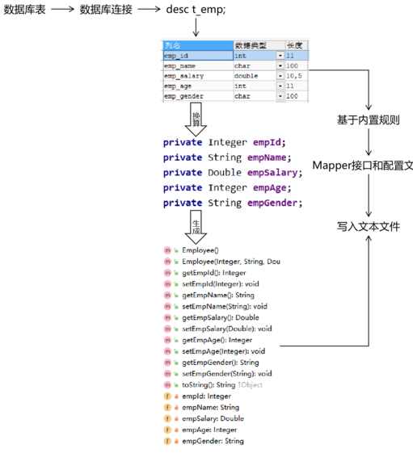

### 配置环境

#### 导入Pom.xml依赖

```XML
<!-- 依赖MyBatis核心包 -->  
<dependencies>  
    <dependency>  
        <groupId>org.mybatis</groupId>  
        <artifactId>mybatis</artifactId>  
        <version>3.5.3</version>  
    </dependency>  
</dependencies>  
<!-- 控制Maven在构建过程中相关配置 -->  
<build>  
    <!-- 构建过程中用到的插件 -->  
    <plugins>  
        <!-- 具体插件，逆向工程的操作是以构建过程中插件形式出现的 -->  
        <plugin>  
            <groupId>org.mybatis.generator</groupId>  
            <artifactId>mybatis-generator-maven-plugin</artifactId>  
            <version>1.3.0</version>  
            <!-- 插件的依赖 -->  
            <dependencies>  
                <!-- 逆向工程的核心依赖 -->  
                <dependency>  
                    <groupId>org.mybatis.generator</groupId>  
                    <artifactId>mybatis-generator-core</artifactId>  
                    <version>1.3.2</version>  
                </dependency>  
                <!-- 数据库连接池 -->  
                <dependency>  
                    <groupId>com.mchange</groupId>  
                    <artifactId>c3p0</artifactId>  
                    <version>0.9.2</version>  
                </dependency>  
                <!-- MySQL驱动 -->  
                <dependency>  
                    <groupId>mysql</groupId>  
                    <artifactId>mysql-connector-java</artifactId>  
                    <version>8.0.16</version>  
                </dependency>  
            </dependencies>  
        </plugin>  
    </plugins>  
</build>
```

#### 配置MBG

**文件名必须是：generatorConfig.xml**

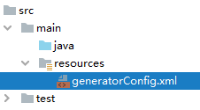

```XML
<?xml version="1.0" encoding="UTF-8"?>  
<!DOCTYPE generatorConfiguration  
        PUBLIC "-//mybatis.org//DTD MyBatis Generator Configuration 1.0//EN"  
        "http://mybatis.org/dtd/mybatis-generator-config_1_0.dtd">  
<generatorConfiguration>  
    <!--  
            targetRuntime: 执行生成的逆向工程的版本  
                    MyBatis3Simple: 生成基本的CRUD（清新简洁版）  
                    MyBatis3: 生成带条件的CRUD（奢华尊享版）  
     -->  
    <context id="DB2Tables" targetRuntime="MyBatis3">  
        <!-- 数据库的连接信息 -->  
        <jdbcConnection driverClass="com.mysql.cj.jdbc.Driver"  
                        connectionURL="jdbc:mysql://192.168.1.188:3306/test?useSSL=false&amp;useUnicode=true&amp;characterEncoding=UTF-8&amp;serverTimezone=Asia/Shanghai"  
                        userId="root"  
                        password="root">  
        </jdbcConnection>  
        <!-- javaBean的生成策略-->  
        <javaModelGenerator targetPackage="com.meturing.pojo" targetProject=".\src\main\java">  
            <property name="enableSubPackages" value="true" />  
            <property name="trimStrings" value="true" />  
        </javaModelGenerator>  
        <!-- SQL映射文件的生成策略 -->  
        <sqlMapGenerator targetPackage="com.meturing.mapper"  targetProject=".\src\main\resources">  
            <property name="enableSubPackages" value="true" />  
        </sqlMapGenerator>  
        <!-- Mapper接口的生成策略 -->  
        <javaClientGenerator type="XMLMAPPER" targetPackage="com.meturing.mapper"  targetProject=".\src\main\java">  
            <property name="enableSubPackages" value="true" />  
        </javaClientGenerator>  
        <!-- 逆向分析的表 -->  
        <!-- tableName设置为*号，可以对应所有表，此时不写domainObjectName -->  
        <!-- domainObjectName属性指定生成出来的实体类的类名 -->  
        <table tableName="dept" domainObjectName="Dept"/>  
    </context>  
</generatorConfiguration>
```

#### 执行MBG插件

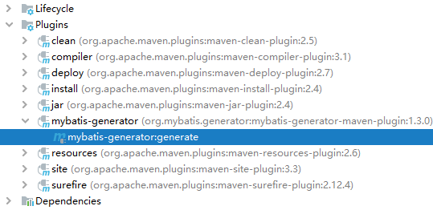

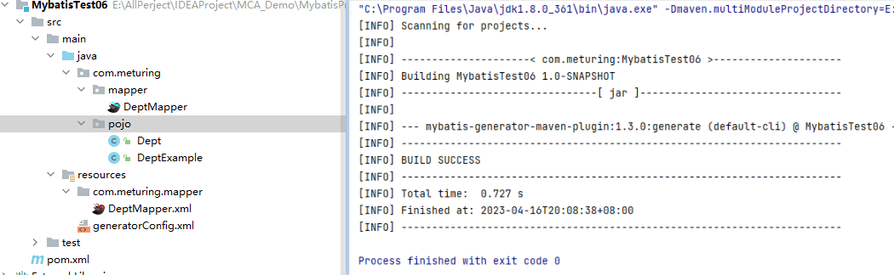

### QBC查询

QBC：Query By Criteria
QBC查询最大的特点就是将SQL语句中的WHERE子句进行了组件化的封装，让我们可以通过调用Criteria对象的方法自由的拼装查询条件。

```Java
@Test  
public void tetsQBC(){  
    //目标:组装查询条件 where (xxx) or (xxx)    //1. 创建Example对象  
    DeptExample example = new DeptExample();  
  
    //2. Example对象创建Criteria对象  
    DeptExample.Criteria criteria01 = example.createCriteria();  
    DeptExample.Criteria criteria02 = example.or();  
  
    //3. 在Criteria对象添加查询条件  
    // 封装的第一个 dname like '%S%'    criteria01.andDnameLike("%S%");  
  
    // 封装的第二个 Deptno >= 20    criteria02.andDeptnoGreaterThan(20);  
  
    //4.根据 Example对象执行查询  
    // select * from Dept WHERE  
    // ( dname like '%S%' ) or ( Deptno >= 20)    DeptMapper mapper = sqlSession.getMapper(DeptMapper.class);  
    List<Dept> deptList = mapper.selectByExample(example);  
    deptList.stream().forEach(System.out::println);  
}
```

## Mybatis其他配置

### main目录下XML文件编译问题

Maven项目默认对于Java文件下只处理.java文件,在打包后才将Resources目录下的文件进行合并
所以对于Java目录下的其他的配置文件,我们需要在Pom.xml中进行配置

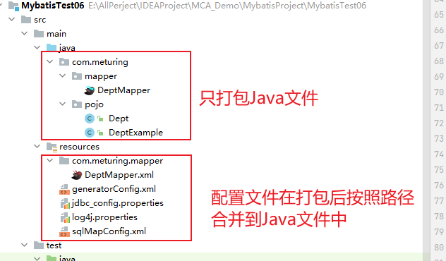

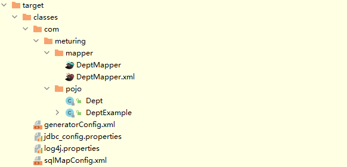

Pom.xml的配置如下

```XMl
<build>  
    <!--告诉maven将项目源码中的xml文件也进行编译，并放到编译目录中-->  
    <resources>  
        <resource>  
            <directory>src/main/java</directory>  
            <includes>  
                <include>**/*.xml</include>  
            </includes>  
            <filtering>true</filtering>  
        </resource>  
        <resource>  
            <directory>src/main/resources</directory>  
            <filtering>true</filtering>  
        </resource>  
    </resources>  
</build>
```

### 类型处理器

#### Mybatis内置类型处理器

无论是 MyBatis 在预处理语句（PreparedStatement）中设置一个参数时，还是从结果集中取出一个值时，都会用类型处理器将获取的值以合适的方式转换成 Java 类型。

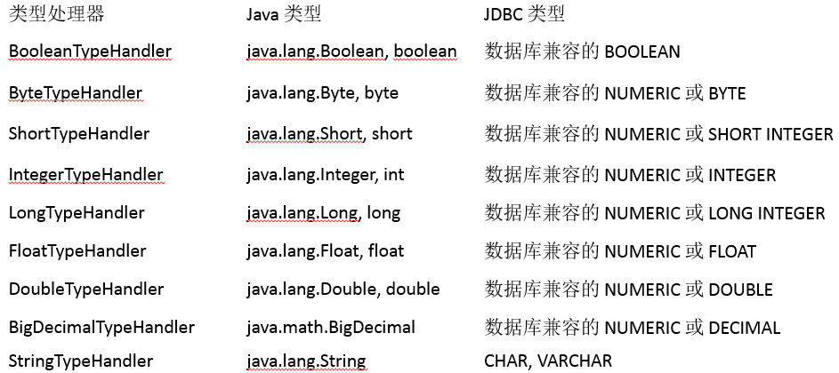

#### 日期处理

日期和时间的处理，JDK1.8以前一直是个头疼的问题。我们通常使用 JSR310 规范领导者 Stephen Colebourne 创建的 Joda-Time 来操作。JDK1.8已经实现全部的JSR310 规范了。

Mybatis在日期时间处理的问题上，提供了基于 JSR310（Date and Time API）编写的各种日期时间类型处理器。
MyBatis3.4以前的版本需要我们手动注册这些处理器，以后的版本都是自动注册的。

如需注册，需要下载`mybatistypehandlers-jsr310`，并通过如下方式注册
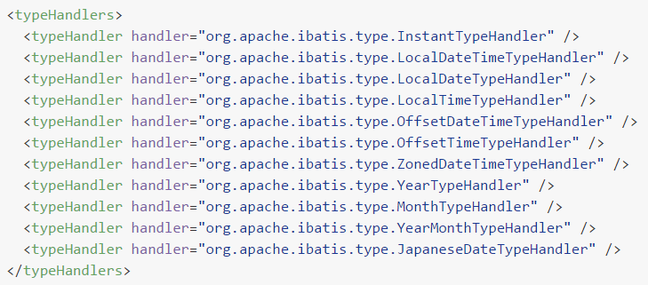

#### 自定义类型处理

当某个具体类型Mybatis靠内置的类型处理器无法识别时，可以使用Mybatis提供的自定义类型处理器机制。

第一步：实现 org.apache.ibatis.type.TypeHandler 接口或者继承 org.apache.ibatis.type.BaseTypeHandler 类。
```Java
@MappedTypes(value = Address.class)
@MappedJdbcTypes(JdbcType.CHAR)
public class AddressTypeHandler extends BaseTypeHandler<Address> {
    @Override
    public void setNonNullParameter(PreparedStatement preparedStatement, int i, Address address, JdbcType jdbcType) throws SQLException {

    }

    @Override
    public Address getNullableResult(ResultSet resultSet, String columnName) throws SQLException {

        // 1.从结果集中获取原始的地址数据
        String addressOriginalValue = resultSet.getString(columnName);

        // 2.判断原始数据是否有效
        if (addressOriginalValue == null || "".equals(addressOriginalValue))
            return null;

        // 3.如果原始数据有效则执行拆分
        String[] split = addressOriginalValue.split(",");
        String province = split[0];
        String city = split[1];
        String street = split[2];

        // 4.创建Address对象
        Address address = new Address();
        address.setCity(city);
        address.setProvince(province);
        address.setStreet(street);

        return address;
    }

    @Override
    public Address getNullableResult(ResultSet resultSet, int i) throws SQLException {
        return null;
    }

    @Override
    public Address getNullableResult(CallableStatement callableStatement, int i) throws SQLException {
        return null;
    }
}
```

第二步：指定其映射某个JDBC类型（可选操作）。

第三步：在Mybatis全局配置文件中注册。
```XML
<!-- 注册自定义类型转换器 -->
<typeHandlers>
    <typeHandler 
             jdbcType="CHAR" 
             javaType="com.atguigu.mybatis.entity.Address" 
             handler="com.atguigu.mybatis.type.handler.AddressTypeHandler"/>
</typeHandlers>
```


### 插件机制

#### Mybatis四大对象

##### Executor

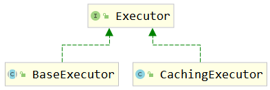

##### ParameterHandler

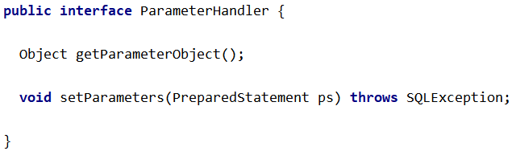

##### ResultSetHandler

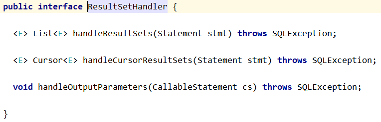

##### StatementHandler

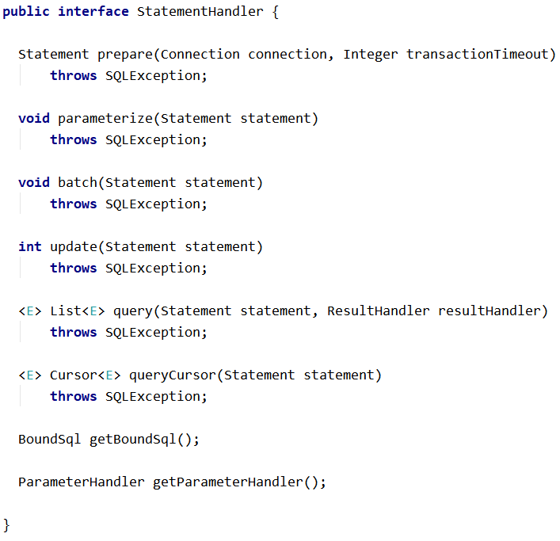

#### Mybatis插件机制

插件是MyBatis提供的一个非常强大的机制，我们可以通过插件来修改MyBatis的一些核心行为。插件通过**动态代理**机制，可以介入四大对象的任何一个方法的执行。著名的Mybatis插件包括 PageHelper（分页插件）、通用 Mapper（SQL生成插件）等。

如果想编写自己的Mybatis插件可以通过实现org.apache.ibatis.plugin.Interceptor接口来完成，表示对Mybatis常规操作进行拦截，加入自定义逻辑。

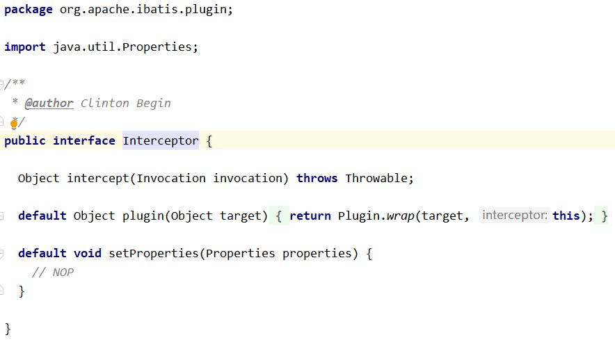

#### Mybatis底层的JDBC封装

org.apache.ibatis.executor.statement.PreparedStatementHandler类：

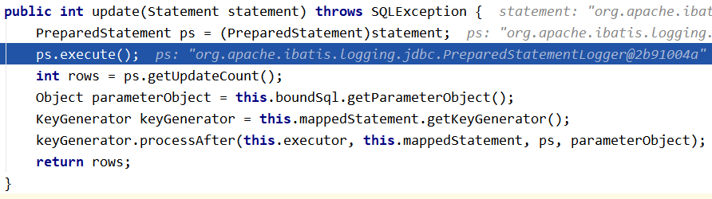

查找上面目标时，Debug查看源码的切入点是：
org.apache.ibatis.session.defaults.DefaultSqlSession类的update()方法
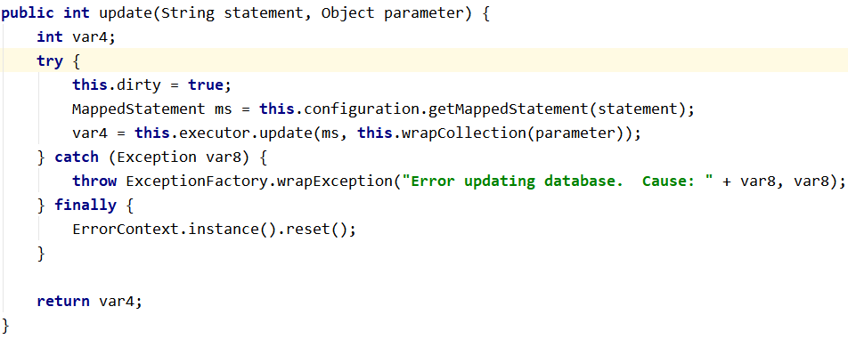