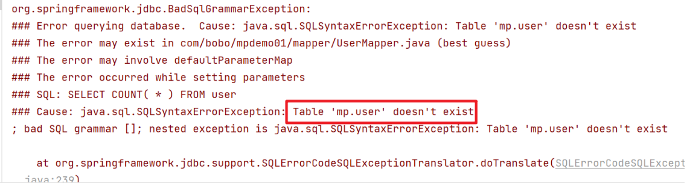
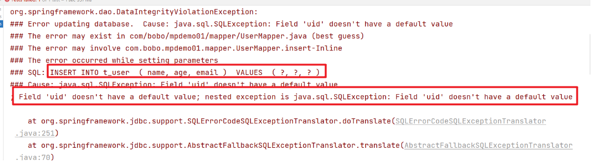
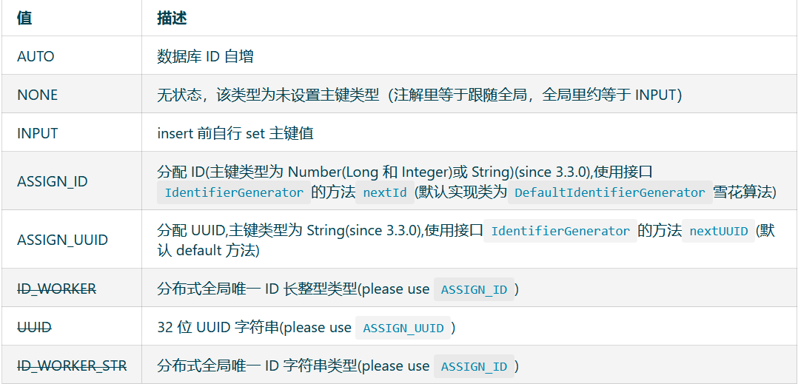
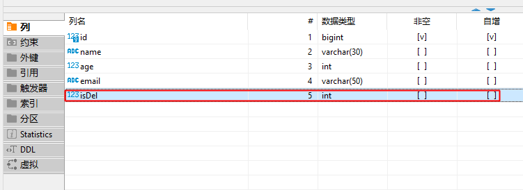
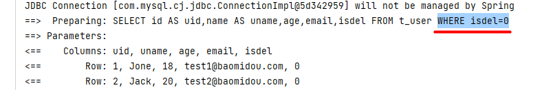
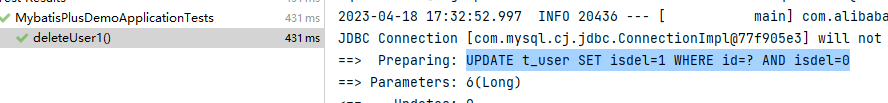
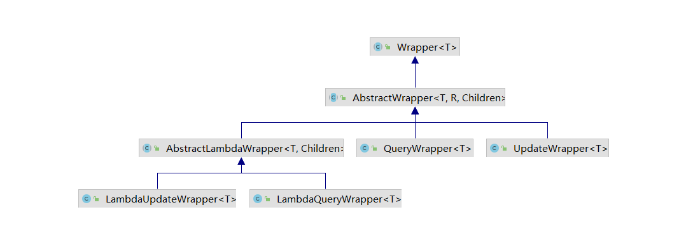
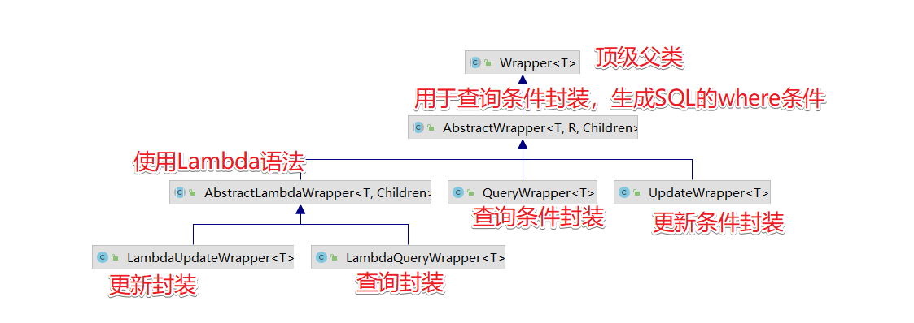
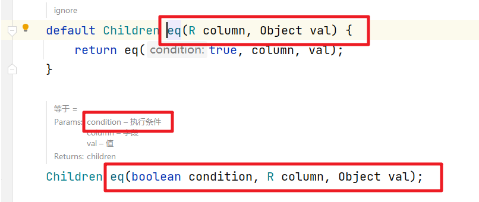

## 常用注解

### 指定表名 : @TableName

经过以上的测试，在使用MyBatis-Plus实现基本的CRUD时，我们并没有指定要操作的表，只是在 Mapper接口继承BaseMapper时，设置了泛型User，而操作的表为user表 由此得出结论，MyBatis-Plus在确定操作的表时，由BaseMapper的泛型决定，即实体类型决 定，且默认操作的表名和实体类型的类名一致

如果表名和我们的实体类的名称不一致的话，在执行相关操作的时候会抛出对应的异常，比如数据库的表我们该为T_USER,然后执行查询操作。



#### 直接配置

这时我们就可以通过`@TableName`来解决这个问题。

```Java
@ToString  
@Data  
@AllArgsConstructor  
@NoArgsConstructor  
@TableName("t_user")  
public class User {  
    private Long uid;  
    private String uname;  
    private Integer age;  
    private String email;  
}
```

#### 全局配置

```Properties
# 配置MyBatis-Plus操作表的默认前缀
mybatis-plus.global-config.db-config.table-prefix=t_
```

### 指定主键 : @TableId

我们可以通过@TableId注解来显示的指定哪个属性为主键对应的属性，在前面的例子中默认id就是，如果我们的主键字段不是id，比如uid的话，把实体user中的id改为uid，同时表结构中的id字段也修改为uid字段。我们来看看效果。执行插入操作。



可以看到抛出了一个 `Field 'uid' doesn't` 的异常，这时我们可以在User实体的uid属性上添加`@TableId`即可。

@TableId中的`value`值在实体类中的字段和表结构的字段一致的情况下我们不用添加，但如果不一致，@TableId中的value我们需要设置表结构中的主键字段。
@TableId中还有一个比较重要的属性是`Type`。Type是用来定义主键的生成策略的。

#### 主键策略



**配置主键自增得在表结构中的字段要设置自动增长才行**

#### 直接配置

1. 如果实体类中的字段与数据库**一致**

```Java
@ToString  
@Data  
@AllArgsConstructor  
@NoArgsConstructor  
@TableName("t_user")  
public class User {  
    @TableId(type = IdType.AUTO)//表示主键 分配主键自增  
    private Long uid;  
    private String uname;  
    private Integer age;  
    private String email;  
}
```

2. 如果实体类中的字段与数据库**不一致**

```Java
@ToString  
@Data  
@AllArgsConstructor  
@NoArgsConstructor  
@TableName("t_user")  
public class User {  
    @TableId(value = "id",type = IdType.AUTO)//表示主键 并重新映射到Id字段,分配主键自增  
    private Long uid;  
    private String uname;  
    private Integer age;  
    private String email;  
}
```

#### 全局配置

```Properties
# 主键生成策略  
mybatis-plus.global-config.db-config.id-type=auto
```


### 指定字段 : @TableField

@TableField注解的作用是当实体类中的属性和表结构中的字段名称不一致的情况下来设置对应关系的，
当然，在MyBatis-Plus中针对实体中是**userName而表结构中是user_name这种情况会自动帮助我们完成驼峰命名法的转换**。

```Java
@ToString  
@Data  
@AllArgsConstructor  
@NoArgsConstructor  
@TableName("t_user")  
public class User {  
    @TableId(value = "id",type = IdType.AUTO)//表示主键 并重新映射到Id字段,分配主键自增  
    private Long uid;  
    @TableField(value = "name")// 表结构中的name属性和name属性对应  
    private String uname;  
    private Integer age;  
    private String email;  
}
```

### 逻辑删除 : @TableLogic

@TableLogic是用来完成 `逻辑删除`操作的

| 删除类型 | 描述                                                                                                              |
| -------- | ----------------------------------------------------------------------------------------------------------------- |
| 逻辑删除 | 假删除，将对应数据中代表是否被删除字段的状态修改为“被删除状态”，&#x3c;br />之后在数据库中仍旧能看到此条数据记录 |
| 物理删除 | 真实删除，将对应数据从数据库中删除，之后查询不到此条被删除的数据                                                  |

#### 直接配置

##### 创建逻辑删除字段

先在表中创建一个isDel字段


##### 修改实体类

对应的在实体类中添加一个isdel属性

```Java
@ToString  
@Data  
@AllArgsConstructor  
@NoArgsConstructor  
@TableName("t_user")  
public class User {  
    @TableId(value = "id",type = IdType.AUTO)//表示主键 并重新映射到Id字段,分配主键自增  
    private Long uid;  
    @TableField(value = "name")// 表结构中的name属性和name属性对应  
    private String uname;  
    private Integer age;  
    private String email;  
    @TableLogic(value = "0",delval = "1")//逻辑删除,默认为0 删除后为1  
    private Integer isdel;  
}
```

此时我们发现,Mybatis对于所有的查询都会再条件中拼接: `Where isdel = 0`



所有的删除都变成了Update语言:



#### 全局配置

```Properties
# 配置逻辑删除  
mybatis-plus.global-config.db-config.logic-delete-field=isdel
mybatis-plus.global-config.db-config.logic-delete-value=1  
mybatis-plus.global-config.db-config.logic-not-delete-value=0
```

## 条件构造器

当我们需要对单表的CURD做复杂条件处理的时候我们就需要借助Wrapper接口来处理，也就是通过条件构造器来处理。

### Wrapper接口

Wrapper接口是条件构造的抽象类，是最顶级的类



对应动作



###  Wrapper的常用API

#### ge、gt、le、lt、isNull、isNotNull

`UPDATE user SET deleted=1 WHERE deleted=0 AND name IS NULL AND age >= ? AND email IS NOT NULL`

```Java
@Test
public void testDelete() {
    QueryWrapper<User> queryWrapper = new QueryWrapper<>();
    queryWrapper
        .isNull("name")
        .ge("age", 12)
        .isNotNull("email");
    int result = userMapper.delete(queryWrapper);
    System.out.println("delete return count = " + result);
}
```

#### eq、ne

注意：seletOne返回的是一条实体记录，当出现多条时会报错

`SELECT id,name,age,email,create_time,update_time,deleted,version FROM user WHERE deleted=0 AND name = ?`

```Java
@Test
public void testSelectOne() {
    QueryWrapper<User> queryWrapper = new QueryWrapper<>();
    queryWrapper.eq("name", "Tom");
    User user = userMapper.selectOne(queryWrapper);
    System.out.println(user);
}
```

#### between、notBetween

包含大小边界

`SELECT COUNT(1) FROM user WHERE deleted=0 AND age BETWEEN ? AND ?`

```Java
@Test
public void testSelectCount() {
    QueryWrapper<User> queryWrapper = new QueryWrapper<>();
    queryWrapper.between("age", 20, 30);
    Integer count = userMapper.selectCount(queryWrapper);
    System.out.println(count);
}
```

#### allEq

包含大小边界

`SELECT id,name,age,email,create_time,update_time,deleted,version FROM user WHERE deleted=0 AND name = ? AND id = ? AND age = ?`

```Java
@Test
public void testSelectList() {
    QueryWrapper<User> queryWrapper = new QueryWrapper<>();
    Map<String, Object> map = new HashMap<>();
    map.put("id", 2);
    map.put("name", "Jack");
    map.put("age", 20);
    queryWrapper.allEq(map);
    List<User> users = userMapper.selectList(queryWrapper);
    users.forEach(System.out::println);
}
```

#### like、notLike、likeLeft、likeRight

包含大小边界

`SELECT id,name,age,email,create_time,update_time,deleted,version FROM user WHERE deleted=0 AND name NOT LIKE ? AND email LIKE ?`

```Java
@Test
public void testSelectMaps() {
    QueryWrapper<User> queryWrapper = new QueryWrapper<>();
    queryWrapper
        .notLike("name", "e")
        .likeRight("email", "t");
    List<Map<String, Object>> maps = userMapper.selectMaps(queryWrapper);//返回值是Map列表
    maps.forEach(System.out::println);
}
```

#### in、notIn、inSql、notinSql、exists、notExists

in、notIn：
-   `notIn("age",{1,2,3})`--->`age not in (1,2,3)`
-   `notIn("age", 1, 2, 3)`--->`age not in (1,2,3)`

inSql、notinSql：可以实现子查询
-   例: `inSql("age", "1,2,3,4,5,6")`--->`age in (1,2,3,4,5,6)`
-   例: `inSql("id", "select id from table where id < 3")`--->`id in (select id from table where id < 3)`

`SELECT id,name,age,email,create_time,update_time,deleted,version FROM user WHERE deleted=0 AND id IN (select id from user where id < 3)`

```Java
@Test
public void testSelectObjs() {
    QueryWrapper<User> queryWrapper = new QueryWrapper<>();
    //queryWrapper.in("id", 1, 2, 3);
    queryWrapper.inSql("id", "select id from user where id < 3");
    List<Object> objects = userMapper.selectObjs(queryWrapper);//返回值是Object列表
    objects.forEach(System.out::println);
}
```

#### or、and

不调用or则默认为使用 and 连

`UPDATE user SET name=?, age=?, update_time=? WHERE deleted=0 AND name LIKE ? OR age BETWEEN ? AND ?`

```Java
@Test
public void testUpdate1() {
    //修改值
    User user = new User();
    user.setAge(99);
    user.setName("Andy");
    //修改条件
    UpdateWrapper<User> userUpdateWrapper = new UpdateWrapper<>();
    userUpdateWrapper
        .like("name", "h")
        .or()
        .between("age", 20, 30);
    int result = userMapper.update(user, userUpdateWrapper);
    System.out.println(result);
}
```

#### 嵌套or、嵌套and

这里使用了lambda表达式，or中的表达式最后翻译成sql时会被加上圆括号

`UPDATE user SET name=?, age=?, update_time=? WHERE deleted=0 AND name LIKE ? OR ( name = ? AND age <> ? )`

```Java
@Test
public void testUpdate2() {
    //修改值
    User user = new User();
    user.setAge(99);
    user.setName("Andy");
    //修改条件
    UpdateWrapper<User> userUpdateWrapper = new UpdateWrapper<>();
    userUpdateWrapper
        .like("name", "h")
        .or(i -> i.eq("name", "李白").ne("age", 20));
    int result = userMapper.update(user, userUpdateWrapper);
    System.out.println(result);
}
```

#### orderBy、orderByDesc、orderByAsc

这里使用了lambda表达式，or中的表达式最后翻译成sql时会被加上圆括号

`SELECT id,name,age,email,create_time,update_time,deleted,version FROM user WHERE deleted=0 ORDER BY id DESC`

```Java
@Test
public void testSelectListOrderBy() {
    QueryWrapper<User> queryWrapper = new QueryWrapper<>();
    queryWrapper.orderByDesc("id");
    List<User> users = userMapper.selectList(queryWrapper);
    users.forEach(System.out::println);
}
```

#### last

直接拼接到 sql 的最后
**注意：只能调用一次,多次调用以最后一次为准 有sql注入的风险,请谨慎使用**

`SELECT id,name,age,email,create_time,update_time,deleted,version FROM user WHERE deleted=0 limit 1`

```Java
@Test
public void testSelectListLast() {
    QueryWrapper<User> queryWrapper = new QueryWrapper<>();
    queryWrapper.last("limit 1");
    List<User> users = userMapper.selectList(queryWrapper);
    users.forEach(System.out::println);
}
```

#### select

`SELECT id,name,age FROM user WHERE deleted=0`

```Java
@Test
public void testSelectListColumn() {
    QueryWrapper<User> queryWrapper = new QueryWrapper<>();
    queryWrapper.select("id", "name", "age");
    List<User> users = userMapper.selectList(queryWrapper);
    users.forEach(System.out::println);
}
```

#### set、setSql

最终的sql会合并 user.setAge()，以及 userUpdateWrapper.set()  和 setSql() 中 的字段

`UPDATE user SET age=?, update_time=?, name=?, email = '123@qq.com' WHERE deleted=0 AND name LIKE ?`

```Java
@Test
public void testUpdateSet() {
    //修改值
    User user = new User();
    user.setAge(99);
    //修改条件
    UpdateWrapper<User> userUpdateWrapper = new UpdateWrapper<>();
    userUpdateWrapper
        .like("name", "h")
        .set("name", "老李头")//除了可以查询还可以使用set设置修改的字段
        .setSql(" email = '123@qq.com'");//可以有子查询
    int result = userMapper.update(user, userUpdateWrapper);
}
```

###  接口的使用

#### QueryWrapper

首先来看看QueryWrapper的使用，针对where后的条件封装。

##### 查询条件

`SELECT id AS uid,name AS uname,age,email,isdel FROM t_user WHERE isdel=0 AND (name LIKE ? AND age > ? AND email IS NOT NULL)`

```Java
@Test  
public void test1(){  
    QueryWrapper<User> userQueryWrapper = new QueryWrapper<>();  
    userQueryWrapper.like("name", "J").gt("age",18).isNotNull("email");  
    List<User> list = userService.list(userQueryWrapper);  
    list.forEach(System.out::println);  
}
```

##### 排序查询

`SELECT id AS uid,name AS uname,age,email,isdel FROM t_user WHERE isdel=0 ORDER BY age ASC,uid DESC`

```Java
@Test  
public void test2(){  
    QueryWrapper<User> userQueryWrapper = new QueryWrapper<>();  
    userQueryWrapper.orderByAsc("age").orderByDesc("uid");  
    List<User> list = userService.list(userQueryWrapper);  
    list.forEach(System.out::println);  
}
```

##### 删除条件

由于开启了逻辑删除 `UPDATE t_user SET isdel=1 WHERE isdel=0 AND (age >= ?)`

```Java
@Test  
public void test3(){  
    QueryWrapper<User> userQueryWrapper = new QueryWrapper<>();  
    userQueryWrapper.ge("age",28);  
    boolean remove = userService.remove(userQueryWrapper);  
}
```

##### 组合条件

在封装条件的时候我们可以同时有多个条件组合，类似于 and 和 or的操作，这时QueryWrapper也能很轻松的处理。

`SELECT id AS uid,name AS uname,age,email,isdel FROM t_user WHERE isdel=0 AND ((age >= ? AND name LIKE ?) OR (email IS NULL))`

```Java
@Test  
public void test4(){  
    QueryWrapper<User> userQueryWrapper = new QueryWrapper<>();  
    userQueryWrapper.ge("age", 20).like("name", "o").or().isNull("email");  
    List<User> list = userService.list(userQueryWrapper);  
    list.forEach(System.out::println);  
}
```

可以使用and() 和 or()

```Java
@Test  
public void test5(){  
    QueryWrapper<User> userQueryWrapper = new QueryWrapper<>();  
    userQueryWrapper.and((s)->{s.ge("age", 20).like("name", "o");})  
            .or((s)->{s.isNull("email");});  
    List<User> list = userService.list(userQueryWrapper);  
    list.forEach(System.out::println);  
}
```

##### 查询特定的字段

特殊情况我们需要查询特定的字段，这时可以通过select方法来处理

`SELECT name,age FROM t_user WHERE isdel=0 AND (name LIKE ?)`

```Java
@Test  
public void test6(){  
    QueryWrapper<User> userQueryWrapper = new QueryWrapper<>();  
    userQueryWrapper.like("name", "J").select("name","age");  
    //返回Map集合列表，通常配合select()使用，避免User对象中没有被查询到的列值为null  
    List<Map<String, Object>> maps = userService.listMaps(userQueryWrapper);  
    maps.forEach(System.out::println);  
}
```

##### 实现子查询

单表查询中对子查询的需求也是有的，我们来看看如何实现。

`SELECT id AS uid,name AS uname,age,email,isdel FROM t_user WHERE isdel=0 AND (id IN (select id from t_user where id < 5))`

```Java
@Test  
public void test7(){  
    QueryWrapper<User> userQueryWrapper = new QueryWrapper<>();  
    userQueryWrapper.inSql("id","select id from t_user where id < 5");  
    List<User> list = userService.list(userQueryWrapper);  
    list.forEach(System.out::println);  
}
```

#### UpdateWrapper

当我们需要组装更新的字段数据的时候，可以通过UpdateWrapper来实现。

```Java
@Test  
public void test8(){  
    UpdateWrapper<User> wrapper = new UpdateWrapper<>();  
    //将年龄为33的用户更改  
    wrapper.set("age",25).set("name", "2333").set("email","xx@xx.xx").set("isdel", "0").and(s->{s.eq("age",33);});  
    boolean update = userService.update(null, wrapper);  
}
```

#### 动态SQL

实际开发中，用户的查询条件都是动态的，我们需要根据不同的输入条件来动态的生成对应的SQL语句，这时我们来看看在MyBatisPlus中是如何处理的。

```Java
@Test  
public void test9(){  
    String  name = "Tom";  
    Integer age = null;  
    String email = null;  
    QueryWrapper<User> wrapper = new QueryWrapper<>();  
    if(!StringUtils.isEmpty(name)){  
        wrapper.eq("name",name);  
    }  
    if(age != null && age > 0){  
        wrapper.eq("age",age);  
    }  
    if(!StringUtils.isEmpty(email)){  
        wrapper.eq("email",email);  
    }  
    List<User> users = userService.list(wrapper);  
    users.forEach(System.out::println);  
}
```

上面的代码是通过if来一个个判断的，看起来代码比较复杂，其实大家在前面看相关的API的时候会注意到都会有一个Condition参数



```Java
@Test  
public void test10(){  
    String  name = "Tom";  
    Integer age = null;  
    String email = null;  
    QueryWrapper<User> wrapper = new QueryWrapper<>();  
    wrapper.eq(!StringUtils.isEmpty(name),"name",name)  
            .eq(age != null && age > 0,"age",age)  
            .eq(!StringUtils.isEmpty(email),"email",email);  
    List<User> users = userService.list(wrapper);  
    users.forEach(System.out::println);  
}
```