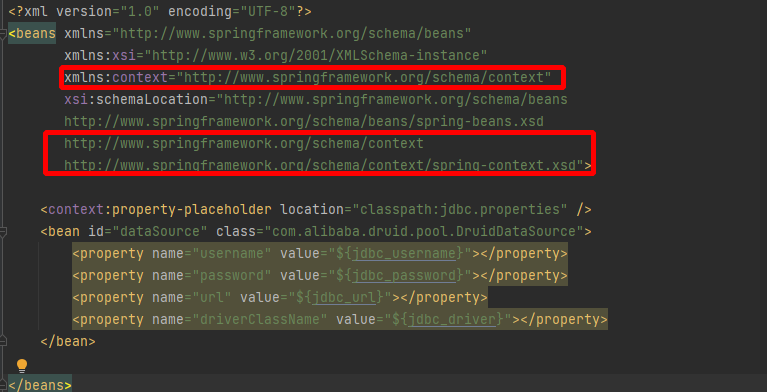
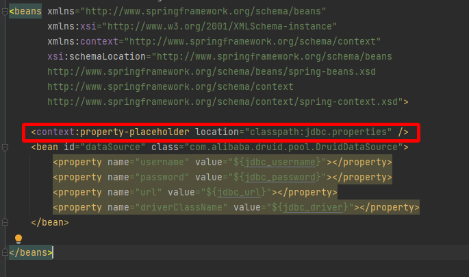
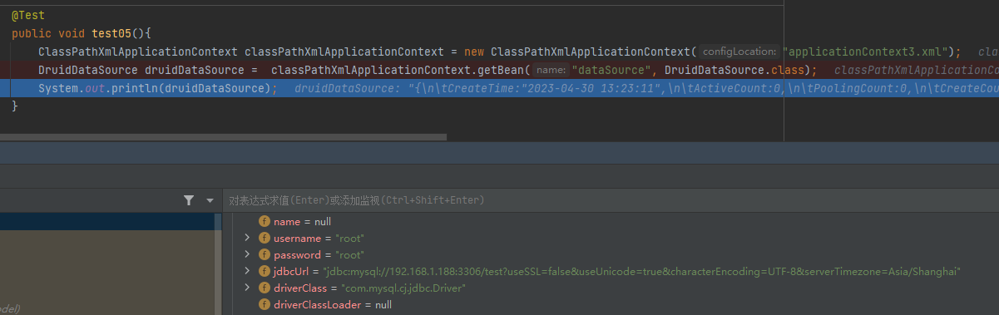

spring容器可以读取.properties属性配置文件,可以将文件中的信息注入给bean

## 相关案例

接下来我们将简单的以Druid连接池为例

### 引入依赖

导入Druid依赖和mysql-connector依赖
```XML
<!--  德鲁伊连接池  -->
<dependency>
	<groupId>com.alibaba</groupId>
	<artifactId>druid</artifactId>
	<version>1.1.14</version>
</dependency>
<!--  数据库链接  -->
<dependency>
	<groupId>mysql</groupId>
	<artifactId>mysql-connector-java</artifactId>
	<version>8.0.28</version>
</dependency>
```

### 准备数据源配置文件

resources目录下准备一个jdbc.properties属性配置文件
```properties
jdbc_driver=com.mysql.cj.jdbc.Driver
jdbc_url=jdbc:mysql://192.168.1.188:3306/test?useSSL=false&useUnicode=true&characterEncoding=UTF-8&serverTimezone=Asia/Shanghai
jdbc_username=root
jdbc_password=root
```

### 将配置文件引入到ApplicationContext.xml中

1. 添加context名称空间


2. 添加context标签指向配置文件


3. 使用`${key}`的形式,直接使用配置文件的值


完整代码:
```XMl
<?xml version="1.0" encoding="UTF-8"?>
<beans xmlns="http://www.springframework.org/schema/beans"
       xmlns:xsi="http://www.w3.org/2001/XMLSchema-instance"
       xmlns:context="http://www.springframework.org/schema/context"
       xsi:schemaLocation="http://www.springframework.org/schema/beans
       http://www.springframework.org/schema/beans/spring-beans.xsd
       http://www.springframework.org/schema/context
       http://www.springframework.org/schema/context/spring-context.xsd">

    <context:property-placeholder location="classpath:jdbc.properties" />
    <bean id="dataSource" class="com.alibaba.druid.pool.DruidDataSource">
        <property name="username" value="${jdbc_username}"></property>
        <property name="password" value="${jdbc_password}"></property>
        <property name="url" value="${jdbc_url}"></property>
        <property name="driverClassName" value="${jdbc_driver}"></property>
    </bean>
</beans>
```

运行效果:


