## 概念

### 什么是AOP切面编程

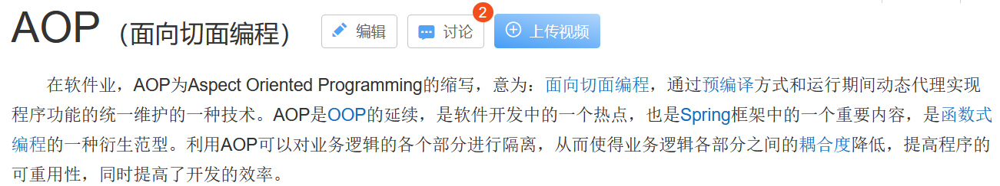

AOP切面编程一般可以帮助我们在不修改现有代码的情况下,对程序的功能进行拓展,往往用于实现 `日志处理`,`权限控制`,`性能检测`,`事务控制`等

在之前的学习中,我们学习了动态代理 : [静态代理与动态代理](../07_静态代理与动态代理/静态代理与动态代理.md)

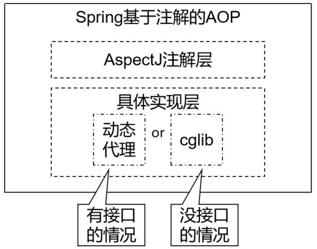

AOP实现的原理就是动态代理: **在有接口的情况下,使用JDK动态代理,在没有接口的情况下使用cglib动态代理**

### AOP切面编程的相关术语

#### 连接点 Joint point

类里面那些**可以被增强的方法**,这些方法称之为连接点

表示在程序中明确定义的点，典型的包括方法调用，对类成员的访问以及异常处理程序块的执行等等，它自身还可以嵌套其它 joint point

#### 切入点 Pointcut

**实际被增强的方法**,称之为切入点

表示一组 joint point，这些 joint point 或是通过逻辑关系组合起来，或是通过通配、正则表达式等方式集中起来，它定义了相应的 Advice 将要发生的地方

#### 通知 Advice

实际增强的逻辑部分称为通知 (**增加的功能**)

Advice 定义了在 Pointcut 里面定义的程序点具体要做的操作，它通过 before、after 和 around 来区别是在每个 joint point 之前、之后还是代替执行的代码。

通知类型: 
1. 前置通知 : 在被代理的目标方法前执行
2. 返回通知 : 在被代理的目标方法成功结束后执行（寿终正寝）
3. 异常通知 : 在被代理的目标方法异常结束后执行（死于非命）
4. 后置通知 : 在被代理的目标方法最终结束后执行（盖棺定论）
5. 环绕通知 : 使用try...catch...finally结构围绕整个被代理的目标方法，包括上面四种通知对应的所有位置
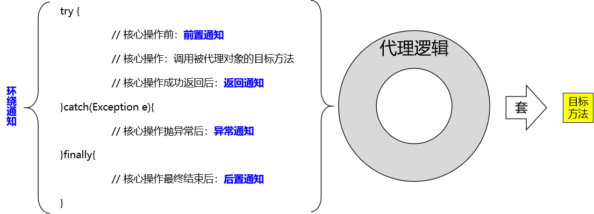

#### 目标对象 Target

**被增强功能的对象(被代理的对象)**

织入 Advice 的目标对象

#### 切面 Aspect

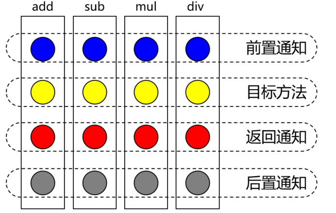

**表现为功能相关的一些advice方法放在一起声明成的一个Java类**

Aspect 声明类似于 Java 中的类声明，在 Aspect 中会包含着一些 Pointcut 以及相应的 Advice。

#### 织入 Weaving

**创建代理对象并实现功能增强的声明并运行过程**

将 Aspect 和其他对象连接起来, 并创建 Adviced object 的过程

#### AspectJ

AspectJ本身并不是spring框架中的组成部分, 是一个独立的AOP框架,一般把AspectJ和Spring框架的AOP依赖一起使用,所以要导入一个独立的依赖

本质上是静态代理，将代理逻辑“织入”被代理的目标类编译得到的字节码文件，所以最终效果是动态的。weaver就是织入器。Spring只是借用了AspectJ中的注解。

## 环境准备

### 所需依赖

```XML
<packaging>jar</packaging>
<properties>
	<maven.compiler.source>8</maven.compiler.source>
	<maven.compiler.target>8</maven.compiler.target>
	<project.build.sourceEncoding>UTF-8</project.build.sourceEncoding>
</properties>
<dependencies>
	<dependency>
		<groupId>org.springframework</groupId>
		<artifactId>spring-context</artifactId>
		<version>5.2.12.RELEASE</version>
	</dependency>
	<!--spring切面包-->
	<dependency>
		<groupId>org.springframework</groupId>
		<artifactId>spring-aspects</artifactId>
		<version>5.3.5</version>
	</dependency>
	<!--织入包  spring-aspects 已经导入该包,这里可以不导入-->
	<!--<dependency>-->
	<!--<groupId>org.aspectj</groupId>-->
	<!--<artifactId>aspectjweaver</artifactId>-->
	<!--<version>1.9.6</version>-->
	<!--</dependency>-->
	<!--aop联盟包-->
	<dependency>
		<groupId>aopalliance</groupId>
		<artifactId>aopalliance</artifactId>
		<version>1.0</version>
	</dependency>
	<!--Apache Commons日志包-->
	<dependency>
		<groupId>commons-logging</groupId>
		<artifactId>commons-logging</artifactId>
		<version>1.2</version>
	</dependency>
	<!--lombok -->
	<dependency>
		<groupId>org.projectlombok</groupId>
		<artifactId>lombok</artifactId>
		<version>1.18.26</version>
	</dependency>
	<!--junit -->
	<dependency>
		<groupId>junit</groupId>
		<artifactId>junit</artifactId>
		<version>4.13.1</version>
		<scope>test</scope>
	</dependency>
</dependencies>
```

核心包:
`spring-context` 包会自动依赖  `spring-aop` / `spring-beans` / `spring-core` / `spring-expression`
`spring-aspects`  包会自动依赖 `spectjweaver`

### Spring配置文件

```XML
<?xml version="1.0" encoding="UTF-8"?>
<beans xmlns="http://www.springframework.org/schema/beans"
       xmlns:xsi="http://www.w3.org/2001/XMLSchema-instance"
       xmlns:aop="http://www.springframework.org/schema/aop"
       xmlns:context="http://www.springframework.org/schema/context"
       xsi:schemaLocation="http://www.springframework.org/schema/beans
       http://www.springframework.org/schema/beans/spring-beans.xsd
       http://www.springframework.org/schema/aop
       https://www.springframework.org/schema/aop/spring-aop.xsd
       http://www.springframework.org/schema/context
       https://www.springframework.org/schema/context/spring-context.xsd">
    <!--spring 包扫描  -->
    <context:component-scan base-package="com.meturing" />
    <!--aop autoProxy 自动生成代理对象 -->
    <aop:aspectj-autoproxy />
</beans>
```

注意: 由于需要使用aop与context,我们需要导入声明空间才可使用

### 接口环境

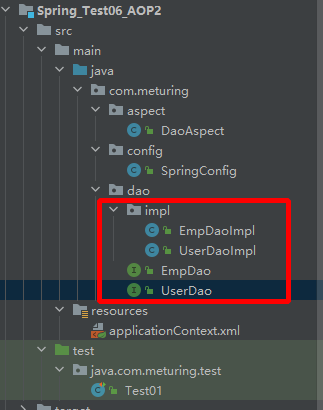

UserDao.Java
```Java
public interface UserDao {  
	int addUser(Integer userid,String username);  
}
```

UserDaoImpl.Java
```Java
@Repository
public class UserDaoImpl implements UserDao {
    @Override
    public int addUser(Integer userid, String username) {
        System.out.println("userdao add ... ...");
        //int i =1/0;
        return 1;
    }
}
```

EmpDao.java
```Java
public interface EmpDao {
    int addEmp(Integer empno,String ename,String job);
}
```

EmpDaoImpl.java
```Java
@Repository
public class EmpDaoImpl implements EmpDao {
    @Override
    public int addEmp(Integer empno, String ename, String job) {
        System.out.println("empDao add ... ...");
        //int i = 1/0;
        return 1;
    }
}
```


注意,我们需要将实现类交给IOC容器进行管理,常见的注解如下: [相关注解](../06_注解方式管理Bean/注解方式管理Bean.md#相关注解)

## 切入点表达式

通过一个表达式来确定AOP要增强的是哪个或者那些方法

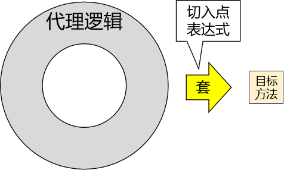

### 语法

`execution([权限修饰符][返回值类型][类的全路径名][方法名](参数 列表) )`

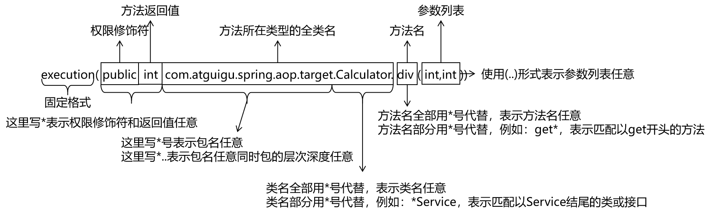

**可用的表达式:**
1. `execution() || execution()`表示满足两个execution()中的任何一个即可
2. `execution() && execution()`表示两个execution()表达式必须都满足
3. `!execution()`表示不满足表达式的其他方法

### 使用案例

```Java
//指定切点为UserDaoImpl.add方法 
execution(* com.meturing.dao.UserDaoImpl.add(..))

//指定切点为UserDaoImpl.所有的方法 
execution(* com.meturing.dao.UserDaoImpl.*(..))

//指定切点为dao包下所有的类中的所有的方法 
execution(* com.meturing.dao.*.*(..))

// 指定切点为dao包下所有的类中的add的方法
execution(* com.meturing.dao.*.add(..))

// 指定切点为dao包下所有的类中的add开头的方法
execution(* com.meturing.dao.*.add*(..))                    
```

### 重用切入点表达式

在一处声明切入点表达式之后，其他有需要的地方引用这个切入点表达式。易于维护，一处修改，处处生效。声明方式如下：
我们可以在一个专门的方法上`@Pointcut`注解声明的切入点表达式，可以在其他任何地方通过方法名进行引入

```java
// 切入点表达式重用
@Pointcut("execution(* *..*.add(..))")
public void declarPointCut() {}
```

同一个类中
```java
@Before(value = "declarPointCut()")
public void printLogBeforeCoreOperation(JoinPoint joinPoint) {}
```

在不同的类中
```Java
@Around(value = "com.atguigu.spring.aop.aspect.LogAspect.declarPointCut()")
public Object roundAdvice(ProceedingJoinPoint joinPoint) {}
```

而作为存放切入点表达式的类，**可以把整个项目中所有切入点表达式全部集中过来**，便于统一管理：
```Java
@Component
public class AtguiguPointCut {
    @Pointcut(value = "execution(public int *..Calculator.sub(int,int))")
    public void atguiguGlobalPointCut(){}
    @Pointcut(value = "execution(public int *..Calculator.add(int,int))")
    public void atguiguSecondPointCut(){}
    @Pointcut(value = "execution(* *..*Service.*(..))")
    public void transactionPointCut(){}
}
```

## JoinPoint对象和ProceedingJoinPoint对象

### JoinPoint对象

JoinPoint对象**封装SpringAop中切面方法的信息**,在切面方法中添加**JoinPoint参数**,就可以获取到了封装了该方法信息的JoinPoint对象.

常用API:
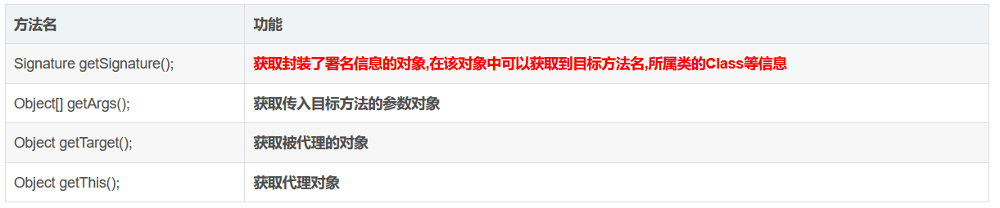

### ProceedingJoinPoint对象

**ProceedingJoinPoint对象是JoinPoint的子接口,该对象值用在@Around的切面方法中**

`Object proceed() throws Throwable`  //执行目标方法

`Object proceed(Object[] varl) throws Thowable` //传入的新的参数去执行目标方法

## 通知

我们一般会对一个类作为切面类,使用`@Aspect`注解标识,并使用`@Component`注解交给容器管理

### @Before 前置通知

切点方法执行之前先执行的功能
参数列表可以用JoinPoint接收切点对象,可以获取方法执行的参数

```Java
@Component
@Aspect
public class DaoAspect {
    @Before("execution(* com.meturing.dao.*.add*(..))")
    public void methodBefore(JoinPoint joinPoint){
        System.out.println("Before invoked");
    }
}
```

### @AfterReturning 返回通知

切点方法正常运行结束后增强的功能
如果方法运行过程中出现异常,则该功能不运行
参数列表可以用 JoinPoint joinPoint接收切点对象,可以用Object res接收方法返回值,需要用returning指定返回值名称

```Java
@Component
@Aspect
public class DaoAspect {
    @AfterReturning(value = "execution(* com.meturing.dao.*.add*(..))",returning = "res")
    public void methodAfterReturning(JoinPoint joinPoint,Object res){
        System.out.println("AfterReturning invoked");
    }
}
```

### @AfterThrowing 异常通知

切点方法出现异常时运行的增强功能
如果方法运行没有出现异常,则该功能不运行
参数列表可以用Exception ex接收异常对象 需要通过throwing指定异常名称

```Java
@Component
@Aspect
public class DaoAspect {
     @AfterThrowing(value = "execution(* com.meturing.dao.*.add*(..))",throwing = "ex")
     public void methodAfterThrowing(Exception ex){
         System.out.println("AfterThrowing invoked");
         System.out.println(ex.getMessage());
     }
}
```

### @After 后置通知

方法执行之后要增强的功能
无论切点方法是否出现异常都会执行的方法
参数列表可以用JoinPoint接收切点对象

```Java
@Component
@Aspect
public class DaoAspect {
	@After("execution(* com.meturing.dao.*.add*(..))")  
	public void methodAfter(JoinPoint joinPoint){  
		System.out.println("After invoked");  
	}
}
```

### @Around 环绕通知

在切点方法之前和之后都进行功能的增强,类似CGLib动态代理
需要在通知中定义方法执行的位置,并在执行位置之前和之后自定义增强的功能
方法列表可以通过`ProceedingJoinPoint`获取执行的切点,通过`proceedingJoinPoint.proceed()`方法控制切点方法的执行位置
`proceedingJoinPoint.proceed()`方法会将切点方法的返回值获取到,并交给我们,可以做后续处理
**我们在环绕通知的最后需要将切点方法的返回值继续向上返回,否则切点方法在执行时接收不到返回值**

```Java
@Component
@Aspect
public class DaoAspect {
    @Around(value = "execution(* com.meturing.dao.*.add*(..))")
    public Object methodAround(ProceedingJoinPoint proceedingJoinPoint) throws Throwable {
        System.out.println("Before invoked");
        Object proceed = proceedingJoinPoint.proceed();//执行切点方法
        System.out.println("After invoked");
        if (proceed instanceof Integer){
            System.out.println((Integer)proceed);
        }
        return  proceed;
    }
}
```

## 通知优先级

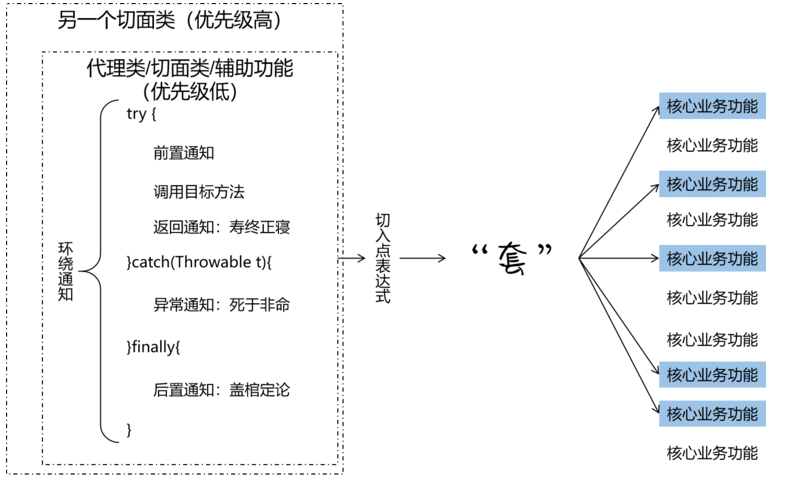

相同目标方法上同时存在多个切面时，切面的优先级控制切面的内外嵌套顺序。
- 优先级高的切面：外面
- 优先级低的切面：里面

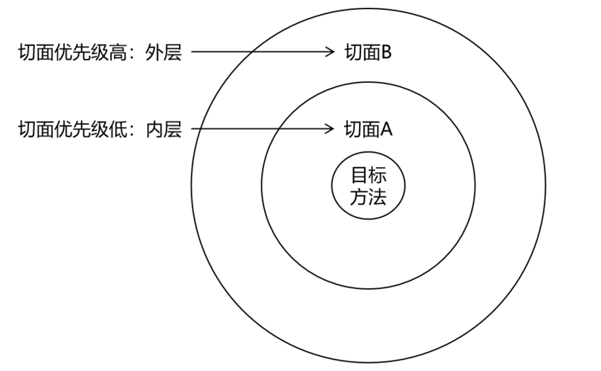

### @Order 注解

使用`@Order`注解可以控制切面的优先级：
- @Order(较小的数)：优先级高
- @Order(较大的数)：优先级低

### 实际意义

实际开发时，如果有多个切面嵌套的情况，要慎重考虑。

例如：如果事务切面优先级高，那么在缓存中命中数据的情况下，事务切面的操作都浪费了。

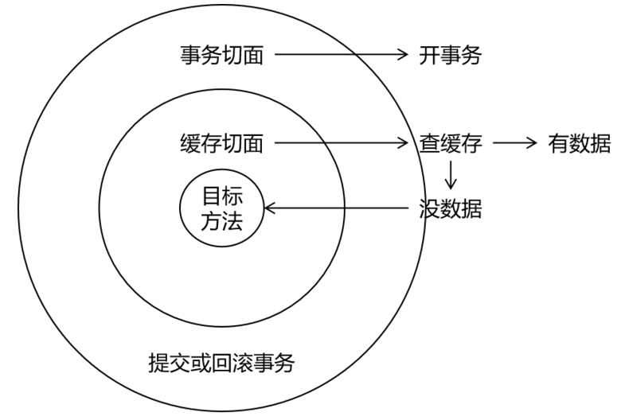

此时应该将缓存切面的优先级提高，在事务操作之前先检查缓存中是否存在目标数据。

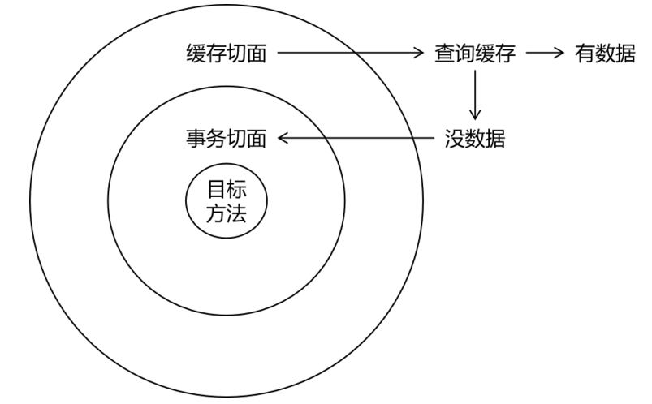

## AOP的完全XML开发

我们可以直击在XML中配置AOP的切面属性

```XML
<?xml version="1.0" encoding="UTF-8"?>
<beans xmlns="http://www.springframework.org/schema/beans"
       xmlns:xsi="http://www.w3.org/2001/XMLSchema-instance"
       xmlns:aop="http://www.springframework.org/schema/aop"
       xmlns:context="http://www.springframework.org/schema/context"
       xsi:schemaLocation="http://www.springframework.org/schema/beans
       http://www.springframework.org/schema/beans/spring-beans.xsd
       http://www.springframework.org/schema/aop
       https://www.springframework.org/schema/aop/spring-aop.xsd
       http://www.springframework.org/schema/context
       https://www.springframework.org/schema/context/spring-context.xsd">
    <!--spring 包扫描  -->
    <context:component-scan base-package="com.meturing" />
    <!--aop autoProxy 自动生成代理对象 -->
    <aop:aspectj-autoproxy />
    <!-- Aop的配置 -->
    <aop:config>
        <!-- 配置公共切入点表达式 -->
        <aop:pointcut id="addPointCut" expression="execution(* com.meturing.dao.*.add*(..))"/>
        <!-- 配置切面类 -->
        <aop:aspect id="daoAspectByXML" ref="daoAspectByXml">
            <!-- 前置通知: method方法名  pointcut-ref:公共切入点表达式ID -->
            <aop:before method="methodBefore" pointcut-ref="addPointCut" />
            <!-- 返回通知: method方法名  pointcut-ref:公共切入点表达式ID returning:指定返回的值 -->
            <aop:after-returning method="methodAfterReturning" pointcut-ref="addPointCut" returning="res" />
            <!-- 异常通知: method方法名  pointcut-ref:公共切入点表达式ID throwing:异常的值 -->
            <aop:after-throwing method="methodAfterThrowing" pointcut-ref="addPointCut" throwing="ex" />
            <!-- 后置通知: method方法名  pointcut-ref:公共切入点表达式ID -->
            <aop:after method="methodAfter" pointcut-ref="addPointCut" />
            <!-- 环绕通知: method方法名  pointcut-ref:公共切入点表达式ID -->
            <aop:around method="methodAround" pointcut-ref="addPointCut" />
        </aop:aspect>
    </aop:config>
</beans>
```

在`aop:config`标签中配置:
- `aop:pointcut`标签配置切入点表达式
- `aop:aspect`标签配置切面类 使用ref属性关联到切面的bean
	- `aop:before`标签配置前置通知 使用pointcut-ref关联到切入点表达式
	- `aop:after-returning`标签配置返回通知 使用pointcut-ref关联到切入点表达式，returning指定方法中用来接受目标方法返回值的参数名
	- `aop:after-throwing`标签配置异常通知 使用pointcut-ref关联到切入点表达式，throwing指定目标方法异常时的参数名
	- `aop:after`标签配置后置通知 使用pointcut-ref关联到切入点表达式

## AOP的完全注解开发

添加配置类SpringConfig.java

```Java
@Configuration
@ComponentScan(basePackages = "com.meturing")
@EnableAspectJAutoProxy(proxyTargetClass = true)
public class SpringConfig {
}
```

测试类
```Java
@Test
public void test2(){
	ApplicationContext context=new AnnotationConfigApplicationContext(SpringConfig.class);
	UserDao userDao = context.getBean( UserDao.class);
	int add = userDao.addUser(10,"晓明");
}
```

## AOP的通知获取细节

### JoinPoint接口

**JoinPoint接口** : `org.aspectj.lang.JoinPoint`

1. 要点1：JoinPoint接口通过getSignature()方法获取目标方法的签名
2. 要点2：通过目标方法签名对象获取方法名
3. 要点3：通过JoinPoint对象获取外界调用目标方法时传入的实参列表组成的数组

```Java
/**获取目标方法名称，实际参数列表
     * 在前置通知方法形参位置声明一个JoinPoint类型的参数，Spring就会将这个对象传入
     * 然后根据这个对象就可以获取目标方法的名称、实际参数列表*/
    @Before(value = "execution(public int com.meturing.aop.impl.CalculatorPureImpl.div(int,int))")
    public void printLogBeforeCore(JoinPoint joinPoint){
        //1. 通过JoinPoint对象获取目标方法签名对象
        //一个方法的全部声明信息就是一个方法的签名
        Signature signature = joinPoint.getSignature();
        String name = signature.getName();
        System.out.println("方法名：name() =" + name);
        int modifiers = signature.getModifiers();
        //二进制的形式返回
        System.out.println("修饰符：modifiers() =" + modifiers);
        String declaringTypeName = signature.getDeclaringTypeName();
        System.out.println("声明类型的全限定名：declaringTypeName() =" + declaringTypeName);
        //参数列表
        Object[] args = joinPoint.getArgs();
        List<Object> objects = Arrays.asList(args);
        System.out.println("参数列表是："+objects);
        System.out.println("[前置通知] 前置通知...");
    }
```

需要获取方法签名、传入的实参等信息时，可以在通知方法声明JoinPoint类型的形参。
获取方法名：`joinPoint.getSignature();`
获取修饰符：`signature.getModifiers(); `（返回是以二进制的形式）
获取类型的全限定名：`signature.getDeclaringTypeName();`
获取参数：`Object[] args = joinPoint.getArgs(); List objects = Arrays.asList(args);`

### 方法返回值

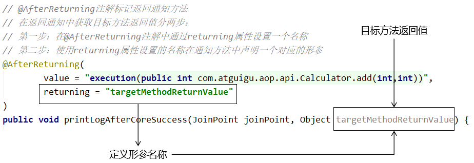

```Java
//获取目标方法返回值分两步
//第一步：在AfterReturning注解中，配置returning属性的值设置形参的名称
//第二步：使用returning属性设置的名称在通知方法中声明一个形参Object
@AfterReturning(value = "execution(public int com.meturing.aop.impl.CalculatorPureImpl.div(int,int))",
                returning = "targetMethodReturn")
public void printLogAfterCoreSuccess(JoinPoint joinPoint,Object targetMethodReturn){
    String name = joinPoint.getSignature().getName();
    System.out.println("[返回通知] "+name+"方法执行成功返回..."+targetMethodReturn);
}
```

### 抛出的异常捕捉

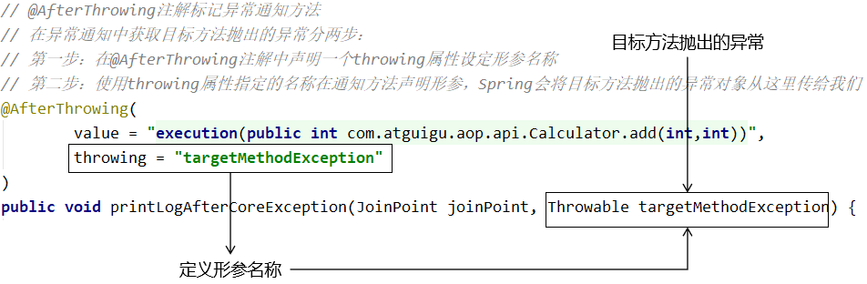

在异常通知中，通过@AfterThrowing注解的throwing属性获取目标方法抛出的异常对象

```Java
//获取异常值分两步
//第一步：AfterThrowing，配置throwing属性的值设置形参的名称
//第二步：使用throwing属性设置的名称在通知方法中声明一个形参，Spring会将目标方法抛出的异常从这传入
@AfterThrowing(value = "execution(public int com.meturing.aop.impl.CalculatorPureImpl.div(int,int))",
               throwing = "targetMethodException")
public void printLogAfterCoreException(JoinPoint joinPoint,Throwable targetMethodException){
    System.out.println("[异常通知] 方法异常..."+targetMethodException.getMessage());
}
```

## AOP对获取bean的影响

### 情景一：只有一个bean类

IOC中只有一个同类型的bean : 根据类型获取bean <font color="#00b050">可以正常获取bean对象</font>

IOC中有多个同类型的bean : 根据类型获取bean <font color="#ff0000">抛出NoUniqueBeanDefinitionException异常，表示IOC容器中这个类型的bean有多个</font>

### 情景二：一个接口和一个实现类bean

根据接口类型获取bean : <font color="#00b050">能够正常获取到bean</font>

根据类型获取bean : <font color="#00b050">能够正常获取到bean</font>

### 情景三：一个接口和多个实现类bean

根据接口类型获取bean : <font color="#ff0000">抛出NoUniqueBeanDefinitionException异常，表示IOC容器中这个类型的bean有多个</font>

根据类型获取bean : <font color="#00b050">能够正常获取到bean</font>

### 情景四：一个接口和一个实现类bean，并对接口切面【重要】

根据接口类型获取bean : <font color="#00b050">能够正常获取到bean</font>

根据类型获取bean : <font color="#ff0000">此时获取不到对应的bean，所以无法装配，抛出异常</font>
- 原因分析：**动态代理**
	- 应用了切面后，真正放在IOC容器中的是代理类的对象
	- 目标类并没有被放到IOC容器中，所以根据目标类的类型从IOC容器中是找不到的
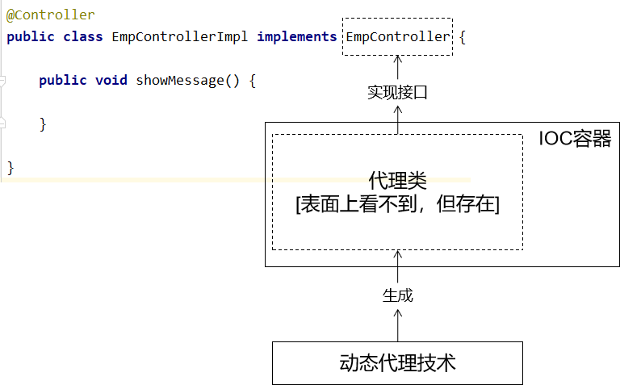
从内存分析的角度来说，IOC容器中引用的是代理对象，代理对象引用的是目标对象。IOC容器并没有直接引用目标对象，所以根据目标类本身在IOC容器范围内查找不到。
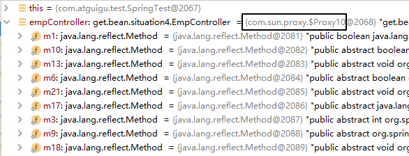

### 情景五：一个bean类，并对其切面【重要】

根据接口类型获取bean : <font color="#00b050">能够正常获取到bean</font>
- 原因分析 ： **cglib代理**
由于没有使用接口，我们是直接对实现类进行切面编程，所以Spring使用的是CGlib代理
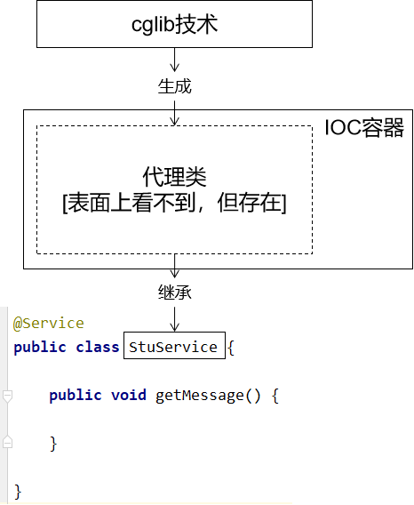
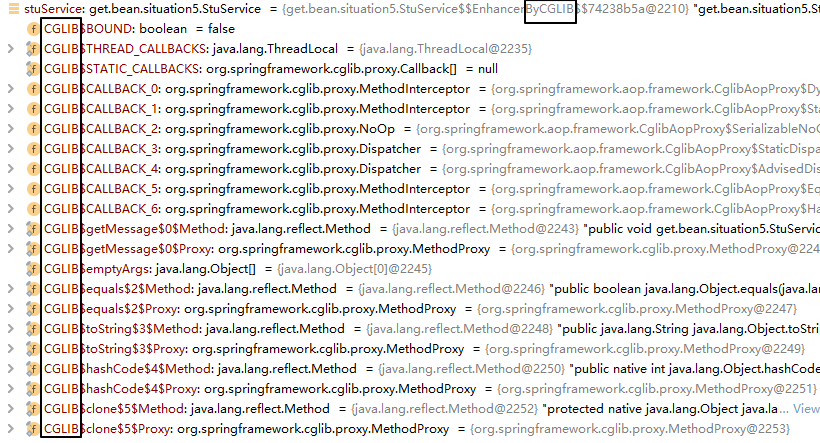

根据类型获取bean : <font color="#00b050">能够正常获取到bean</font>

### 总结

对实现了接口的类应用切面


对没实现接口的类应用切面

