## 环境准备

### 数据库准备

继续使用该类型的数据源

[导入数据库](../../01_Mybatis基础/02_搭建Mybatis项目环境/搭建Mybatis项目环境.md#导入数据库)

### 项目工程初始化

#### 导入Maven依赖

我们依旧需要导入以下依赖:
1. `spring-context `-> Spring核心依赖
2. `spring-aspects` -> Spring切面
3. `aopalliance` -> AOP联盟包
4. `druid `-> 德鲁伊连接池
5. `mysql-connector-java` -> mysql连接驱动
6. `spring-jdbc` -> **新**  SpringJDBC包
7. `spring-tx` -> **新**  Spring事务
8. `spring-orm` -> **新**  SpringORM
9. `lombok` -> Lombok包
10. `commons-logging` -> Apache Commons日志
11. `junit`   ->  单元测试

```XML
<packaging>jar</packaging>

<properties>
	<maven.compiler.source>8</maven.compiler.source>
	<maven.compiler.target>8</maven.compiler.target>
	<project.build.sourceEncoding>UTF-8</project.build.sourceEncoding>
</properties>
<dependencies>
	<!-- Spring核心依赖 -->
	<dependency>
		<groupId>org.springframework</groupId>
		<artifactId>spring-context</artifactId>
		<version>5.2.12.RELEASE</version>
	</dependency>
	<!-- Spring切面 -->
	<dependency>
		<groupId>org.springframework</groupId>
		<artifactId>spring-aspects</artifactId>
		<version>5.3.5</version>
	</dependency>
	<!-- AOP联盟 -->
	<dependency>
		<groupId>aopalliance</groupId>
		<artifactId>aopalliance</artifactId>
		<version>1.0</version>
	</dependency>
	<!-- 德鲁伊连接池 -->
	<dependency>
		<groupId>com.alibaba</groupId>
		<artifactId>druid</artifactId>
		<version>1.1.14</version>
	</dependency>
	<!-- Mysql连接驱动 -->
	<dependency>
		<groupId>mysql</groupId>
		<artifactId>mysql-connector-java</artifactId>
		<version>8.0.28</version>
	</dependency>
	<!-- SpringJDBC包 -->
	<dependency>
		<groupId>org.springframework</groupId>
		<artifactId>spring-jdbc</artifactId>
		<version>5.3.18</version>
	</dependency>
	<!-- Spring事务管理 -->
	<dependency>
		<groupId>org.springframework</groupId>
		<artifactId>spring-tx</artifactId>
		<version>5.3.18</version>
	</dependency>
	<!-- Spring中的ORM映射 -->
	<dependency>
		<groupId>org.springframework</groupId>
		<artifactId>spring-orm</artifactId>
		<version>5.3.5</version>
	</dependency>
	<!-- lombok -->
	<dependency>
		<groupId>org.projectlombok</groupId>
		<artifactId>lombok</artifactId>
		<version>1.18.26</version>
	</dependency>
	<!-- Apache Commons日志 -->
	<dependency>
		<groupId>commons-logging</groupId>
		<artifactId>commons-logging</artifactId>
		<version>1.2</version>
	</dependency>
	<!-- 单元测试 -->
	<dependency>
		<groupId>junit</groupId>
		<artifactId>junit</artifactId>
		<version>4.13.1</version>
		<scope>test</scope>
	</dependency>
</dependencies>
```

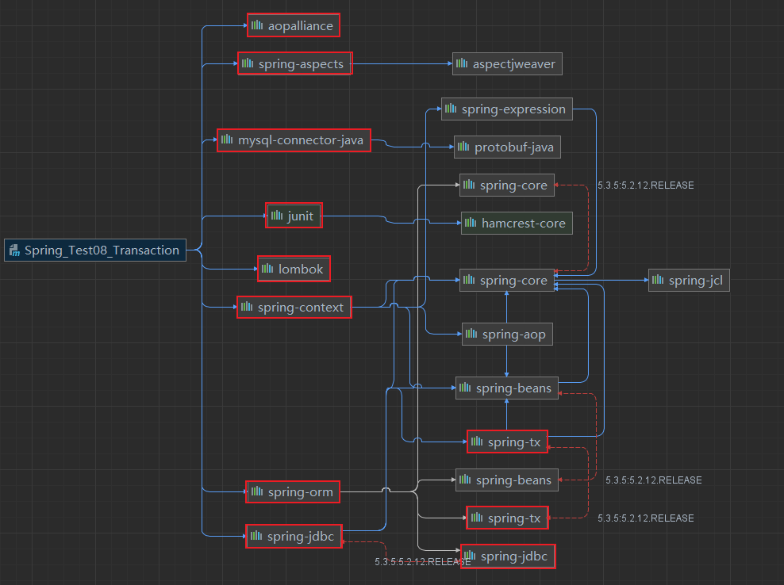

#### 配置Spring工程

applicationContex.xml
```XML
<?xml version="1.0" encoding="UTF-8"?>
<beans xmlns="http://www.springframework.org/schema/beans"
       xmlns:xsi="http://www.w3.org/2001/XMLSchema-instance"
       xmlns:context="http://www.springframework.org/schema/context"
       xmlns:p="http://www.springframework.org/schema/p"
       xmlns:c="http://www.springframework.org/schema/c"
       xmlns:aop="http://www.springframework.org/schema/aop"
       xmlns:util="http://www.springframework.org/schema/util"
       xsi:schemaLocation="http://www.springframework.org/schema/beans
       http://www.springframework.org/schema/beans/spring-beans.xsd
       http://www.springframework.org/schema/context
       https://www.springframework.org/schema/context/spring-context.xsd
       http://www.springframework.org/schema/c
       https://www.springframework.org/schema/c/spring-c.xsd
       http://www.springframework.org/schema/aop
       https://www.springframework.org/schema/aop/spring-aop.xsd
       http://www.springframework.org/schema/util
       https://www.springframework.org/schema/util/spring-util.xsd
       http://www.springframework.org/schema/p
       https://www.springframework.org/schema/p/spring-p.xsd">
    <!-- 包扫描 -->
    <context:component-scan base-package="com.meturing" />
    <!-- 导入外部配置依赖 -->
    <context:property-placeholder location="JDBC.properties" />
    <!-- 配置德鲁伊连接池 -->
    <bean id="dataSource" class="com.alibaba.druid.pool.DruidDataSource">
        <property name="username" value="${jdbc_username}"/>
        <property name="password" value="${jdbc_password}"/>
        <property name="url" value="${jdbc_url}"/>
        <property name="driverClassName" value="${jdbc_driver}"/>
    </bean>

    <!--配置JDBCTemplate对象,并向里面注入DataSource-->
    <bean id="jdbcTemplate" class="org.springframework.jdbc.core.JdbcTemplate">
        <!--通过set方法注入连接池-->
        <property name="dataSource" ref="dataSource"/>
    </bean>
</beans>
```

JDBC.properties 数据源配置文件

```XMl
jdbc_username=root
jdbc_password=root
jdbc_driver=com.mysql.cj.jdbc.Driver
jdbc_url=jdbc:mysql://192.168.1.188:3306/test?useSSL=false&useUnicode=true&characterEncoding=UTF-8&serverTimezone=Asia/Shanghai&allowPublicKeyRetrieval=true
```

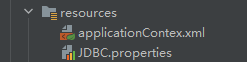

#### 创建工程文件层级

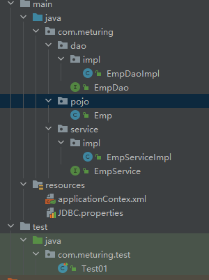


Emp.Java实体类

```Java
@AllArgsConstructor
@NoArgsConstructor
@Data
public class Emp implements Serializable{
    private Integer empno;
    private String ename;
    private String job;
    private Integer mgr;
    private Date hiredate;
    private Double sal;
    private Double comm;
    private Integer deptno;
}
```

EmpService.java 接口

```Java
public interface EmpService {
    int findEmpCount();
    Emp findByEmpno(int empno);
    List<Emp> findByDeptno(int deptno);
    int addEmp(Emp emp);
    int updateEmp(Emp emp);
    int deleteEmp( int empno);
}
```

EmpServiceImpl.java 实现类

```Java
@Service
public class EmpServiceImpl implements EmpService {
    @Autowired
    private EmpDao empDao;
    @Override
    public int findEmpCount() {return empDao.findEmpCount();}
    @Override
    public Emp findByEmpno(int empno) {return empDao.findByEmpno(empno);}
    @Override
    public List<Emp> findByDeptno(int deptno) {return empDao.findByDeptno(deptno);}
    @Override
    public int addEmp(Emp emp) {return empDao.addEmp(emp);}
    @Override
    public int updateEmp(Emp emp) {return empDao.updateEmp(emp);}
    @Override
    public int deleteEmp(int empno) {return empDao.deleteEmp(empno);}
}
```

EmpDao.java 持久层工具接口

```Java
public interface EmpDao {
    int findEmpCount();
    Emp findByEmpno(int empno);
    List<Emp> findByDeptno(int deptno);
    int addEmp(Emp emp);
    int updateEmp(Emp emp);
    int deleteEmp(int empno);
}
```

```java
@Repository
public class EmpDaoImpl implements EmpDao {
	@Autowired  
	private JdbcTemplate jdbcTemplate;//获取JdbcTemplate对象操作数据库
    @Override
    public int findEmpCount() {return 0;}//获取Emp总数
    @Override
    public Emp findByEmpno(int empno) {return null;}//根据empno查询
    @Override
    public List<Emp> findByDeptno(int deptno) {return null;}//根据deptno查询
    @Override
    public int addEmp(Emp emp) {return 0;} //新增
    @Override
    public int updateEmp(Emp emp) {return 0;}//修改
    @Override
    public int deleteEmp(int empno) {return 0;}//删除
}
```

## JDBCTemplate的使用

### 概述

JDBCTemplate是spring框架中提供的一个对象，是对原始繁琐的Jdbc API对象的简单封装。spring框架为我们提供了很多的操作模板类。

例如：操作关系型数据的JdbcTemplate和，操作nosql数据库的RedisTemplate，操作消息队列的JmsTemplate等等。

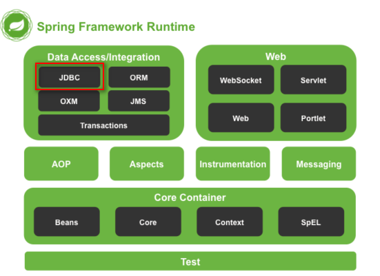

### 简单的使用

#### 查询

##### 单一结果

queryForObject : 查询并返回Object类型实体
`<T> T queryForObject(String sql, RowMapper<T> rowMapper, @Nullable Object... args)`

EmpDaoImpl.java

```Java
@Override
public int findEmpCount() {
	return jdbcTemplate.queryForObject("select count(1) from emp", Integer.class);
}

@Override
public Emp findByEmpno(int empno) {
	BeanPropertyRowMapper<Emp> empBeanPropertyRowMapper = new BeanPropertyRowMapper<>(Emp.class);
	return jdbcTemplate.queryForObject("select * from  emp where empno =?", empBeanPropertyRowMapper, empno);
}
```

测试类

```Java
@Test
public void test01(){
	ApplicationContext applicationContext = new ClassPathXmlApplicationContext("applicationContex.xml");
	EmpService empService = applicationContext.getBean( EmpService.class);
	int empCount = empService.findEmpCount();//获取员工的总数
	System.out.println(empCount);
	
	Emp byEmpno = empService.findByEmpno(8899);  
	System.out.println(byEmpno);
}
```

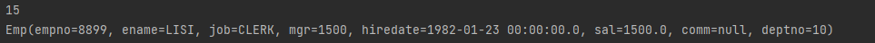

##### 多结果返回

query : 返回多结果值
`<T> List<T> query(String sql, RowMapper<T> rowMapper, @Nullable Object... args)`

EmpDaoImpl.java

```Java
@Override
public List<Emp> findByDeptno(int deptno) {
	String sql = "select * from emp where deptno =?";
	BeanPropertyRowMapper<Emp> empBeanPropertyRowMapper = new BeanPropertyRowMapper<>(Emp.class);
	return jdbcTemplate.query(sql, empBeanPropertyRowMapper, deptno);
}
```

测试类

```Java
@Test
public void test01(){
	ApplicationContext applicationContext = new ClassPathXmlApplicationContext("applicationContex.xml");
	EmpService empService = applicationContext.getBean( EmpService.class);
	List<Emp> byDeptno = empService.findByDeptno(30);  
	System.out.println(byDeptno);
}
```

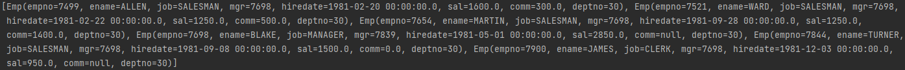

####  增/删/改

增删改的操作都是使用update方法
`int update(String sql, @Nullable Object... args)`

EmpDaoImpl.java

```Java
//新增
@Override
public int addEmp(Emp emp) {
	String sql = "insert into emp values(DEFAULT ,?,?,?,?,?,?,?)";
	Object[] args = {emp.getEname(),emp.getJob(),emp.getMgr(),emp.getHiredate(),emp.getSal(),emp.getComm(),emp.getDeptno()};
	return jdbcTemplate.update(sql, args);
}

//修改
@Override
public int updateEmp(Emp emp) {
	String sql = "update emp set ename =? , job =?, mgr=? , hiredate =?, sal=?, comm=?, deptno =? where empno =?";
	Object[] args = {emp.getEname(),emp.getJob(),emp.getMgr(),emp.getHiredate(),emp.getSal(),emp.getComm(),emp.getDeptno(),emp.getEmpno()};
	return jdbcTemplate.update(sql, args);
}

//删除
@Override
public int deleteEmp(int empno) {
	String sql ="delete  from emp where empno =?";
	return jdbcTemplate.update(sql, empno);
}
```

测试类

```Java
@Test
public void test01(){
	ApplicationContext applicationContext = new ClassPathXmlApplicationContext("applicationContex.xml");
	EmpService empService = applicationContext.getBean( EmpService.class);
	
	//Emp emp = new Emp(null, "test", "test", 1888, new Date(), 1888.00, null, 10);
	//empService.addEmp(emp);
	
	//Emp emp = new Emp(8900, "111", "test", 1888, new Date(), 1888.00, 0.0, 10);
	//empService.updateEmp(emp);
	
	empService.deleteEmp(8900);
}
```

## JDBCTemplate的批处理

### 新增工程文件

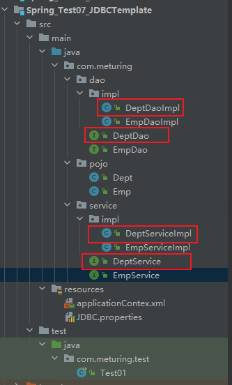

DeptService.java
```Java
public interface DeptService {
    int[] deptBatchAdd(List<Dept> depts);
    int[] deptBatchUpdate(List<Dept> depts);
    int[] deptBatchDelete(List<Integer> deptnos);
}
```

DeptServiceImpl.java

```Java
@Service
public class DeptServiceImpl implements DeptService {
	@Autowired  
	private DeptDao deptDao;  
	@Override  
	public int[] deptBatchAdd(List<Dept> depts) {return deptDao.deptBatchAdd(depts);}  
	@Override  
	public int[] deptBatchUpdate(List<Dept> depts) {return deptDao.deptBatchUpdate(depts);}  
	@Override  
	public int[] deptBatchDelete(List<Integer> deptnos) {return deptDao.deptBatchDelete(deptnos);}
}
```

DeptDao.java

```Java
@Repository
public interface DeptDao {
    int[] deptBatchAdd(List<Dept> depts);
    int[] deptBatchUpdate(List<Dept> depts);
    int[] deptBatchDelete(List<Integer> deptnos);
}
```

DeptDaoImpl.java

```Java
@Repository
public class DeptDaoImpl implements DeptDao {
	@Autowired  
	private JdbcTemplate template;
    @Override
    public int[] deptBatchAdd(List<Dept> depts) {return new int[0];}//批量新增
    @Override
    public int[] deptBatchUpdate(List<Dept> depts) {return new int[0];}//批量更新
    @Override
    public int[] deptBatchDelete(List<Integer> deptnos) {return new int[0];}//批量删除
}
```

### 简单实用

在批量处理时,我们统一使用的是`int[] batchUpdate(String sql, List<Object[]> batchArgs)`方法

#### 批量新增

DeptDaoImpl.java

```Java
@Override
public int[] deptBatchAdd(List<Dept> depts) {
	String sql ="insert into dept values(DEFAULT,?,?)";
	List<Object[]> args =new LinkedList<>();
	for (Dept dept : depts) {
		Object[] arg ={dept.getDname(),dept.getLoc()};
		args.add(arg);
	}
	return template.batchUpdate(sql,args);
}
```

测试类

```Java
@Test
public void test02(){
	ApplicationContext applicationContext = new ClassPathXmlApplicationContext("applicationContex.xml");
	DeptService deptService = applicationContext.getBean( DeptService.class);
	List<Dept> depts = new ArrayList<>();
	 depts.add(new Dept(null, "1","1"));
	 depts.add(new Dept(null, "2","2"));
	 depts.add(new Dept(null, "3","3"));
	deptService.deptBatchAdd(depts);
}
```

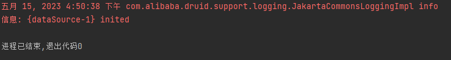


#### 批量更新

DeptDaoImpl.java

```Java
@Override
public int[] deptBatchUpdate(List<Dept> depts) {
	String sql ="update dept set dname =? ,loc =? where deptno=?";
	List<Object[]> args =new LinkedList<>();
	for (Dept dept : depts) {
		Object[] arg ={dept.getDname(),dept.getLoc(),dept.getDeptno()};
		args.add(arg);
	}
	return template.batchUpdate(sql, args);
}
```

测试类

```Java
@Test
public void test02(){
	ApplicationContext applicationContext = new ClassPathXmlApplicationContext("applicationContex.xml");
	DeptService deptService = applicationContext.getBean( DeptService.class);
	List<Dept> depts = new ArrayList<>();
	 depts.add(new Dept(50, "11","11"));
	 depts.add(new Dept(60, "22","22"));
	 depts.add(new Dept(70, "33","33"));
	deptService.deptBatchAdd(depts);
}
```

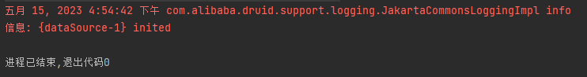

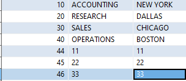

#### 批量删除

DeptDaoImpl.java

```Java
@Override
public int[] deptBatchUpdate(List<Dept> depts) {
	String sql ="update dept set dname =? ,loc =? where deptno=?";
	List<Object[]> args =new LinkedList<>();
	for (Dept dept : depts) {
		Object[] arg ={dept.getDname(),dept.getLoc(),dept.getDeptno()};
		args.add(arg);
	}
	return template.batchUpdate(sql, args);
}
```

测试类

```Java
@Test
public void test02(){
	ApplicationContext applicationContext = new ClassPathXmlApplicationContext("applicationContex.xml");
	DeptService deptService = applicationContext.getBean( DeptService.class);
	List<Integer> deptnos =new ArrayList<>();  
	deptnos.add(44);  
	deptnos.add(45);  
	deptnos.add(46);  
	deptService.deptBatchDelete(deptnos);
}
```

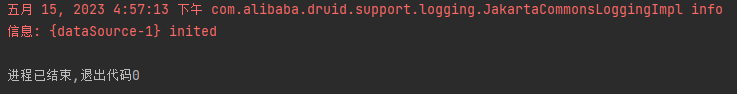

