## 事务的回顾

### 事务的概念

`事务(Transaction)`指的是一个操作序列，该操作序列中的多个操作要么都做，要么都不做，是一个不可分割的工作单位，**是数据库环境中的逻辑工作单位，由DBMS中的事务管理子系统负责事务的处理。**

目前常用的存储引擎有`InnoDB`（MySQL5.5以后默认的存储引擎）和`MyISAM`（MySQL5.5之前默认的存储引擎），其中**InnoDB支持事务处理机制，而MyISAM不支持。**

### 事务的特性

事务处理可以确保除非事务性序列内的所有操作都成功完成，否则不会永久更新面向数据的资源。通过将一组相关操作组合为一个**要么全部成功要么全部失败的序列**，可以简化错误恢复并使应用程序更加可靠。

但并不是所有的操作序列都可以称为事务，这是因为一个操作序列要成为事务，必须满足事务的`原子性（Atomicity）`、`一致性（Consistency）`、`隔离性（Isolation）`和`持久性（Durability）`。这四个特性简称为ACID特性。

#### 原子性（Atomicity）

原子是自然界最小的颗粒，具有不可再分的特性。事务中的所有操作可以看做一个原子，事务是应用中不可再分的最小的逻辑执行体。

使用事务对数据进行修改的操作序列，要么全部执行，要么全不执行。通常，某个事务中的操作都具有共同的目标，并且是相互依赖的。如果数据库系统只执行这些操作中的一部分，则可能会破坏事务的总体目标，而原子性消除了系统只处理部分操作的可能性。

#### 一致性（Consistency）

一致性是指事务执行的结果必须使数据库从一个一致性状态，变到另一个一致性状态。当数据库中只包含事务成功提交的结果时，数据库处于一致性状态。一致性是通过原子性来保证的。

例如：在转账时，只有保证转出和转入的金额一致才能构成事务。也就是说事务发生前和发生后，数据的总额依然匹配。

#### 隔离性（Isolation）

隔离性是指各个事务的执行互不干扰，任意一个事务的内部操作对其他并发的事务，都是隔离的。也就是说：并发执行的事务之间既不能看到对方的中间状态，也不能相互影响。

例如：在转账时，只有当A账户中的转出和B账户中转入操作都执行成功后才能看到A账户中的金额减少以及B账户中的金额增多。并且其他的事务对于转账操作的事务是不能产生任何影响的。

#### 持久性（Durability）

持久性指事务一旦提交，对数据所做的任何改变，都要记录到永久存储器中，通常是保存进物理数据库，即使数据库出现故障，提交的数据也应该能够恢复。但如果是由于外部原因导致的数据库故障，如硬盘被损坏，那么之前提交的数据则有可能会丢失。

### 事务的并发问题

#### 脏读（Dirty read）

当一个事务正在访问数据并且对数据进行了修改，而这种修改还没有提交到数据库中，这时另外一个事务也访问了这个数据，然后使用了这个数据。因为这个数据是还没有提交的数据，那么另外一个事务读到的这个数据是“脏数据”，依据“脏数据”所做的操作可能是不正确的。

| 时间点 | 事务A      | 事务B      |
|:----|:---------|:---------|
|   1 | 开启事务A    |          |
|   2 |          | 开启事务B    |
|   3 | 查询余额为100 |          |
|   4 |          | 余额增加至150 |
|   5 | 查询余额为150 |          |
|   6 |          | 事务回滚     |  

#### 不可重复读（Unrepeatableread）

指在一个事务内多次读同一数据。在这个事务还没有结束时，另一个事务也访问该数据。那么，在第一个事务中的两次读数据之间，由于第二个事务的修改导致第一个事务两次读取的数据可能不太一样。这就发生了在一个事务内两次读到的数据是不一样的情况，因此称为不可重复读。

| 时间点 | 事务A      | 事务B      |
|:----|:---------|:---------|
|   1 | 开启事务A    |          |
|   2 |          | 开启事务B    |
|   3 | 查询余额为100 |          |
|   4 |          | 余额增加至150 |
|   5 | 查询余额为100 |          |
|   6 |          | 提交事务     |  
|   7 | 查询余额为150 |      |  

#### 幻读(Phantom read)

幻读与不可重复读类似。它发生在一个事务（T1）读取了几行数据，接着另一个并发事务（T2）插入了一些数据时。在随后的查询中，第一个事务（T1）就会发现多了一些原本不存在的记录，就好像发生了幻觉一样，所以称为幻读。

| 时间点 | 事务A                | 事务B        |
|:----|:-------------------|:-----------|
|   1 | 开启事务A              |            |
|   2 |                    | 开启事务B      |
|   3 | 查询id&lt;3的所有记录,共3条 |            |
|   4 |                    | 插入一条记录id=2 |
|   5 |                    | 提交事务       |
|   6 | 查询id&lt;3的所有记录,共4条 |            |  

**不可重复度和幻读区别**：
不可重复读的重点是修改，幻读的重点在于新增或者删除。

**解决不可重复读的问题只需锁住满足条件的行，解决幻读需要锁表**
例1（同样的条件, 你读取过的数据, 再次读取出来发现值不一样了 ）：事务1中的A先生读取自己的工资为 1000的操作还没完成，事务2中的B先生就修改了A的工资为2000，导 致A再读自己的工资时工资变为 2000；这就是不可重复读。
例2（同样的条件, 第1次和第2次读出来的记录数不一样 ）：假某工资单表中工资大于3000的有4人，事务1读取了所有工资大于3000的人，共查到4条记录，这时事务2又插入了一条工资大于3000的记录，事务1再次读取时查到的记录就变为了5条，这样就导致了幻读

### 事务的隔离级别

事务的隔离级别用于决定如何控制并发用户读写数据的操作。数据库是允许多用户并发访问的，如果多个用户同时开启事务并对同一数据进行读写操作的话，有可能会出现脏读、不可重复读和幻读问题，所以MySQL中提供了四种隔离级别来解决上述问题。

事务的隔离级别从低到高依次为
-  `READ UNCOMMITTED` - 读未提交、
- `READ COMMITTED` - 读已提交、
- `REPEATABLE READ` - 可重复读 
-  `SERIALIZABLE` - 串行化

隔离级别越低，越能支持高并发的数据库操作。

| 隔离级别                        | 脏读 | 不可重复读                                     | 幻读 |
|:----------------------------|:---|:-----------------------------------------:|:---|
| READ UNCOMMITTED            | √  | <span style="text-align: start;">√</span> | √  |
| READ COMMITTED              | ×  | <span style="text-align: start;">√</span> | √  |
| REPEATABLE READ&nbsp;&nbsp; | ×  | <span style="text-align: start;">×</span> | √  |
| SERIALIZABLE&nbsp;          | ×  | <span style="text-align: start;">×</span> | ×  |  

默认Mysql使用的是: `REPEATABLE READ` - 可重复读
## 简单的转账案例

### 数据源准备

```SQL
CREATE TABLE `wallet` (
  `id` int NOT NULL AUTO_INCREMENT,
  `name` varchar(100) DEFAULT NULL,
  `money` double DEFAULT NULL,
  PRIMARY KEY (`id`),
  KEY `wallet_id_IDX` (`id`) USING BTREE
) ENGINE=InnoDB DEFAULT CHARSET=utf8mb4 COLLATE=utf8mb4_0900_ai_ci;

INSERT INTO wallet (id, name, money) VALUES(1, 'zhangsan', 15000.0);
INSERT INTO wallet (id, name, money) VALUES(2, 'lisi', 1000.0);
```


### Spring工程配置

[导入Maven依赖](../09_JDBCTemplate/JDBCTemplate.md#导入Maven依赖)

[配置Spring工程](../09_JDBCTemplate/JDBCTemplate.md#配置Spring工程)

### 实现转账功能

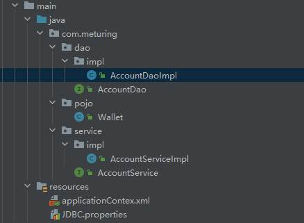

Wallet.java实体类
```Java
@AllArgsConstructor
@NoArgsConstructor
@Data
public class Wallet implements Serializable {
    private Integer id;
    private String name;
    private Integer money;
}
```

AccountDao.java接口
```Java
public interface AccountDao {
    int transMoney(int id,int money);
}
```

AccountDaoImpl.java接口实现类
```Java
@Repository
public class AccountDaoImpl implements AccountDao {
    @Autowired
    private JdbcTemplate jdbcTemplate;
    @Override
    public int transMoney(int id, int money) {
        String sql ="update wallet set money =money +? where id =?";
        return jdbcTemplate.update(sql,money,id);
    }
}
```

AccountService.java接口
```Java
public interface AccountService {
    int transMoney(int from ,int to,int money);
}
```

AccountServiceImpl.java接口实现类
```Java
@Service
public class AccountServiceImpl implements AccountService {
    @Autowired
    private AccountDao accountDao;
    @Override
    public int transMoney(int from, int to, int money) {
        int rows=0;
        rows+=accountDao.transMoney(from, 0 - money);
        rows+=accountDao.transMoney(to, money);
        return rows;
    }
}
```

测试类
```Java
@Test
public void test01(){
	ApplicationContext applicationContext = new ClassPathXmlApplicationContext("applicationContex.xml");
	AccountService accountService = applicationContext.getBean(AccountService.class);
	accountService.transMoney(1,2,500);
}
```

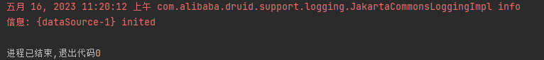

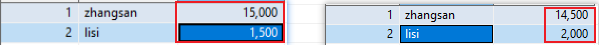

### 未开启事务的危害

在上面的操作中 A->B进行了转账行为,A的账户发生了扣款,B的账户发生了存款

如果在A->B转账中发生了异常,由于没有事务的控制,则会发生严重的后果:

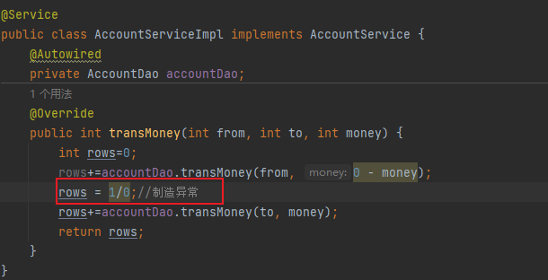

再次执行转账功能:

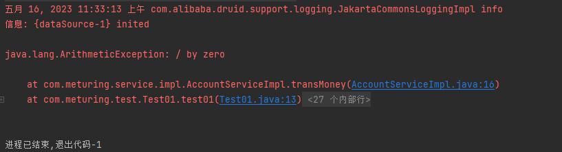

此时我们再次查看余额:

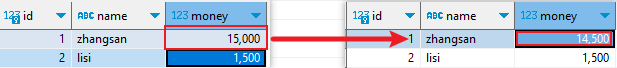

我们发现A账户发生了扣款,但是B账户并没有成功存款,此时也没有重置A账户的余额,这样最终违背了一致性原则

所以我们需要引入事务的控制

## Spring中对事物的管理

事务的管理应该放在我们的service层进行处理

spring中有两种事务的管理方式:
1. 编程式事务管理(了解) 
2. 声明式事务管理(掌握)
	1. 基于注解方式实现(掌握)
	2. XML方式实现(了解)

Spring声明式事务的实现方式,底层就是AOP,AOP的底层就是动态代理

**事务管理器接口: PlatformTransactionManager**  针对不同的框架,提供了不同的实现类
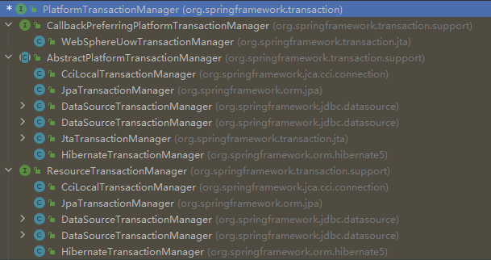

### 编程式事务管理 - 了解

#### 修改applicationContext.xml

1. 注入事务管理器`DataSourceTransactionManager` 并将 dataSource 指向数据源
2. 注入事务管理模板`TransactionTemplate` 并将 transactionManager 指向事务管理器`DataSourceTransactionManager` 

```XML
<!--配置事务管理器-->
<bean id="transactionManager" class="org.springframework.jdbc.datasource.DataSourceTransactionManager">
	<property name="dataSource" ref="dataSource" />
</bean>
<!--配置事务管理模板-->
<bean id="transactionTemplate" class="org.springframework.transaction.support.TransactionTemplate">
	<property name="transactionManager" ref="transactionManager" />
</bean>
```

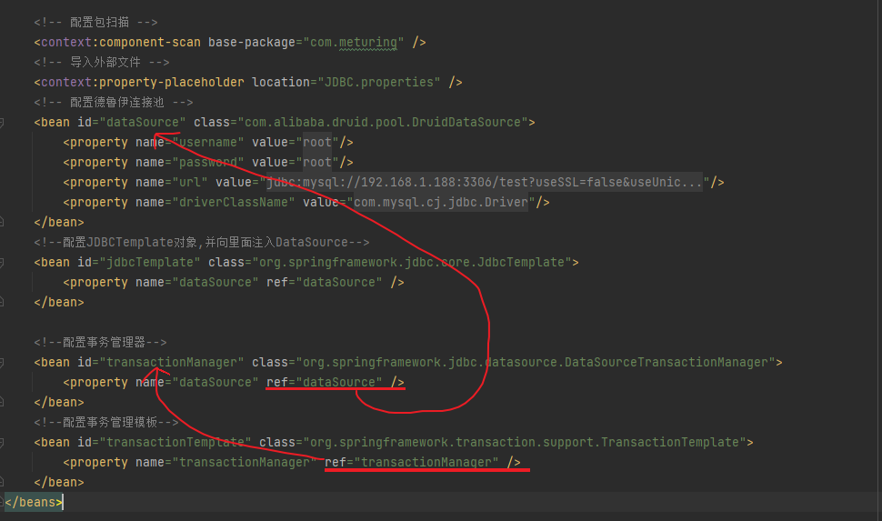

#### 修改Service层代码

AccountServiceImpl.java
```Java
@Service
public class AccountServiceImpl implements AccountService {
    @Autowired
    private AccountDao accountDao;
    @Autowired
    private TransactionTemplate transactionTemplate;
    @Override
    public int transMoney(int from, int to, int money) {
        Object execute = transactionTemplate.execute(new TransactionCallback<Object>() {
            @Override
            public Object doInTransaction(TransactionStatus transactionStatus) {
                //*********执行主要业务,过程中出现错误则回滚*************
                int rows=0;
                rows+=accountDao.transMoney(from, 0 - money);
                rows = 1/0;//制造异常
                rows+=accountDao.transMoney(to, money);
                return rows;
            }
        });
        return  execute instanceof Integer?(Integer)execute:0;
    }
}
```

1. 自动注入获取transactionTemplate对象
2. transactionTemplate对象中 `<T> T execute(TransactionCallback<T> action)` 方法执行事务
3. 使用`new TransactionCallback<Object>()` 接口直接实现`doInTransaction` 方法
4. `doInTransaction`方法中实现我们原有代码功能

注意: 默认情况下,`doInTransaction`方法中发生异常将自动回滚,我们无需干预,当然我们也可以使用`transactionStatus`对象手动创建还原点和回滚事件:
`Object savepoint = transactionStatus.createSavepoint();` 创建还原点
`transactionStatus.rollbackToSavepoint(savepoint);` 回滚到还原点

AccountServiceImpl.java
```Java
@Service
public class AccountServiceImpl implements AccountService {
    @Autowired
    private AccountDao accountDao;
    @Autowired
    private TransactionTemplate transactionTemplate;
    @Override
    public int transMoney(int from, int to, int money) {
        Object execute = transactionTemplate.execute(new TransactionCallback<Object>() {
            @Override
            public Object doInTransaction(TransactionStatus transactionStatus) {
                //创建还原点
                Object savepoint = transactionStatus.createSavepoint();
                //*********执行主要业务,过程中出现错误则回滚,并返回错误日志*************
                int rows=0;
                try {
                    rows+=accountDao.transMoney(from, 0 - money);
                    rows = 1/0;//制造异常
                    rows+=accountDao.transMoney(to, money);
                } catch (Exception e) {
                    //回滚至还原点
                    transactionStatus.rollbackToSavepoint(savepoint);
                    return 0;
                }
                return rows;
            }
        });
        return  execute instanceof Integer?(Integer)execute:0;
    }
}
```

#### 测试事务


### 声明式事务管理 - 熟悉

#### @Transactional注解管理事务

##### 修改applicationContext.xml

1. 导入tx声明空间
2. 配置`DataSourceTransactionManager`事务管理器,并将`dataSource`属性注入到数据源中
3. 使用`tx:annotation-driven` 标签 ,`transaction-manager `属性 指向`DataSourceTransactionManager`事务管理器

```XML
<!--配置一个事务管理器-->
<bean id="transactionManager" class="org.springframework.jdbc.datasource.DataSourceTransactionManager">
	<property name="dataSource" ref="dataSource" />
</bean>
<!--开启事务注解-->
<tx:annotation-driven transaction-manager="transactionManager" />
```


##### 修改Service层代码

使用`@Transactional` 注解在需要事务的地方:
1. 在类上使用,则当前类中的所有方法都开始事务处理
2. 在方法上使用,则当前方法使用事务处理

```Java
@Service
public class AccountServiceImpl implements AccountService {
    @Autowired
    private AccountDao accountDao;
    @Override
    @Transactional
    public int transMoney(int from, int to, int money) {
        int rows=0;
        rows+=accountDao.transMoney(from, 0 - money);
        rows+=accountDao.transMoney(to, money);
        return rows;
    }
}
```

##### 测试事务

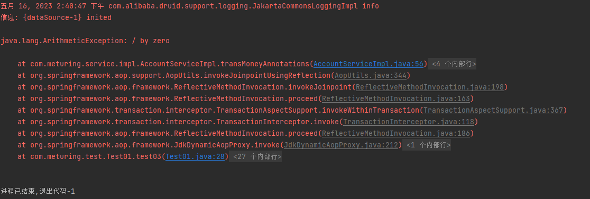

事务生效


#### XML方式管理事务

##### 修改applicationContext.xml

1. 导入tx声明空间
2. 配置`DataSourceTransactionManager`事务管理器,并将`dataSource`属性注入到数据源中
3. 使用`tx:advice`标签创建一个事物的通知
	1. `transaction-manager`属性指向`DataSourceTransactionManager`事务管理器
	2. `tx:method`子标签控制指定方法上的事务
4. 使用`aop:config` 为需要使用事务的类添加切面事件
	1. `aop:advisor`子标签上的`advice-ref`属性指向`tx:advice`标签创建的通知

```XML
<!--配置一个事务管理器-->
<bean id="transactionManager" class="org.springframework.jdbc.datasource.DataSourceTransactionManager">
	<property name="dataSource" ref="dataSource" />
</bean>
<!--配置通知-->
<tx:advice id="txAdvice" transaction-manager="transactionManager">
	<tx:attributes>
		<!--配置事务的参数-->
		<!-- read-only属性：设置为false 【默认就是可以不设置】-->
		<!-- rollback-for属性：设置回滚的异常-->
		<!-- no-rollback-for属性：设置不回滚的异常-->
		<!-- isolation属性：设置事务的隔离级别-->
		<!-- timeout属性：设置事务的超时属性-->
		<!-- propagation属性：设置事务的传播行为-->
		<tx:method name="*" isolation="DEFAULT"  propagation="REQUIRED"/>
	</tx:attributes>
</tx:advice>
<!--AOP添加事务-->
<aop:config>
	<!--配置切入点-->
	<aop:pointcut id="pt" expression="execution(* com.meturing.service.AccountService.*(..))"/>
	<!--配置切面-->
	<aop:advisor advice-ref="txAdvice" pointcut-ref="pt"></aop:advisor>
</aop:config>
```

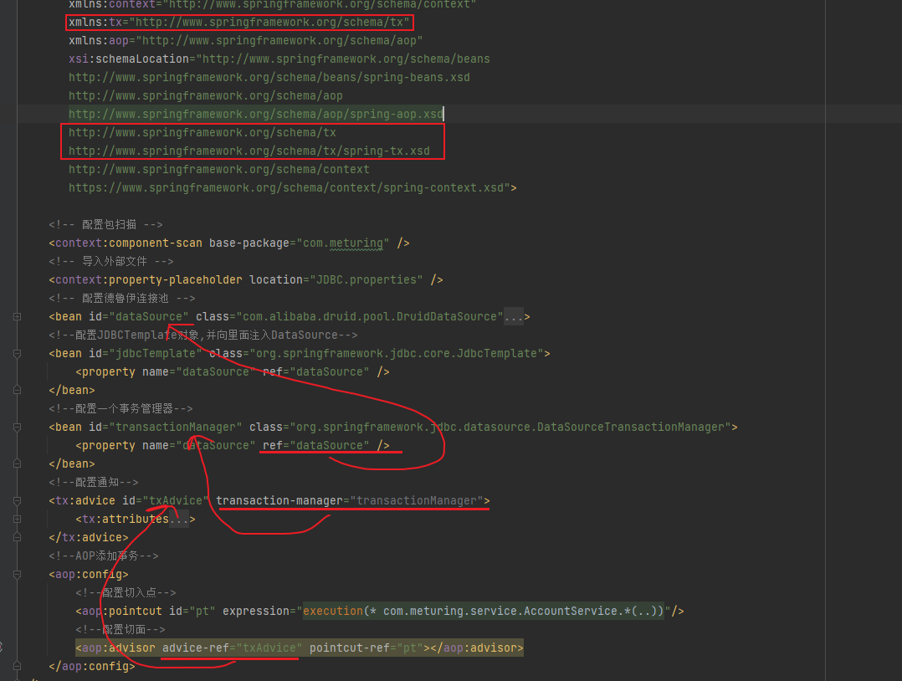

##### 修改Service层代码

Service层代码正常使用就好
```Java
@Service
public class AccountServiceImpl implements AccountService {
    @Autowired
    private AccountDao accountDao;
    @Override
    public int transMoney(int from, int to, int money) {
        int rows=0;
        rows+=accountDao.transMoney(from, 0 - money);
        rows+=accountDao.transMoney(to, money);
        return rows;
    }
}
```

##### 测试事务

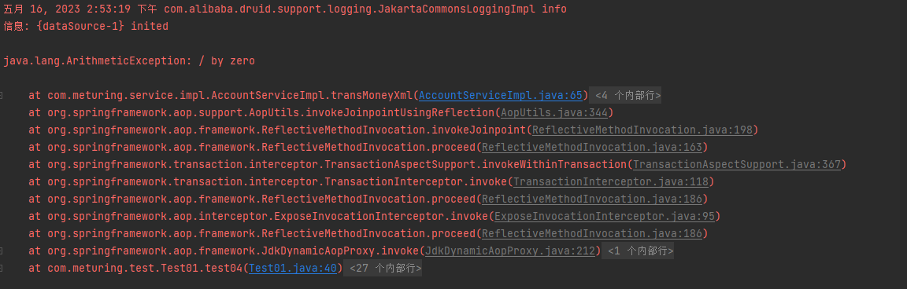

事务生效


## 事务中的属性

我们在使用XML配置事务或者直接使用@Transactional注解来管理事务时,都有发现,在Spring的事务中存在多个属性:

- XML中
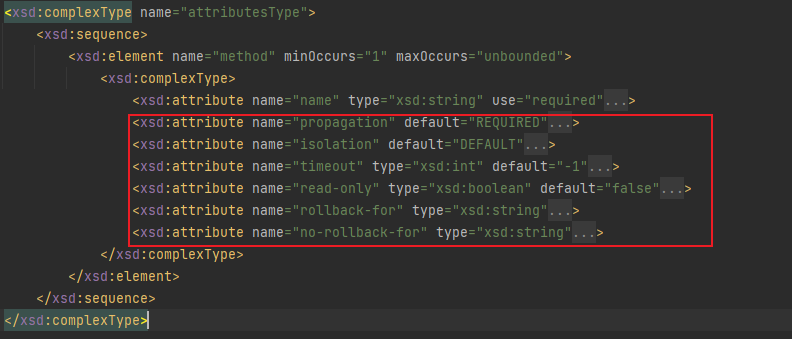

- @Transactional注解中
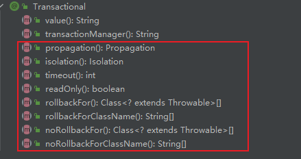

接下来我们详细了解一下:

### 只读 readOnly

对一个查询操作来说，如果我们把它设置成只读，就能够明确告诉数据库，这个操作不涉及写操作。
**这样数据库就能够针对查询操作来进行优化。**

默认值为:false
```Java
@Transactional(readOnly = true)
public String getEmpName(Integer empId) { return empDao.selectEmpNameById(empId); }
```

<font color="#ff0000">注意: 只读操作只针对查询，如果配置增删改会抛出异常！！！</font>

### 超时 timeout

事务在执行过程中，有可能因为遇到某些问题，导致程序卡住，从而长时间占用数据库资源。而长时间占用资源，大概率是因为程序运行出现了问题（可能是Java程序或MySQL数据库或网络连接等等）

此时这个很可能出问题的程序应该被回滚，撤销它已做的操作，事务结束，把资源让出来，让其他正常程序可以执行。

默认值为-1,表示无限等待  单位是秒

```Java
//timeout属性设置事务的超时时间，以秒为单位
@Transactional(readOnly = true, timeout = 3)
public String getEmpName(Integer empId) {
    return empDao.selectEmpNameById(empId);
}
```

概括来说就是一句话：**超时回滚，释放资源。**

### 回滚 rollbackFor

设置回滚的异常,发生该异常才回滚,其他异常不回滚

```Java
@Transactional(rollbackFor = Exception.class)
public String getEmpName(Integer empId) {
    return empDao.selectEmpNameById(empId);
}
```

### 不会滚的异常 noRollbackFor

设置不回滚的异常,发生该异常不回滚,其他异常回滚

```Java
@Transactional(noRollbackFor = FileNotFoundException.class)
public String getEmpName(Integer empId) {
    return empDao.selectEmpNameById(empId);
}
```

**当异常范围与rollbackFor设定的一致时,以rollbackFor为准**

### 隔离级别 isolation

在 `@Transactional 注解`中使用 `isolation 属性`设置事务的隔离级别。
取值使用 `org.springframework.transaction.annotation.Isolation` 枚举类提供的数值。

####  DEFAULT （默认）

这是一个PlatfromTransactionManager默认的隔离级别，使用数据库默认的事务隔离级别。另外四个与JDBC的隔离级别相对应。
MySQL默认`REPEATABLE_READ`   
Oracle默认`READ_COMMITTED`

#### READ_UNCOMMITTED （读未提交） 

这是事务最低的隔离级别，它允许另外一个事务可以看到这个事务未提交的数据。
**这种隔离级别会产生脏读，不可重复读和幻像读。**

#### READ_COMMITTED （读已提交）

保证一个事务修改的数据提交后才能被另外一个事务读取，另外一个事务不能读取该事务未提交的数据。
**这种事务隔离级别可以避免脏读出现，但是可能会出现不可重复读和幻像读。** 

#### REPEATABLE_READ （可重复读）

这种事务隔离级别可以防止脏读、不可重复读，但是可能出现幻像读。

它除了保证一个事务不能读取另一个事务未提交的数据外，还保证了不可重复读。

#### SERIALIZABLE（串行化） 

这是花费**最高代价**但是**最可靠**的事务隔离级别，**事务被处理为顺序执行**。

除了防止脏读、不可重复读外，还避免了幻像读。

### 传播行为 propagation

多事务方法之间调用,事务是如何管理的

#### 常用属性

| 事务的传播行为类型                 | 说明                                                        |
|:--------------------------|:----------------------------------------------------------|
| PROPAGATION_REQUIRED      | 如果当前没有事务，就新建一个事务，如果已经存在一个事务中，加入到这个事务中。这是最常见的选择(默认)。       |
| PROPAGATION_SUPPORTS      | 支持当前事务，如果当前没有事务，就以非事务方式执行。                                |
| PROPAGATION_MANDATORY     | 使用当前的事务，如果当前没有事务，就抛出异常。                                   |
| PROPAGATION_REQUIRES_NEW  | 新建事务，如果当前存在事务，把当前事务挂起                                     |
| PROPAGATION_NOT_SUPPORTED | 以非事务方式执行操作，如果当前存在事务，就把当前事务挂起                              |
| PROPAGATION_NEVER         | 以非事务方式执行，如果当前存在事务，则抛出异常                                   |
| PROPAGATION_NESTED        | 如果当前存在事务，则在嵌套事务内执行。如果当前没有事务，则执行与PROPAGATION_REQUIRED类似的操作 |  

#### 重点属性讲解

下面以a.save()里调用了b.save()举例，事务方法之间调用时事务如何传播。

以下内容来自 CSDN-[春天的早晨](https://blog.csdn.net/mccand1234 "春天的早晨")

##### PROPAGATION_REQUIRED（默认）

**默认**的spring事务传播级别，使用该级别的特点是，如果上下文中已经存在事务，那么就加入到事务中执行，如果当前上下文中不存在事务，则新建事务执行。如下图：

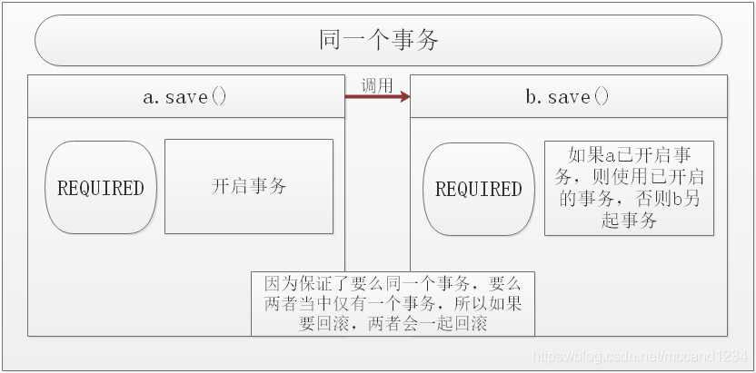

由于两个方法属于同一个物理事务，如果发生回滚，则两者都回滚。

##### PROPAGATION_SUPPORTS

顾名思义就是可以支持事务，如果b.save()在事务环境中运行，则以事务形式运行，否则以非事务运行。

**注：这里所谓的非事务形式的数据库访问只是指没有显式的事务边界而已，就是说数据库操作只是 auto-commit 的方式，在数据库的物理事务概念上，还是有事务的。譬如在这里，a.save()调用b.save()，如果当a是非事务执行（非手动提交事务，而是auto-commit），那么b.save()在执行前，a.save()的物理事务就要先提交，而同时，b.save()的物理事务也是auto-commit，这样才是这里说的b.save()以非事务方法运行，而不是指b.save()不开启数据库物理事务。而所谓的b.save()在事务环境中运行，是指当b的外层a.save()本身是手动提交事务时，b.save()也会包含在a.save()里边的同一个事务去执行，也就是说a.save()与b.save()的SQL操作在同一个物理事务中。**

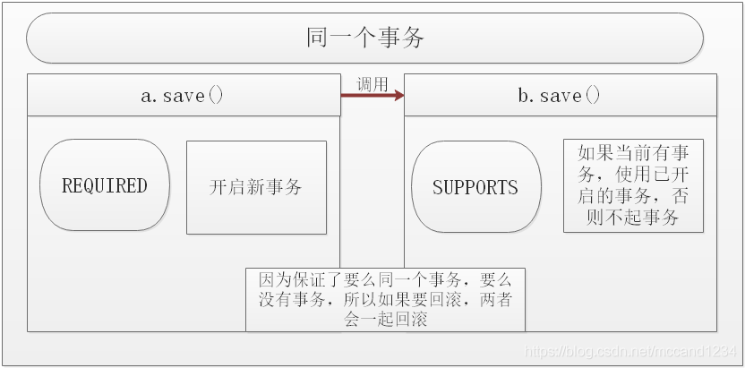

##### PROPAGATION_MANDATORY

必须在一个事务中运行，也就是说，b.save()只能在已有事务的方法中被调用，如果当前事物不存在，会抛异常。

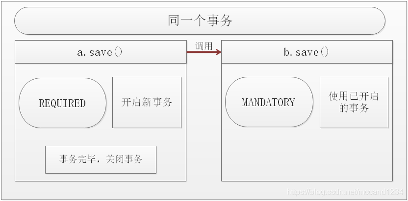

##### PROPAGATION_REQUIRES_NEW

总是会创建一个新事务（包括物理事务），该传播级别的特点是，每次都会新建一个事务，并且同时将上下文中的事务挂起，执行当前新建事务完成以后，上下文事务恢复再执行。如下图：

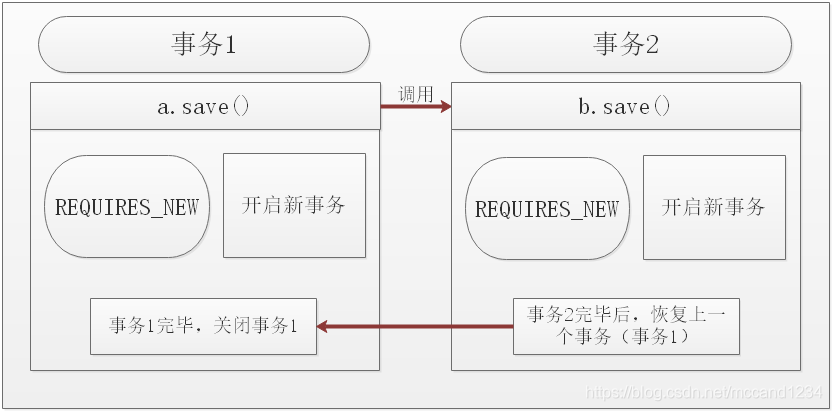

两个方法之间既不属于同一个逻辑事务也不属于同一个物理事务。

##### PROPAGATION_NOT_SUPPORTED

顾名思义不支持事务，当处于存在事务的上下文环境中运行时，b.save()会暂停当前已开启的事务，意味着a.save()的事务被挂起直至b.save()**以非事务方法运行完毕后**，a.save()的事务继续执行。

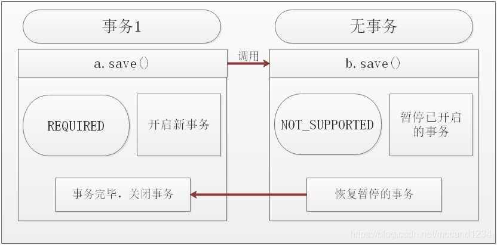

##### PROPAGATION_NEVER

绝不能在事务环境中运行，如果a.save()里声明了使用事务，而b.save()的事务类型声明为never，那么只能以抛异常告终。

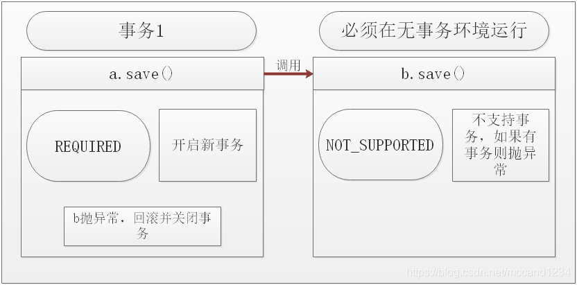

**与Mandatory相反**，Mandatory意思是强制要求上下文中有事务（外层有事务），否则抛异常，而Never是上下文中不能有事务（外层无事务），否则抛异常。

##### PROPAGATION_NESTED

嵌套事务支持。该传播级别特征是，如果上下文中存在事务，则嵌套事务执行，如果不存在事务，则新建事务。

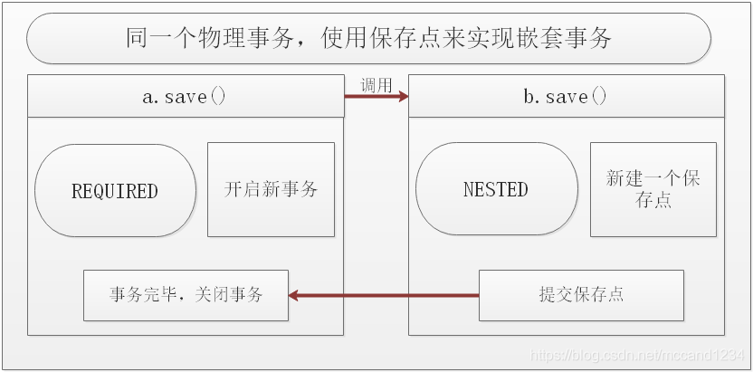

Nested和RequiresNew的区别：
-   RequiresNew每次都创建新的独立的物理事务，而Nested只有一个物理事务；Nested嵌套事务回滚或提交不会导致外部事务回滚或提交，但外部事务回滚将导致嵌套事务回滚，而RequiresNew由于都是全新的事务，所以之间是无关联的  Nested使用JDBC 3的保存点实现，即如果使用低版本驱动将导致不支持嵌套事务
-   **使用嵌套事务，必须确保具体事务管理器实现的nestedTransactionAllowed属性为true，否则不支持嵌套事务，如DataSourceTransactionManager默认支持，而HibernateTransactionManager默认不支持，需要我们来开启。**

### 总结

#### 死活不要事务的

- PROPAGATION_NEVER：没有就非事务执行，有就抛出异常。
- PROPAGATION_NOT_SUPPORTED：没有就非事务执行，有就**直接挂起**，然后非事务执行。 挂起记得B事务不能再操作同一张表，不然会死锁。

#### 可有可无的
- PROPAGATION_SUPPORTS: 有就用，没有就算了。

#### 必须有事务的
- PROPAGATION_REQUIRES_NEW: 有没有都新建事务，如果原来有，就将原来挂起。 外部内部事务互相隔离，互不影响，内层回滚不影响外部。
- PROPAGATION_NESTED：如果没有，就新建一个事务；如果有，就在当前事务中嵌套其他事务。，外层默认事务，内层NESTED，外层调用try{内层}catch{}。 外层异常回滚外层+内层，内层异常仅回滚内层，不影响外层。
- PROPAGATION_REQUIRED：如果没有，就新建一个事务；如果有，就加入当前事务。
- PROPAGATION_MANDATORY：如果没有，就抛出异常；如果有，就使用当前事务。