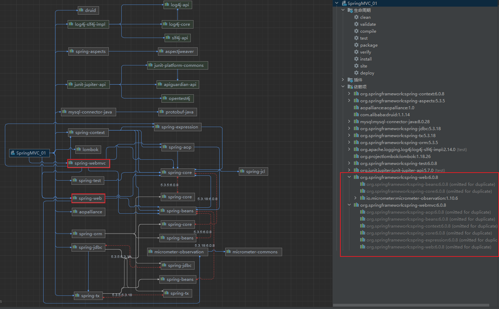
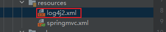
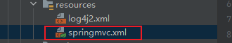
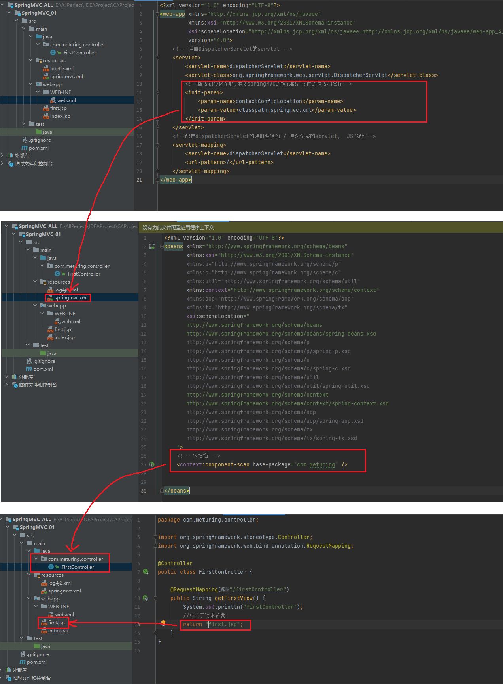
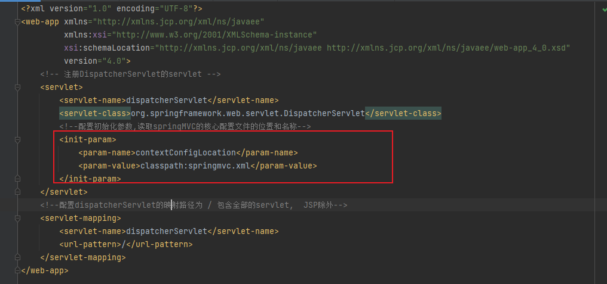
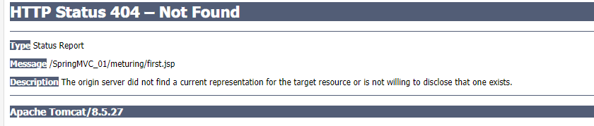
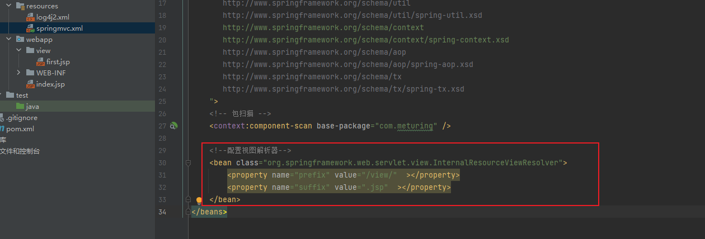
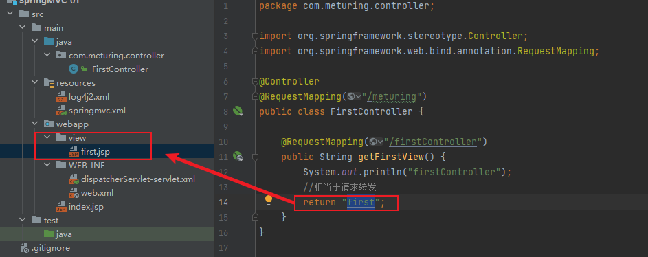

## 搭建框架

### 导入依赖

在pom.xml中导入Spring依赖大礼包:
1. Spring核心包 : `spring-context` 
2. spring切面 : `spring-aspects` `aopalliance`
3. 数据库连接 : `druid`  `mysql-connector-java` `spring-jdbc` `spring-tx` `spring-orm`
4. 工具包 : `log4j-slf4j-impl` `lombok` `spring-test` `junit-jupiter-api`
5. **SpringMVC** : `spring-web` `spring-webmvc`

```XML
  <dependencies>
    <!--Spring核心包-->
    <dependency>
      <groupId>org.springframework</groupId>
      <artifactId>spring-context</artifactId>
      <version>5.2.12.RELEASE</version>
    </dependency>
    <!--spring切面包-->
    <dependency>
      <groupId>org.springframework</groupId>
      <artifactId>spring-aspects</artifactId>
      <version>5.2.12.RELEASE</version>
    </dependency>
    <!--Aop联盟-->
    <dependency>
      <groupId>aopalliance</groupId>
      <artifactId>aopalliance</artifactId>
      <version>1.0</version>
    </dependency>
    <!--德鲁伊连接池-->
    <dependency>
      <groupId>com.alibaba</groupId>
      <artifactId>druid</artifactId>
      <version>1.1.14</version>
    </dependency>
    <!--mysql连接驱动-->
    <dependency>
      <groupId>mysql</groupId>
      <artifactId>mysql-connector-java</artifactId>
      <version>8.0.28</version>
    </dependency>
    <!--SpringJDBC包-->
    <dependency>
      <groupId>org.springframework</groupId>
      <artifactId>spring-jdbc</artifactId>
      <version>5.2.12.RELEASE</version>
    </dependency>
    <!--Spring事务管理-->
    <dependency>
      <groupId>org.springframework</groupId>
      <artifactId>spring-tx</artifactId>
      <version>5.2.12.RELEASE</version>
    </dependency>
    <!--Spring ORM 映射-->
    <dependency>
      <groupId>org.springframework</groupId>
      <artifactId>spring-orm</artifactId>
      <version>5.2.12.RELEASE</version>
    </dependency>
    <!--log4j2 日志-->
    <dependency>
      <groupId>org.apache.logging.log4j</groupId>
      <artifactId>log4j-slf4j-impl</artifactId>
      <version>2.14.0</version>
      <scope>test</scope>
    </dependency>
    <!--lombok -->
    <dependency>
      <groupId>org.projectlombok</groupId>
      <artifactId>lombok</artifactId>
      <version>1.18.26</version>
    </dependency>
    <!--spring test测试支持包-->
    <dependency>
      <groupId>org.springframework</groupId>
      <artifactId>spring-test</artifactId>
      <version>5.2.12.RELEASE</version>
    </dependency>
    <!--junit5单元测试-->
    <dependency>
      <groupId>org.junit.jupiter</groupId>
      <artifactId>junit-jupiter-api</artifactId>
      <version>5.7.0</version>
      <scope>test</scope>
    </dependency>
    <!--springMVC支持包-->
    <dependency>
      <groupId>org.springframework</groupId>
      <artifactId>spring-web</artifactId>
      <version>5.2.12.RELEASE</version>
    </dependency>
    <dependency>
      <groupId>org.springframework</groupId>
      <artifactId>spring-web</artifactId>
      <version>5.2.12.RELEASE</version>
    </dependency>
  </dependencies>
```

依赖关系



### 创建log4j配置文件



```xml
<?xml version="1.0" encoding="UTF-8"?>
<Configuration status="DEBUG">
    <Appenders>
        <Console name="Console" target="SYSTEM_OUT">
            <PatternLayout pattern="%d{YYYY-MM-dd HH:mm:ss} [%t] %-5p %c{1}:%L - %msg%n" />
        </Console>
    </Appenders>
    <Loggers>
        <Root level="debug">
            <AppenderRef ref="Console" />
        </Root>
    </Loggers>
</Configuration>
```

### 创建SpringMVC配置文件



```XML
<?xml version="1.0" encoding="UTF-8"?>
<beans xmlns="http://www.springframework.org/schema/beans"
       xmlns:xsi="http://www.w3.org/2001/XMLSchema-instance"
       xmlns:p="http://www.springframework.org/schema/p"
       xmlns:c="http://www.springframework.org/schema/c"
       xmlns:util="http://www.springframework.org/schema/util"
       xmlns:context="http://www.springframework.org/schema/context"
       xmlns:aop="http://www.springframework.org/schema/aop"
       xmlns:tx="http://www.springframework.org/schema/tx"
       xsi:schemaLocation="
       http://www.springframework.org/schema/beans
       http://www.springframework.org/schema/beans/spring-beans.xsd
       http://www.springframework.org/schema/p
       http://www.springframework.org/schema/p/spring-p.xsd
       http://www.springframework.org/schema/c
       http://www.springframework.org/schema/c/spring-c.xsd
       http://www.springframework.org/schema/util
       http://www.springframework.org/schema/util/spring-util.xsd
       http://www.springframework.org/schema/context
       http://www.springframework.org/schema/context/spring-context.xsd
       http://www.springframework.org/schema/aop
       http://www.springframework.org/schema/aop/spring-aop.xsd
       http://www.springframework.org/schema/tx
       http://www.springframework.org/schema/tx/spring-tx.xsd
    ">
    <!-- 包扫描 -->
    <context:component-scan base-package="com.meturing" />


</beans>
```

### 在web.xml中配置前端控制器


```xml
<?xml version="1.0" encoding="UTF-8"?>
<web-app xmlns="http://xmlns.jcp.org/xml/ns/javaee"
         xmlns:xsi="http://www.w3.org/2001/XMLSchema-instance"
         xsi:schemaLocation="http://xmlns.jcp.org/xml/ns/javaee http://xmlns.jcp.org/xml/ns/javaee/web-app_4_0.xsd"
         version="4.0">
    <!-- 注册DispatcherServlet的servlet -->
    <servlet>
        <servlet-name>dispatcherServlet</servlet-name>
        <servlet-class>org.springframework.web.servlet.DispatcherServlet</servlet-class>
        <!--配置初始化参数,读取springMVC的核心配置文件的位置和名称-->
        <init-param>
            <param-name>contextConfigLocation</param-name>
            <param-value>classpath:springmvc.xml</param-value>
        </init-param>
    </servlet>
    <!--配置dispatcherServlet的映射路径为 / 包含全部的servlet,  JSP除外-->
    <servlet-mapping>
        <servlet-name>dispatcherServlet</servlet-name>
        <url-pattern>/</url-pattern>
    </servlet-mapping>
</web-app>
```

### 编写controller

```java
@Controller
public class FirstController {
    
    @RequestMapping("/firstController")
    public String getFirstView() {
        System.out.println("firstController");
        //相当于请求转发
        return "first.jsp";
    }
}
```

注意 :  
1. 在类上使用`@Controller`注解让当前类被Spring扫描到
2. 我们可以在方法上使用`@RequestMapping`注解来标识当前方法执行的请求路径
3. `return "first.jsp"` 相当于请求转发`req.getRequestDispatcher("first.jsp").forward(req,resp);`

### 总结

1. wbe.xml中配置DispatcherServlet的Servlet,并设置初始化的SpringMVC路径
2. 在SpringMVC配置文件中,使用包扫描指定路径
3. 创建Controller层,使用`@Controller`注解提交给Spring管理,使用`@RequestMapping`注解标注请求路径,return String直接转发到指定页面



## 注意事项

### init-param初始化可以省略




在web.xml中,我们也可以不使用`<init-param>`指定SpringMVC的配置文件路径使用默认配置,但需要遵循下列规则
1. 默认的读取路径为`/WEB-INF/` ,我们需要将配置文件移至该目录下
2. 默认情况下配置文件名需要遵循`<servlet-name>-servlet.xml`的规则,如上图应该是`dispatcherServlet-servlet.xml`

> 我们不推荐使用该方式省略配置

### Controller层路径问题

`@RequestMapping` 注解也可以用在类上,当类上使用该注解时访问的路径应该是: `类上的注解+方法上的注解`

```Java
@Controller
@RequestMapping("/meturing")
public class FirstController {
    @RequestMapping("/firstController")
    public String getFirstView() {
        System.out.println("firstController");
        //相当于请求转发
        return "first.jsp";
    }
}
```

如上述代码,访问的路径应该为 : `http://localhost:8080/SpringMVC_01/meturing/firstController`

但是此时我们访问时会发现出现错误



原因与srvlet中 [请求转发路径](../../../04_JavaEE技术/03_Servlet/08_路径问题/路径问题.md#请求转发路径) 问题一致 ,转发路径中`\`开头表示结对路径,否则是相对路径 .
当前代码是`return "first.jsp";` 当在类上添加`/meturing`路径后,他会在`meturing`目录下查找页面

所以我们可以修改路径为绝对路径`return "/first.jsp";`

### 视图解析器

对于复杂的路径,我们不必在Controller中完全描述,这样的话太臃肿了.
我们可以借助在MVC配置文件中添加视图解析器来配置通用的一些路径



```Java
    <!--配置视图解析器-->
    <bean class="org.springframework.web.servlet.view.InternalResourceViewResolver">
        <!--前缀-->
        <property name="prefix" value="/view/"  ></property>
		<!--后缀-->
        <property name="suffix" value=".jsp"  ></property>
    </bean>
```

所以我们可以在Controller中跳转的路径就可以直接写文件名



当我们访问后,会自动给我们拼接: `前缀 + 字符串 + 后缀` ,也就是: `/view/first.jsp`
