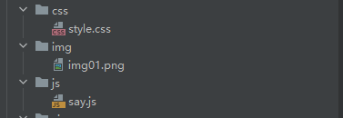
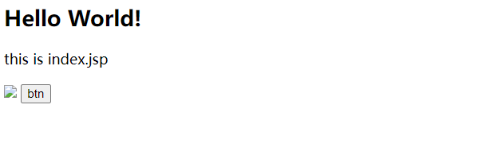
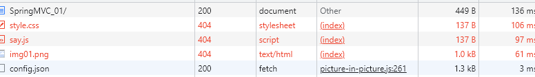
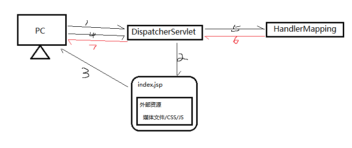
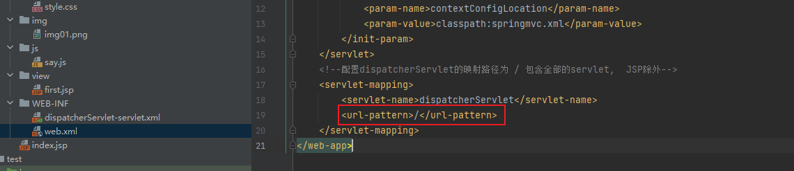
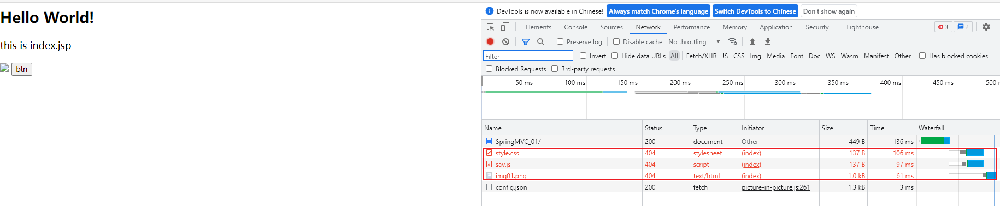
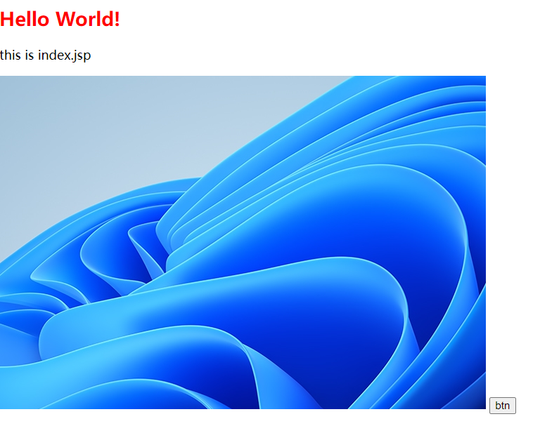
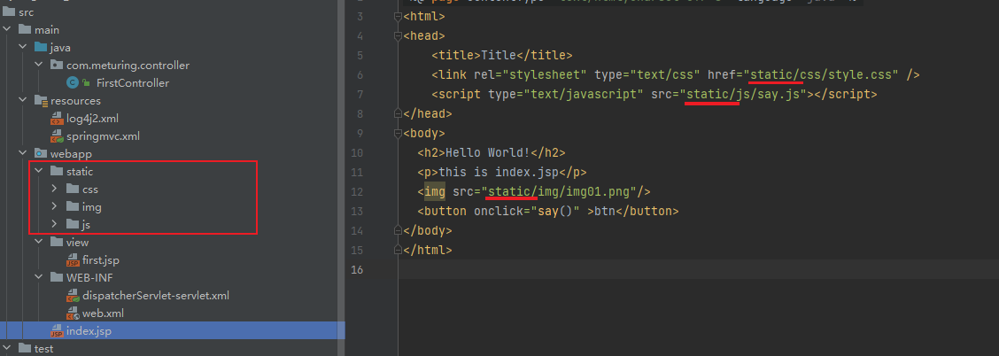
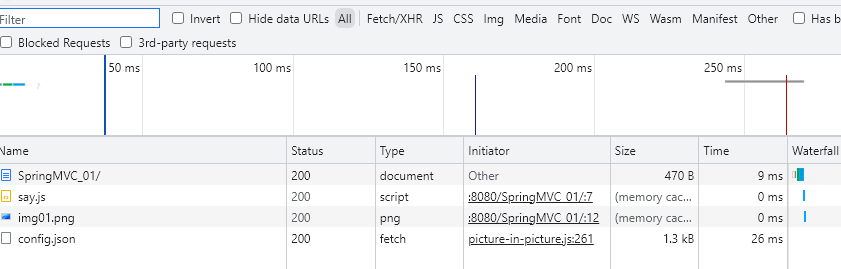

我们项目中不单单存在JSP文件,也存在许多静态文件.如:多媒体文件 / CSS样式 / JS脚本,在SpringMVC中对于这些静态文件的管理也是需要我们注意的地方. 

## 为什么需要放行静态文件?

### 修改Demo

#### 创建静态资源



style.css
```CSS
h2 {
    color: red;
}
```

say.js
```Js
function say() {
    alert("123");
}
```

#### 修改index.jsp

```jsp
<%@ page contentType="text/html;charset=UTF-8" language="java" %>
<html>
<head>
    <title>Title</title>
    <link rel="stylesheet" type="text/css" href="css/style.css" />
    <script type="text/javascript" src="js/say.js"></script>
</head>
<body>
  <h2>Hello World!</h2>
  <p>this is index.jsp</p>
  
  <button onclick="say()" >btn</button>
</body>
</html>
```

### 测试结果



此时我们发现页面资源无法正常访问

打开网络监控,显示资源请求404



### 问题原因



由于我们之前在web.xml中注册DispatcherServlet时,对于所有的请求都进行捕捉,JSP文件除外



所以上面的Demo执行流程如下:
1. PC发出请求打开JSP页面
2. DispatcherServlet发现是JSP文件,直接返回给前端
3. 前端在打开渲染JSP时发现有外部资源,再次发送请求
4. DispatcherServlet此时捕捉到资源请求,于是请求HandlerMapping处理器映射器查询
5. HandlerMapping处理器映射器未能发现对应的Controller处理单元,返回结果
6. DispatcherServlet未能收到正确的Controller处理单元位置,返回404



## 放行静态文件

修改springmvc.xml配置文件,添加`<mvc:resources>`标签放行指定目录

如下:
```xml
<!--静态资源放行-->
<mvc:resources mapping="/js/**" location="/js/"></mvc:resources>
<mvc:resources mapping="/img/**" location="/img/"></mvc:resources>
<mvc:resources mapping="/css/**" location="/css/"></mvc:resources>
```

>其中 : 
>> - mapping表示请求的url
>> - location表示本地资源目录

完整代码:
```xml
<?xml version="1.0" encoding="UTF-8"?>
<beans xmlns="http://www.springframework.org/schema/beans"
       xmlns:xsi="http://www.w3.org/2001/XMLSchema-instance"
       xmlns:p="http://www.springframework.org/schema/p"
       xmlns:c="http://www.springframework.org/schema/c"
       xmlns:util="http://www.springframework.org/schema/util"
       xmlns:context="http://www.springframework.org/schema/context"
       xmlns:aop="http://www.springframework.org/schema/aop"
       xmlns:tx="http://www.springframework.org/schema/tx"
       xmlns:mvc="http://www.springframework.org/schema/mvc"
       xsi:schemaLocation="
       http://www.springframework.org/schema/beans
       http://www.springframework.org/schema/beans/spring-beans.xsd
       http://www.springframework.org/schema/p
       http://www.springframework.org/schema/p/spring-p.xsd
       http://www.springframework.org/schema/c
       http://www.springframework.org/schema/c/spring-c.xsd
       http://www.springframework.org/schema/util
       http://www.springframework.org/schema/util/spring-util.xsd
       http://www.springframework.org/schema/context
       http://www.springframework.org/schema/context/spring-context.xsd
       http://www.springframework.org/schema/aop
       http://www.springframework.org/schema/aop/spring-aop.xsd
       http://www.springframework.org/schema/tx
       http://www.springframework.org/schema/tx/spring-tx.xsd
       http://www.springframework.org/schema/mvc
       http://www.springframework.org/schema/mvc/spring-mvc.xsd
    ">
    <!-- 包扫描 -->
    <context:component-scan base-package="com.meturing" />

    <!--配置视图解析器-->
    <bean class="org.springframework.web.servlet.view.InternalResourceViewResolver">
        <property name="prefix" value="/view/"  ></property>
        <property name="suffix" value=".jsp"  ></property>
    </bean>
    <!--自动加载处理映射器和处理器适配器-->
    <mvc:annotation-driven />

    <!--静态资源放行-->
    <mvc:resources mapping="/js/**" location="/js/"></mvc:resources>
    <mvc:resources mapping="/img/**" location="/img/"></mvc:resources>
    <mvc:resources mapping="/css/**" location="/css/"></mvc:resources>
</beans>
```

再次测试:


## 优化项目结构

我们刚刚虽然解决了当前的问题,但是当前的目录看起来还是很混乱.
静态文件有很多,文件件存储与代码文件混在一起不方便管理.
同时,需要放开的资源目录也会无限制增多

所以我们推荐将所有的静态资源都存放在`/static/`目录中,这样我们只需要放行静态资源目录就行.



修改springmvc.xml放行规则
```xml
<!--静态资源放行-->  
<mvc:resources mapping="/static/**" location="/static/"></mvc:resources>
```

测试正常


