@RequestMapping注解在前面的学习中,我们通常将他使用在方法或者类上,用来表明当前Controller控制单元的请求路径

接下来我们将简单学习一下@RequestMapping注解在SpringMVC项目中的应用:

## @RequestMapping注解的使用

 在注解中,如果是单一默认属性,在使用时可以不用`属性名=值`的形式,直接使用值就行.

### value:Url路径

@RequestMapping注解中的**value属性是默认属性**,用来标识当前类或者方法的**Controller控制单元**的请求路径

#### 代码

Controller控制单元

```Java
@Controller
@RequestMapping("/meturing")
public class FirstController {
    @RequestMapping("/firstController")
    public String getFirstView() {
        System.out.println("firstController");
        //相当于请求转发
        return "first";
    }
}
```

#### 测试

当我们访问指定URL时,就会执行到具体的**Controller控制单元**

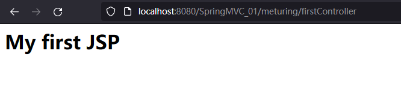

具体的执行流程详见: [执行流程与三大组件](../03_执行流程与三大组件/执行流程与三大组件.md)

### method控制请求方式

method属性 可以控制请求的方式, 值为RequestMethod的枚举值

#### 代码

Controller控制单元

```Java
@Controller
public class TestRequestMapping {
    @RequestMapping(value = "/testPostRequest", method= RequestMethod.POST)
    public String testPostRequest() {
        System.out.println("testPostRequest");
        return "first";
    }
}
```

testRequestMapping.jsp代码

```JSP
<html>
<head>
    <title>Title</title>
</head>
<body>
<form method="post" action="testPostRequest">
    <input type="submit" value="post">
</form>
</body>
</html>
```

#### 测试

当我们使用正确的请求方法时,即可请求到具体的控制单元

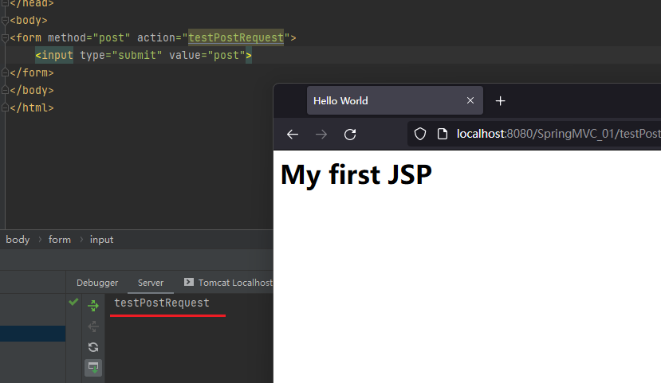

当我们前端使用错误的请求方法时:

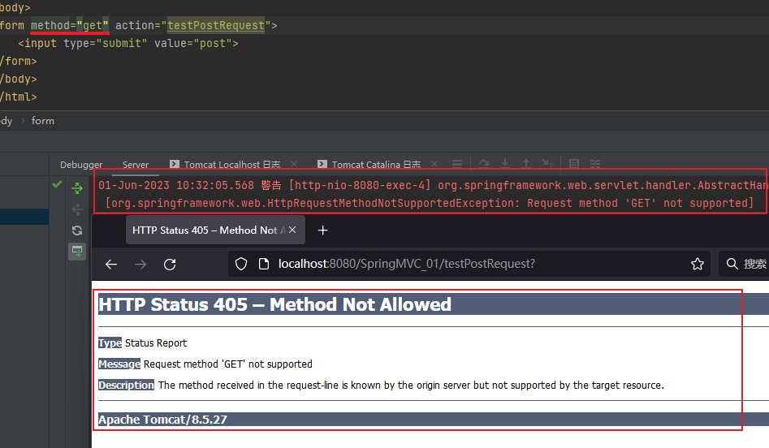

此时前端会出现405错误,服务器抛出异常

### params : 控制请求参数

params 属性可以对请求中的参数进行限定:

```txt
params = {"参数1","参数2"}   表示请求中必须有参数1和参数2
params = {"!参数1","!参数2"}   表示请求中不能有参数1和参数2
params = {"参数1=值1","参数2=值2"}   表示请求中必须有参数1和参数2,且值必须对应值1和值2
params = {"参数1!=值1","参数2!=值2"}   表示请求中必须有参数1和参数2,且值不能对应值1和值2
```

参数可以是一个或者多个,多个参数使用逗号分隔

#### 代码

Controller控制单元

```Java
@Controller
public class TestRequestMapping {
//参数里面userName不能是root 必须有password参数 不能有sex参数
    @RequestMapping(value = "/testRequestParams", params={"userName!=root","password","!sex"})
    public String testRequestParams() {
        System.out.println("testPostRequest");
        return "first";
    }
}
```

testRequestMapping.jsp代码

```JSP
<%@ page contentType="text/html;charset=UTF-8" language="java" %>
<html>
<head>
    <title>Title</title>
</head>
<body>
<form method="get" action="testRequestParams">
    <input name="userName" type="text">
    <input name="password" type="password">
    <input type="submit" value="Params">
</form>
</body>
</html>
```

#### 测试

当userName为11111时正常访问

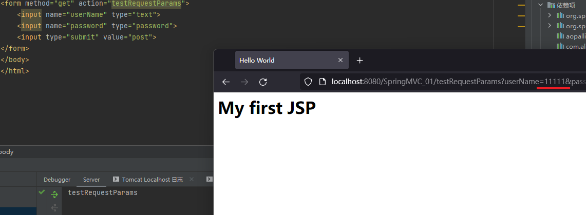

当userName为root时,前端页面400且控制台出现异常

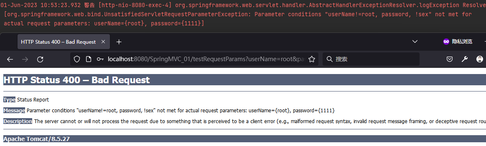

### headers:控制请求头

#### 代码 

Controller控制单元

```Java
@Controller
public class TestRequestMapping {
    @RequestMapping(value = "/testRequestHeaders", headers={"Referer=http://localhost:8080/SpringMVC_01/testRequestMapping.jsp"})
    public String testRequestHeaders() {
        System.out.println("testRequestParams");
        return "first";
    }
}
```

testRequestMapping.jsp代码

```JSP
<%@ page contentType="text/html;charset=UTF-8" language="java" %>
<html>
<head>
    <title>Title</title>
</head>
<body>
<form method="get" action="testRequestHeaders">
    <input type="submit" value="Headers">
</form>
</body>
</html>
```

#### 测试

正常访问

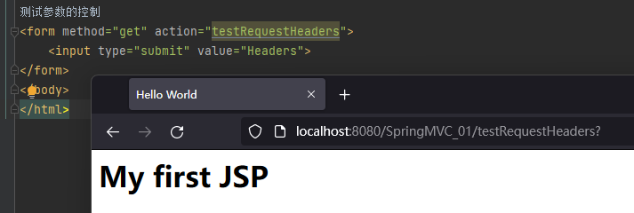

修改headers中的设置


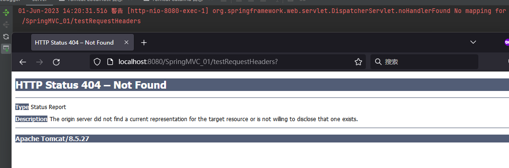

## @PathVariable注解和RESTful风格

### 什么是RESTful风格

REST即表述性状态传递(英文: Representational State Transfer，简称REST)是Roy Fielding博士在2000年他的博士论中提出来的一种软件架构风格。它是一种针对网络应用的设计和开发方式，可以降低开发的复杂性，提高系统的可伸缩性。

在三种主流的Web服务实现方案中，因为REST模式的Web服务与复杂的SOAP和XML-RPC对比来讲明显的更加简洁，越来我多的web服条开始采用REST风格设计和实现。例如，Amazon.com提供接近REST风格的Web服条进行图书查找:雅虎提供的Web服务也是REST风格的。

表述性状态转移是一组架构约束条件和原则。满足这些约束条件和原则的应用程序或设计就是RESTful。需要注意的是，REST是设计风格而不是标准。REST通常基于使用HTTP，UR1，和XML (标准通用标记语言下的一个子集)以及HTML(标准通用标记语言下的一个应用) 这些现有的广泛流行的协议和标准。

REST 定义了一组体系架构原则，您可以根据这些原则设计以系统资源为中心的 Web 服务，包括使用不同语言编写的客户端如何通过 HTTP 处理和传输资源状态。如何考虑使用它的 Web 服务的数量，REST 近年来已经成为最主要的 Web 服务设计模式。事实上，REST 对 Web 的影响非常大，由于其使用相当方便，已经普遍地取代了基于 SOAP 和 WSDL 的接口设计。

### RESTful与普通Url

普通的Url形式

```txt
*****/contextPath/aaa.do
*****/contextPath/aaa.jsp
*****/contextPath/aaa.html
*****/contextPath/css/aaa.css
*****/contextPath/js/aaa.js
```


RESTful风格Url

```txt
*****/contextPath/aaa/10/root
*****/contextPath/aaa
```

### 简单实现RESTful

实现步骤:

1. 在`@RequestMapping`注解的路径中,对于需要传递的参数使用`{}`标注
2. 在方法的参数中,对于需要映射的参数使用`@PathVariable`注解

```Java
@RestController
public class TestRestful {
    @RequestMapping("/getRestful/{pageName}")
    public String getRestful(@PathVariable String pageName){
        return pageName;
    }
}
```

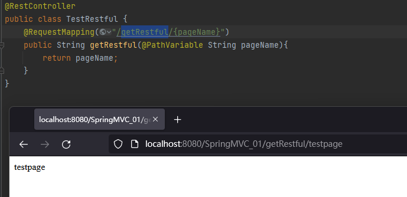

### 多参数的问题

一般情况下,如果参数名与url中的名字保持一致,会自动映射字段进行取值

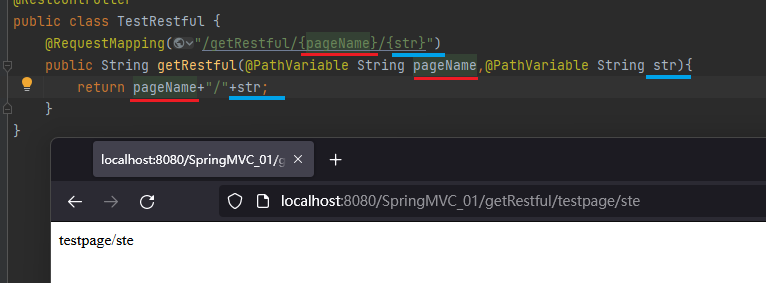

如果不一致,则会出错

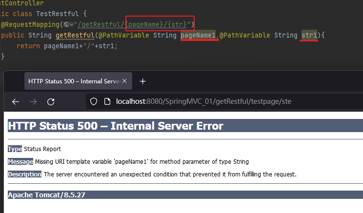

此时我们需要修改`@PathVariable`注解指定映射字段

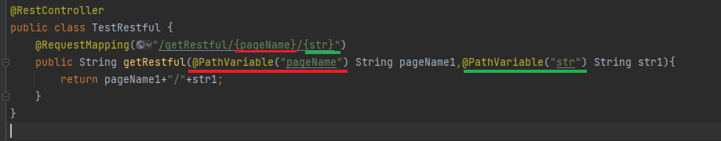

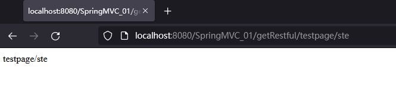

## 综合案例

我们尝试通过同一个url使用不同的请求方式,来访问到不同的controller处理单元

例如:
/controller/1  HTTP GET : 得到id为1 的资源
/controller/1  HTTP DELETE : 删除id为1的资源
/controller/1  HTTP PUT : 更新id为1 的资源
/controller/1  HTTP POST : 增加id为1 的资源

### 回顾请求方式

[HTTP请求方式](../../../04_JavaEE技术/02_HTTP协议/HTTP协议.md#HTTP请求方式)

### 实现思路

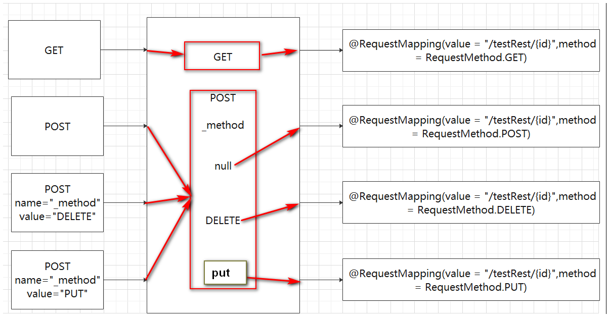

前端 : 在使用DELETE和PUT请求时,本质上也是使用的POST请求方式,**需要传输_method字段指定**

 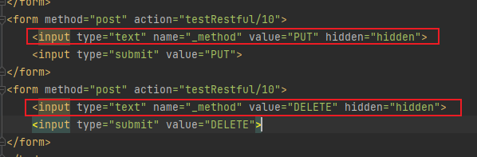

后端需要在web.xml中配置`hiddenHttpMethodFilter`过滤器将POST请求转换为PUT或者DELETE请求

```xml
 <!--配置hiddenHttpMethodFilter ,将POST请求转换为PUT或者DELETE请求-->
<filter>
 <filter-name>hiddenHttpMethodFilter</filter-name>
 <filter-class>org.springframework.web.filter.HiddenHttpMethodFilter</filter-class>
</filter>
<filter-mapping>
 <filter-name>hiddenHttpMethodFilter</filter-name>
 <url-pattern>/*</url-pattern>
</filter-mapping>
```

### 相关代码

修改web.xml,新增过滤器转换PUT和DELETE请求

```XML
<!--配置hiddenHttpMethodFilter ,将POST请求转换为PUT或者DELETE请求-->
<filter>
 <filter-name>hiddenHttpMethodFilter</filter-name>
 <filter-class>org.springframework.web.filter.HiddenHttpMethodFilter</filter-class>
</filter>
<filter-mapping>
 <filter-name>hiddenHttpMethodFilter</filter-name>
 <url-pattern>/*</url-pattern>
</filter-mapping>
```

前端代码:

```JSP
<%@ page contentType="text/html;charset=UTF-8" language="java" %>
<html>
<head>
    <title>Title</title>
</head>
<body>
<form method="post" action="testRestful/10">
    <input type="submit" value="POST">
</form>
<form method="get" action="testRestful/10">
    <input type="submit" value="GET">
</form>
<form method="post" action="testRestful/10">
    <input type="text" name="_method" value="PUT" hidden="hidden">
    <input type="submit" value="PUT">
</form>
<form method="post" action="testRestful/10">
    <input type="text" name="_method" value="DELETE" hidden="hidden">
    <input type="submit" value="DELETE">
</form>
</body>
</html>
```

Controller层TestRestful.java

```JAVA
@RestController
public class TestRestful {
    @RequestMapping(value = "/testRestful/{userId}",method = RequestMethod.GET)
    public String getRestful(@PathVariable String userId){
        return "GET :"+userId;
    }
    @RequestMapping(value = "/testRestful/{userId}",method = RequestMethod.POST)
    public String postRestful(@PathVariable String userId){
        return "POST :"+userId;
    }
    @RequestMapping(value = "/testRestful/{userId}",method = RequestMethod.PUT)
    public String putRestful(@PathVariable String userId){
        return "PUT :"+userId;
    }
    @RequestMapping(value = "/testRestful/{userId}",method = RequestMethod.DELETE)
    public String deleteRestful(@PathVariable String userId){
        return "DELETE :"+userId;
    }
}
```

实现效果:

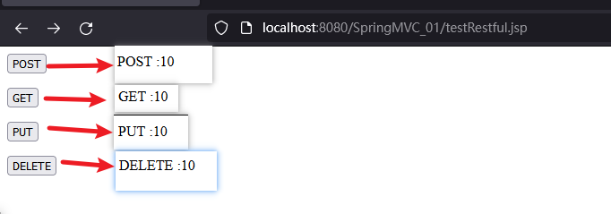
