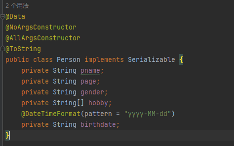
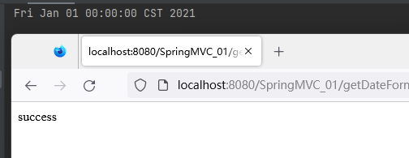
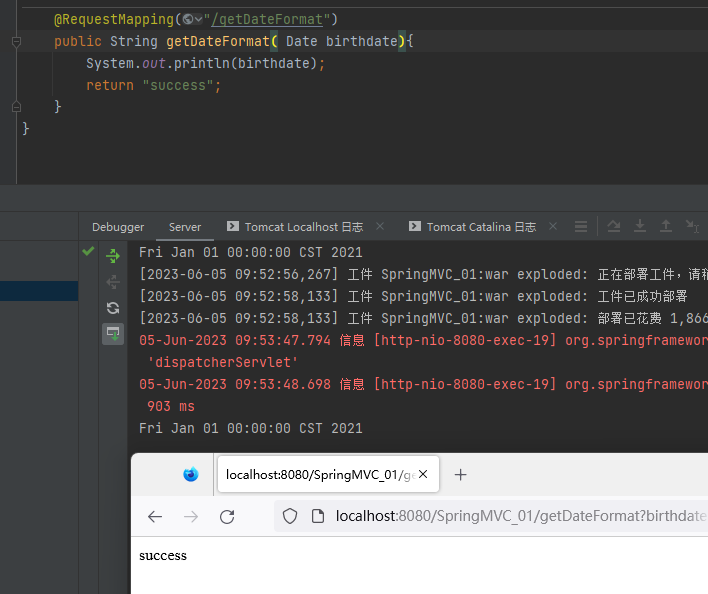
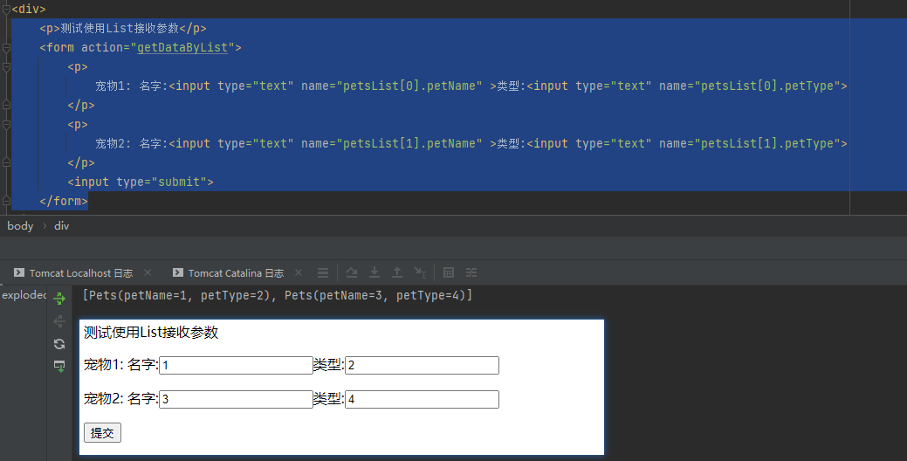
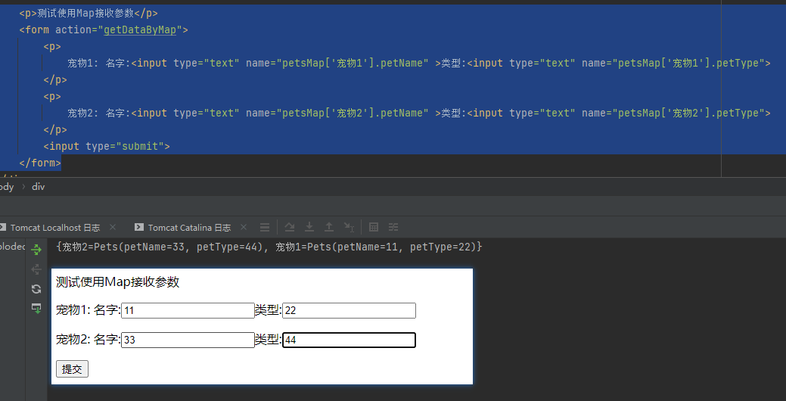

## 获取参数的方式

### 紧耦合方式 - 了解

DispatcherServlet中的service方法直接将此次请求的request对象传递给调用的单元方法即可。
同时在单元方法上声明形参HttpServletRequest来接收request实参即可。

Controller层
```Java
@RestController
public class TestGetRequestParam {
    //紧耦合方式参数注入
    @RequestMapping("/getParamByRequest")
    public String getParamByRequest(HttpServletRequest req, HttpServletResponse resp) {
        String username = req.getParameter("username");
        String password = req.getParameter("password");
        System.out.println("username:"+username+" / password:"+password);
        return "success";
    }
}
```

>我们在Controller单元中修改:
>>- 使用**HttpServletRequest与HttpServletResponse形参**接收Request对象与Response对象
>>- 通过`Request对象.getParameter("参数名")`方法获取具体的参数

testGetRequestParam.jsp
```JSP
<%@ page contentType="text/html;charset=UTF-8" language="java" %>
<html>
<head>
    <title>Title</title>
</head>
<body>
<p>测试紧耦合方式参数注入</p>
<form action="getParamByRequest">
    <input name="username" type="text" value="admin">
    <input name="password" type="password" value="admin">
    <input type="submit" value="TestParamByRequest">
</form>
</body>
</html>
```

> 注意 : 前端发送的参数名需要和后端保持一致,否则获取不到显示为null

### 解耦合方式【熟练】

DispatcherServlet在其service方法中将请求数据根据需求从request对象中获取出来后，将数据直接传递给对应的单元方法使用。

同时在单元方法上直接声明对应的形参接收请求数据即可。

在单元方法上声明形参来接收请求数据时，形参名必须和请求数据的键名一致，DispatcherServlet会将调用单元方法的形参名作为请求数据的键名获取请求数据，然后传递给单元方法。如果不一致可以使用`@RequestParam`注解注明参数的映射

Controller层
```Java
@RestController
public class TestGetRequestParam {
    //解耦合方式参数注入
    @RequestMapping("/getParamByArgName")
    public String getParamByArgName(@RequestParam String username, @RequestParam("password") String pwd) {
        System.out.println("username:"+username+" / password:"+pwd);
        return "success";
    }
}
```

> 注意: 
>> 1. 默认情况下只要保证形参名与参数名一致,可以自动由SpringMVC处理映射
>> 2. 如果参数名不一致,需要使用`@RequestParam`注解来指定映射
>> 3. 在前面学习Restful风格时,从路径中获取参数的注解是`@PathVariable`

testGetRequestParam.jsp
```JSP<%@ page contentType="text/html;charset=UTF-8" language="java" %>
<html>
<head>
    <title>Title</title>
</head>
<body>
<p>测试解耦合方式参数注入</p>
<form action="getParamByArgName">
    <input name="username" type="text" value="admin">
    <input name="password" type="password" value="admin">
    <input type="submit" value="TestParamByRequest">
</form>
</body>
</html>
```

## 参数的处理

### POJO接收参数

> 注意事项 : 
> 1. 提交的参数名必须和POJO的属性名保持一致
> 2. springmvc底层通过反射给参数列表的属性赋值(通过set方法设置属性值的,不是直接通过操作属性)POJO的属性一定要有set方法,要不然就会接收失败

testGetRequestParam.jsp
```JSP
<html>
<head>
    <title>Title</title>
</head>
<body>
<p>测试POJO</p>
<form action="getDataByPojo">
    <p>姓名<input type="text" name="pname"></p>
    <p>年龄<input type="text" name="page"></p>
    <p>性别:
        <input type="radio" name="gender" value="1" >男
        <input type="radio" name="gender" value="0" >女
    </p>
    <p>爱好
        <input type="checkbox" name="hobby" value="1"> 篮球
        <input type="checkbox" name="hobby" value="2"> 足球
        <input type="checkbox" name="hobby" value="3"> 羽毛球
    </p>生日
    <p>
        <input type="text" name="birthdate">
    </p>
    <input type="submit">
</form>
</body>
</html>
```

POJO类 : Person.java
```Java
@Data
@NoArgsConstructor
@AllArgsConstructor
@ToString
public class Person implements Serializable {
    private String pname;
    private String page;
    private String gender;
    private String[] hobby;
    private String birthdate;
}
```

Controller层
```Java
@RestController
public class TestGetRequestParam {
    @RequestMapping("/getDataByPojo")
    public String getDataByPojo(Person person){
        System.out.println(person);
        return "success";
    }
}
```

### 日期类型的特殊处理

#### 注解方式

我们可以在字段上使用`@DateTimeFormat`注解来表示当前字段需要转换为Date类型

testGetRequestParam.jsp
```JSP
<html>
<head>
    <title>Title</title>
</head>
<body>
<p>测试日期转换</p>
<form action="getDateFormat">
	</p>生日
	<p>
		<input type="text" name="birthdate">
	</p>
	<input type="submit">
</form>
</body>
</html>
```

Controller层
```Java
@RestController
public class TestGetRequestParam {
    @RequestMapping("/getDateFormat")
    public String getDateFormat(@DateTimeFormat(pattern = "yyyy-MM-dd") Date birthdate){
        System.out.println(birthdate);
        return "success";
    }
}
```

> @DateTimeFormat(pattern = "yyyy-MM-dd") 可以用于方法参数列表和 类的属性上
例如: 



#### 自定义转换器

定义转换器 : 实现Converter接口重写convert方法
```Java
public class StringToDateConverter implements Converter<String, Date> {
    private SimpleDateFormat dateFormat=new SimpleDateFormat("yyyy-MM-dd");
    public Date convert(String source) {
        Date date =null;
        try {
            date = dateFormat.parse(source);
        } catch (ParseException e) {
            throw new RuntimeException(e);
        }
        return date;
    }
}
```

springmvc.xml 中配置转换器
```XML
<!--数据转换工厂-->
<bean id="conversionService" class="org.springframework.context.support.ConversionServiceFactoryBean">
	<!--配置类型转换器-->
	<property name="converters">
		<array>
			<!--注入自定义转换器对象-->
			<bean class="com.meturing.util.StringToDateConverter"></bean>
		</array>
	</property>
</bean>
<!--这里配置转换服务工厂-->
<mvc:annotation-driven conversion-service="conversionService"/>
```

测试:


### List集合接收参数

创建Pets类
```Java
@NoArgsConstructor
@AllArgsConstructor
@ToString
@Data
public class Pets implements Serializable {
    private String petName;
    private String petType;
}
```

在Person类中新增petsList属性,用来接收参数
```Java
@Data
@NoArgsConstructor
@AllArgsConstructor
@ToString
public class Person implements Serializable {
    private ArrayList<Pets> petsList ;
}
```

Controller层
```Java
@RestController
public class TestGetRequestParam {
    @RequestMapping("/getDataByList")
    public String getDataByList(Person person){
        System.out.println(person.getPetsList());
        return "success";
    }
}
```

testGetRequestParam.jsp
```JSP
<html>
<head>
    <title>Title</title>
</head>
<body>
<p>测试使用List接收参数</p>
<form action="getDataByList">
	<p>
		宠物1: 名字:<input type="text" name="petsList[0].petName" >类型:<input type="text" name="petsList[0].petType">
	</p>
	<p>
		宠物2: 名字:<input type="text" name="petsList[1].petName" >类型:<input type="text" name="petsList[1].petType">
	</p>
	<input type="submit">
</form>
</body>
</html>
```

> 前端传送参数时,需要以数组的方式传送: 字段名\[下标].属性名



### Map集合接收参数

创建Pets类
```Java
@NoArgsConstructor
@AllArgsConstructor
@ToString
@Data
public class Pets implements Serializable {
    private String petName;
    private String petType;
}
```

在Person类中新增petsList属性,用来接收参数
```Java
@Data
@NoArgsConstructor
@AllArgsConstructor
@ToString
public class Person implements Serializable {
    private HashMap<String,Pets> petsMap ;
}
```

Controller层
```Java
@RestController
public class TestGetRequestParam {
    @RequestMapping("/getDataByMap")
    public String getDataByMap(Person person){
        System.out.println(person.getPetsMap());
        return "success";
    }
}
```

testGetRequestParam.jsp
```JSP
<html>
<head>
    <title>Title</title>
</head>
<body>
<p>测试使用Map接收参数</p>
<form action="getDataByMap">
	<p>
		宠物1: 名字:<input type="text" name="petsMap['宠物1'].petName" >类型:<input type="text" name="petsMap['宠物1'].petType">
	</p>
	<p>
		宠物2: 名字:<input type="text" name="petsMap['宠物2'].petName" >类型:<input type="text" name="petsMap['宠物2'].petType">
	</p>
	<input type="submit">
</form>
</body>
</html>
```

> 前端传送参数时,需要以数组的方式传送: 字段名\['key'].属性名



### 编码问题

#### Get乱码

可以参照之前在JavaEE阶段中Servlet中处理方案

[get请求乱码](../../../04_JavaEE技术/03_Servlet/03_乱码的处理/乱码的处理.md#get请求乱码)

#### POST乱码

##### 设置请求编码方式

可以参照之前在JavaEE阶段中Servlet中处理方案,但是需要使用紧耦合的方式获取参数

[post请求乱码](../../../04_JavaEE技术/03_Servlet/03_乱码的处理/乱码的处理.md#post请求乱码)

##### 设置过滤器

[过滤器的应用案例](../../../04_JavaEE技术/05_过滤器和监听器/03_过滤器的应用案例/过滤器的应用案例.md)

##### 使用SpringMVC过滤器

> **web.xml中配置编码过滤器**

```XMl
<!--创建springframework提供的CharacterEncodingFilter过滤器-->
<filter>
	<filter-name>characterEncodingFilter</filter-name>
	<filter-class>org.springframework.web.filter.CharacterEncodingFilter</filter-class>
	<init-param>
		<param-name>encoding</param-name>
		<param-value>utf-8</param-value>
	</init-param>
</filter>
<!--指定过滤器映射路径-->
<filter-mapping>
	<filter-name>characterEncodingFilter</filter-name>
	<url-pattern>/*</url-pattern>
</filter-mapping>
```