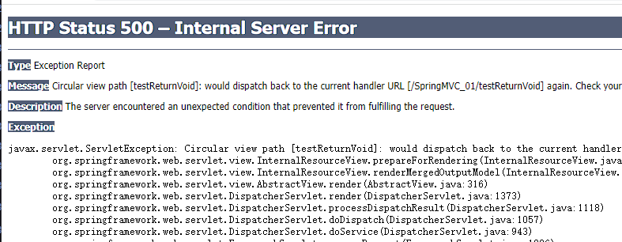
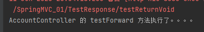

## 返回Viod

如果我们将Controller层中返回Viod方法
```Java
@Controller
public class TestResponse {
    @RequestMapping("/testReturnVoid")
    public void testReturnVoid() throws Exception{
        System.out.println("AccountController 的 testForward 方法执行了。。。。");
    }
}
```

并使用前端页面进行访问
```JSP
<%@ page contentType="text/html;charset=UTF-8" language="java" %>
<html>
<head>
    <title>Title</title>
</head>
<body>
<form action="testReturnVoid">
   <input type="submit" value="testReturnVoid">
</form>
</body>
</html>
```

前端访问后发现,浏览器出现500的错误,控制台可以直接输入方法中的代码



> 由此可见 : 在SpringMVC中如果对于当前的控制单元，没有写对应的返回值，这个时候SpringMVC就会找和自己控制单元名称一致的页面展示,控制单元中的代码是可以正常访问的.

如果在SpringMVC.xml中怕配置了视图解析器:

则前端展示的是404的页面


## 转发和重定向

### 环境准备

redirect.JSP
```JSP
<%@ page contentType="text/html;charset=UTF-8" language="java" %>
<html>
<head>
    <title>Title</title>
</head>
<body>
<h1>This is Redirect Page</h1>
</body>
</html>
```

forward.JSP
```JSP
<%@ page contentType="text/html;charset=UTF-8" language="java" %>
<html>
<head>
    <title>Title</title>
</head>
<body>
<h1>This is Forward Page</h1>
</body>
</html>
```

### ServletAPI实现

单元方法的返回值类型设置void。因为使用response对象在单元方法中直接对此次请求进行了响应，不再通过DispatcherServlet了，既然已经响应了，就不需要再给DispatcherServlet返回值了。

在单元方法上声明HttpServletResponse形参，来接收此次请求的response对象。

#### 请求转发

>  `request.getRequestDispatcher("目标页面地址").forward(request,response);`

Controller层
```Java
@Controller
public class TestResponse {
    @RequestMapping("/testForwardByServletAPI")
    public void testForwardByServletAPI(HttpServletRequest request, HttpServletResponse response) throws ServletException, IOException {
        request.getRequestDispatcher("/forward.jsp").forward(request,response);
    }
}
```

TestResponse.JSP
```JSP
<html>
<head>
    <title>Title</title>
</head>
<body>
<form action="testForwardByServletAPI">
    <input type="submit" value="testForwardByServletAPI">
</form>
</body>
</html>
```

#### 重定向


>  `request.getRequestDispatcher("目标页面地址").forward(request,response);`

Controller层
```Java
@Controller
public class TestResponse {
    @RequestMapping("/testRedirectByServletAPI")
    public void testRedirectByServletAPI(HttpServletRequest request, HttpServletResponse response) throws ServletException, IOException {
        response.sendRedirect(request.getContextPath()+"/redirect.jsp");
    }
}
```

TestResponse.JSP
```JSP
<html>
<head>
    <title>Title</title>
</head>
<body>
<form action="testRedirectByServletAPI">
    <input type="submit" value="testRedirectByServletAPI">
</form>
</body>
</html>
```

### 使用关键字

#### 请求转发 : forward关键字

使用通过单元方法的返回值来告诉DispatcherServlet请求转发指定的资源,如果是请求转发，**forward关键字可以省略不写的**

Controller层
```Java
@Controller
public class TestResponse {
    /*
     * 返回字符串告诉DispatcherServlet跳转的路径
     * 在路径之前放上一个forward: 关键字,就是请求转发
     * 如果路径前的关键字是forward,那么可以省略不写
     * */
    @RequestMapping("/testKeywordsByForward")
    public String testKeywordsByForward()  {
        return "/forward.jsp";
        //return "forward:/forward.jsp";
    }
}
```

TestResponse.JSP
```JSP
<html>
<head>
    <title>Title</title>
</head>
<body>
<form action="testKeywordsByForward">
    <input type="submit" value="testKeywordsByForward">
</form>
</body>
</html>
```

> 注意 : 当前请求是,没有在视图解析器中配置前后缀的,需要注意搭配

#### 请求转发 : redirect关键字

使用通过单元方法的返回值来告诉DispatcherServlet重定向指定的资源，**注意这个redirect关键字不可以省去**

Controller层
```Java
@Controller
public class TestResponse {
    @RequestMapping("/testKeywordsByRedirect")
    public String testKeywordsByRedirect()  {
        return "redirect:/redirect.jsp";
    }
}
```

TestResponse.JSP
```JSP
<html>
<head>
    <title>Title</title>
</head>
<body>
<form action="testKeywordsByRedirect">
    <input type="submit" value="testKeywordsByRedirect">
</form>
</body>
</html>
```

> 注意 : 当前请求是,没有在视图解析器中配置前后缀的,需要注意搭配

### 使用View视图

> RedirectView中所做的操作，最终的实现是在renderMergedOutputModel中完成实现的，简单来说RedirectView实现了链接的重定向，并且将数据保存到FlashMap中，这样在跳转后的链接中可以获取一些数据.

#### 请求转发

Controller层
```Java
@Controller
public class TestResponse {
    @RequestMapping("/testViewByForward")
    public View testViewByForward()  {
        return new InternalResourceView("/forward.jsp");
    }
}
```

TestResponse.JSP
```JSP
<html>
<head>
    <title>Title</title>
</head>
<body>
<form action="testViewByForward">
    <input type="submit" value="testViewByForward">
</form>
</body>
</html>
```

#### 重定向

Controller层
```Java
@Controller
public class TestResponse {
    @RequestMapping("/testViewByRedirect")
    public View testViewByRedirect(HttpServletRequest request)  {
        return new RedirectView(request.getContextPath()+"/redirect.jsp");
    }
}
```

TestResponse.JSP
```JSP
<html>
<head>
    <title>Title</title>
</head>
<body>
<form action="testViewByRedirect">
    <input type="submit" value="testViewByRedirect">
</form>
</body>
</html>
```

### 使用ModelAndView

> ModelAndView中的Model代表模型，View代表视图，这个名字就很好地解释了该类的作用。业务处理器调用模型层处理完用户请求后，把结果数据存储在该类的model属性中，把要返回的视图信息存储在该类的view属性中，然后让该ModelAndView返回该Spring MVC框架。

注意 : `.setViewName()`可以使用关键字进行处理 , ` .setView()` 可以直接使用View视图进行处理

#### 请求转发

Controller层
```Java
@Controller
public class TestResponse {
    @RequestMapping("/testModelAndViewByForward")
    public ModelAndView testModelAndViewByForward()  {
        ModelAndView modelAndView = new ModelAndView();
        //modelAndView.setViewName("forward:/forward.jsp");
        modelAndView.setView(new InternalResourceView("/forward.jsp"));
        return modelAndView;
    }
}
```

TestResponse.JSP
```JSP
<html>
<head>
    <title>Title</title>
</head>
<body>
<form action="testModelAndViewByForward">
    <input type="submit" value="testModelAndViewByForward">
</form>
</body>
</html>
```

#### 重定向

Controller层
```Java
@Controller
public class TestResponse {
    @RequestMapping("/testModelAndViewByRedirect")
    public ModelAndView testModelAndViewByRedirect(HttpServletRequest request)  {
        ModelAndView modelAndView = new ModelAndView();
        //modelAndView.setViewName("redirect:/redirect.jsp");
        modelAndView.setView(new RedirectView(request.getContextPath()+"/redirect.jsp"));
        return modelAndView;
    }
}
```

TestResponse.JSP
```JSP
<html>
<head>
    <title>Title</title>
</head>
<body>
<form action="testModelAndViewByRedirect">
    <input type="submit" value="testModelAndViewByRedirect">
</form>
</body>
</html>
```

## 响应JSON数据

当浏览器发起一个ajax请求给服务器，服务器调用对应的单元方法处理ajax请求。而ajax的请求在被处理完成后，其处理结果需要直接响应。而目前我们在单元方法中响应ajax请求，使用的是response对象，需要我们自己将要响应的数据转换为json字符串响应，比较麻烦，而我们一直希望在单元方法中无论是否是ajax请求，都使用return语句来完成资源的响应，怎么办？

既然我们希望使用单元方法的返回值来响应ajax请求的处理结果，而目前DispatcherServlet的底层会将单元方法的返回值按照请求转发或者重定向来处理，所以就需要我们告诉DispatcherServlet，**单元方法的返回值不要按照请求转发或者重定向处理，而是按照直接响应处理，将单元方法的返回值直接响应给浏览器**。

### 导入包

在之前JavaEE的学习中我们使用了GSON包来处理,详见: [GSON工具类的使用](../../../04_JavaEE技术/06_Ajax/02_数据格式/数据格式.md#GSON工具类的使用)

接下来我们将使用jackson包来处理
```XML
<dependency>
	<groupId>com.fasterxml.jackson.core</groupId>
	<artifactId>jackson-databind</artifactId>
	<version>2.12.1</version>
</dependency>
```

### 使用@ResponseBody返回JSON

> 把我们要响应的数据直接return即可，返回值类型为要return的数据类型。

Controller层
```Java
@Controller
public class TestResponse {
    /*
     * @ResponseBody
     * 1方法的返回值不在作为界面跳转依据,而已直接作为返回的数据
     * 2将方法的返回的数据自动使用ObjectMapper转换为JSON
     */
    @ResponseBody
    @RequestMapping("/testAjax")
    public Pets testAjax(Person p) {
        System.out.println(p);
        Pets pet =new Pets("Tom","cat");
        return pet;
    }
}
```

### 前端使用Ajax请求

更多Ajax的学习可以回顾: [Ajax](../../../04_JavaEE技术/06_Ajax/Ajax.md)
注意:别忘了导入JQuery文件!!!

```JSP
<%@ page contentType="text/html;charset=UTF-8" language="java" %>
<html>
<head>
    <title>Title</title>
    <script src="static/js/jquery-3.5.1.min.js"></script>
    <script>
        $(function (){
            $("#testAjaxBtn").click(function (){
                $.get("testAjax",{pname:"Tome",page:"18"},function (result){
                    console.log(result)
                });
            })
        })
    </script>
</head>
<body>
<input type="button" value="testAjax" id="testAjaxBtn">
</body>
</html>
```

## @RestController注解

> 相当于@Controller+@ResponseBody两个注解的结合，返回json数据不需要在方法前面加@ResponseBody注解了，但使用@RestController这个注解，就不能返回jsp,html页面，视图解析器无法解析jsp,html页面

```Java
@RestController
public class TestResponse {
    /*
     * @ResponseBody
     * 1方法的返回值不在作为界面跳转依据,而已直接作为返回的数据
     * 2将方法的返回的数据自动使用ObjectMapper转换为JSON
     */
    @RequestMapping("/testAjax")
    public Pets testAjax(Person p) {
        System.out.println(p);
        Pets pet =new Pets("Tom","cat");
        return pet;
    }
}
```
