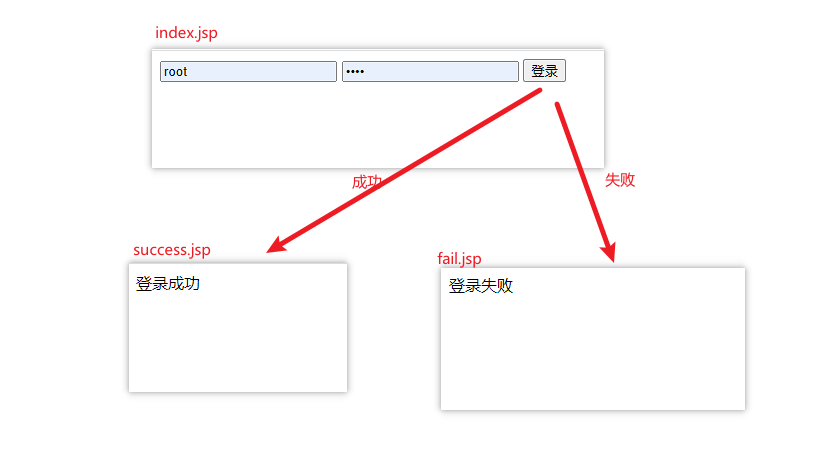
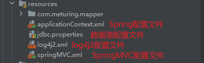
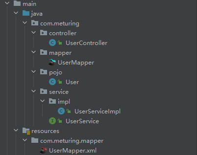

接下来将使用一个登录案例来整合前面学的SpringMVC和Mybatis等技术



## 环境准备

### 数据源

```SQL
CREATE TABLE `userinfo` (
  `uid` int NOT NULL AUTO_INCREMENT,
  `uname` varchar(32) NOT NULL,
  `upwd` varchar(32) NOT NULL,
  PRIMARY KEY (`uid`)
) ENGINE=InnoDB DEFAULT CHARSET=utf8mb4 COLLATE=utf8mb4_0900_ai_ci;
```

```SQl
INSERT INTO userinfo (uid, uname, upwd) VALUES(1, 'root', 'root');
INSERT INTO userinfo (uid, uname, upwd) VALUES(2, 'zhangsan', '123123');
```

### 环境准备

#### 检查项目配置

[检查项目配置](../01_概念引入与环境准备/概念引入与环境准备.md#环境准备#检查项目配置)

#### 创建Maven web 模块

[创建MavenWeb模块](../01_概念引入与环境准备/概念引入与环境准备.md#创建MavenWeb模块)

#### 删除多余的依赖配置

```XML
<project xmlns="http://maven.apache.org/POM/4.0.0" xmlns:xsi="http://www.w3.org/2001/XMLSchema-instance"
  xsi:schemaLocation="http://maven.apache.org/POM/4.0.0 http://maven.apache.org/maven-v4_0_0.xsd">
  <modelVersion>4.0.0</modelVersion>
  <groupId>com.meturing</groupId>
  <artifactId>SpringMVC_02</artifactId>
  <packaging>war</packaging>
  <version>1.0-SNAPSHOT</version>

</project>
```

#### 检查目录标记

[检查目录标记](../01_概念引入与环境准备/概念引入与环境准备.md#检查目录标记)

#### 修改Web.xml

[修改Web.xml](../01_概念引入与环境准备/概念引入与环境准备.md#修改Web.xml)

### 导入依赖

导入工程的依赖文件:

#### Spring相关依赖

```XML
<!--Spring核心包-->
<dependency>
  <groupId>org.springframework</groupId>
  <artifactId>spring-context</artifactId>
  <version>5.3.5</version>
</dependency>
<!--SpringAop切面-->
<dependency>
  <groupId>org.springframework</groupId>
  <artifactId>spring-aspects</artifactId>
  <version>5.3.5</version>
</dependency>
<!--Aop联盟包-->
<dependency>
  <groupId>aopalliance</groupId>
  <artifactId>aopalliance</artifactId>
  <version>1.0</version>
</dependency>
```

#### 数据库相关依赖

```XML
<!--德鲁特连接池-->
<dependency>
  <groupId>com.alibaba</groupId>
  <artifactId>druid</artifactId>
  <version>1.1.14</version>
</dependency>
<!--mysql连接驱动-->
<dependency>
  <groupId>mysql</groupId>
  <artifactId>mysql-connector-java</artifactId>
  <version>8.0.28</version>
</dependency>
<!--SpringJDBC-->
<dependency>
  <groupId>org.springframework</groupId>
  <artifactId>spring-jdbc</artifactId>
  <version>5.3.18</version>
</dependency>
<!--ORM-->
<dependency>
  <groupId>org.springframework</groupId>
  <artifactId>spring-orm</artifactId>
  <version>5.3.5</version>
</dependency>
<!--Spring事务控制-->
<dependency>
  <groupId>org.springframework</groupId>
  <artifactId>spring-tx</artifactId>
  <version>5.3.18</version>
</dependency>
```

#### 日志/工具/测试

```XML
<!--Apache Commons日志包-->
<dependency>
  <groupId>commons-logging</groupId>
  <artifactId>commons-logging</artifactId>
  <version>1.2</version>
</dependency>
<!--log4j2 日志-->
<dependency>
  <groupId>org.apache.logging.log4j</groupId>
  <artifactId>log4j-core</artifactId>
  <version>2.14.0</version>
</dependency>
<!--lombok-->
<dependency>
  <groupId>org.projectlombok</groupId>
  <artifactId>lombok</artifactId>
  <version>1.18.26</version>
</dependency>
<!--JackSon-->
<dependency>
  <groupId>com.fasterxml.jackson.core</groupId>
  <artifactId>jackson-databind</artifactId>
  <version>2.14.2</version>
</dependency>
<!--Spring测试包-->
<dependency>
  <groupId>org.springframework</groupId>
  <artifactId>spring-test</artifactId>
  <version>5.3.18</version>
</dependency>
<!--Junit5-->
<dependency>
  <groupId>org.junit.jupiter</groupId>
  <artifactId>junit-jupiter-api</artifactId>
  <version>5.9.3</version>
  <scope>test</scope>
</dependency>
```

#### SpringMVC

```XML
<!--SpringMVC包-->
<dependency>
  <groupId>org.springframework</groupId>
  <artifactId>spring-webmvc</artifactId>
  <version>5.3.18</version>
</dependency>
<dependency>
  <groupId>org.springframework</groupId>
  <artifactId>spring-web</artifactId>
  <version>5.3.18</version>
</dependency>
```

#### SERVLET和JSP

```XML
<!--jsp-->
<dependency>
  <groupId>javax.servlet.jsp</groupId>
  <artifactId>javax.servlet.jsp-api</artifactId>
  <version>2.3.3</version>
</dependency>
<!--servlet-->
<dependency>
  <groupId>javax.servlet</groupId>
  <artifactId>javax.servlet-api</artifactId>
  <version>4.0.1</version>
</dependency>
```

#### Mybatis

```XML
<!--mybatis-->
<dependency>
  <groupId>org.mybatis</groupId>
  <artifactId>mybatis</artifactId>
  <version>3.5.9</version>
</dependency>
<!--Mybatis与Spring的整合包-->
<dependency>
  <groupId>org.mybatis</groupId>
  <artifactId>mybatis-spring</artifactId>
  <version>2.0.6</version>
</dependency>
```

### 添加配置文件



#### 创建log4j配置文件

推荐快速极简配置 :

```XML
<?xml version="1.0" encoding="UTF-8"?>
<Configuration status="INFO">
    <Appenders>
        <Console name="Console" target="SYSTEM_ERR">
            <PatternLayout pattern="%d{YYYY-MM-dd HH:mm:ss} [%t] %-5p %c{1}:%L - %msg%n" />
        </Console>
    </Appenders>
    <Loggers>
        <Root level="INFO">
            <AppenderRef ref="Console" />
        </Root>
    </Loggers>
</Configuration>
```

更多详情可以了解 : [Log4j日志框架](../../../02_数据库和JDBC/02_JDBC/08_Log4j日志框架/Log4j日志框架.md)

#### 创建数据源配置文件

```properties
jdbc_driver=com.mysql.cj.jdbc.Driver
jdbc_url=jdbc:mysql://192.168.1.188:3306/test?useSSL=false&useUnicode=true&characterEncoding=UTF-8&serverTimezone=Asia/Shanghai
jdbc_username=root
jdbc_password=root
```

#### 创建SpringMVC配置文件

整体配置效果如下: 

```XML
<?xml version="1.0" encoding="UTF-8"?>
<beans xmlns="http://www.springframework.org/schema/beans"
       xmlns:xsi="http://www.w3.org/2001/XMLSchema-instance"
       xmlns:p="http://www.springframework.org/schema/p"
       xmlns:c="http://www.springframework.org/schema/c"
       xmlns:util="http://www.springframework.org/schema/util"
       xmlns:context="http://www.springframework.org/schema/context"
       xmlns:aop="http://www.springframework.org/schema/aop"
       xmlns:tx="http://www.springframework.org/schema/tx"
       xmlns:mvc="http://www.springframework.org/schema/mvc"
       xsi:schemaLocation="
       http://www.springframework.org/schema/beans
       http://www.springframework.org/schema/beans/spring-beans.xsd
       http://www.springframework.org/schema/p
       http://www.springframework.org/schema/p/spring-p.xsd
       http://www.springframework.org/schema/c
       http://www.springframework.org/schema/c/spring-c.xsd
       http://www.springframework.org/schema/util
       http://www.springframework.org/schema/util/spring-util.xsd
       http://www.springframework.org/schema/context
       http://www.springframework.org/schema/context/spring-context.xsd
       http://www.springframework.org/schema/aop
       http://www.springframework.org/schema/aop/spring-aop.xsd
       http://www.springframework.org/schema/tx
       http://www.springframework.org/schema/tx/spring-tx.xsd
       http://www.springframework.org/schema/mvc
       http://www.springframework.org/schema/mvc/spring-mvc.xsd
">
    <!--扫描controller-->
    <context:component-scan base-package="com.meturing.controller"></context:component-scan>

    <!--这里配置三大组件-->
    <mvc:annotation-driven></mvc:annotation-driven>

    <!--视图解析器-->
    <bean class="org.springframework.web.servlet.view.InternalResourceViewResolver"></bean>

    <!--配置静态资源放行-->
    <mvc:resources mapping="/static/**" location="/static/"></mvc:resources>
</beans>
```

##### 新增声明空间

注意我们需要新增: `p` / `c`  / `util` / `context` /  `aop` / `tx`  /  `mvc`  的声明空间,可以不用但是不能没有!

```xml
<?xml version="1.0" encoding="UTF-8"?>
<beans xmlns="http://www.springframework.org/schema/beans"
       xmlns:xsi="http://www.w3.org/2001/XMLSchema-instance"
       xmlns:p="http://www.springframework.org/schema/p"
       xmlns:c="http://www.springframework.org/schema/c"
       xmlns:util="http://www.springframework.org/schema/util"
       xmlns:context="http://www.springframework.org/schema/context"
       xmlns:aop="http://www.springframework.org/schema/aop"
       xmlns:tx="http://www.springframework.org/schema/tx"
       xmlns:mvc="http://www.springframework.org/schema/mvc"
       xsi:schemaLocation="
       http://www.springframework.org/schema/beans
       http://www.springframework.org/schema/beans/spring-beans.xsd
       http://www.springframework.org/schema/p
       http://www.springframework.org/schema/p/spring-p.xsd
       http://www.springframework.org/schema/c
       http://www.springframework.org/schema/c/spring-c.xsd
       http://www.springframework.org/schema/util
       http://www.springframework.org/schema/util/spring-util.xsd
       http://www.springframework.org/schema/context
       http://www.springframework.org/schema/context/spring-context.xsd
       http://www.springframework.org/schema/aop
       http://www.springframework.org/schema/aop/spring-aop.xsd
       http://www.springframework.org/schema/tx
       http://www.springframework.org/schema/tx/spring-tx.xsd
       http://www.springframework.org/schema/mvc
       http://www.springframework.org/schema/mvc/spring-mvc.xsd
">

</beans>
```

##### 扫描controller

添加Controller层的扫描器,SpringMVC主要处理的就是Controller层

```XML
<!--扫描controller-->
<context:component-scan base-package="com.meturing.controller"></context:component-scan>
```

关于包扫描,你可能需要回顾 : [注解方式管理Bean](../../03_Spring基础/06_注解方式管理Bean/注解方式管理Bean.md)

##### 配置三大组件

```XML
<!--自动配置:处理器映射器/处理器适配器-->
<mvc:annotation-driven></mvc:annotation-driven>
<!--视图解析器-->
<bean class="org.springframework.web.servlet.view.InternalResourceViewResolver">  
	<property name="suffix" value=".jsp" ></property>  
</bean>
```

关于三大组件与执行原理,需要回顾: [执行流程与三大组件](../03_执行流程与三大组件/执行流程与三大组件.md)

##### 静态资源放行

```xml
<!--配置静态资源放行-->
<mvc:resources mapping="/static/**" location="/static/"></mvc:resources>
```

为什么配置放行静态资源? 详见: [静态资源的放行管理](../04_静态资源的放行管理/静态资源的放行管理.md)

#### 创建Spring配置文件

整体配置文件如下:

```XML
<?xml version="1.0" encoding="UTF-8"?>
<beans xmlns="http://www.springframework.org/schema/beans"
       xmlns:xsi="http://www.w3.org/2001/XMLSchema-instance"
       xmlns:p="http://www.springframework.org/schema/p"
       xmlns:c="http://www.springframework.org/schema/c"
       xmlns:util="http://www.springframework.org/schema/util"
       xmlns:context="http://www.springframework.org/schema/context"
       xmlns:aop="http://www.springframework.org/schema/aop"
       xmlns:tx="http://www.springframework.org/schema/tx"
       xmlns:mvc="http://www.springframework.org/schema/mvc"
       xsi:schemaLocation="
       http://www.springframework.org/schema/beans
       http://www.springframework.org/schema/beans/spring-beans.xsd
       http://www.springframework.org/schema/p
       http://www.springframework.org/schema/p/spring-p.xsd
       http://www.springframework.org/schema/c
       http://www.springframework.org/schema/c/spring-c.xsd
       http://www.springframework.org/schema/util
       http://www.springframework.org/schema/util/spring-util.xsd
       http://www.springframework.org/schema/context
       http://www.springframework.org/schema/context/spring-context.xsd
       http://www.springframework.org/schema/aop
       http://www.springframework.org/schema/aop/spring-aop.xsd
       http://www.springframework.org/schema/tx
       http://www.springframework.org/schema/tx/spring-tx.xsd
       http://www.springframework.org/schema/mvc
       http://www.springframework.org/schema/mvc/spring-mvc.xsd
">
    <!--扫描service层-->
    <context:component-scan base-package="com.meturing.service"></context:component-scan>

    <!--加载外部属性文件-->
    <context:property-placeholder location="classpath:jdbc.properties"></context:property-placeholder>
    <!--配置德鲁伊数据源-->
    <bean id="dataSource" class="com.alibaba.druid.pool.DruidDataSource">
        <property name="username" value="${jdbc_username}"></property>
        <property name="password" value="${jdbc_password}"></property>
        <property name="url" value="${jdbc_url}"></property>
        <property name="driverClassName" value="${jdbc_driver}"></property>
    </bean>

    <!--配置sqlSessionFactory-->
    <bean id="sessionFactory" class="org.mybatis.spring.SqlSessionFactoryBean">
        <!--配置数据源-->
        <property name="dataSource" ref="dataSource"></property>
        <!--POJO类的包扫描-->
        <property name="typeAliasesPackage" value="com.meturing.pojo"></property>
    </bean>
    <!--配置MapperScanner 扫描mapper.xml 和接口 将生成的Mapper对象放到容器中-->
    <bean id="mapperScannerConfigurer" class="org.mybatis.spring.mapper.MapperScannerConfigurer">
        <!--配置SQLSessionFactory-->
        <property name="sqlSessionFactoryBeanName" value="sessionFactory"></property>
        <!--扫描mapper接口和映射文件-->
        <property name="basePackage" value="com.meturing.mapper"></property>
    </bean>

    <!--事务管理-->
    <!--配置事务管理器-->
    <bean id="transactionManager" class="org.springframework.jdbc.datasource.DataSourceTransactionManager">
        <property name="dataSource" ref="dataSource"></property>
    </bean>
    <!--开启事务注解-->
    <tx:annotation-driven transaction-manager="transactionManager"></tx:annotation-driven>
</beans>
```


##### 新增声明空间

与SpringMVC一样我们需要新增: `p` / `c`  / `util` / `context` /  `aop` / `tx`  /  `mvc`  的声明空间,可以不用但是不能没有!

```xml
<?xml version="1.0" encoding="UTF-8"?>
<beans xmlns="http://www.springframework.org/schema/beans"
       xmlns:xsi="http://www.w3.org/2001/XMLSchema-instance"
       xmlns:p="http://www.springframework.org/schema/p"
       xmlns:c="http://www.springframework.org/schema/c"
       xmlns:util="http://www.springframework.org/schema/util"
       xmlns:context="http://www.springframework.org/schema/context"
       xmlns:aop="http://www.springframework.org/schema/aop"
       xmlns:tx="http://www.springframework.org/schema/tx"
       xmlns:mvc="http://www.springframework.org/schema/mvc"
       xsi:schemaLocation="
       http://www.springframework.org/schema/beans
       http://www.springframework.org/schema/beans/spring-beans.xsd
       http://www.springframework.org/schema/p
       http://www.springframework.org/schema/p/spring-p.xsd
       http://www.springframework.org/schema/c
       http://www.springframework.org/schema/c/spring-c.xsd
       http://www.springframework.org/schema/util
       http://www.springframework.org/schema/util/spring-util.xsd
       http://www.springframework.org/schema/context
       http://www.springframework.org/schema/context/spring-context.xsd
       http://www.springframework.org/schema/aop
       http://www.springframework.org/schema/aop/spring-aop.xsd
       http://www.springframework.org/schema/tx
       http://www.springframework.org/schema/tx/spring-tx.xsd
       http://www.springframework.org/schema/mvc
       http://www.springframework.org/schema/mvc/spring-mvc.xsd
">

</beans>
```

##### 扫描Service层

Spring主要是面向Service层进行管理

```XMl
<!--扫描service层-->
<context:component-scan base-package="com.meturing.service"></context:component-scan>
```

##### 加载外部配置文件配置数据源

开始扫描外部文件,配置数据源

```XMl
<!--加载外部属性文件-->
<context:property-placeholder location="classpath:jdbc.properties"></context:property-placeholder>
<!--配置德鲁伊数据源-->
<bean id="dataSource" class="com.alibaba.druid.pool.DruidDataSource">
	<property name="username" value="${jdbc_username}"></property>
	<property name="password" value="${jdbc_password}"></property>
	<property name="url" value="${jdbc_url}"></property>
	<property name="driverClassName" value="${jdbc_driver}"></property>
</bean>
```

你可能需要了解 : [引入外部配置文件](../../03_Spring基础/05_引入外部配置文件/引入外部配置文件.md)

##### 整合Mybatis

在此之前我们回顾一下Mybatis的相关使用知识 : 

[基础写法思路](../../01_Mybatis基础/02_搭建Mybatis项目环境/搭建Mybatis项目环境.md#基础写法思路)

Spring整合Mybatis的整体思路如下:对于`SqlSessionFactory对象` / `SqlSession对象` / `Mapper对象`全部交给Spring去创建 .然后将创建的对象交给Service层即可.

所以我们只需要关注SqlSessionFactory的创建和Mapper的扫描即可.

```xml
<!--配置sqlSessionFactory-->
<bean id="sessionFactory" class="org.mybatis.spring.SqlSessionFactoryBean">
	<!--配置数据源-->
	<property name="dataSource" ref="dataSource"></property>
	<!--POJO类的包扫描-->
	<property name="typeAliasesPackage" value="com.meturing.pojo"></property>
</bean>
<!--配置MapperScanner 扫描mapper.xml 和接口 将生成的Mapper对象放到容器中-->
<bean id="mapperScannerConfigurer" class="org.mybatis.spring.mapper.MapperScannerConfigurer">
	<!--配置SQLSessionFactory-->
	<property name="sqlSessionFactoryBeanName" value="sessionFactory"></property>
	<!--扫描mapper接口和映射文件-->
	<property name="basePackage" value="com.meturing.mapper"></property>
</bean>
```

##### 配置Spring事务

```XMl
<!--事务管理-->
<!--配置事务管理器-->
<bean id="transactionManager" class="org.springframework.jdbc.datasource.DataSourceTransactionManager">
	<property name="dataSource" ref="dataSource"></property>
</bean>
<!--开启事务注解-->
<tx:annotation-driven transaction-manager="transactionManager"></tx:annotation-driven>
```

你可能需要回顾 : [XML方式管理事务](../../03_Spring基础/10_Spring的事务管理/Sping的事务管理.md#XML方式管理事务)

#### 配置Web.XML文件

##### 整合SpringMVC

```XML
<!--配置SpringMVC-->
<servlet>
	<servlet-name>dispatcherServlet</servlet-name>
	<servlet-class>org.springframework.web.servlet.DispatcherServlet</servlet-class>
	<init-param>
		<param-name>contextConfigLocation</param-name>
		<param-value>classpath:springMVC.xml</param-value>
	</init-param>
	<load-on-startup>1</load-on-startup>
</servlet>
<servlet-mapping>
	<servlet-name>dispatcherServlet</servlet-name>
	<url-pattern>/</url-pattern>
</servlet-mapping>
```

你需要知道的知识点 : [在web.xml中配置前端控制器](../02_框架搭建与注意事项/框架搭建与注意事项.md#在web.xml中配置前端控制器)

##### 整合Spring

Spring的核心容器需要放置到Application域中,通过监听器监听Javaweb项目中ServletContext创建的时候,就创建一个Spring容器,并放置到ServletContext对象中

关于域对象,你需要知道 : [域对象](../../../04_JavaEE技术/03_Servlet/10_域对象/域对象.md)

```XMl
<!--配置Spring-->
<context-param>
	<param-name>contextConfigLocation</param-name>
	<param-value>classpath:applicationContext.xml</param-value>
</context-param>
<listener>
	<listener-class>org.springframework.web.context.ContextLoaderListener</listener-class>
</listener>
```

可以手写监听器,Spring帮我们提供了ContextLoaderListener监听器

关于监听器,你需要知道的: [Application域监听器](../../../04_JavaEE技术/05_过滤器和监听器/04_初识监听器/初识监听器.md#Application域监听器)

##### 配置编码过滤器

```XMl
<!--配置编码过滤器-->
<filter>
	<filter-name>characterEncodingFilter</filter-name>
	<filter-class>org.springframework.web.filter.CharacterEncodingFilter</filter-class>
	<init-param>
		<param-name>encoding</param-name>
		<param-value>UTF-8</param-value>
	</init-param>
</filter>
<filter-mapping>
	<filter-name>characterEncodingFilter</filter-name>
	<url-pattern>/*</url-pattern>
</filter-mapping>
```

关于过滤器,你可能需要知道 : [过滤器和监听器](../../../04_JavaEE技术/05_过滤器和监听器/过滤器和监听器.md)

## 实现业务代码



### 创建前端页面

index.jsp
```JSP
<%@ page contentType="text/html;charset=UTF-8" language="java" %>
<html>
<head>
    <title>Title</title>
</head>
<body>
<form action="login" method="post">
    <input type="text" name="username">
    <input type="password" name="password">
    <input type="submit" value="登录">
</form>
</body>
</html>
```

success.jsp
```JSP
<%@ page contentType="text/html;charset=UTF-8" language="java" %>
<html>
<head>
  <title>Title</title>
</head>
<body>
登录成功
</body>
</html>
```

fail.jsp
```JSP
<%@ page contentType="text/html;charset=UTF-8" language="java" %>
<html>
<head>
    <title>Title</title>
</head>
<body>
登录失败
</body>
</html>
```

### 创建Pojo层

```Java
@AllArgsConstructor
@NoArgsConstructor
@Data
@ToString
public class User implements Serializable {
    private String uId;
    private String uName;
    private String uPwd;
}
```

### 创建Conteoller层

```Java
@Controller
public class UserController {
    @Autowired
    private UserService userService;
    @RequestMapping("/login")
    public String getLogin(String username,String password) {
        User user = userService.getLogin(username,password);
        if (user==null){
            return "/fail";
        }else {
            return "/success";
        }
    }
}
```

### 创建Service层

```Java
public interface UserService {
    User getLogin(String username, String password);
}
```

```Java
@Service
@Transactional
public class UserServiceImpl implements UserService {
    @Autowired
    private UserMapper userMapper;
    public User getLogin(String username, String password) {
        return userMapper.getLogin(username,password);
    }
}
```

### 创建Mapper层

UserMapper.java
```Java
public interface UserMapper{
    User getLogin(String username, String password);
}
```

UserMapper.xml
```XML
<?xml version="1.0" encoding="UTF-8" ?>
<!DOCTYPE mapper
        PUBLIC "-//mybatis.org//DTDMapper3.0//EN"
        "http://mybatis.org/dtd/mybatis-3-mapper.dtd">
<mapper namespace="com.meturing.mapper.UserMapper">
    <select id="getLogin" resultType="user">
        select * from userinfo where uname=#{param1} and upwd=#{param2}
    </select>
</mapper>
```

关于Mybatis的Mapper使用,您可能需要回顾: [Mybatis代理模式的开发](../../01_Mybatis基础/05_Mybatis代理模式的开发/Mybatis代理模式的开发.md)
