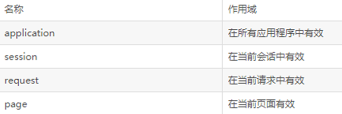
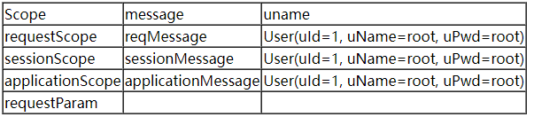
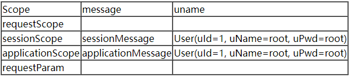
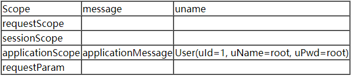
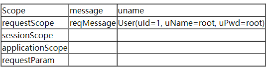
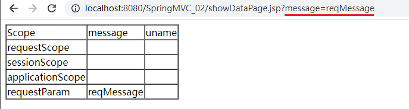
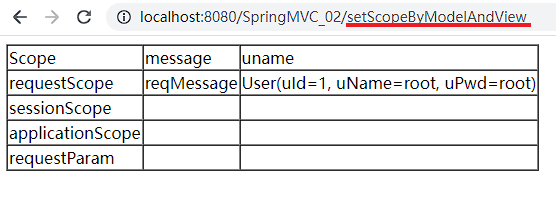
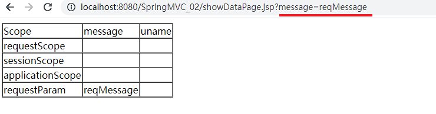

## 回顾作用域

在之前的学习中,我们了解了作用域的使用,可以回顾一下: [域对象](../../../04_JavaEE技术/03_Servlet/10_域对象/域对象.md)



### PageContext对象

作用域范围: 当前jsp页面内有效

### Request对象

作用域范围: 一次请求内。
作用: 解决了一次请求内的资源的数据共享问题

### Session对象

作用域范围: 一次会话内有效。
说明: 浏览器不关闭,并且后台的session不失效，在任意请求中都可以获取到同一个session对象。
作用: 解决了一个用户不同请求的数据共享问题。

### Application(ServletContext)对象

作用域范围: 一次会话内有效。
说明: 浏览器不关闭,并且后台的session不失效，在任意请求中都可以获取到同一个session对象。
作用: 解决了一个用户不同请求的数据共享问题。

## 环境准备

当前项目运行在上一个案例: [整合SpringMVC](../09_整合SpringMVC/整合SpringMVC.md) 的环境上

新增showDataPage.jsp
```JSP
<%@ page contentType="text/html;charset=UTF-8" language="java" %>
<html>
<head>
    <title>Title</title>
</head>
<body>
<table border="1" cellspacing="0">
    <thead>
        <tr>
            <td>Scope</td>
            <td>message</td>
            <td>uname</td>
        </tr>
    </thead>
    <tbody>
        <tr>
            <td>requestScope</td>
            <td>${requestScope.message}</td>
            <td>${requestScope.users[0]}</td>
        </tr>
        <tr>
            <td>sessionScope</td>
            <td>${sessionScope.message}</td>
            <td>${sessionScope.users[0]}</td>
        </tr>
        <tr>
            <td>applicationScope</td>
            <td>${applicationScope.message}</td>
            <td>${applicationScope.users[0]}</td>
        </tr>
        <tr>
            <td>requestParam</td>
            <td>${param.message}</td>
            <td>${applicationScope.users[0]}</td>
        </tr>
    </tbody>
</table>
</body>
</html>
```

## 传统方式传递参数

> 注意 : 在SpringMVC中,request,session 这两个域直接放在参数列表上即可,SpringMVC就可以给我们注入,ServletContext对象(application域) 不能直接放在参数列表上的

构建ScopeController.java
```Java
@Controller
public class ScopeController {
    @Autowired
    UserService userService;
    @RequestMapping("/setScopeByServlet")
    public String setScopeByServlet(HttpServletRequest request, HttpSession session){
        List<User> allUser = userService.getAllUser();
        //存储到request域中:本次请求期间有效
        request.setAttribute("message", "reqMessage");
        request.setAttribute("users", allUser);
        //存储到session域中:本次会话期间有效
        session.setAttribute("message", "sessionMessage");
        session.setAttribute("users", allUser);
        //存储到application域中:本次服务运行期间都有效
        ServletContext application = request.getServletContext();
        application.setAttribute("message", "applicationMessage");
        application.setAttribute("users", allUser);
        return "/showDataPage";
    }
}
```

测试直接访问: `http://localhost:8080/SpringMVC_02/setScopeByServlet`

**我们可以看到requestScope/sessionScope/applicationScope 都正常获取数据**


测试直接访问: `http://localhost:8080/SpringMVC_02/showDataPage.jsp`

**我们可以看到sessionScope/applicationScope 都正常获取数据,说明requestScope仅限于单次请求**

测试关掉浏览器后,再直接访问: `http://localhost:8080/SpringMVC_02/showDataPage.jsp`

**我们可以看到applicationScope 都正常获取数据,说明sessionScope仅限于单次会话**

## 使用Model传递参数

### 请求转发

> model对象**使用addAttribute存储数据**,主要是对请求域传递数据进行了API上的封装降低controller和Servlet之间的耦合度. 

构建ScopeController.java
```Java
@Controller
public class ScopeController {
    @Autowired
    UserService userService;
    @RequestMapping("/setScopeByModel")
    public String setScopeByModel(Model model){
        List<User> allUser = userService.getAllUser();
        //存储到model中:本次请求期间有效
        model.addAttribute("message", "reqMessage");
        model.addAttribute("users", allUser);
        return "/showDataPage";
    }
}
```

测试直接访问: `http://localhost:8080/SpringMVC_02/setScopeByModel`

我们看到: **只有requestScope 正常获取数据**

### 重定向的特殊问题

尝试修改ScopeController.java为重定向
```Java
@Controller
public class ScopeController {
    @Autowired
    UserService userService;
    @RequestMapping("/setScopeByModel")
    public String setScopeByModel(Model model){
        List<User> allUser = userService.getAllUser();
        //存储到model中:本次请求期间有效
        model.addAttribute("message", "reqMessage");
        model.addAttribute("users", allUser);
        return "redirect:/showDataPage.jsp";
    }
}
```

测试直接访问: `http://localhost:8080/SpringMVC_02/setScopeByModel`

我们发现: **当前requestScope/sessionScope/applicationScope 都无法获取数据,但由于Url中存在参数,requestParam获取到了值**

> 注意 : **重定向下,没法使用model传递域中的数据**, model中的字符串类型的键值对信息会转换为请求参数,转发给目标组件

## 使用ModelAndView传递参数

### 请求转发

ScopeController.java
```Java
@Controller
public class ScopeController {
    @Autowired
    UserService userService;
    @RequestMapping("/setScopeByModelAndView")
    public ModelAndView setScopeByModelAndView() {
        List<User> allUser = userService.getAllUser();
        ModelAndView modelAndView = new ModelAndView();
        //设置Model
        Map<String, Object> model = modelAndView.getModel();
        model.put("message", "reqMessage");
        model.put("users", allUser);
        //设置视图
        modelAndView.setViewName("/showDataPage");
        return modelAndView;
    }
}
```

测试直接访问: `http://localhost:8080/SpringMVC_02/setScopeByModelAndView


### 重定向问题的特殊问题

同 [上述Moel传递时的重定向问题](#重定向的特殊问题)

