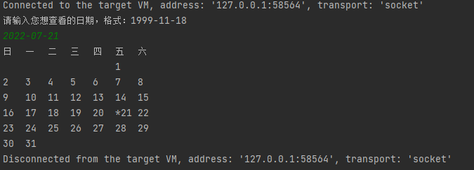

## java.util.Date 与 java.sql.Date

`java.util.date`是`java.sql.date`的父类，其中`java.util.date`用于除了数据库以外的任何地方（**实际上也可以用于数据库**）。两者都有getTime的方法（获取long类型）。所以可以互相转换

```java
java.sql.date date_sql = new java.sql.date(System.currentTime());
java.util.date date = new java,util.date(date_sql.getTime());
```

### java.util.Date 相关API

```java
ublic class utilDemo {
    //这是一个main方法，是程序的入口：
    public static void main(String[] args) {
        //java.util.Date:
        Date d = new Date();
        // Wed Jul 20 20:32:16 CST 2022
        System.out.println(d);
        // Wed Jul 20 20:32:16 CST 2022
        System.out.println(d.toString());
        // 20 Jul 2022 12:32:16 GMT
        System.out.println(d.toGMTString());//过期方法，过时方法，废弃方法。
        // 2022年7月20日 下午8:32:16
        System.out.println(d.toLocaleString());
        // 122
        System.out.println(d.getYear());//122+1900=2022
        // 6
        System.out.println(d.getMonth());//6 :返回的值在 0 和 11 之间，值 0 表示 1 月。
        //返回自 1970 年 1 月 1 日 00:00:00 GMT 以来此 Date 对象表示的毫秒数。
        // 1658320336844
        System.out.println(d.getTime());
        System.out.println(System.currentTimeMillis());
        
        /*
        （1）疑问：以后获取时间差用：getTime()还是currentTimeMillis()
        答案：currentTimeMillis()--》因为这个方法是静态的，可以类名.方法名直接调用
        （2）public static native long currentTimeMillis();
        本地方法
        为什么没有方法体？因为这个方法的具体实现不是通过java写的。
        （3）这个方法的作用：
        一般会去衡量一些算法所用的时间
         */
        long startTime = System.currentTimeMillis();
        for (int i = 0; i < 100000; i++) {
            System.out.println(i);
        }
        long endTime = System.currentTimeMillis();
        System.out.println(endTime-startTime);
    }
}
```

### java.sql.Date 相关API

```java
public class sqlDate {
    public static void main(String[] args) {
        Date d = new Date(1592055964263L);
        System.out.println(d);
        
        /*
        (1)java.sql.Date和java.util.Date的区别：
            java.util.Date：年月日  时分秒
            java.sql.Date：年月日
        (2)java.sql.Date和java.util.Date的联系：
            java.sql.Date(子类) extends java.util.Date （父类）
         */
        //java.sql.Date和java.util.Date相互转换：
            //【1】util--->sql:
        java.util.Date date = new Date(1592055964263L);//创建util.Date的对象
        //方式1：向下转型
        Date date1 = (Date) date;
        /*
        父类：Animal 子类：Dog
        Animal an = new Dog();
        Dog d = (Dog)an;
         */
        //方式2：利用构造器
        Date date2 = new Date(date.getTime());
        //【2】sql-->util:
        java.util.Date date3 = d;
        //[3]String--->sql.Date:
        Date date4 =  Date.valueOf("2019-3-8");
    }
}
```

### 类型互转

String → java.util.Date 类型转换
String →  java.sql.Date →  java.util.Date

```java
public class Test04 {
    //这是一个main方法，是程序的入口：
    public static void main(String[] args) {
        //（1）String--->java.sql.Date
        java.sql.Date date = java.sql.Date.valueOf("2015-9-24");
        //（2）java.sql.Date--->java.util.Date
        java.util.Date date2 = date;
        System.out.println(date2.toString());
    }
}

```

String的格式必须是：**年-月-日** 拼接的形式，换成其它类型，就会出现异常

## SimpleDateFormat

SimpleDateFormat(子类) extends DateFormat（父类是一个抽象类），主要用来定义日期的格式

```java
public class Test05 {
    public static void main(String[] args) {
        //日期转换：
        //SimpleDateFormat(子类) extends DateFormat（父类是一个抽象类）
        //格式化的标准已经定义好了：
        DateFormat dateFormat = new SimpleDateFormat("yyyy-MM-dd HH:MM:SS");
        try {
            // String -> Date
            Date parse = dateFormat.parse("2022-07-21 12:00:00");
            System.out.println(parse);
        } catch (ParseException e) {
            throw new RuntimeException(e);
        }
        // Date -> String
        String format = dateFormat.format(new Date());
        System.out.println(format);
        Date date = new Date();
        System.out.println(date.toString());
        System.out.println(date.toGMTString());
        System.out.println(date.toLocaleString());
    }
}
```

日期格式

| 字母 | 日期或者时间元素          | 表示                | 示例                                   |
| -- | ----------------- | ----------------- | ------------------------------------ |
| G  | Era 标识符           | Text              | AD                                   |
| y  | 年                 | Year              | 1996; 96                             |
| M  | 年中的月份             | Month             | July; Jul; 07                        |
| w  | 年中的周数             | Number            | 27                                   |
| W  | 月中的周数             | Number            | 2                                    |
| D  | 年中的天数             | Number            | 189                                  |
| d  | 月中的天数             | Number            | 10                                   |
| F  | 月中的星期数            | Number            | 2                                    |
| E  | 星期中的天数            | Text              | Tuesday; tue                         |
| a  | Am/pm 标记          | Text              | PM                                   |
| H  | 一天中的小时数(0-23)     | Number            | 0                                    |
| k  | 一天中的小时数(1-24)     | Number            | 24                                   |
| K  | am/pm 中的小时数(0-11) | Number            | 0                                    |
| h  | am/pm 中的小时数(1-12) | Number            | 12                                   |
| m  | 小时中的分钟数           | Number            | 30                                   |
| s  | 分钟中的秒数            | Number            | 55                                   |
| S  | 毫秒数               | Number            | 978                                  |
| z  | 时区                | General time zone | Pacific Standard Time； PST；GMT-08:00 |
| Z  | 时区                | RFC 822 time zone | -0800                                |

## Calendar

Calendar是一个抽象类，不可以直接创建对象
GregorianCalendar()子类 extends Calendar（父类是一个抽象类）

```java
public class Test06 {
    public static void main(String[] args) {
        Calendar gregorianCalendar = new GregorianCalendar();
        Calendar instance = Calendar.getInstance();
        System.out.println(gregorianCalendar);
        
        //获取当前年
        System.out.println(gregorianCalendar.get(Calendar.YEAR));
        //获取当前月  0-11
        System.out.println(gregorianCalendar.get(Calendar.MONTH));
        //获取当前日  21
        System.out.println(gregorianCalendar.get(Calendar.DATE));
        //获取当前是周几？ 分地区，默认按照周日是第一天
        // MONDAY 1， TUESDAY 2， WEDNESDAY 3, THURSDAY 4， FRIDAY 5， SATURDAY 6 ， SUNDAY  7
        //SUNDAY  1， MONDAY 2， TUESDAY 3， WEDNESDAY 4, THURSDAY 5， FRIDAY 6， SATURDAY 7 ，
        System.out.println(gregorianCalendar.get(Calendar.DAY_OF_WEEK));
        //获取当月日期的最大天数
        System.out.println(gregorianCalendar.getActualMaximum(Calendar.DATE));
        ////获取当月日期的最小天数
        System.out.println(gregorianCalendar.getActualMinimum(Calendar.DATE));
        
        //Set改变Calendar的内容
        gregorianCalendar.set(Calendar.YEAR,1997);
        gregorianCalendar.set(Calendar.MONTH,11);
        gregorianCalendar.set(Calendar.DATE,8);
        System.out.println(gregorianCalendar);
        
        //String ->  Calendar
        Date d = java.sql.Date.valueOf("2022-07-21");
        gregorianCalendar.setTime(d);
        System.out.println(gregorianCalendar);
    }
}
```

## 小练习

一个简单的日历小程序



```java
public class Test07 {
    public static void main(String[] args) {
        Scanner scanner = new Scanner(System.in);
        System.out.println("请输入您想查看的日期，格式：1999-11-18");
        String next = scanner.next();
        
        Date date = java.sql.Date.valueOf(next);
        Calendar calendar = new GregorianCalendar();
        calendar.setTime(date);
        
        System.out.println("日\t一\t二\t三\t四\t五\t六");
        //获取当前这个月最大天数
        int maxDay = calendar.getActualMaximum(Calendar.DATE);
        //获取输入的天
        int nowDay = calendar.get(Calendar.DATE);
        //获取这个月第一天是周几？
        calendar.set(Calendar.DATE,1);
        int begin =  calendar.get(Calendar.DAY_OF_WEEK);
        //存入一个计数器
        int count = 0;
        for (int i = 0; i < begin-1; i++) {
            System.out.print("\t");
        }
        count+=begin;
        //补齐第一行
        for (int i = 1; i <= maxDay; i++){
            if (nowDay==i){
                System.out.print("*");
            }
            System.out.print(i+"\t");
            count++;
            if (count%7==0){
                System.out.println();
            }
        }
        System.out.println();
    }
}

```

## JDK1.8中的日期API

### 为什么会有第三代日期API

1.  第一代API：`java.util.Date类`
2.  第二代API：`Calendar类`
	    前两代缺陷：
		    可变性：日期和时间的类应该是不可变的
		    偏移性：Date种年份是从1900开始，月份是从0开始
		    格式化：格式化只对Date有用，Calendar无法使用
3.  第三代：JDK1.8新增API

### LocalDate / LocalTime / LocalDateTime

```java
public class Test08 {
    public static void main(String[] args) {
        //实例化
        //2022-07-21
        LocalDate localDate = LocalDate.now();
        System.out.println(localDate);
        //14:56:28.695081900
        LocalTime localTime = LocalTime.now();
        System.out.println(localTime);
        //2022-07-21T14:56:28.695081900
        LocalDateTime localDateTime = LocalDateTime.now();
        System.out.println(localDateTime);
        
        //设置指定的日期
        LocalDate of = LocalDate.of(2022, 7, 21);
        System.out.println(of);
        LocalTime of1 = LocalTime.of(12, 35, 56);
        System.out.println(of1);
        LocalDateTime of2 = LocalDateTime.of(2022, 7, 21, 14, 58, 58);
        System.out.println(of2);
        
        //LocalDate,LocalTime用的不如LocalDateTime多
        System.out.println(localDateTime.getYear());//2022
        System.out.println(localDateTime.getMonth());//JULY
        System.out.println(localDateTime.getMonthValue());//7
        System.out.println(localDateTime.getDayOfMonth());//21
        System.out.println(localDateTime.getDayOfWeek());//THURSDAY
        System.out.println(localDateTime.getDayOfYear());//202
        System.out.println(localDateTime.getHour());//15
        System.out.println(localDateTime.getMinute());//4
        System.out.println(localDateTime.getSecond());//39
        
        //不可变性  日期之间相互独立，不会相互影响
        //设置指定的日期，不是set 是with
        LocalDateTime localDateTime1 = localDateTime.withMonth(12);
        //2022-12-21T15:04:39.706128800
        System.out.println(localDateTime1);
        //2022-07-21T15:04:39.706128800
        System.out.println(localDateTime);
        
        //提供加减操作
        LocalDateTime localDateTime2 = localDateTime.plusHours(1);
        //2022-07-21T16:04:39.706128800
        System.out.println(localDateTime2);
        //2022-07-21T15:04:39.706128800
        System.out.println(localDateTime);
        
        LocalDateTime localDateTime3 = localDateTime.minusDays(5);
        //2022-07-16T15:04:39.706128800
        System.out.println(localDateTime3);
        //2022-07-21T15:04:39.706128800
        System.out.println(localDateTime);
    }
}
```

### DateTimeFormatter

```java
public class Test09 {
    public static void main(String[] args) {
        //格式化类：DateTimeFormatter
        //方式一:预定义的标准格式。如: ISO_LOCAL_DATE_TIME;ISO_LOCAL_DATE;IS0_LOCAL_TIME
        DateTimeFormatter isoLocalDateTime = DateTimeFormatter.ISO_LOCAL_DATE_TIME;
        //isoLocalDateTime就可以帮我们完成LocalDateTime和String之间的相互转换：
        //LocalDateTime-->String:
        LocalDateTime now = LocalDateTime.now();
        String format = isoLocalDateTime.format(now);
        System.out.println(format);
        //String--->LocalDateTime
        TemporalAccessor parse = isoLocalDateTime.parse("2022-06-15T15:02:51.29");
        System.out.println(parse);
        
        //方式二:本地化相关的格式。如: oflocalizedDateTime()
        //参数：FormatStyle.LONG / FormatStyle.MEDIUM / FormatStyle.SHORT
        //FormatStyle.LONG :2020年6月15日 下午03时17分13秒
        //FormatStyle.MEDIUM: 2020-6-15 15:17:42
        //FormatStyle.SHORT:20-6-15 下午3:18
        DateTimeFormatter dateTimeFormatter = DateTimeFormatter.ofLocalizedDateTime(FormatStyle.SHORT);
        //LocalDateTime-->String:
        LocalDateTime now1 = LocalDateTime.now();
        String format1 = dateTimeFormatter.format(now1);
        System.out.println(format1);
        //String--->LocalDateTime
        TemporalAccessor parse1 = dateTimeFormatter.parse("2022/7/21 下午3:17");
        System.out.println(parse1);
        
        //方式三: 自定义的格式。如: ofPattern( "yyyy-MM-dd hh:mm:ss") ---》重点，以后常用
        DateTimeFormatter dateTimeFormatter1 = DateTimeFormatter.ofPattern("yyyy-MM-dd hh:mm:ss");
        //LocalDateTime-->String:
        LocalDateTime now2 = LocalDateTime.now();
        String format2 = dateTimeFormatter1.format(now2);
        System.out.println(format2);
        //String--->LocalDateTime
        TemporalAccessor parse2 = dateTimeFormatter1.parse("2020-06-15 03:22:03");
        System.out.println(parse2);
    }
}
```
