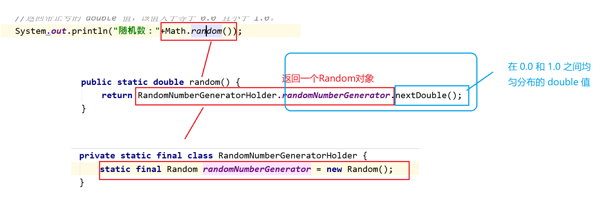

## 常用方法



```java
public class test01 {
    public static void main(String[] args) {
        //返回带正号的 double 值，该值大于等于 0.0 且小于 1.0。
        System.out.println("随机数："+Math.random());
        
        //Random类
        //（1）利用带参数的构造器创建对象：
        Random random = new Random(System.currentTimeMillis());
        int i = random.nextInt();
        System.out.println(i);
        
        //（2）利用空参构造器创建对象：
        Random random1 = new Random();//表面是在调用无参数构造器，实际底层还是调用了带参构造器
        System.out.println(random1.nextInt(10));//在 0（包括）和指定值（不包括）之间均匀分布的 int 值
        System.out.println(random1.nextDouble());//在 0.0 和 1.0 之间均匀分布的 double 值。
    }
}
```
