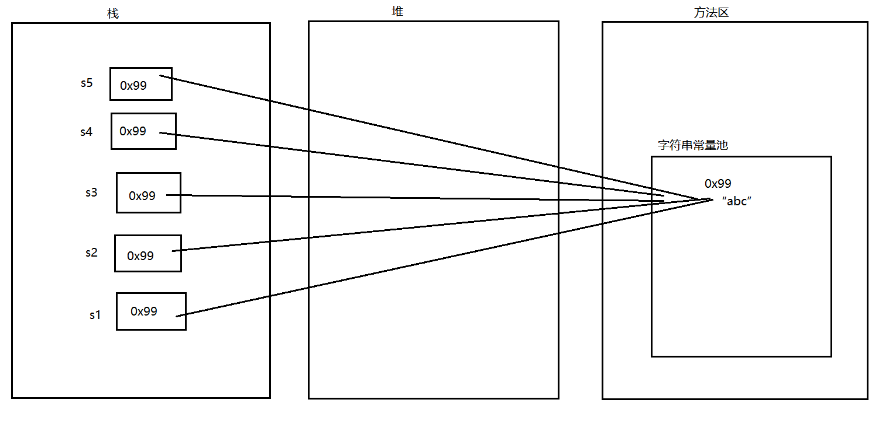
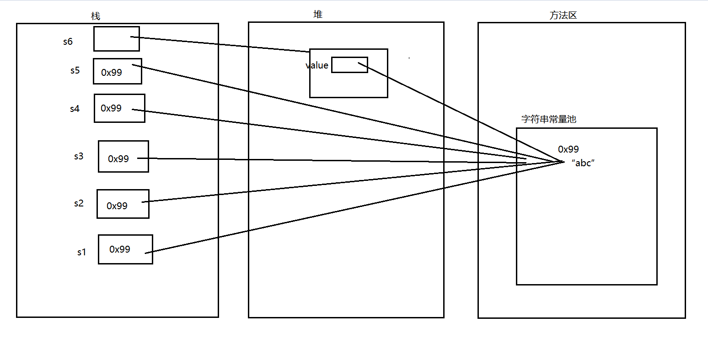
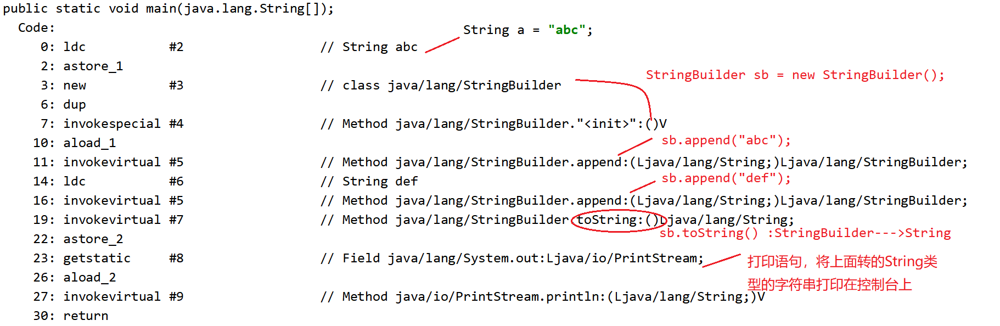

## 特性

包名：`java.lang`
特征：是对象、不可改变、不可继承、底层是一个char数组

## 常用方法

```java
public class test01 {
    public static void main(String[] args) {
        String s1 = new String();
        String s2 = new String("abc");
        String s3 = new String(new char[]{'a','b','c'});
        
        System.out.println("字符串长度："+s2.length());
        System.out.println("字符串是否为空："+s1.isEmpty());
        System.out.println("字符串下表对应字符："+s2.charAt(1));
        
        System.out.println("字符串是否相同："+s2.equals(s3));
        System.out.println("字符串地址是否相同："+ (s2== s3));
        
        //String类实现了Comparable，里面有一个抽象方法叫compareTo，所以String中一定要对这个方法进行重写
        //按位比较
        // abc =》  accdef    返回 b与c之间的ASCII差值 -1
        // abc =》  abcdef    返回 两者之间的长度差 -3
        // abc =》  abc       返回 0
        // abc =》  abf       返回 b与c之间的ASCII差值 -3
        s2 = "abc";
        s3 = "abf";
        System.out.println(s2.compareTo(s3));
        
        //字符串截取
        String s10 = "abcdefhijk";
        System.out.println(s10.substring(3));
        System.out.println(s10.substring(3,6));
        //字符串合并
        System.out.println(s10.concat("lmn"));
        //字符串替换
        System.out.println(s10.replace('a','t'));
        //字符串分割
        String str = "a-b-c-d-e-f";
        String[] split = str.split("-");
        Arrays.stream(split).forEach(System.out::print);
        //大小写转换
        System.out.println(s10.toUpperCase());
        System.out.println(s10.toLowerCase());
        //去除空格
        String s14 = "    a  b  c    ";
        System.out.println(s14.trim());
        //toString()
        String s15 = "abc";
        System.out.println(s15.toString());
        //转换为String类型：
        System.out.println(String.valueOf(false));
    }
}
```

## 内存分析

###  原理

我们创建的字符串，底层是Final修饰的，第一次创建我们会生成在字符串常量池中。
所有创建字符串都会在常量池中寻找一下，如果没有的话则在创建一个新的，并将对象指向常量池中的位置。

### 区别

直接赋值：**`String a = "123"`**



构造方法赋值：**`String a = new String("123");`**



字符串拼接：**`String a =  "123";`**  **`String b = a+"456";`**


