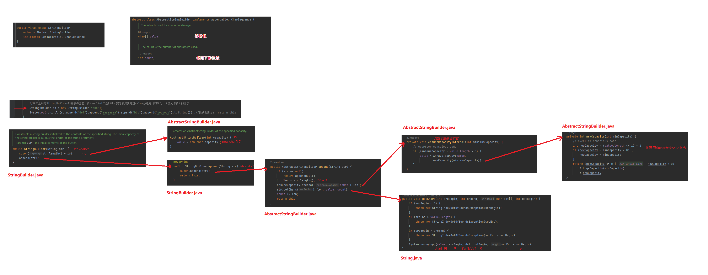
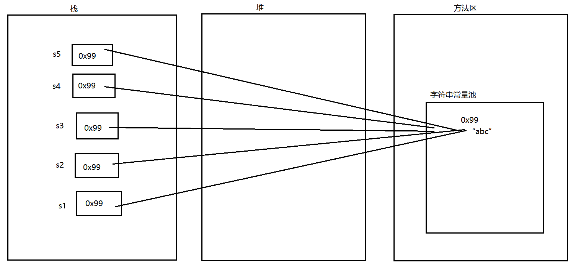
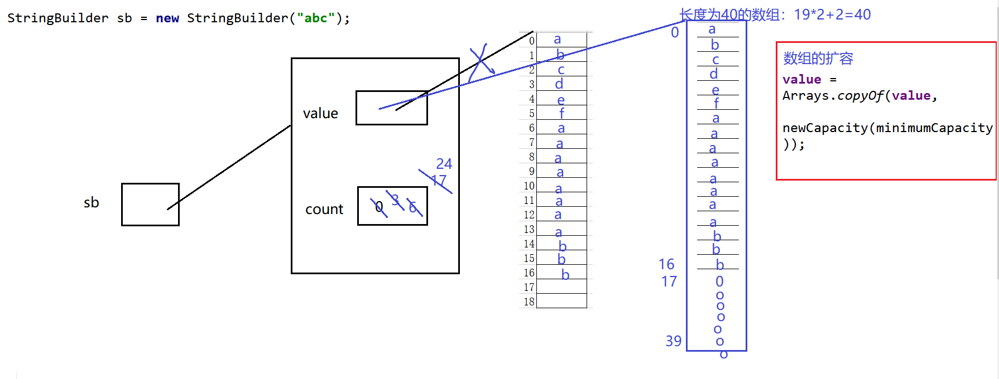

`StringBuilder`与`StringBuffer`类 很相似，下面我们就以`StringBuilder`为例讲解底层内存。

## StringBuilder的底层

可变字符串：**`StringBuilder`**，**`StringBuffer`**

StringBuilder底层中  非常重要的两个属性：**char[ ] value;  //底层存储数组**      **int count;  // 指value数组中被使用的长**

继承： **StringBuilder 继承 AbstractStringBuilder**

```java
public class Test01 {
    //这是一个main方法，是程序的入口：
    public static void main(String[] args) {
        //创建StringBuilder的对象：
        StringBuilder sb3 = new StringBuilder();
        //表面上调用StringBuilder的空构造器，实际底层是对value数组进行初始化，长度为16
        StringBuilder sb2 = new StringBuilder(3);
        //表面上调用StringBuilder的有参构造器，传入一个int类型的数，实际底层就是对value数组进行初始化，长度为你传入的数字
        StringBuilder sb = new StringBuilder("abc");
        System.out.println(sb.append("def").append("aaaaaaaa").append("bbb").append("ooooooo").toString());;//链式调用方式：return this
    }
}
```



查看源码我们知道：
- 初始化String的长度是：**`参数长度+16`**
- StringBulider的扩容是：**`(value.length <<1) +2`**     // 当前存储char数组的长度 \* 2 + 2

## 理解什么是可变与不可变

在前面的学习中，我们知道String是应用方法，他一单被声明则创建在JVM的常量池中，并指向这个位置。当我们改变这个String的参数时，他会优先在常量池中查找，如果不存在则再次创建并指向新的地址。



通过阅读StringBuilder的底层源码，我们发现他是指向一个char数组的引用位置。我们对于StringBuilder的改动，都是在原有的char数组上进行变更，内存地址是一样的。如果超过数组长度，底层会帮我们自动扩容，并将原有的内容复制到新的地址中继续操作。



## 常用方法

### StringBuilder常用方法

```java
public class Test02 {
    public static void main(String[] args) {
        StringBuilder sb=new StringBuilder("nihaojavawodeshijie");
        //增加
        sb.append("这是梦想");
        System.out.println(sb);//nihaojavawodeshijie这是梦想
        //删除
        sb.delete(3,6);////删除位置在[3,6)上的字符
        System.out.println(sb);//nihavawodeshijie这是梦想
        sb.deleteCharAt(16);
        System.out.println(sb);//nihavawodeshijie是梦想
        //修改--> 插入
        StringBuilder sb1=new StringBuilder("$23445980947");
        sb1.insert(3,",");////在下标为3的位置上插入 ,
        System.out.println(sb1);//$23,445980947
        //修改--> 替换
        sb1.replace(3,5,"我好累");//在下标[3,5)位置上替换插入字符串
        System.out.println(sb1);//$23我好累45980947
        sb1.setCharAt(3,'你');//在下标3位置上替换插入字符串
        System.out.println(sb1);//$23你好累45980947
        //查询
        StringBuilder sb3=new StringBuilder("asdfa");
        for (int i = 0; i < sb3.length(); i++) {
            System.out.print(sb3.charAt(i)+"\t");
        }
        System.out.println();
        //截取
        String str=sb3.substring(2,4);//截取[2,4)返回的是一个新的String，对StringBuilder没有影响
        System.out.println(str);
        System.out.println(sb3);
    }
}
```

### StringBuffer常用方法

```java
public class Test03 {
    //这是一个main方法，是程序的入口：
    public static void main(String[] args) {
        StringBuffer sb=new StringBuffer("nihaojavawodeshijie");
        //增
        sb.append("这是梦想");
        System.out.println(sb);//nihaojavawodeshijie这是梦想
        
        //删
        sb.delete(3, 6);//删除位置在[3,6)上的字符
        System.out.println(sb);//nihavawodeshijie这是梦想
        sb.deleteCharAt(16);//删除位置在16上的字符
        System.out.println(sb);//nihavawodeshijie是梦想
        
        //改-->插入
        StringBuilder sb1=new StringBuilder("$23445980947");
        sb1.insert(3, ",");//在下标为3的位置上插入 ,
        System.out.println(sb1);
        
        
        StringBuilder sb2=new StringBuilder("$2你好吗5980947");
        //改-->替换
        sb2.replace(3, 5, "我好累");//在下标[3,5)位置上插入字符串
        System.out.println(sb2);
        sb.setCharAt(3, '!');
        System.out.println(sb);
        //查
        StringBuilder sb3=new StringBuilder("asdfa");
        for (int i = 0; i < sb3.length(); i++) {
            System.out.print(sb3.charAt(i)+"\t");
        }
        System.out.println();
        //截取
        String str=sb3.substring(2,4);//截取[2,4)返回的是一个新的String，对StringBuilder没有影响
        System.out.println(str);
        System.out.println(sb3);
    }
}
```

## StringBuilder与StringBuffer的区别

String类是不可变类，即一旦一个String对象被创建后，包含在这个对象中的字符序列是不可改变的，直至这个对象销毁

StringBuffer类则代表一个字符序列可变的字符串，可以通过append、insert、reverse、setChartAt、setLength等方法改变其内容。一旦生成了最终的字符串，调用toString方法将其转变为String

JDK1.5新增了一个StringBuilder类，与StringBuffer相似，构造方法和方法基本相同。不同是StringBuffer是线程安全的，而StringBuilder是线程不安全的，所以性能略高。通常情况下，创建一个内容可变的字符串，应该优先考虑使用StringBuilder

- StringBuilder:JDK1.5开始  效率高   线程不安全
- StringBuffer:JDK1.0开始   效率低    线程安全
