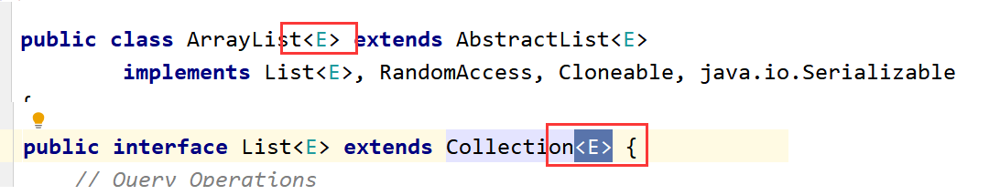

## 前言

### 什么是泛型

集合容器类在设计阶段/声明阶段不能确定这个容器到底实际存的是什么类型的对象，所以在JDK1.5之前只能把元素类型设计为Object，

JDK1.5之 后使用泛型来解决。因为这个时候除了元素的类型不确定，其他的部分是确定的，例如关于这个元素如何保存，如何管理等是确定的，因此此时**把元素的类型设计成一个参数，这个类型参数叫做泛型**。
例如：`Collection<E>`, `List<E>`，` ArrayList<E>` 这个`<E>`就是类型参数，即泛型。

### 为什么用泛型

不使用泛型
```java
public class Test01 {
    //这是main方法，程序的入口
    public static void main(String[] args) {
        //创建一个ArrayList集合，向这个集合中存入学生的成绩：
        ArrayList al = new ArrayList();
        al.add(98);
        al.add(18);
        al.add(39);
        al.add(60);
        al.add(83);
        al.add("丽丽");
        //对集合遍历查看：
        for(Object obj:al){
            System.out.println(obj);
        }
    }
}
```

一般我们在使用集合的时候基本上往集合中存入的都是相同类型的数据，便于管理。但是，由于集合底层是Object数组，所以现在什么引用数据类型都可以存入集合，不方便！

使用泛型后

```java
public class Test01 {
    //这是main方法，程序的入口
    public static void main(String[] args) {
        //创建一个ArrayList集合，向这个集合中存入学生的成绩：
        //加入泛型的优点：在编译时期就会对类型进行检查，不是泛型对应的类型就不可以添加入这个集合。
        ArrayList<Integer> al = new ArrayList<Integer>();
        al.add(98);
        al.add(18);
        al.add(39);
        al.add(60);
        al.add(83);
        // 此时对于不符合泛型限定类型的数据，都会报错
        /*al.add("丽丽");
        al.add(9.8);*/
        //对集合遍历查看：
        /*for(Object obj:al){
            System.out.println(obj);
        }*/
        for(Integer i:al){
            System.out.println(i);
        }
    }
```

### 使用泛型的好处

-   使用版本：`JDK1.5以后`
-   泛型实际就是 一个<>引起来的 参数类型，这个参数类型  具体在使用的时候才会确定具体的类型
    
-   使用了泛型以后，可以确定集合中存放数据的类型，在编译时期就可以检查出来。
-   使用泛型你可能觉得麻烦，实际使用了泛型才会简单，后续的遍历等操作简单。
-   泛型的类型：都是引用数据类型，不能是基本数据类型
-   `ArrayList<Integer> al = new ArrayList<Integer>();`  在JDK1.7以后可以写为：`ArrayList<Integer> al = new ArrayList<>();`  --<>  ---钻石运算符

## 语法

### 泛型类、泛型接口

#### 格式

类名\<E> 就是一个泛型类，<>里面就是一个参数类型，但是这个类型是什么呢？这个类型现在是不确定的，相当于一个占位。

但是现在确定的是这个类型一定是一个引用数据类型，而不是基本数据类型

```java
public class GenericTest<E> {
    int age;
    String name;
    E sex;
    public void a(E n){
    }
    public void b(E[] m){
    }
}
class Test{
    //这是main方法，程序的入口
    public static void main(String[] args) {
        //GenericTest进行实例化：
        //(1)实例化的时候不指定泛型：如果实例化的时候不明确的指定类的泛型，那么认为此泛型为Object类型
        GenericTest gt1 = new GenericTest();
        gt1.a("abc");
        gt1.a(17);
        gt1.a(9.8);
        gt1.b(new String[]{"a","b","c"});
        
        //（2）实例化的时候指定泛型：---》推荐方式
        GenericTest<String> gt2 = new GenericTest<>();
        gt2.sex = "男";
        gt2.a("abc");
        gt2.b(new String[]{"a","b","c"});
        
    }
}
```

#### 继承情况

-   父类指定泛型
```java
class SubGenericTest extends GenericTest<Integer>{
}
class Demo{
	//这是main方法，程序的入口
	public static void main(String[] args) {
		//指定父类泛型，那么子类就不需要再指定泛型了，可以直接使用
		SubGenericTest sgt = new SubGenericTest();
		sgt.a(19);
	}
}
```

- 父类不指定泛型
    如果父类不指定泛型，那么子类也会变成一个泛型类，那这个E的类型可以在创建子类对象的时候确定：
```java
class SubGenericTest2<E> extends GenericTest<E>{
}

class Demo2{
	//这是main方法，程序的入口
	public static void main(String[] args) {
		SubGenericTest2<String> s = new  SubGenericTest2<>();
		s.a("abc");
		s.sex = "女";
	}
}  
```

#### 细节

-   泛型类可以定义多个参数类型
```java
public class TestGeneric<A,B,C>{
  A age;
  B name;
  C sex;
  
  public void a(A m,B n,C x){
  
  }
}
```

-   泛型类的构造器的写法
构造方法不能使用泛型
```java
public class TestGeneric<A,B,C>{
  // public TestGeneric <A,B,C>(){
  public TestGeneric(){
  
  }
}
```

-   不同的泛型的引用类型不可以相互赋值
```java
class Demo2{
	//这是main方法，程序的入口
	public static void main(String[] args) {
		SubGenericTest2<String> s1 = null;
		SubGenericTest2<Integer> s2 = null;
		// s1 = s2
	}
}
```

-   泛型如果不指定，那么就会被擦除，反应对应的类型为Object类型
```java
class SubGenericTest2<E> extends GenericTest<E>{
}

class Demo2{
	//这是main方法，程序的入口
	public static void main(String[] args) {
		SubGenericTest2 s = new  SubGenericTest2();
		s.a("abc");
		s.sex = "女";
	}
}
```

-   泛型类中的静态方法不能使用类的泛型
因为，静态方法属性优先于对象之前加载
```java
class SubGenericTest2<E> extends GenericTest<E>{
  //public static int c(A a){
   // return 10;
  //}
}
```

-   不能直接使用E\[ ]的创建
可以先创建Object数组再转换成泛型类型
```java
public static void main(String[] args) {
	 // A[] i = new A[10];
	 A[] i = (A[])new Object[10];
}

```

### 泛型方法

-   不是带泛型的方法就是泛型方法，泛型方法有要求：**这个方法的泛型的参数类型要和当前的类的泛型无关**
    泛型方法对应的那个泛型参数类型 和  当前所在的这个类 是否是泛型类，泛型是啥  无关
-   泛型方法定义的时候，前面要加上\<T>
    原因：如果不加的话，会把T当做一种数据类型，然而代码中没有T类型那么就会报错
-   T的类型是在调用方法的时候确定的
-   泛型方法可否是静态方法？可以是静态方法

```java
public class TestGeneric<E> {
    //不是泛型方法 （不能是静态方法）
    public static void a(E e){
    }
    //是泛型方法
    public static <T>  void b(T t){
    }
}
class Demo{
    //这是main方法，程序的入口
    public static void main(String[] args) {
        TestGeneric<String> tg = new TestGeneric<>();
        tg.a("abc");
        tg.b("abc");
        tg.b(19);
        tg.b(true);
    }
}
```

### 泛型参数的继承关系

泛型的参数继承关系，与原有的类的继承关系无关，我们再使用多态时，以原有类的继承关系为准
```java
public static void main(String[] args){
  // 多态的应用
  Object obj = new Object();
  String s = new String();
  obj = s;
   
  // 多态的应用
  Object[] objArr = new Object[10];
  String[] strArr = new String[10];
  objArr = strArr;
  
  List<Object> list1 = new ArrayList<>();
  List<String> list2 = new ArrayList<>();
  // list1 = list2;   // 报错 list1 与 list2 是并列关系
}
```

### 通配符 \<?>

#### 格式

在上面的开发中，我们在使用不不同的泛型时，当涉及到重写操作时，会出现错误的情况：
```java
public class Test {
    /*public void a(List<Object> list){
    }
    public void a(List<String> list){
    }
    public void a(List<Integer> list){
    }*/
}
```

此时我们可以使用通配符\<?>
```java
public class Test {
    /*public void a(List<Object> list){
    }
    public void a(List<String> list){
    }
    public void a(List<Integer> list){
    }*/
    public void a(List<?> list){
        //内部遍历的时候用Object即可，不用？
        for(Object a:list){
            System.out.println(a);
        }
    }
}

class T{
    //这是main方法，程序的入口
    public static void main(String[] args) {
        Test t = new Test();
        t.a(new ArrayList<Integer>());
        t.a(new ArrayList<String>());
        t.a(new ArrayList<Object>());
    }
}
```

\<?> 通配符的泛型，可作为任何类型的泛型的父类，与之转换承接
```java
public class Demo {
    //这是main方法，程序的入口
    public static void main(String[] args) {
        List<Object> list1 = new ArrayList<>();
        List<String> list2 = new ArrayList<>();
        List<Integer> list3 = new ArrayList<>();
        List<?> list = null;
        list = list1;
        list = list2;
        list = list3;
    }
}
```

#### 细节

注意事项
-   使用增强For循环遍历时，需要使用Object对象进行操作
-   不可以随便添加数据
-   读取数据时，必须使用Object类型类承接

相关代码
```java
public class Test {
    public void a(List<?> list){
        //1.遍历：
        for(Object a:list){
            System.out.println(a);
        }
        //2.数据的写入操作 ：
        //list.add("abc");-->出错，不能随意的添加数据
        list.add(null);
        //3.数据的读取操作：
        Object s = list.get(0);
    }
}
class T{
    //这是main方法，程序的入口
    public static void main(String[] args) {
        Test t = new Test();
        t.a(new ArrayList<Integer>());
        t.a(new ArrayList<String>());
        t.a(new ArrayList<Object>());
    }
}
```

### 泛型受限

#### 上限  \<? extends Classs>

限定为指定类或指定类的子类
```java
public class Test02 {
    public static void main(String[] args) {
        List<Object> objects = new ArrayList<>();
        List<Person> person = new ArrayList<>();
        List<Student> students = new ArrayList<>();
        /*测试：泛型上限*/
        List<? extends Person> list = null;
        // list = objects;  报错，Object是Person的父类
        list = person;
        list = students;
    }
}
class Person{}
class Student extends Person{}
```

#### 下限 \<? super Classs>

限定为指定类或指定类的父类
```java
public class Test02 {
    public static void main(String[] args) {
        List<Object> objects = new ArrayList<>();
        List<Person> person = new ArrayList<>();
        List<Student> students = new ArrayList<>();
        /*测试：泛型下限*/
        List<? super Person> list1 = null;
        list1 = objects;
        list1 = person;
        // list1 = students; 报错，Object是Person的子类
    }
}
class Person{}
class Student extends Person{}

```
