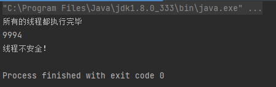
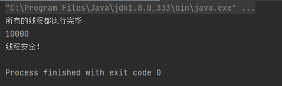
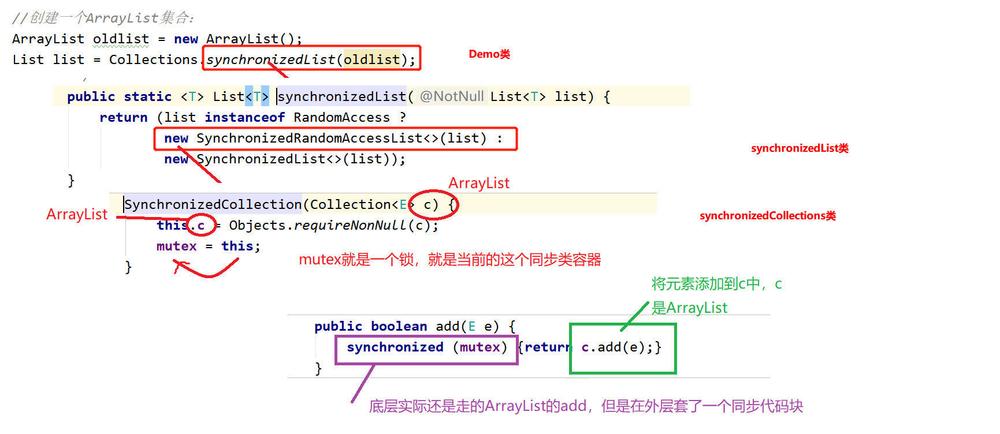

在之前的学习中，我们说`Vector`和`HashTable`是线程安全的，但是目前来说在实际开发中我们是淘汰使用的。因为他们底层默认使用`了synchronized`将整个容器锁了起来，这种情况下我们会出现效率低下的情况。所以，我们常用的是一般的集合容器，在特殊的场景下（必须线程同步）时，讲普通容器转换为同步类容器。

涉及方法：`Collections.synchronizedList();` `Collections.synchronizedMap();` `Collections.synchronizedSet();`

## 测试线程的不安全性

```java
public class Test01 {
    public static void main(String[] args) {
        ArrayList<String> list = new ArrayList<>();
        //创建一个线程池
        ExecutorService executorService = Executors.newFixedThreadPool(100);
        
        //并发使用线程向同一个集合中塞入数据
        for (int i = 0; i < 10000; i++) {
            executorService.execute(new Runnable() {
                @Override
                public void run() {
                    list.add("A");
                }
            });
        }
        //关闭线程
        executorService.shutdown();
        
        //检查线程是否执行完毕
        while (true){
            //线程都执行完以后返回true
            if (executorService.isTerminated()){
                System.out.println("所有的线程都执行完毕");
                System.out.println(list.size());
                if (list.size()==10000){
                    System.out.println("线程安全！");
                }else{
                    System.out.println("线程不安全！");
                }
                break;
            }
        }
    }
}
```

原因：
	由于我们在集合中塞入数据时，由于多个线程的影响，可能出现两个线程同时操作同一个下标上的数据的情况。所以最终不会完全操作完所有的数据，个别数据被重复修改。

## 修改为线程安全的

```java
public class Test01 {
    public static void main(String[] args) {
        ArrayList<String> oldList = new ArrayList<>();
        //将普通集合转换成同步类集合
        List<String> list = Collections.synchronizedList(oldList);
        
        //创建一个线程池
        ExecutorService executorService = Executors.newFixedThreadPool(100);
        
        //并发使用线程向同一个集合中塞入数据
        for (int i = 0; i < 10000; i++) {
            executorService.execute(new Runnable() {
                @Override
                public void run() {
                    list.add("A");
                }
            });
        }
        //关闭线程
        executorService.shutdown();
        
        //检查线程是否执行完毕
        while (true){
            //线程都执行完以后返回true
            if (executorService.isTerminated()){
                System.out.println("所有的线程都执行完毕");
                System.out.println(list.size());
                if (list.size()==10000){
                    System.out.println("线程安全！");
                }else{
                    System.out.println("线程不安全！");
                }
                break;
            }
        }
    }
}
```


## 底层源码



解释：使用Collections工具类中的synchronizedXXX方法，会将<font color="#ff0000">当前的原有集合转换成一个带有同步锁的同步集合。该集合实际上操作的还是原有集合，只是在执行操作时，都会执行同步锁的控制。</font>

