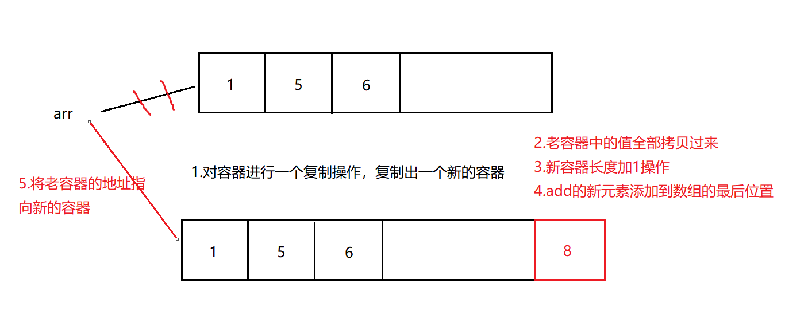

## 概念

COW类并发容器，全称：**Copy On Write容器**，写时复制容器。（读写分离容器）

原理：**向容器中添加元素时，先将容器进行Copy复制出一个新容器，然后将元素添加到新容器中，再将原容器的引用指向新容器**,并发读的时候不需要锁定容器，因为原容器没有变化，所以可以读取原容器中的值，使用的是一种读写分离的思想。



- 优点:
	**操作arr数组本身是无锁的，没有锁，在添加数据的时候，做了额外的复制**。如果有线程来读数据，那么读取的是老arr的数据，此时arr的地址还没有改呢，在我添加元素的过程中，无论有多少个线程来读数据，都是读的原来的arr，不是新的arr。所以性能很高，读写分离。提高了并发的性能。如果再读再复制...
- 注意:
	**CopyOnWrite容器只能保证数据的最终一致性，不能保证数据实时一致性**。所以如果你希望写入的的数据，马上能读到，请不要使用CopyOnWrite容器。
- 适合特定场合
	这个应用场景显而易见，**适合读多写少的情况**。如果一万个线程都添加操作，都在集合中添加数据，那数组不断复制，长度不断+1，那JVM肯定一直往上飙升，你用的时候肯定要评估使用场景的。由于每次更新都会复制新容器，所以如果数据量较大并且更新操作频繁则对内存消耗很高，建议在高并发读的场景下使用。
	
## CopyOnWriteArrayList

### 使用案例

```java
public class Test {
    //这是main方法，程序的入口
    public static void main(String[] args) {
        CopyOnWriteArrayList<Integer> list = new CopyOnWriteArrayList<>();
        //添加方法：
        list.add(1);
        list.add(2);
        list.add(3);
        list.add(4);
        System.out.println(list);//[1, 2, 3, 4]
        list.add(3);//add方法无论元素是否存在，都可以添加进去--》添加重复的元素
        System.out.println(list);//[1, 2, 3, 4, 3]
        //adj. 缺席的；缺少的；心不在焉的；茫然的
        list.addIfAbsent(33);//添加不存在的元素--》不可以添加重复的数据
        System.out.println(list);//[1, 2, 3, 4, 3, 33]
    }
}
```

### 相关源码

```java
public class CopyOnWriteArrayList<E>{
        //底层基于数组实现的
        private transient volatile Object[] array;
        
        public CopyOnWriteArrayList() {
            setArray(new Object[0]);
        }
        
        //add方法：
        public boolean add(E e) {
          final ReentrantLock lock = this.lock;
          lock.lock();
          try {
              //返回底层array数组,给了elements
              Object[] elements = getArray();
              //获取elements的长度---》获取老数组的长度
              int len = elements.length;
              //完成数组的复制，将老数组中的元素复制到新数组中，并且新数组的长度加1操作
              Object[] newElements = Arrays.copyOf(elements, len + 1);
              //将e元素放入新数组最后位置
              newElements[len] = e;
              //array数组的指向从老数组变为新数组
              setArray(newElements);
              return true;
          } finally {
              lock.unlock();
          }
        }
        
        final void setArray(Object[] a) {
          array = a; // array = new Object[0]
        }
        
        final Object[] getArray() {
          return array;//返回底层数组
        }
        
        
        private boolean addIfAbsent(E e, Object[] snapshot) {
          final ReentrantLock lock = this.lock;
          lock.lock();
          try {
              //取出array数组给current
              Object[] current = getArray();
              int len = current.length;
              if (snapshot != current) {
                // Optimize for lost race to another addXXX operation
                int common = Math.min(snapshot.length, len);
                //遍历老数组：
                for (int i = 0; i < common; i++)
                //eq(e, current[i])将放入的元素和老数组的每一个元素进行比较，如果有重复的元素，就返回false，不添加了
                
                if (current[i] != snapshot[i] && eq(e, current[i])) return false;
                if (indexOf(e, current, common, len) >= 0) return false;
              }
              //完成数组的复制，将老数组中的元素复制到新数组中，并且新数组的长度加1操作
              Object[] newElements = Arrays.copyOf(current, len + 1);
              //将e元素放入新数组最后位置
              newElements[len] = e;
              //array数组的指向从老数组变为新数组
              setArray(newElements);
              return true;
          } finally {
              lock.unlock();
          }
       }
}

```

## CopyOnWriteArraySet

### 使用案例

```java
public class Test02 {
    //这是main方法，程序的入口
    public static void main(String[] args) {
        //创建一个集合：
        CopyOnWriteArraySet<Integer> set = new CopyOnWriteArraySet<>();
        //在这里也体现出Set和List的本质区别，就在于是否重复
        //所以add方法直接不可以添加重复数据进去
        set.add(1);
        set.add(2);
        set.add(2);
        set.add(7);
        System.out.println(set);//[1, 2, 7]
        
    }
}
```

### 相关源码

```java
public class CopyOnWriteArraySet<E>{
        //CopyOnWriteArraySet底层基于CopyOnWriteArrayList
        private final CopyOnWriteArrayList<E> al;
        
        public CopyOnWriteArraySet() {
          al = new CopyOnWriteArrayList<E>();
        }
        
        //添加方法：
        public boolean add(E e) {
          return al.addIfAbsent(e);//底层调用的还是CopyOnWriteArrayList的addIfAbsent
        }
}

```

每次调用CopyOnWriteArraySet的add方法时候，其实底层是基于CopyOnWriteArrayList的addIfAbsent，每次在addIfAbsent方法中每次都要对数组进行遍历，所以CopyOnWriteArraySet的性能低于CopyOnWriteArrayList