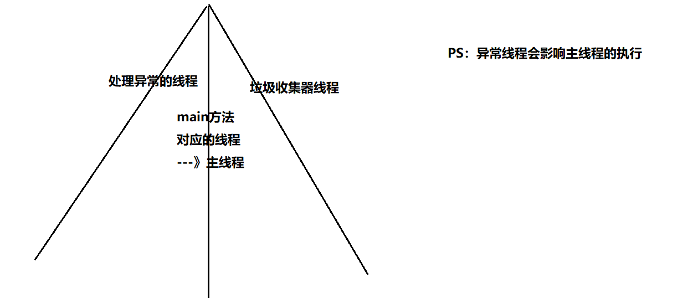
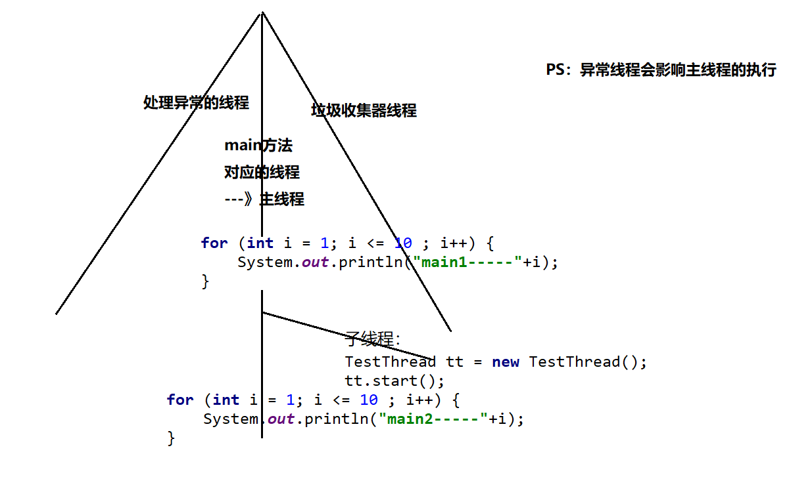

## 程序、进程、线程

➢`程序(program)`：是为完成特定任务、用某种语言编写的一组指令的集合,是一段静态的代码。 （程序是静态的）

➢`进程(process)`：是程序的一次执行过程。正在运行的一个程序，进程作为资源分配的单位，在内存中会为每个进程分配不同的内存区域。 （进程是动态的）是一个动的过程 ，进程的生命周期  :  有它自身的产生、存在和消亡的过程&#x20;

➢`线程(thread)`: 进程可进一步细化为线程， 是一个程序内部的一条执行路径。若一个进程同一时间并行执行多个线程，就是支持多线程的。

> 注意：
> **单核CPU**在执行任务时，是按照时间片来执行的，他是不停的来切换时间片，执行不同的线程。由于时间片比较短，所以我们感受到的是多个任务同时执行，实际上这是一种假象，是**并行**。
> **`多核CPU`** 较于单核CPU来讲，是同时有多个内核，每个内核有自己的时间片，从宏观上来讲是并发的多个任务，与内核的数量有关。但每个内核中还是单线程的。是**并发**

>拓展：
>我们常听说**4核8线程**类似的CPU描述语句，这里的**核**表示的是**内核**，这里的**线程**表示的是**逻辑单元**，是指使用超线程技术，使原本只支持一个线程的内核，虚拟化出一个内核，物理内核和虚拟内核同时各自执行一个线程，做到单核双线程的目的。

## Java上的多线程

在正常的Java代码中，我们编写的代码都是执行在主线程上。但是从JVM的层面来看，我们的程序是多线程的，除了主线程、我们还有异常信息捕捉线程和垃圾回收线程。

我们创建的多线程是指，在主线程的基础上，再开辟其他的线程

