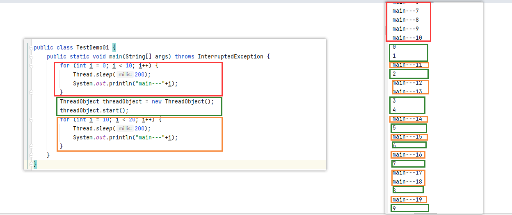
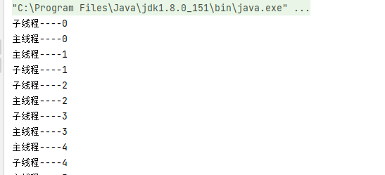
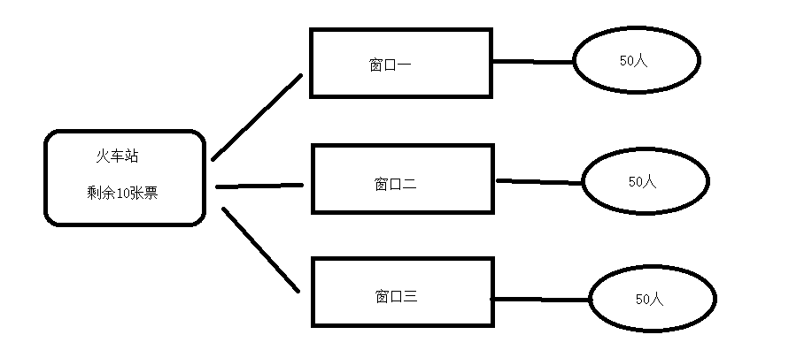
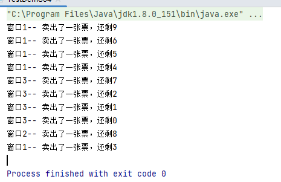
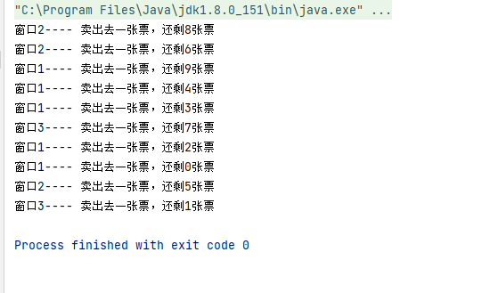

## 继承Thread类

### 步骤

① 继承Thread类  
② 重写run方法 
③ 执行start方法

### 一个简单的Demo

```java
/**
 * 简单的线程测试
 */
public class TestDemo01 {
	public static void main(String[] args) throws InterruptedException {
		for (int i = 0; i < 10; i++) {
			Thread.sleep(200);
			System.out.println("main---"+i);
		}
		ThreadObject threadObject = new ThreadObject();
		threadObject.start();
		for (int i = 10; i < 20; i++) {
			Thread.sleep(200);
			System.out.println("main---"+i);
		}
	}
}
/**
 * ① 继承Thread类  ② 重写run方法   ③ 执行start方法
 */
class ThreadObject extends Thread{
	@Override
	public void run() {
		for (int i = 0; i < 10; i++) {
			try {
				Thread.sleep(200);
			} catch (InterruptedException e) {
				throw new RuntimeException(e);
			}
			System.out.println(i);
		}
	}
}
```

我们可以看到：在执行多线程之前，我们的程序还是单线程执行的，将红色代码块全部执行完毕，当执行到绿色代码块时，并不会等待执行完毕，而是和橙色代码块一起并发执行。



### 给线程设置名字

**`Thread.currentThread().setName("主线程");`** //设置当前主线程的名字
**`Thread.currentThread().getName()`** //获取当前主线程的名字
**`线程对象.setName("子线程")`**//设置当前子线程的名字
**`线程对象.getName()`**//获取当前子线程的名字

#### 通过对象属性设置

```java
package com.turing.createthread;

public class TestDemo02 {
	public static void main(String[] args) throws InterruptedException {
		Thread.currentThread().setName("主线程");//设置当前主线程的名字
		
		ThreadObject01 threadObject01 = new ThreadObject01();
		threadObject01.setName("子线程");//设置当前子线程的名字
		threadObject01.start();
		
		for (int i = 0; i < 10; i++) {
			Thread.sleep(200);
			System.out.println(Thread.currentThread().getName()+"----"+i);
		}
	}
}

/**
 * ① 继承Thread类  ② 重写run方法   ③ 执行start方法
 */
class ThreadObject01 extends Thread{
	@Override
	public void run() {
		for (int i = 0; i < 10; i++) {
			try {
				Thread.sleep(200);
			} catch (InterruptedException e) {
				throw new RuntimeException(e);
			}
			System.out.println(this.getName()+"----"+i);
		}
	}
}
```

####  通过构造函数设置

```java
public class TestDemo03 {
	public static void main(String[] args) throws InterruptedException {
		Thread.currentThread().setName("主线程");//设置当前主线程的名字
		
		ThreadObject02 threadObject02 = new ThreadObject02("子线程");//设置当前子线程的名字
		threadObject02.start();
		
		for (int i = 0; i < 10; i++) {
			Thread.sleep(200);
			System.out.println(Thread.currentThread().getName()+"----"+i);
		}
	}
}
/**
 * ① 继承Thread类  ② 重写run方法   ③ 执行start方法
 */
class ThreadObject02 extends Thread{
	//重写构造方法 给线程设置名字
	public ThreadObject02(String name) {
		super(name);
	}
	
	@Override
	public void run() {
		for (int i = 0; i < 10; i++) {
			try {
				Thread.sleep(200);
			} catch (InterruptedException e) {
				throw new RuntimeException(e);
			}
			System.out.println(this.getName()+"----"+i);
		}
	}
}
```

我们可以看到：每个线程都获取到我们设置的名字



### 模拟卖票

我们模拟火车站卖票的操作，一共3个窗口，每个窗口50人，大家一起抢剩余的10张票



代码

```java
public class TestDemo04 {
	public static void main(String[] args) {
		TrainStation thread01 = new TrainStation("窗口1");
		thread01.start();
		TrainStation thread02 = new TrainStation("窗口2");
		thread02.start();
		TrainStation thread03 = new TrainStation("窗口3");
		thread03.start();
	}
}
class TrainStation extends Thread{
	private static int ticket = 10; //初始化10张票
	//设置线程的名字
	public TrainStation(String name) {
		super(name);
	}
	
	//执行的方法
	@Override
	public void run() {
		//每个线程后面有50个人去抢票
		for (int i = 0; i < 50; i++) {
			if (ticket>0){
				System.out.println(this.getName()+"-- 卖出了一张票，还剩"+(--ticket));
			}
		}
	}
}
```


我们可以看到：效果实现，没有出现票卖超的情况



## 实现Runnable接口

### 步骤

① 实现Runnable接口 
② 重写run方法   
③ 创建线程任务对象   
④ 创建Thread对象，使用构造方法传入线程任务对象以及线程名字 
⑤ Thread对象.strat()执行线程

### 一个简单的Demo

```java
public class TestDemo05 {
    public static void main(String[] args) {
        runnableDemo runnableDemo = new runnableDemo();//创建对象
        Thread thread = new Thread(runnableDemo,"线程1");//使用对象创建线程对象，并为线程创建名字
        thread.start();
    }
}

class runnableDemo implements Runnable{
    @Override
    public void run() {
        for (int i = 0; i < 10; i++) {
            try {
                Thread.sleep(200);
            } catch (InterruptedException e) {
                throw new RuntimeException(e);
            }
            System.out.println(Thread.currentThread().getName()+"----"+i);
        }
    }
}

```

### 模拟卖票

```java
public class TestDemo06 {
	public static void main(String[] args) {
		TrainStation02 trainStation01 = new TrainStation02();
		
		Thread thread1 = new Thread(trainStation01,"窗口1");
		thread1.start();
		Thread thread2 = new Thread(trainStation02,"窗口2");
		thread2.start();
		Thread thread3 = new Thread(trainStation03,"窗口3");
		thread3.start();
	}
}

class TrainStation02 implements Runnable{
	private static int ticket = 10; //初始化10张票
	
	@Override
	public void run() {
		for (int i = 0; i < 50; i++) {
			if (ticket>0){
				System.out.println(Thread.currentThread().getName()+"---- 卖出去一张票，还剩"+(--ticket)+"张票");
			}
		}
	}
}
```

效果



## 实现Callable接口

我们查看前面的集中线程的创建方法，我们发现都是重写了run方法，这个方法是没有返回值的。在**JDK1.5**后，我们可以实现Callable接口来**获取线程的返回值**

### 优点

（1）**`有返回值`**  
（2）**`能抛出异常`**

### 步骤

① 实现Callable接口（可以指定返回值类型，不指定返回Object）
② 重写call方法   
③ 创建线程任务对象  
④ 创建FutureTask对象，传入线程任务对象  
⑤ 创建Thread线程对象，传入FutureTask对象，线程名字
⑥ 线程对象.start() 执行线程 
⑦ FutureTask对象.get() 获取返回值

### 一个简单的Demo

```java
public class TestDemo07 {
    public static void main(String[] args) throws ExecutionException, InterruptedException {
        CallAbleDemo callAbleDemo = new CallAbleDemo(); //创建线程任务对象
        FutureTask futureTask = new FutureTask(callAbleDemo);//创建FutureTask对象，传入线程任务对象
        Thread thread = new Thread(futureTask, "线程一");//创建Thread线程对象，传入FutureTask对象
        thread.start();//运行线程
        int random = (int)futureTask.get();//通过FutureTask对象.get() 获取返回值
        System.out.println(random);
    }
}
class CallAbleDemo implements Callable<Integer>{
    @Override
    public Integer call() throws Exception {
        return new Random().nextInt(10);//返回10以内的随机数
    }
}
```
