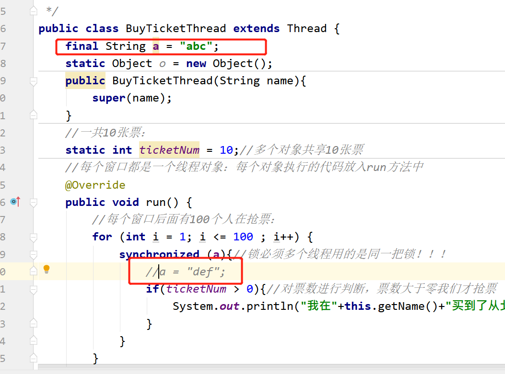

由于多线程的特性，由于多个线程互相抢占资源，可能会出现资源不可控的现象：

比如：抢票软件出现了 重票，错票。主要就是：多个线程，在争抢资源的过程中，导致共享的资源出现问题。一个线程还没执行完，另一个线程就参与进来了，开始争抢。

为此，我们需要对线程进行同步操作，也就是加锁。

## 同步代码块

### 语法

`synchronized (同步监视器){}`

### 代码

```java
public class BuyTicketThread implements Runnable {
    int ticketNum = 10;
    @Override
    public void run() {
        //此处有1000行代码
        for (int i = 1; i <= 100 ; i++) {
            synchronized (this){//把具有安全隐患的代码锁住即可，如果锁多了就会效率低 --》this就是这个锁
                if(ticketNum > 0){
                    System.out.println("我在"+Thread.currentThread().getName()+"买到了北京到哈尔滨的第" + ticketNum-- + "张车票");
                }
            }
        }
        //此处有1000行代码
    }
}
```

### 关于同步监视器

1.  必须是引用数据类型，不能是基本数据类型
2.  也可以创建一个专门的同步监视器，没有任何业务含义
3.  一般使用共享资源做同步监视器即可
4.  在同步代码块中不能改变同步监视器对象的引用
5.  尽量不要String和包装类Integer做同步监视器
6.  建议使用final修饰同步监视器
7.  也可以利用反射的原理，使用 `类名.class `字节码作为同步监视器



#### 执行过程

1.  第一个线程来到同步代码块，发现同步监视器open状态，需要close,然后执行其中的代码
2.  第一个线程执行过程中，发生了线程切换（阻塞 就绪），第一个线程失去了cpu，但是没有开锁open
3.  第二个线程获取了cpu，来到了同步代码块，发现同步监视器close状态，无法执行其中的代码，第二个线程也进入阻塞状态
4.  第一个线程再次获取CPU,接着执行后续的代码；同步代码块执行完毕，释放锁open
5.  第二个线程也再次获取cpu，来到了同步代码块，发现同步监视器open状态，拿到锁并且上锁，由阻塞状态进入就绪状态，再进入运行状态，重复第一个线程的处理过程（加锁）
6.  建议使用final修饰同步监视器

#### 注意

1.  同步代码块中能发生CPU的切换吗？能！！！ 但是后续的被执行的线程也无法执行同步代码块（因为锁仍旧close）
2.  多个代码块使用了同一个同步监视器（锁），锁住一个代码块的同时，也锁住所有使用该锁的所有代码块，其他线程无法访问其中的任何一个代码块
3.  多个代码块使用了同一个同步监视器（锁），锁住一个代码块的同时，也锁住所有使用该锁的所有代码块， 但是没有锁住使用其他同步监视器的代码块，其他线程有机会访问其他同步监视器的代码块

### 同步方法

#### 语法

`public static synchronized void buyTicket(){}`

#### 代码

```java
public class BuyTicketThread extends Thread {
    public BuyTicketThread(String name){
        super(name);
    }
    //一共10张票：
    static int ticketNum = 10;//多个对象共享10张票
    //每个窗口都是一个线程对象：每个对象执行的代码放入run方法中
    @Override
    public void run() {
        //每个窗口后面有100个人在抢票：
        for (int i = 1; i <= 100 ; i++) {
            buyTicket();
        }
    }
    public static synchronized void buyTicket(){//锁住的  同步监视器： BuyTicketThread.class
        if(ticketNum > 0){//对票数进行判断，票数大于零我们才抢票
            System.out.println("我在"+Thread.currentThread().getName()+"买到了从北京到哈尔滨的第" + ticketNum-- + "张车票");
        }
    }
}
```

#### 注意

1.  不要将`run()`定义为同步方法
2.  非静态同步方法的同步监视器是this，静态同步方法的同步监视器是 `类名.class` 字节码信息对象
3.  同步代码块的效率要高于同步方法，因为：同步方法是将线程挡在了方法的外部，而同步代码块锁将线程挡在了代码块的外部，但是却是方法的内部
4.  同步方法的锁是this，一旦锁住一个方法，就锁住了所有的同步方法；同步代码块只是锁住使用该同步监视器的代码块，而没有锁住使用其他监视器的代码块

### Lock锁

JDK1.5后新增新一代的线程同步方式 :  **Lock锁，与采用synchronized相比，lock可提供多种锁方案，更灵活**

`synchronized`是Java中的关键字，这个关键字的识别是靠JVM来识别完成的，**是虚拟机级别**的。但是**Lock锁是API级别**的，提供了相应的接口和对应的实现类，这个方式更灵活，表现出来的性能优于之前的方式

#### 相关概念

##### Condition等待池

Condition是在Java 1.5中才出现的，它用来替代传统的Object的`wait()`、`notify()` 实现线程间的协作，相比使用Object的`wait()`、`notify()`，使用Condition的`await()`、`signal()`这种方式实现线程间协作更加安全和高效。

它能够更加精细的控制多线程的休眠与唤醒。对于同一个锁，我们可以创建多个Condition，在不同的情况下使用不同的Condition

一个`Condition`包含一个等待队列。一个`Lock`可以产生多个`Condition`，所以可以有多个等待队列。

在`Object`的监视器模型上，一个对象拥有一个同步队列和等待队列，而`Lock`（同步器）拥有一个同步队列和多个等待队列。​

Object中的`wait()`,`notify()`,`notifyAll()`方法是和"同步锁"(`synchronized关键字`)捆绑使用的；而`Condition`是需要与"`互斥锁`" / "`共享锁`" 捆绑使用的。

调用Condition的`await()`、`signal()`、`signalAll()`方法，都必须在lock保护之内，就是说必须在`lock.lock()`和`lock.unlock`之间才可以使用

-   Conditon中的await()对应Object的wait()；
-   Condition中的signal()对应Object的notify()；
-   Condition中的signalAll()对应Object的notifyAll()。

> 注意 : 
> `await()`的线程在接到信号或被中断之前一直处于等待状态：
> 与此 Condition 相关的锁以原子方式释放，并且出于线程调度的目的，将禁用当前线程，且在发生以下四种情况之一 以前，当前线程将一直处于休眠状态：
> 1.  其他某个线程调用此 Condition 的 `signal() 方法`，并且碰巧将当前线程选为被唤醒的线程；
> 2.  其他某个线程调用此 Condition 的 `signalAll() 方法`；
> 3. 其他某个线程`中断当前线程`，且支持`中断线程`的挂起；
> 4. 发生“`虚假唤醒`”

#### 语法

`Lock lock = new ReentrantLock();`

#### API

##### Lock锁的API

| API                                               | 说明                              |
| ------------------------------------------------- | ------------------------------- |
| `ReentrantLock()`                             | 构造方法，默认不开启公平策略                  |
| `ReentrantLock(boolean fair)`                 | 构造方法，是否开启公平策略，true 开始 false 不开启 |
| `void lock()`                                 | 获得锁                             |
| `void unlock()`                               | 释放此锁                            |
| `Condition newCondition()`                    | 创建等待池                           |
| `final int getQueueLength()`                  | 返回等待获取此锁的线程数的估计值                |
| `boolean hasWaiters(Condition condition)`     | 查询是否有线程正在等待与此锁                  |
| `int getWaitQueueLength(Condition condition)` | 返回在与此锁相关的给定条件上等待的线程数的估计值        |

##### Condition 等待池的API

| API                                           | 说明                                                                |
| --------------------------------------------- | ----------------------------------------------------------------- |
| `void await()`                            | 当前线程放入等待池，直到收到信号或被中断                                              |
| `boolean await(long time, TimeUnit unit)` | 导致当前线程等待，直到发出信号或中断，或指定的等待时间结束。&#xA;Time→等待的最大时间单位  unit → 参数的时间单位 |
| `boolean awaitUntil(Date deadline)`       | 导致当前线程等待，直到收到信号或中断，或超过指定的截止日期。&#xA;deadline → 等待的绝对时间             |
| `void signal()`                           | 唤醒一个等待的线程                                                         |
| `void signalAll()`                        | 唤醒所有等待的线程                                                         |

#### 代码

```java
public class BuyTicketThread implements Runnable {
    int ticketNum = 10;
    //拿来一把锁：
    Lock lock = new ReentrantLock();//多态  接口=实现类  可以使用不同的实现类
    @Override
    public void run() {
        //此处有1000行代码
        for (int i = 1; i <= 100 ; i++) {
            //打开锁：
            lock.lock();
            try{
                if(ticketNum > 0){
                    System.out.println("我在"+Thread.currentThread().getName()+"买到了北京到哈尔滨的第" + ticketNum-- + "张车票");
                }
            }catch (Exception ex){
                ex.printStackTrace();
            }finally {
                //关闭锁：--->即使有异常，这个锁也可以得到释放
                lock.unlock();
            }
        }
        //此处有1000行代码
    }
}
```

#### Lock和synchronized的区别

1.  Lock是显式锁（手动开启和关闭锁，别忘记关闭锁），synchronized是隐式锁
2.  Lock只有代码块锁，synchronized有代码块锁和方法锁
3.  使用Lock锁，JVM将花费较少的时间来调度线程，性能更好。并且具有更好的扩展性（提供更多的子类）

### 线程同步的优缺点

优先使用：Lock----同步代码块（已经进入了方法体，分配了相应资源）----同步方法（在方法体之外）

#### 优点

1.  线程安全，效率低

#### 缺点

1.  线程不安全，效率高
2.  可能造成死锁
    1.  不同的线程分别占用对方需要的同步资源不放弃，都在等待对方放弃自己需要的同步资源，就形成了线程的死锁
    2.  出现死锁后，不会出现异常，不会出现提示，只是所有的线程都处于阻塞状态，无法继续

> 避免死锁：
减少同步资源的定义，避免嵌套同步
