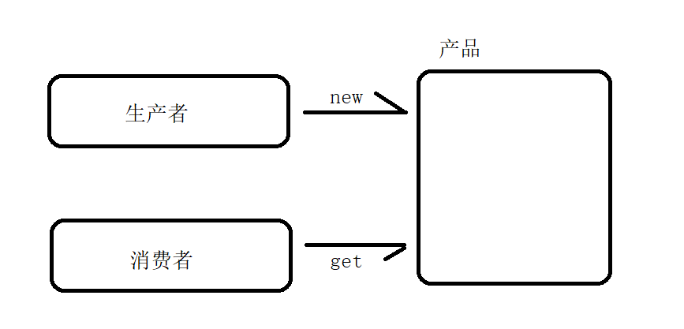
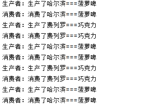
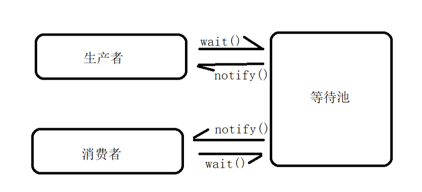

## 需求

我们来模拟开发者常见的生产者和消费者模式，我们需要生产者创建指定类的对象，消费者访问这个类的对象。两者有序交替执行，





## 注意点

1.  生产者和消费者之间需要保证线程的同步，我们需要采用同步锁的方式
2.  注意同步监视器的设置，我们可以将同步监视器设置为共同的对象资源

## 案例

### 使用synchronized的解决方案

> 注意点：
> 我们**不可以在线程里面使用同步代码块**，因为生产者和消费者是两个独立的线程，在使用线程阻塞的时候，我们拿到的锁也是独自的个体。所以我们需要在产品类中使用锁以及监视器

synchronized使用的**是一个等待池**，这样**只能对于一个生产者和一个消费者**使用时可以正常，如果**多个生产者和多个消费者**时，**还是会出现锁资源争抢的情况**。



产品类

```java
/**
 * 商品类
 */
public class Product {
	//品牌
	private String brand;
	//名字
	private String name;
	//状态 true 生产  false 消费
	private boolean locked = true;
	
	public Product() {}
	
	public Product(String brand, String name) {
		this.brand = brand;
		this.name = name;
	}
	
	public String getBrand() {
		return brand;
	}
	
	public void setBrand(String brand) {
		this.brand = brand;
	}
	
	public String getName() {
		return name;
	}
	
	public void setName(String name) {
		this.name = name;
	}
	
	public boolean isLocked() {
		return locked;
	}
	
	public void setLocked(boolean locked) {
		this.locked = locked;
	}
	
	/**
	 * 生产
	 */
	public synchronized void setProduct(String brand,String name){
		if (!this.isLocked()){
			try {
				wait();
			} catch (InterruptedException e) {
				throw new RuntimeException(e);
			}
		}
		
		this.brand = brand;
		this.name = name;
		System.out.println("生产者：生产了"+this.brand+"==="+this.name);
		
		this.setLocked(false);
		notify();
	}
	
	/**
	 * 消费
	 */
	public synchronized void getProduct(){
		if (this.isLocked()){
			try {
				wait();
			} catch (InterruptedException e) {
				throw new RuntimeException(e);
			}
		}
		
		System.out.println("消费者：消费了"+this.brand+"==="+this.name);
		
		this.setLocked(true);
		notify();
	}
}
```

生产者

```java
/**
 * 生产者
 */
public class ProducerThread extends Thread {
	private Product product;
	
	public ProducerThread(Product product) {
		this.product = product;
	}
	
	@Override
	public void run() {
		for (int i = 1; i <= 10; i++) {
			if (i%2==0){
				product.setProduct("费列罗","巧克力");
			}else {
				product.setProduct("哈尔滨","菠萝啤");
			}
		}
	}
}
```

消费者

```java
/**
 * 消费者
 */
public class CustomerThread extends Thread{
	private Product product;
	
	public CustomerThread(Product product) {
		this.product = product;
	}
	
	@Override
	public void run() {
		for (int i = 1; i <= 10; i++) {
			product.getProduct();
		}
	}
}
```

主线程

```java
public class TestDemo13 {
	public static void main(String[] args) {
		Product product = new Product();
		ProducerThread producerThread = new ProducerThread(product);
		CustomerThread customerThread = new CustomerThread(product);
		producerThread.start();
		customerThread.start();
	}
}
```

### 使用Lock的解决方案

对于多个消费者和多个生产者的情况，单一的等待池就不够用了。我们需要使用Lock锁去对应的构建独自的等待池：


产品类

```java
/**
 * 商品类
 */
public class Product {
	//品牌
	private String brand;
	//名字
	private String name;
	//状态 true 生产  false 消费
	private boolean locked = true;
	
	//使用Lock锁
	Lock lock = new ReentrantLock();
	//消费者等待池
	Condition produceCondition = lock.newCondition();
	Condition customerCondition = lock.newCondition();
	
	public Product() {}
	
	public Product(String brand, String name) {
		this.brand = brand;
		this.name = name;
	}
	
	public String getBrand() {
		return brand;
	}
	
	public void setBrand(String brand) {
		this.brand = brand;
	}
	
	public String getName() {
		return name;
	}
	
	public void setName(String name) {
		this.name = name;
	}
	
	public boolean isLocked() {
		return locked;
	}
	
	public void setLocked(boolean locked) {
		this.locked = locked;
	}
	
	/**
	 * 生产
	 */
	public  void setProduct(String brand,String name){
		lock.lock();
		try {
			if (!this.isLocked()){
				try {
					//wait();
					produceCondition.await();
				} catch (InterruptedException e) {
					throw new RuntimeException(e);
				}
			}
			
			this.brand = brand;
			this.name = name;
			System.out.println("生产者：生产了"+this.brand+"==="+this.name);
			
			this.setLocked(false);
			//notify();
			customerCondition.signal();
		} finally {
			lock.unlock();
		}
	}
	/**
	 * 消费
	 */
	public synchronized void getProduct(){
		lock.lock();
		try {
			if (this.isLocked()){
				try {
					//wait();
					customerCondition.await();
				} catch (InterruptedException e) {
					throw new RuntimeException(e);
				}
			}
			
			System.out.println("消费者：消费了"+this.brand+"==="+this.name);
			
			this.setLocked(true);
			//notify();
			produceCondition.signal();
		} finally {
			lock.unlock();
		}
	}
}
```

生产者

```java
/**
 * 生产者
 */
public class ProducerThread extends Thread {
	private Product product;
	
	public ProducerThread(Product product) {
		this.product = product;
	}
	
	@Override
	public void run() {
		for (int i = 1; i <= 10; i++) {
			if (i%2==0){
				product.setProduct("费列罗","巧克力");
			}else {
				product.setProduct("哈尔滨","菠萝啤");
			}
		}
	}
}

```

消费者

```java
/**
 * 消费者
 */
public class CustomerThread extends Thread{
	private Product product;
	public CustomerThread(Product product) {
		this.product = product;
	}
	@Override
	public void run() {
		for (int i = 1; i <= 10; i++) {
			product.getProduct();
		}
	}
}
```

主线程

```java
public class TestDemo13 {
	public static void main(String[] args) {
		Product product = new Product();
		ProducerThread producerThread = new ProducerThread(product);
		CustomerThread customerThread = new CustomerThread(product);
		producerThread.start();
		customerThread.start();
	}
}
```
