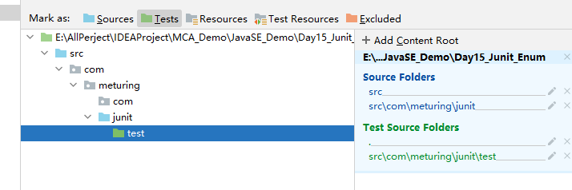
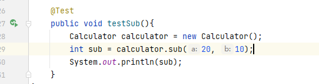
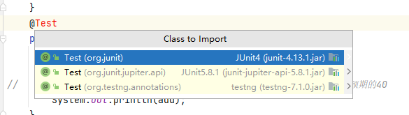
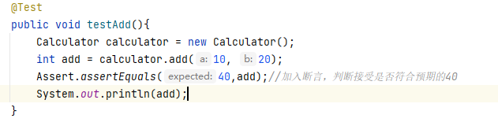

## 概念

Junit 测试的优点：
1.  测试不用在Main方法中执行
2.  无需注释其他的代码
3.  无需定义很多测试类，不会干扰原有代码

## 使用Junit单元测试

### 开发步骤

1.  创建独立的测试单元包，例如：公司域名倒着写+test
2.  创建测试类：xxxxTest
3.  设置当前包为Test包
    
4.  定义测试方法，使用@Test注解
    
5.  导入依赖Jar包
    
6.  执行测试单元获取结果，可加入断言Assert.assertEquals(a,b)
    

### 完整代码

功能类
```java
public class Calculator {
	public int add(int a ,int b){
		return  a + b;
	}
	
	public int sub(int a ,int b){
		return  a - b;
	}
}

```

测试类
```java
public class Test01 {
	@Test
	public void testAdd(){
		Calculator calculator = new Calculator();
		int add = calculator.add(10, 20);
		Assert.assertEquals(40,add);//加入断言，判断接受是否符合预期的40
		System.out.println(add);
	}
	
	@Test
	public void testSub(){
		Calculator calculator = new Calculator();
		int sub = calculator.sub(20, 10);
		Assert.assertEquals(0,sub);//加入断言，判断接受是否符合预期的40
		System.out.println(sub);
	}
}
```

## @Before @After

`@Before`
某一个方法中，加入了@Before注解以后，那么这个方法中的功能会在测试方法执行前先执行
一般会在@Beforer修饰的那个方法中加入：加入一些申请资源的代码：申请数据库资源，申请IO资源，申请网络资源。。。

`@After`
某一个方法中，加入了@After注解以后，那么这个方法中的功能会在测试方法执行后先执行
一般会在@After修饰的那个方法中加入：加入释放资源的代码：释放数据库资源，释放IO资源，释放网络资源。。

### 相关代码

功能类
```java
public class Calculator {
	public int add(int a ,int b){
		return  a + b;
	}
	
	public int sub(int a ,int b){
		return  a - b;
	}
}

```

测试类
```java
public class Test01 {
	@Before
	public void testBefore(){
		System.out.println("测试方法执行前先执行，通常用来申请资源");
	}
	
	@After
	public void testAfter(){
		System.out.println("测试方法执行后执行，通常用来释放资源");
	}
	@Test
	public void testAdd(){
		Calculator calculator = new Calculator();
		int add = calculator.add(10, 20);
		Assert.assertEquals(40,add);//加入断言，判断接受是否符合预期的40
		System.out.println(add);
	}
	
	@Test
	public void testSub(){
		Calculator calculator = new Calculator();
		int sub = calculator.sub(20, 10);
		Assert.assertEquals(0,sub);//加入断言，判断接受是否符合预期的40
		System.out.println(sub);
	}
}
```
