## 概念

JDK5.0 新增 ---  注解（Annotation）,也叫元数据

### 什么是注解

注解其实就是代码里的特殊标记，这些标记可以在编译,类加载,运行时被读取,并执行相应的处理。

通过使用注解,程序员可以在不改变原有逻辑的情况下，在源文件中嵌入一些补充信息。代码分析工具、开发工具和部署工具可以通过这些补充信息进行验证或者进行部署。

使用注解时要在其前面增加@符号,并把该注解当成一个修饰符使用。用于修饰它支持的程序元素。

### 注解的重要性

Annotation 可以像修饰符一样被使用，可用于修饰包，类，构造器,方法，成员变量,参数，局部变量的声明，这些信息被保存在Annotation的"name=value"对中。

在JavaSE中，注解的使用目的比较简单，例如标记过时的功能，忽略警告等。在JavaEE/ArIdroid中注解占据了更重要的角色，例如用来配置应用程序的任何切面，代替JavaEE旧版中所遗留的繁冗代码和XML配置等。

未来的开发模式都是基于注解的，JPA(java的持久化API)是基于注解的，Spring2.5以后都是基于注解的，Hibernate3.x以后也是基于注解的，现在的Struts2有一部分也是基于注解的了，注解是一种趋势，一定程度上可以说 ：框架=注解+反射+设计模式。

## Junit 注解

`@Before` `@After` `@Test`

## 文档注解

**说明注释**允许你在程序中嵌入关于程序的信息。你可以使用 **javadoc** 工具软件来生成信息，并输出到HTML文件中。
说明注释，使你更加方便的记录你的程序信息。

**文档注解**我们一般使用在文档注释中，配合javadoc工具

#### 常见的文档注解

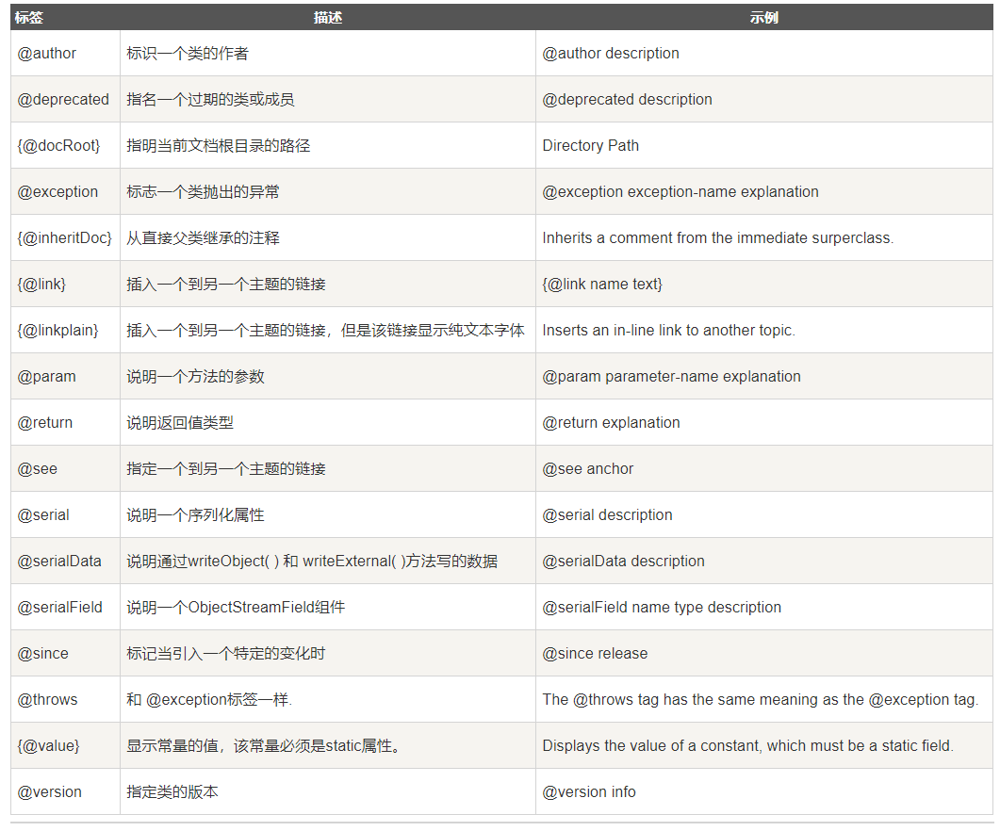

> 其中注意 ：
> 1. @param @return和@exception这三个标记都是只用于方法的。
> 2. @param的格式要求: @param 形参名 形参类型 形参说明
> 3. @return的格式要求: @return 返回值类型返回值说明，如果方法的返回值类型是void就不能写
> 4. @exception的格式要求: @exception 异常类型异常说明
> 5. @param和@exception可以并列多个


### 代码案例

```java
/**
 * @author : meturing
 * @version : 1.0
 */
public class Person {
	/**
	 * 下面是eat方法，实现了XXX功能。
	 * @param num1 就餐人数
	 * @param num2 点了几个菜
	 */
	public void eat(int num1,int num2){
	}
	/**
	 * @param age 年龄
	 * @return int
	 * @exception RuntimeException 当年龄过大的时候
	 * @exception IndexOutOfBoundsException 当年龄过小的时候
	 * @see Student
	 */
	public int sleep(int age){
		new Student();
		if(age>100){
			throw new RuntimeException();
		}
		if(age<0){
			throw new IndexOutOfBoundsException();
		}
		return 10;
	}
}
```

### IDEA的javadoc工具的使用

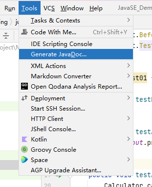

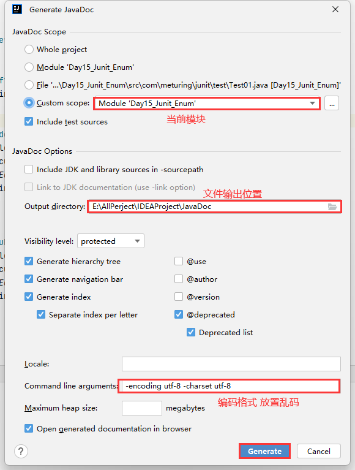

## JDK内置注解

### @Override

限定重写父类方法，该注解只能用于方法

```java
public class Person {
	public void eat(){
		System.out.println("父类eat..");
	}
}
```

```java
public class Student extends Person {
	/*
	@Override的作用：限定重写的方法，只要重写方法有问题，就有错误提示。
	 */
	@Override
	public void eat(){
		System.out.println("子类eat..");
	}
}
```

### @Deprecated

 用于表示所修饰的元素(类,方法，构造器，属性等)已过时

```java
public class Student extends Person {
	/*
	@Override的作用：限定重写的方法，只要重写方法有问题，就有错误提示。
	 */
	@Override
	public void eat(){
		System.out.println("子类eat..");
	}
	/*
	在方法前加入@Deprecated，这个方法就会变成一个废弃方法/过期方法/过时方法
	 */
	@Deprecated
	public void study(){
		System.out.println("学习。。");
	}
}
```

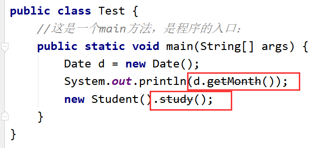

### @SuppressWarnings

抑制编译器警告

```java
public class Test02 {
	//这是一个main方法，是程序的入口：
	public static void main(String[] args) {
		@SuppressWarnings("unused")
		int age = 10;
		
		int num = 10;
		System.out.println(num);
		@SuppressWarnings({"unused","rwatypes"})
		ArrayList al = new ArrayList();
	}
}
```

## 简化配置文件

### 在servlet3.0之前的配置

```java
public class HelloServlet implements Servlet {
	@Override
	public void init(ServletConfig servletConfig) throws ServletException {}
	
	@Override
	public ServletConfig getServletConfig() {return null;}
	
	@Override
	public void service(ServletRequest servletRequest, ServletResponse servletResponse) throws ServletException, IOException {
		System.out.println("service方法被调用了...");
	}
	
	@Override
	public String getServletInfo() {return null;}
	
	@Override
	public void destroy() {}
}
```

```xml
<?xml version="1.0" encoding="UTF-8"?>
<web-app xmlns="http://xmlns.jcp.org/xml/ns/javaee"
		 xmlns:xsi="http://www.w3.org/2001/XMLSchema-instance"
		 xsi:schemaLocation="http://xmlns.jcp.org/xml/ns/javaee http://xmlns.jcp.org/xml/ns/javaee/web-app_4_0.xsd"
		 version="4.0">
	<!--配置Servlet-->
	<!--配置Servlet的信息-->
	<servlet>
		<servlet-name>HelloServlet</servlet-name>
		<servlet-class>com.bjsxt.servlet.HelloServlet</servlet-class>
	</servlet>
	<!--配置Servlet的映射路径-->
	<servlet-mapping>
		<servlet-name>HelloServlet</servlet-name>
		<!--http://localhost:8080/01-hello-servlet/hello-->
		<url-pattern>/hello</url-pattern>
	</servlet-mapping>
</web-app>
```

### servlet3.0之后使用注解

```java
@WebServlet("/hello")
public class HelloServlet implements Servlet {
	@Override
	public void init(ServletConfig servletConfig) throws ServletException { }
	
	@Override
	public ServletConfig getServletConfig() { return null; }
	
	/**
	* 用于提供服务, 接收请求, 处理响应
	*
	* @param servletRequest
	* @param servletResponse
	* @throws ServletException
	* @throws IOException
	*/
	@Override
	public void service(ServletRequest servletRequest, ServletResponse servletResponse) throws ServletException, IOException {
		System.out.println("service方法被调用了...");
	}
	
	@Override
	public String getServletInfo() { return null; }
	
	@Override
	public void destroy() {}
}
```

## 自定义注解

### 创建自定义注解

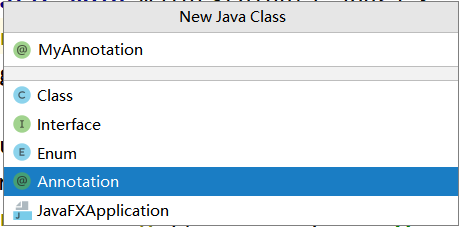

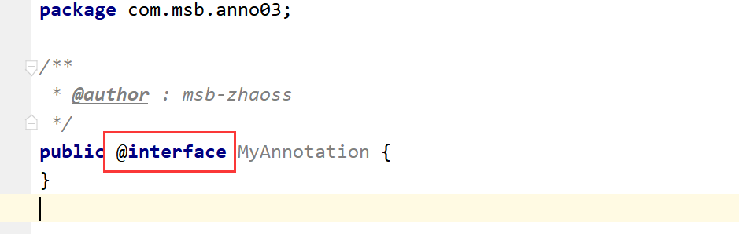

> 注解并不是创建了接口，是`@interface`，跟接口没有一点关系

### 可以省略的元素

#### 省略value

如果自定义注解**只有一个参数**，使用时`可以省略value`

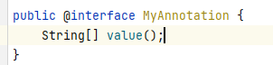

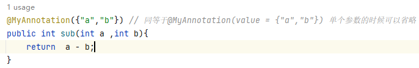

#### 设略赋值

如果自定义注解内部参数**自带默认值**，使用时`可以不赋值`

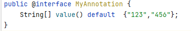

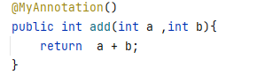

> 如果自定义注解**没有参数**，那么实际上**只是个标记**，只有**有参数的才是元注解**

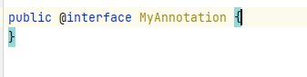

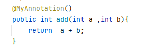

## 元注解

元注解是用于修饰其它注解的注解

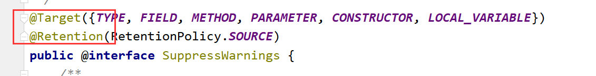

JDK5.0提供了四种元注解：`Retention`, `Target`, `Documented`, `Inherited`

### @Retention

用于修饰注解，**用于指定修饰的那个注解的生命周期**，@Rentention包含一个RetentionPolicy枚举类型的成员变量,使用@Rentention时必须为该value成员变量指定值:

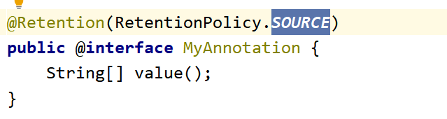

**`RetentionPolicy.SOURCE`**:  在源文件中有效(即源文件保留),编译器直接丢弃这种策略的注释，在.class文件中不会保留注解信息

**`RetentionPolicy.CLASS`**:   在class文件中有效(即class保留)，保留在.class文件中，但是当运行Java程序时，他就不会继续加载了，不会保留在内存中，JVM不会保留注解。**如果注解没有加Retention元注解，那么相当于默认的注解就是这种状态。**

**`RetentionPolicy.RUNTIME`**:   在运行时有效(即运行时保留),当运行 Java程序时，JVM会保留注释，加载在内存中了，那么程序可以通过反射获取该注释。

### @Target

用于修饰注解的注解，用于指定被修饰的注解能用于修饰哪些程序元素。@Target也包含一个名为value的成员变量。

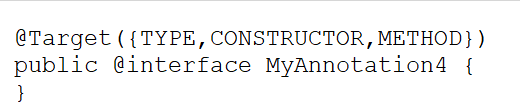

CONSTRUCTOR 表示可以在类上使用  METHOD表示可以在方法上使用  未注明的则不可以使用

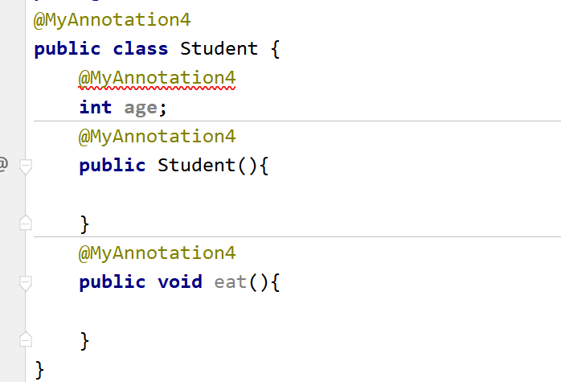

### @Documented(很少用）

用于指定被该元注解修饰的注解类将被javadoc工具提取成文档。默认情况下，javadoc是 不包括注解的，但是加上了这个注解生成的文档中就会带着注解了

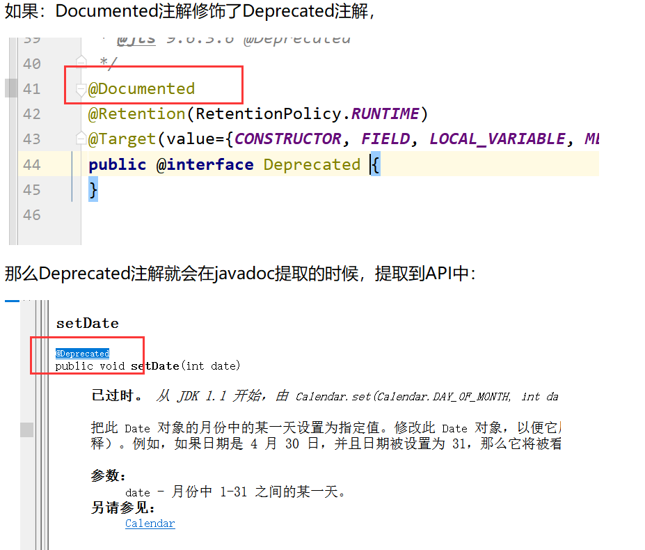

### @Inherited(极少用）

被它修饰的Annotation将具有继承性。如果某个类使用了被@Inherited修饰的Annotation,则其子类将自动具有该注解。

如果MyAnno注解使用了@Inherited之后，就具备了继承性，那么相当于子类Student也使用了这个MyAnno

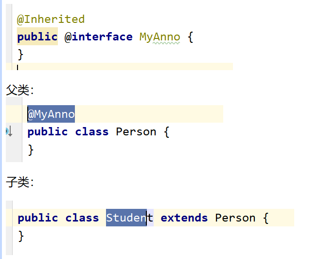
