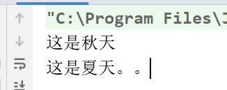

### 概念

在java中，类的对象是有限个，确定的。这个类我们可以定义为枚举类。

### 枚举的使用

#### JDK1.5之前

```java
public class Season {
    //属性：
    private final String seasonName ;//季节名字
    private final String seasonDesc ;//季节描述
    //利用构造器对属性进行赋值操作：
    //构造器私有化，外界不能调用这个构造器，只能Season内部自己调用
    private Season(String seasonName,String seasonDesc){
        this.seasonName = seasonName;
        this.seasonDesc = seasonDesc;
    }
    //提供枚举类的有限的  确定的对象：
    public static final Season SPRING = new Season("春天","春暖花开");
    public static final Season SUMMER = new Season("夏天","烈日炎炎");
    public static final Season AUTUMN = new Season("秋天","硕果累累");
    public static final Season WINTER = new Season("冬天","冰天雪地");
    //额外因素：
    public String getSeasonName() {
        return seasonName;
    }
    public String getSeasonDesc() {
        return seasonDesc;
    }
    //toString();
    @Override
    public String toString() {
        return "Season{" +
                "seasonName='" + seasonName + '\'' +
                ", seasonDesc='" + seasonDesc + '\'' +
                '}';
    }
}
```

```java
public class TestSeason {
    //这是一个main方法，是程序的入口：
    public static void main(String[] args) {
        Season summer = Season.SUMMER;
        System.out.println(summer/*.toString()*/);
        System.out.println(summer.getSeasonName());
    }
}
```

#### JDK1.5之后

```java
public enum Season {
    //提供枚举类的有限的  确定的对象：--->enum枚举类要求对象（常量）必须放在最开始位置
    //多个对象之间用，进行连接，最后一个对象后面用;结束
    SPRING("春天","春暖花开"),
    SUMMER("夏天","烈日炎炎"),
    AUTUMN("秋天","硕果累累"),
    WINTER("冬天","冰天雪地");
    //属性：
    private final String seasonName ;//季节名字
    private final String seasonDesc ;//季节描述
    //利用构造器对属性进行赋值操作：
    //构造器私有化，外界不能调用这个构造器，只能Season内部自己调用
    private Season(String seasonName, String seasonDesc){
        this.seasonName = seasonName;
        this.seasonDesc = seasonDesc;
    }
    //额外因素：
    public String getSeasonName() {
        return seasonName;
    }
    public String getSeasonDesc() {
        return seasonDesc;
    }
    //toString();
    @Override
    public String toString() {
        return "Season{" +
                "seasonName='" + seasonName + '\'' +
                ", seasonDesc='" + seasonDesc + '\'' +
                '}';
    }
}
```

```java
public class TestSeason {
    //这是一个main方法，是程序的入口：
    public static void main(String[] args) {
        Season winter = Season.WINTER;
        System.out.println(winter);
        //enum关键字对应的枚举类的上层父类是 ：java.lang.Enum
        //但是我们自定义的枚举类的上层父类：Object
        System.out.println(Season.class.getSuperclass().getName());//java.lang.Enum
    }
}
```

在源码中经常看到别人定义的枚举类形态：

```java
public enum Season {
    SPRING,
    SUMMER,
    AUTUMN,
    WINTER;
}
```

为什么这么简单：因为这个枚举类底层没有属性，属性，构造器，toString，get方法都删掉不写了，然后案例来说应该
写为：SPRING()   现在连（）可以省略 就变成  SPRING
看到的形态就剩：常量名（对象名）

### 常用方法

```java
public class TestSeason {
    //这是一个main方法，是程序的入口：
    public static void main(String[] args) {
        //用enum关键字创建的Season枚举类上面的父类是：java.lang.Enum,常用方法子类Season可以直接拿过来使用：
        //toString();--->获取对象的名字
        Season autumn = Season.AUTUMN;
        System.out.println(autumn/*.toString()*/);//AUTUMN
        System.out.println("--------------------");
        //values:返回枚举类对象的数组
        Season[] values = Season.values();
        for(Season s:values){
            System.out.println(s/*.toString()*/);
        }
        System.out.println("--------------------");
        //valueOf：通过对象名字获取这个枚举对象
        //注意：对象的名字必须传正确，否则抛出异常
        Season autumn1 = Season.valueOf("AUTUMN");
        System.out.println(autumn1);
    }
}
```

### 枚举类实现接口

```java
public interface TestInterface {
    void show();
}
```

```java
public enum Season implements TestInterface {
    SPRING{
        @Override
        public void show() {
            System.out.println("这是春天。。。");
        }
    },
    SUMMER{
        @Override
        public void show() {
            System.out.println("这是夏天。。");
        }
    },
    AUTUMN{
        @Override
        public void show() {
            System.out.println("这是秋天");
        }
    },
    WINTER{
        @Override
        public void show() {
            System.out.println("这是冬天");
        }
    };
    /*@Override
    public void show() {
        System.out.println("这是Season....");
    }*/
}
```

```java
public class Test {
    //这是一个main方法，是程序的入口：
    public static void main(String[] args) {
        Season autumn = Season.AUTUMN;
        autumn.show();
        Season summer = Season.SUMMER;
        summer.show();
    }
}
```



### 实际应用

```java
public class Test02 {
    //这是一个main方法，是程序的入口：
    public static void main(String[] args) {
        Gender sex = Gender.男;
        //switch后面的（）中可以传入枚举类型
        //switch后面的（）:int,short,byte,char,String ,枚举
        switch (sex){
            case 女:
                System.out.println("是个女孩");
                break;
            case 男:
                System.out.println("是个男孩");
                break;
        }
    }
}
```
