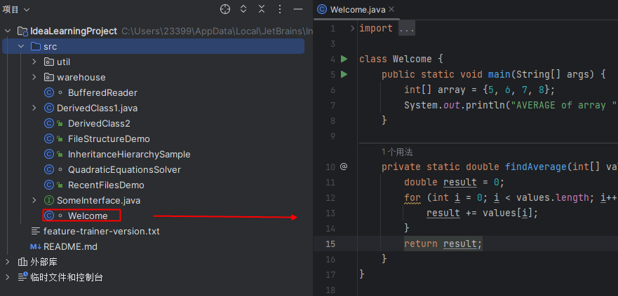
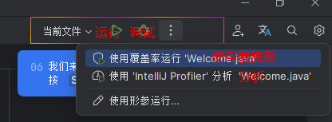
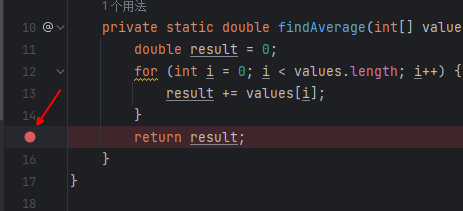
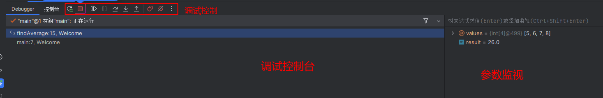
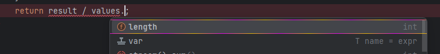
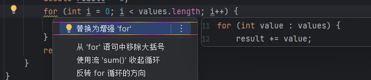
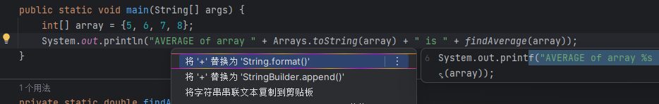
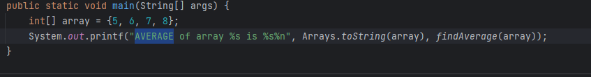
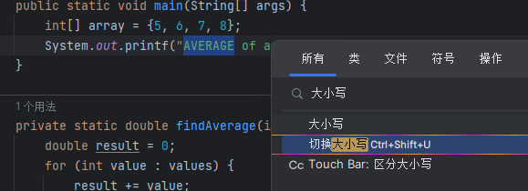

## 运行与调试

### 项目视图

项目视图是主要工具窗囗之一 。 它包含页目目录 、 SDK 特定的外部库和临时文件 。

点击图标或者按 `AIt + 1` 快速打开 。

点击对应的源码文件,即可打开编辑框视图

第一次打开项目时，IntelliJ IDEA会扫描JDK和项目本身，以收集编码辅助所需的详细信息。要继续：请等待索引完成。

### 运行项目

在高亮显示的组件中，您可以看到所选配置的常用运行操作

点击`三角图标`或使用`Shift F10`快速运行项目

### 调试项目

当程序发生错误时,可以点击行号下断点调试

我们次啊是可以看到调试控制台的展示

## 快速提醒

IDEA在您使用`.`时会自动触发自动提示功能,也可以使用`ALT + / `来在代码任意部分触发提示

## 警告预览与意图

IDEA将高亮显示可以改进的代码行，并为这些行添加黄色灯泡。按`Alt + Enter`可以打开警告预览进行修复

意图也可以节省您的时间，让编码更轻松。
我们来使用意图重新格式化字符串串联。按`Alt + Enter`显示可能的选项。

使用意图优化后

## 全局导航

`Ctrl+W`选中当前AVERAGE单次,按`两下Shift`,在弹出的窗口输入`大小写,`选择大小写即可快速`切换大小写`
也可以按照旁边的提示使用`Ctrl+Shift+U`快速切换

