## 扩展和收缩代码选区

按住`Ctrl+W`可以快速选则光标处的单次
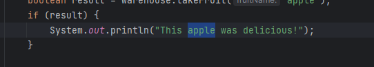

再次按住`Ctrl+W`可以选择整个字符串
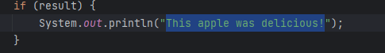

第三次按住`Ctrl+W`可以选择整个字符串和引号
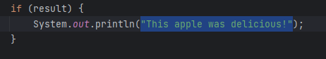

再次按住`Ctrl+W`两次可以选择整个引用
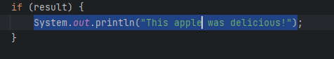

使用`Ctrl+Shift+W`可以搜索选中
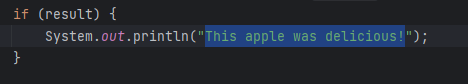

在代码块之前多点几次`Ctrl+W`可以选中代码块
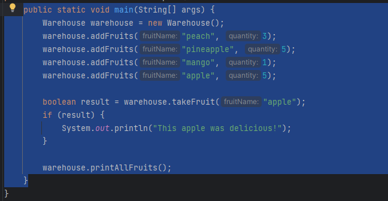

## 注释行和代码块

`Ctrl+/` 可以注释当前行,再次点击`Ctrl+/`则取消注释
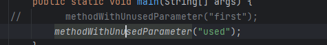

`Ctrl+Shit+/` 可以块注释,再次点击`Ctrl+Shit+/`则取消注释
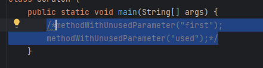

## 复制和删除行

`Ctrl+D`可以复制当前行

`Ctrl+Y`删除当前行

多行操作可以使用`Shift+↑` 或 `Shift+↓`

## 移动代码

移动当前行: `Alt+Shit+↑`向上一动  /  `Alt+Shit+↓` 向下移动

移动当前方法块: `Ctrl+Shit+↑`向上一动  /  `Ctrl+Shit+↓` 向下移动

## 收起/展开

当前代码块操作: `Ctrl + -` 收起代码块   /   `Ctrl + =` 展开代码块

全部代码块操作: `Ctrl + Shift + -` 收起代码块   /   `Ctrl + Shift + =` 展开代码块

## 包围和解包围

`Ctrl + Alt + T` 可以对当前代码进行包围操作,如:try-catch
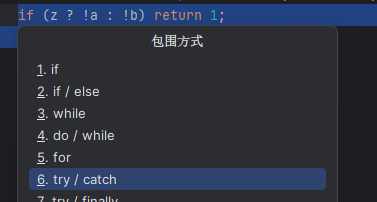

`Ctrl + Shift + Delete` 可以对当前代码进行解包操作,还原成原有状态
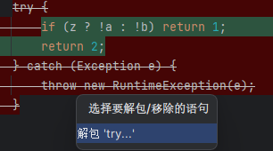

## 多选

`Alt+J `可以选中光标处的符号
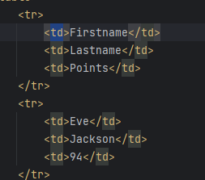

`Alt+J`多次可以选中多次当前匹配的符号
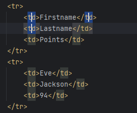

`Alt+Shift+J` 可以取消上一个选中
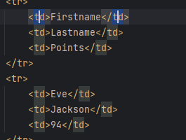

`Ctrl + Alt + Shift + J` 可以选中全部
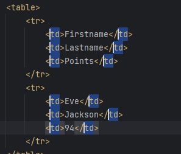