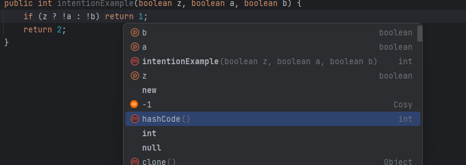

## 基本补全

默认情况下,IDEA中输入`.`会自动进行代码补全提醒,当然也可以使用`Alt+/` 进行激活提醒

`Ctrl + Shift + Enter` 可以对当前语句进行补全

连续两次 `Alt+/`可以对静态常量或方法进行提醒

## 类型匹配补全

`Ctrl + Shift + 空格` 自动补全上下文适用的提醒

## 后缀补全

对于已经键入的表达式,可以直接使用`.`的方法来进行补全操作

## 语句补全

`Ctrl + Shift + Enter` 可以对当前语句进行自动补全

## 使用Tab补全

`Alt + / ` 查看代码建议时,如果使用`Tab`选中,则直接替换当前标签

