## 重命名

`Shift + F6` 可以直接对当前变量进行改名

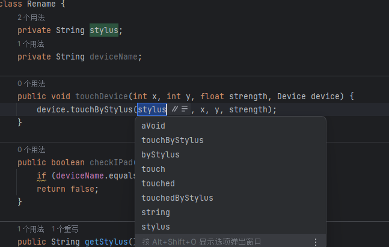

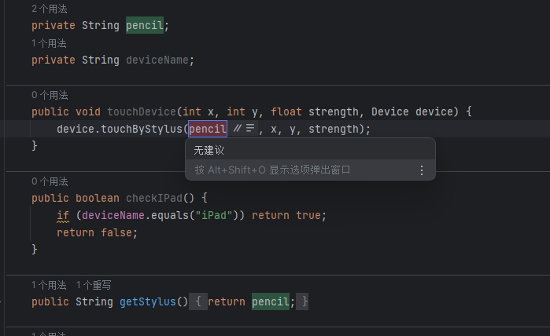

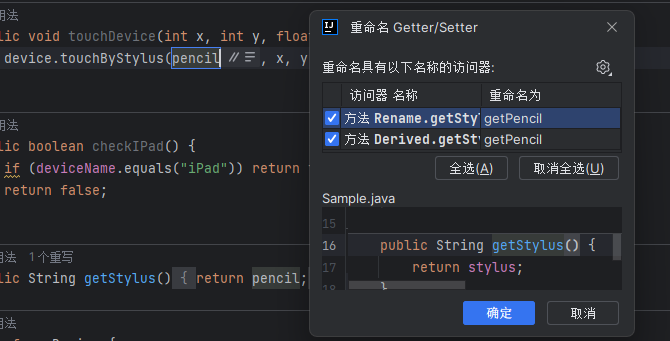

## 提取变量

`Ctrl + Alt + V` 提取变量

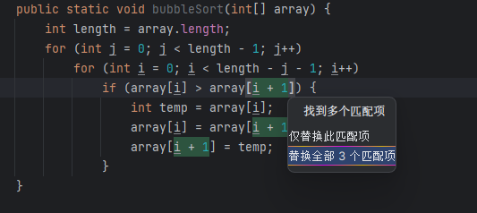

提取后

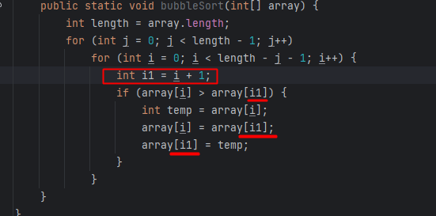

## 提取方法

`Ctrl + Alt + M` 提取代码段为方法

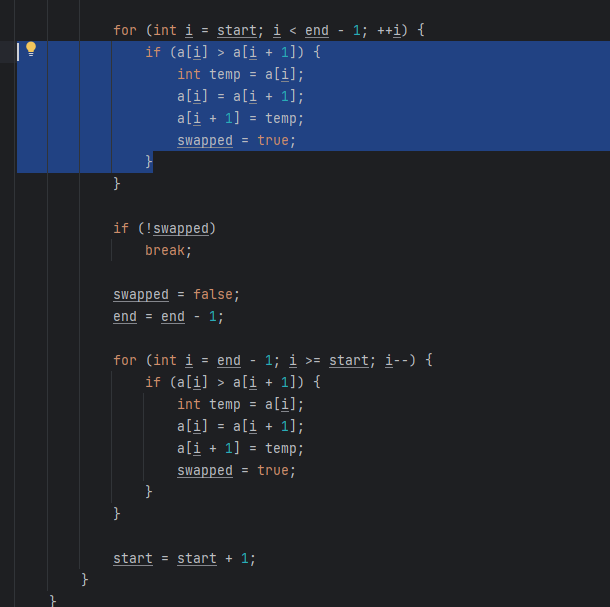

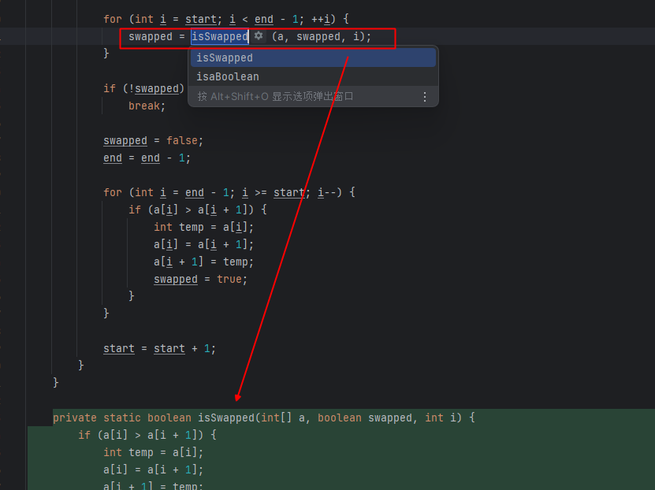

对于重复的代码会提醒一起替换
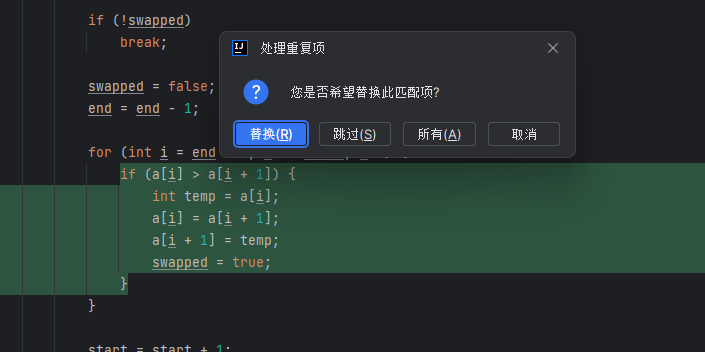

## 重构菜单

### 引入形参

`Ctrl + Alt + Shift + T` 选中引入形参
或者 `Ctrl + Alt + P `
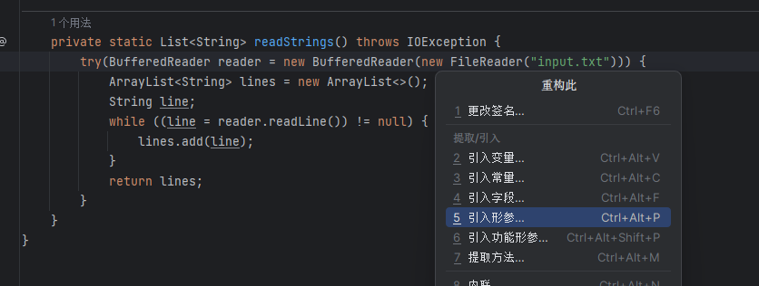

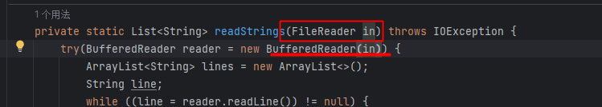

### 内联变量

`Ctrl + Alt + Shift + T` 选中内联变量
或者 `Ctrl + Alt + N `

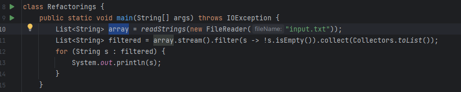

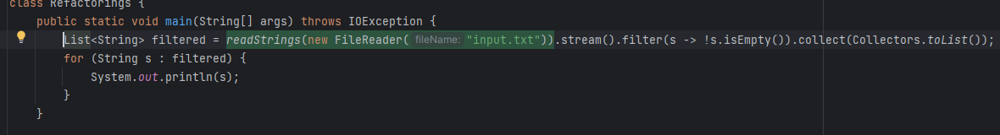

### 引入常量

`Ctrl + Alt + Shift + T` 选中引入常量
或者 `Ctrl + Alt + C `

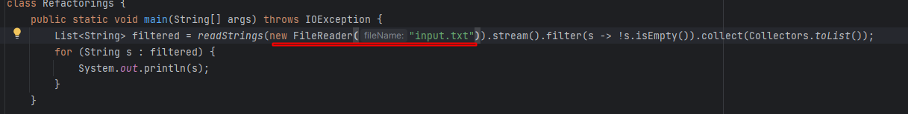

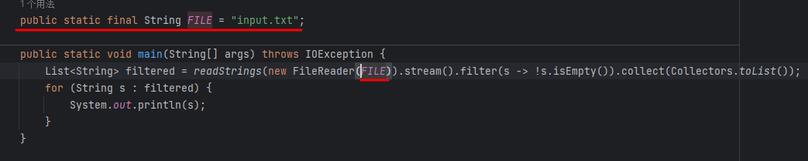

