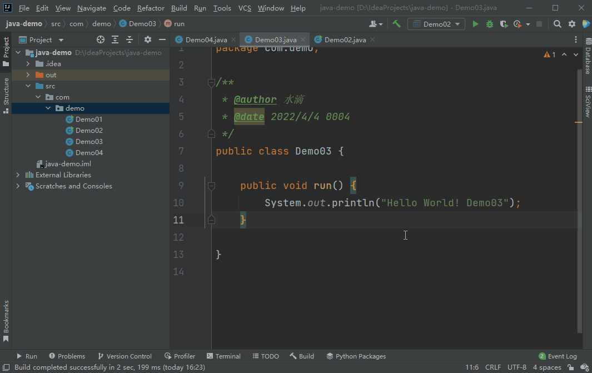

本文参考了 IntelliJ IDEA 的官网，列举了IntelliJ IDEA（Windows 版）的所有快捷键。并在此基础上，为 90% 以上的快捷键提供了动图演示，能够直观的看到操作效果。  

该快捷键共分 16 种，可以方便的按各类查找自己需要的快捷键~~

## 构建/编译

### Ctrl + F9 ：构建项目

> 该快捷键，等同于菜单【Build】—>【Build Project】

执行该命令后，IntelliJ IDEA 会编译项目中所有类，并将编译结果输出到`out`目录中。IntelliJ IDEA 支持增量构建，会在上次构建的基础上，仅编译修改的类。

### Ctrl + Shift + F9 ：重新编译当前类

> 该快捷键，等同于菜单【Build】—>【Recompile ‘class name’】

在IntelliJ IDEA 中打开要编译的类，执行该命令会编译当前类。

## 文本编辑

### Ctrl + X：剪切

剪切选中文本，若未选中则剪切当前行。

### Ctrl + C：复制

复制选中文本，若未选中则复制当前行。
### Ctrl + V：粘贴

### Ctrl + Alt + Shift + V：粘贴为纯文本

### Ctrl + Shift + V：从历史选择粘贴

