## 第三章：Maven的使用

### 3.1 安装Maven核心程序

1）检查JAVA\_HOME环境变量。Maven是使用Java开发的，所以必须知道当前系统环境中JDK的安装目录。

```java
C:\Windows\System32>echo %JAVA_HOME%
D:\Java\jdk1.8.0_111
```

2）解压Maven的核心程序。将apache-maven-3.2.2-bin.zip解压到一个**非中文无空格**的目录下。例如：

```java
D:\apache-maven-3.2.2
```

3）配置环境变量。

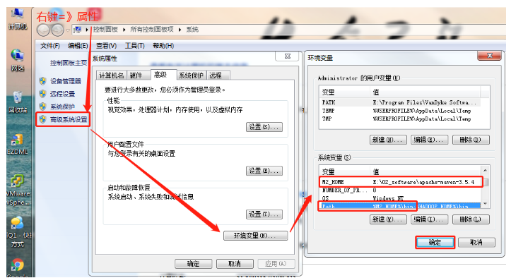

（1）在系统变量里面创建M2\_HOME变量，并赋值

```java
变量：M2_HOME
值：D:\apache-maven-3.2.2
```

（2）在Path变量中，添加maven环境变量

```java
变量：Path
值：%M2_HOME%\bin或D:\apache-maven-3.2.2\bin
```

4）查看Maven版本信息验证安装是否正确

（1）按Win +r，进入电脑运行模式；

（2）在打开里面输入：cmd

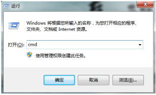

（3）在管理员窗口输入

C:\Users\Administrator>mvn -v

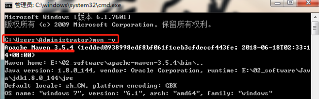

### 3.2  Maven的本地仓库配置

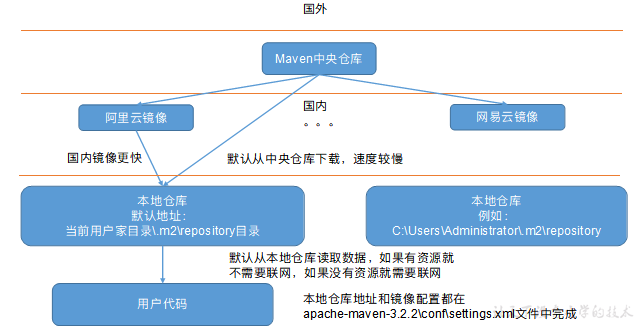

（1）Maven默认的本地仓库：\~\\.m2\repository目录。

`说明：~表示当前用户的家目录。`

（2）Maven的核心配置文件位置：

`解压目录D:\apache-maven-3.2.2\conf\settings.xml`

（3）本地仓库地址更改到E:\LocalRepository，默认在C:\Users\Administrator\\.m2\repository

```java
<localRepository>E:\LocalRepository</localRepository>
```

（4）配置阿里云镜像（下载速度快）

```java
<mirror>
    <id>nexus-aliyun</id>
    <mirrorOf>central</mirrorOf>
    <name>Nexus aliyun</name>
    <url>http://maven.aliyun.com/nexus/content/groups/public</url>
</mirror>
```

### 3.3  在IDEA中配置Maven

1）close project所有项目后，回到如下页面，点击右下角的Configure=》点击setting

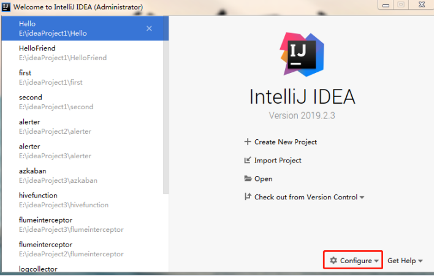

2）设置Maven的安装目录及本地仓库

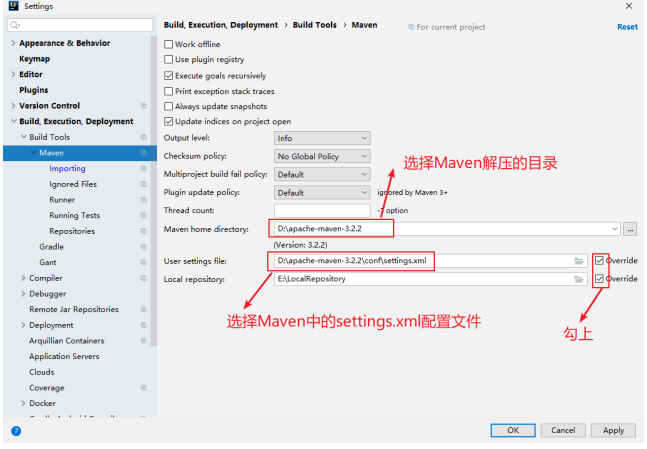

Ø**Maven home directory**： 可以指定本地 Maven 的安装目录所在，因为我已经配置了M2\_HOME系统参数，所以直接这样配置IntelliJ IDEA是可以找到的。但是假如你没有配置的话，这里可以选择你的Maven安装目录。此外，这里不建议使用IDEA默认的。

Ø **User settings file / Local repository**：我们还可以指定 Maven 的 settings.xml 位置和本地仓库位置。

3\)  配置Maven自动导入依赖的jar包

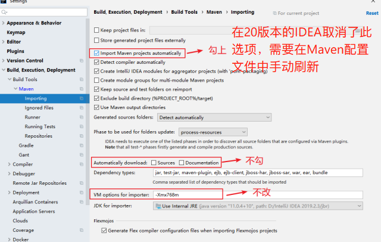

Ø `Import Maven projects automatically：`表示 IntelliJ IDEA 会实时监控项目的 pom.xml 文件，进行项目变动设置，勾选上。

Ø `Automatically download`：在 Maven 导入依赖包的时候是否自动下载源码和文档。默认是没有勾选的，也不建议勾选，原因是这样可以加快项目从外网导入依赖包的速度，如果我们需要源码和文档的时候我们到时候再针对某个依赖包进行联网下载即可。IntelliJ IDEA 支持直接从公网下载源码和文档的。

Ø` VM options for importer`：可以设置导入的VM参数。一般这个都不需要主动改，除非项目真的导入太慢了我们再增大此参数。

### 3.4  创建Maven程序

#### 3.4.1  创建项目

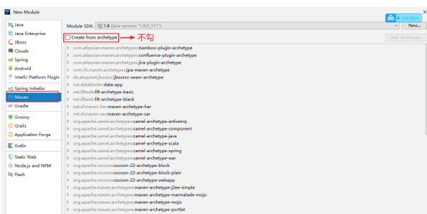

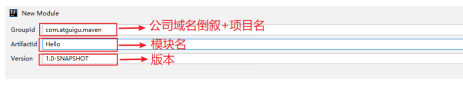

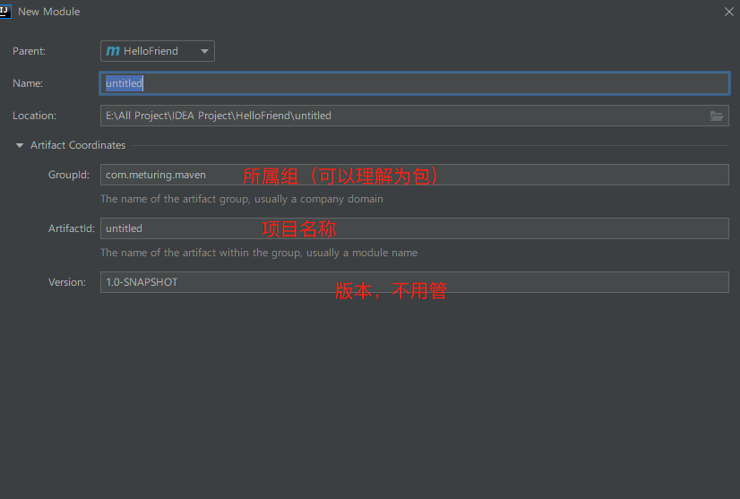

#### 3.4.2  项目结构

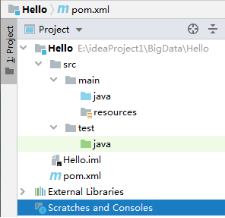

Ø main目录用于存放主程序。

Ø java目录用于存放源代码文件。

Ø resources目录用于存放配置文件和资源文件。

Ø test目录用于存放测试程序。

#### 3.4.3  配置Maven的核心配置文件pom.xml

```xml
<?xml version="1.0" encoding="UTF-8"?>
<project xmlns="http://maven.apache.org/POM/4.0.0"
         xmlns:xsi="http://www.w3.org/2001/XMLSchema-instance"
         xsi:schemaLocation="http://maven.apache.org/POM/4.0.0 http://maven.apache.org/xsd/maven-4.0.0.xsd">
    <modelVersion>4.0.0</modelVersion>

    <!--当前的Maven模块的坐标信息-->
    <groupId>maven</groupId>
    <artifactId>Hello</artifactId>
    <version>1.0-SNAPSHOT</version>

    <!--添加依赖-->
    <dependencies>
        <!--junit的依赖坐标-->
        <dependency>
            <groupId>junit</groupId>
            <artifactId>junit</artifactId>
            <version>4.12</version>
            <!--
                scope标签决定了当前依赖的生效范围 main和test
                如果不写，默认是compile，表示主程序和测试程序都生效

                如果设置成provided的话，则表示
                主程序和测试程序都生效且实时加载
            -->
            <scope>test</scope>

        </dependency>
    </dependencies>
</project>
```

#### 3.4.4  Maven的命令

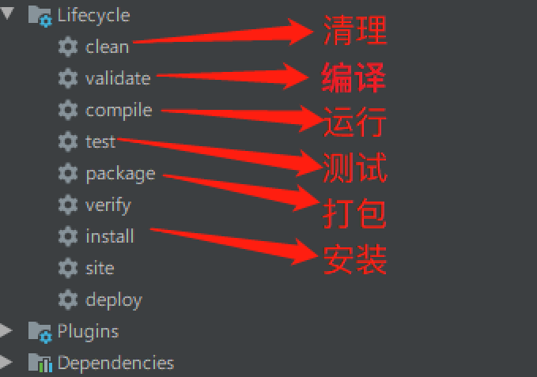
