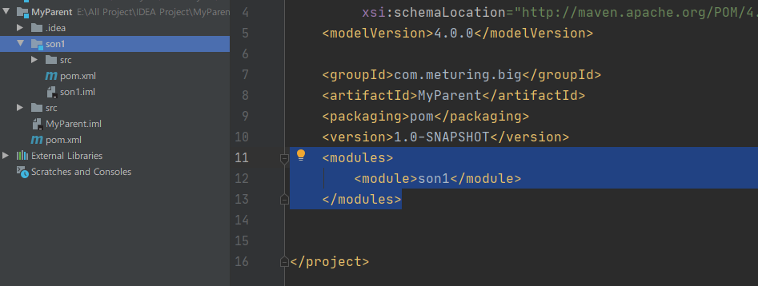

## 第五章  继承

> **使用继承机制就可以将这样的依赖信息统一提取到父工程模块中进行统一管理**

### 方式一：dependencyManagement标签

第一步：配置父类的Module修改pom.xml

**项目中的dependencies标签，用dependencyManagement标签括起来**

```xml
 <?xml version="1.0" encoding="UTF-8"?>
<project xmlns="http://maven.apache.org/POM/4.0.0"
         xmlns:xsi="http://www.w3.org/2001/XMLSchema-instance"
         xsi:schemaLocation="http://maven.apache.org/POM/4.0.0 http://maven.apache.org/xsd/maven-4.0.0.xsd">
    <modelVersion>4.0.0</modelVersion>
    <groupId>com.meturing.maven</groupId>
    <artifactId>mavenDemo01</artifactId>
    <version>1.0-SNAPSHOT</version>
    <!--
        挂载父类打包的类型
        默认是jar包   jar/pom/war
      -->
    <packaging>pom</packaging>
    <!--统一管理依赖的版本-->
    <dependencyManagement>
        <dependencies>
            <dependency>
                <groupId>junit</groupId>
                <artifactId>junit</artifactId>
                <version>4.13</version>
            </dependency>
        </dependencies>
    </dependencyManagement>

</project>
```

第二步：在子类的Module修改pom.xml

重新指定需要的依赖，**删除范围和版本号**
```xml
<?xml version="1.0" encoding="UTF-8"?>
<project xmlns="http://maven.apache.org/POM/4.0.0"
         xmlns:xsi="http://www.w3.org/2001/XMLSchema-instance"
         xsi:schemaLocation="http://maven.apache.org/POM/4.0.0 http://maven.apache.org/xsd/maven-4.0.0.xsd">
    <modelVersion>4.0.0</modelVersion>
    <!--实现继承-->
    <parent>
        <groupId>com.meturing.maven</groupId>
        <artifactId>mavenDemo01</artifactId>
        <version>1.0-SNAPSHOT</version>
        <relativePath>../mavenDemo01/pom.xml</relativePath>
    </parent>

    <!--当前的Maven模块的坐标信息-->
    <groupId>maven</groupId>
    <artifactId>Hello</artifactId>
    <version>1.0-SNAPSHOT</version>

    <!--添加依赖-->
    <dependencies>
        <!--junit的依赖坐标-->
        <dependency>
            <groupId>junit</groupId>
            <artifactId>junit</artifactId>
            <!--
              如果子类标注了版本号，则以子类为主
              若子类没有标注版本号，则归父类管理
              <version>4.12</version>
            -->
        </dependency>
    </dependencies>
</project>
```

### 方式二：父类不使用 dependencyManagement 标签

第一步：配置父类的Module修改pom.xml

```xml
 <?xml version="1.0" encoding="UTF-8"?>
<project xmlns="http://maven.apache.org/POM/4.0.0"
         xmlns:xsi="http://www.w3.org/2001/XMLSchema-instance"
         xsi:schemaLocation="http://maven.apache.org/POM/4.0.0 http://maven.apache.org/xsd/maven-4.0.0.xsd">
    <modelVersion>4.0.0</modelVersion>
    <groupId>com.meturing.maven</groupId>
    <artifactId>mavenDemo01</artifactId>
    <version>1.0-SNAPSHOT</version>
    <!--
        挂载父类打包的类型
        默认是jar包   jar/pom/war
      -->
    <packaging>pom</packaging>
    <!--统一管理依赖的版本-->
      <dependencies>
          <dependency>
              <groupId>junit</groupId>
              <artifactId>junit</artifactId>
              <version>4.13</version>
          </dependency>
      </dependencies>

</project>
```

第二步：在子类的Module修改pom.xml

```xml
<?xml version="1.0" encoding="UTF-8"?>
<project xmlns="http://maven.apache.org/POM/4.0.0"
         xmlns:xsi="http://www.w3.org/2001/XMLSchema-instance"
         xsi:schemaLocation="http://maven.apache.org/POM/4.0.0 http://maven.apache.org/xsd/maven-4.0.0.xsd">
    <modelVersion>4.0.0</modelVersion>
    <!--实现继承-->
    <parent>
        <groupId>com.meturing.maven</groupId>
        <artifactId>mavenDemo01</artifactId>
        <version>1.0-SNAPSHOT</version>
        <relativePath>../mavenDemo01/pom.xml</relativePath>
    </parent>
    <!--当前的Maven模块的坐标信息-->
    <groupId>maven</groupId>
    <artifactId>Hello</artifactId>
    <version>1.0-SNAPSHOT</version>
    <!--添加依赖-->
    <dependencies>
        <!--无需添加jar包的依赖，自动引用父类-->
    </dependencies>
</project>
```

### 方式三：在IDEA中的父Module中创建子Module



## 第六章  聚合

使用了聚合之后就可以批量进行Maven工程的安装、清理工作。

### 如何配置聚合

总的聚合工程中使用modules/module标签组合，指定模块工程的相对路径即可

```xml
<!--聚合-->
<modules>
    <module>../MakeFriend</module>
    <module>../OurFriends</module>
    <module>../HelloFriend</module>
    <module>../Hello</module>
</modules>
```
