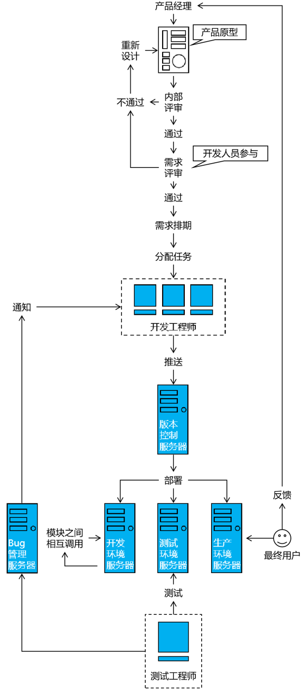
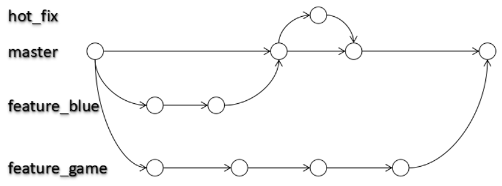
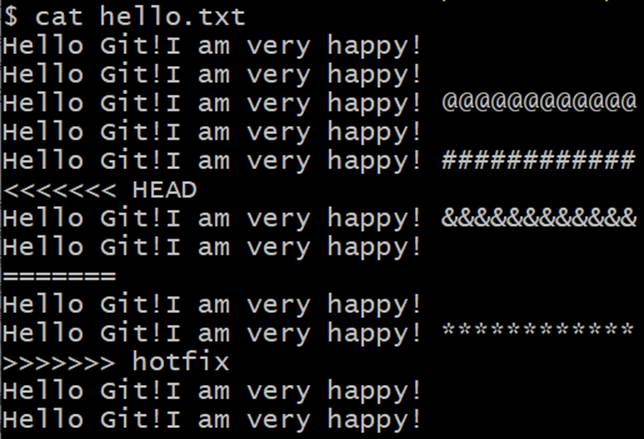
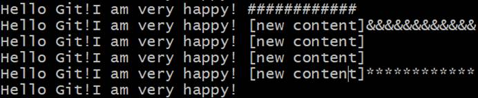
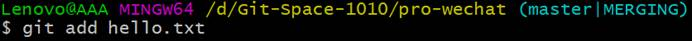
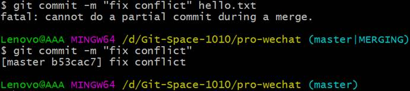

## 常用命令预览

| 命令名称&#xA;                              | 命令作用&#xA;         |
| -------------------------------------- | ----------------- |
| git init&#xA;                          | 初始化本地库&#xA;       |
| git config --global user.name 用户名&#xA; | 设置用户签名的用户名部分&#xA; |
| git config --global user.email 邮箱&#xA; | 设置用户签名的邮箱部分&#xA;  |
| git status&#xA;                        | 查看本地库状态&#xA;      |
| git add 文件名&#xA;                       | 添加到暂存区&#xA;       |
| git commit -m "日志信息" 文件名&#xA;          | 提交到本地库&#xA;       |
| git reflog&#xA;                        | 查看历史记录&#xA;       |
| git reset --hard 版本号&#xA;              | 版本穿梭&#xA;         |

### 初始化版本库

初始化: `git init`
-   查看当前目录产生.git隐藏文件夹
-   注意：当前的 .git 是一个隐藏文件夹，需要在电脑上面设置隐藏文件夹显示设置，否则，看不到这个.git目录

### 新建提交状态

#### 状态

语法 : `git status`
**On branch master** ：表示主分支
**Untracked files** ：表示未跟踪状态

Git工作目录下的文件状态信息：
1. Untracked 未跟踪（未被纳入版本控制）
2. Tracked 已跟踪（被纳入版本控制）
3. Unmodified 未修改状态
4. Modified 已修改状态
5. Staged 已暂存状态

这些文件的状态会随着我们执行Git的命令发生变化,这些文件的状态会随着我们执行Git的命令发生变化
 - 红色表示新建文件或者新修改的文件,都在工作区.
 - 绿色表示文件在暂存区
 -  新建的文件在工作区，需要添加到暂存区并提交到仓库区

也可以使用`git status –s` 使输出信息更加简洁,?? : 表示未跟踪状态

#### 暂存区

##### 添加到暂存区

提交指定文件 : `git add <文件名称>` 
只是增加到栈空间（index文件）中，还没有添加到本地库中。初始化时没有这个index文件。这还是一个新文件，需要将栈空间文件提交到本地仓库。

`git add .`  -> 添加项目中所有文件

> 添加未存在文件会出错：**fatal: pathspec 'xxxx' did not match any files**

##### 撤销暂存区文件

撤销暂存区的文件 : `git reset <文件名称>`

> 撤销后，查看文件状态（git status）文件由绿色变为红色

#### 本地库

将暂存区文件提交到本地库 : `git commit`
执行命令时需要填写提交日志，进入编辑模式

`git  commit –m "注释内容"`  -> 直接用-m参数指定日志内容，推荐

commit 会生成一条版本记录，add只是添加暂存区，不会生成版本记录

>建议多次add后，一次性commit，避免每次add都commit产生版本信息爆炸。

`git commit -am "注释内容"` -> 添加和提交合并命令,代码编辑完成后即可进行 add 和 commit 操作.

### 查看日志

查看日志指令 : `git log`
`git log filename` -> 查看文件日志(查看所有日志或某个文件日志),q退出
`git log --pretty=oneline` -> 如果日志很多,可以在一行显示
`git reflog` -> 查看历史操作

### 回退/穿梭/撤销

#### 回退

回退到历史版本 : `git reset --hard HEAD^`
一次回退一个版本，一个^代表一个版本数量

`git  reset  --hard HEAD~n` -> 回退n次操作

#### 穿梭

`git reflog filename` -> 查看历史操作
`git reset --hard 版本号` -> 回到最新的版本

#### 撤销

撤销修改(还原原来的文件)
 
未add，未commit  :  `git checkout -- filename`
已add，未commit :  `git reset`

### 分支

几乎所有的版本控制系统都以某种形式支持分支。 使用分支意味着你可以把你的工作从开发主线上分离开来，以免影响开发主线。

Git 的master分支并不是一个特殊分支。 它跟其它分支没有区别。 之所以几乎每一个仓库都有 master 分支，是因为git init 命令默认创建它，并且大多数人都懒得去改动它。

#### 实际开发流程



#### 分支概念

在使用版本控制工具开发的过程中，同时推进多个任务



####  分支的好处

同时并行推进多个功能开发，提高开发效率

各个分支在开发过程中，如果某一个分支开发失败，不会对其他分支有任何影响。失败的分支删除重新开始即可。 

#### 分支操作

| 命令名称&#xA;              | 作用&#xA;             |
| ---------------------- | ------------------- |
| `git branch 分支名`   | 创建分支&#xA;           |
| `git branch -v`    | 查看分支&#xA;           |
| `git checkout 分支名` | 切换分支&#xA;           |
| `git merge 分支名`    | 把指定的分支合并到当前分支上&#xA; |

切换分支的**本质就是移动HEAD指针**。

###  实战(版本冲突)

#### 冲突产生的表现



Git使用 `<<<<<<< ========= >>>>>>>>>>` 符号帮我们标记出来，现在产生冲突的内容。
```Txt
<<<<<<< HEAD
Hello Git!I am very happy! &&&&&&&&&&&&&
Hello Git!I am very happy!
======= 
Hello Git!I am very happy!
Hello Git!I am very happy! ************
>>>>>>> hotfix
```
表示HEAD指针指向的位置在冲突中的内容

#### 冲突产生的原因

合并分支时，两个分支在同一个文件的同一个位置有两套完全不同的修改。Git无法替我们决定使用哪一个。必须人为决定新代码内容。

#### 冲突的解决

①编辑有冲突的文件，删除特殊符号，决定要使用的内容



②添加到暂存区



③执行提交（注意：使用git commit命令时不能带文件名）



#### 避免冲突

-   容易冲突的操作方式
    -   多个人同时操作了同一个文件
    -   一个人一直写不提交
    -   修改之前不更新最新代码
    -   提交之前不更新最新代码
    -   擅自修改同事代码
-   减少冲突的操作方式
    -   养成良好的操作习惯 **，先`pull`在修改,修改完立即`commit`和`push`**
    -   一定要确保自己正在修改的文件是最新版本的
    -   各自开发各自的模块
    -   如果要修改公共文件，一定要先确认有没有人正在修改
    -   下班前一定要提交代码,上班第一件事拉取最新代码
    -   一定不要擅自修改同事的代码
