## 团队协作的常用流程

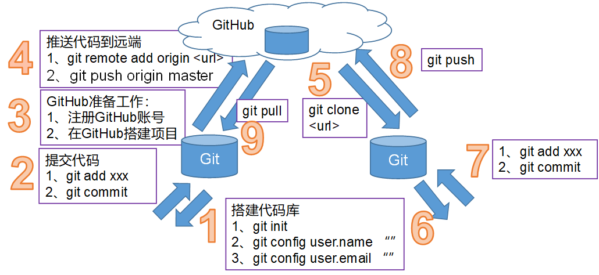

## Fork 跨团队协作

### 概念

现在的情景是，用叉子把别人的东西（copy no cut）叉到你的碗里～

就是把别人的项目clone一份，但是owner变成自己，这样你就可以在遵守Open source license的前提下任意修改这个项目了。

相当于你在原项目的主分支上又建立了一个分支，你可以在该分支上任意修改，如果想将你的修改合并到原项目中时，可以pull request，

这样原项目的作者就可以将你修改的东西合并到原项目的主分支上去，这样你就为开源项目贡献了代码，开源项目就会在大家共同的努力下不断壮大和完善。

### 演示Fork

#### 背景

zhangsan和lisi是一个团队的人，wangwu是另一个团队的人

第三方账号登录（wangwu），搜索某账号找到某项目(zhangsan)，然后点击Fork按钮，这样就将该项目克隆一份到当前账号(wangwu)内，然后进行修改，提交pull request，告诉对方(zhangsan)已经修改了，请求合并；

当前用户登录(zhangsan)后，可以看到小铃铛中的消息提醒，查看到pull request，然后，选择合并或拒绝。

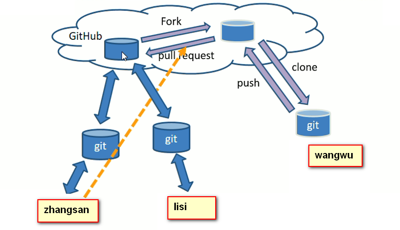

#### 步骤

①\[wangwuatguigu]获取\[zhangsanatguigu]的项目URL(可以进行搜索,也可以通过email发送url地址告知)

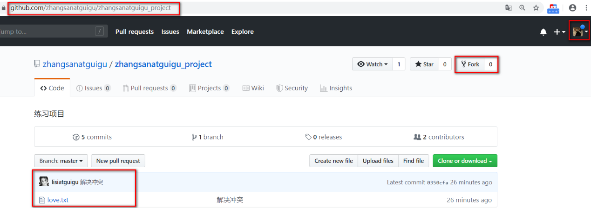

②\[wangwuatguigu]点击\[Fork]，产生分支

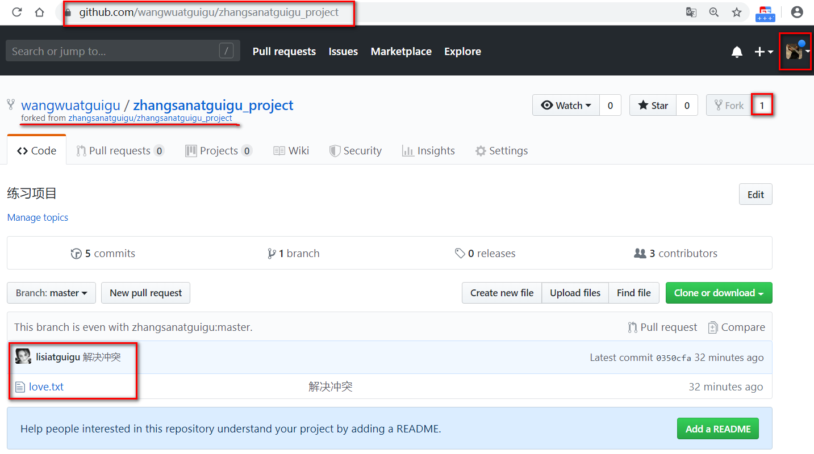

③\[wangwuatguigu]修改项目文件.(可以pull本地后修改,也可以在github上直接进行修改.)

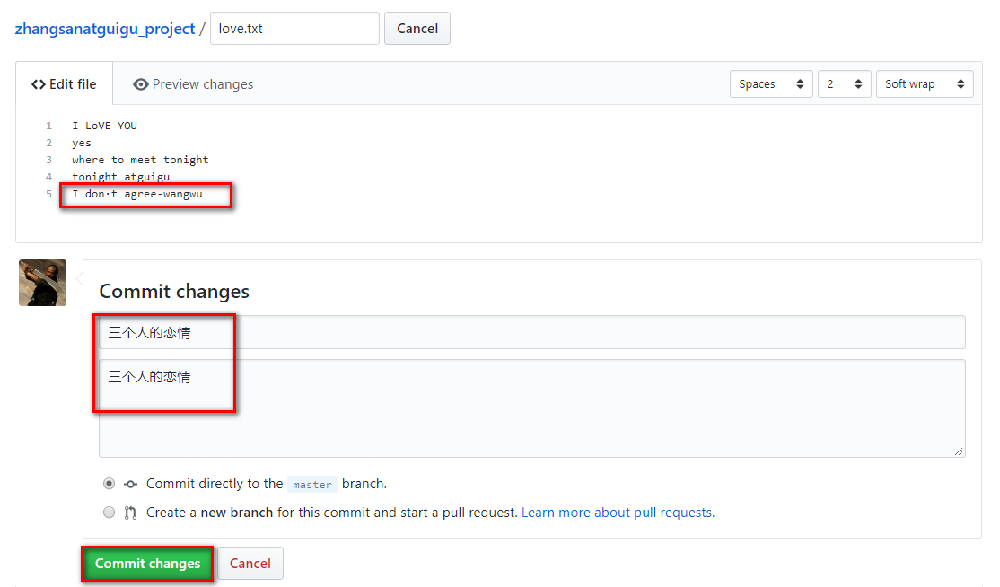

④\[wangwuatguigu]-> \[New pull request]

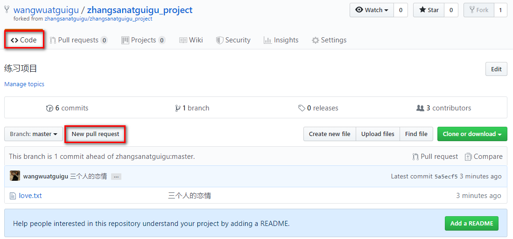

⑤\[wangwuatguigu]->\[Create pull request]->\[填写pull request信息]

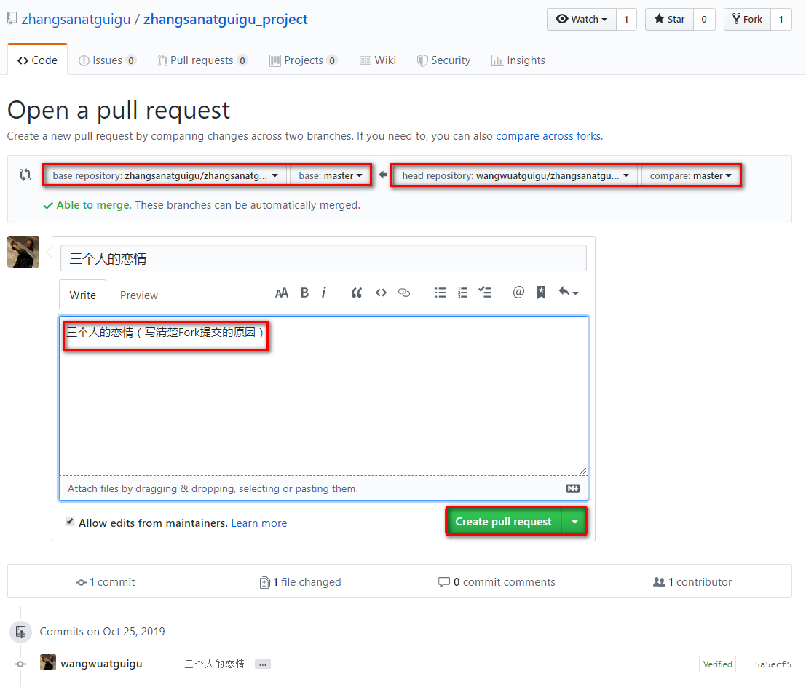

⑥分支已提交到主分支

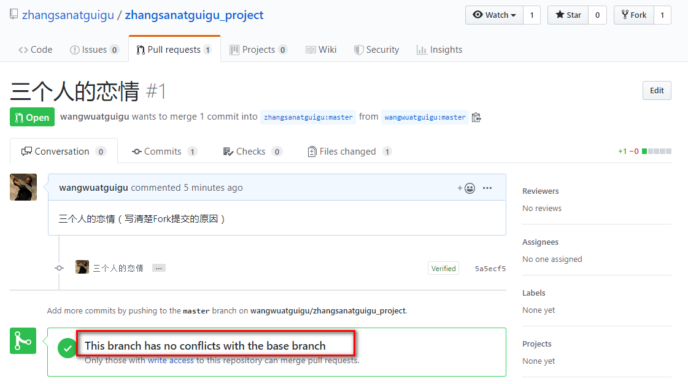

⑦\[zhangsanatguigu]和\[lisiatguigu]都可以看到\[wangwuatguigu]提交的项目内容.

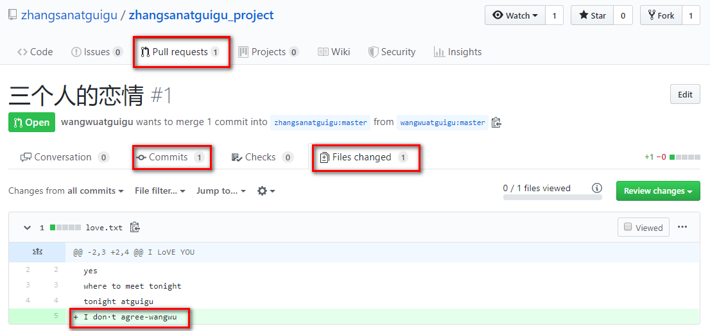

⑧\[zhangsanatguigu]合并项目,点击\[Merge pull request]->点击\[Confirm merge]

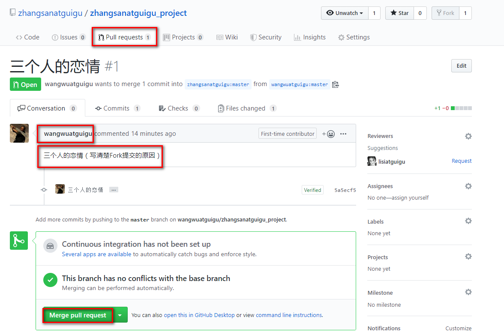

⑨\[zhangsanatguigu]查看项目代码，合并完成，OK

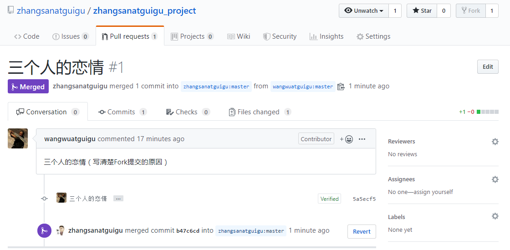

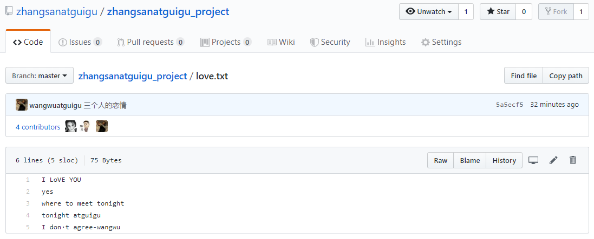

## 解决重复输入密码问题

### 两种模式：https  VS  ssh

ssh模式比https模式的一个重要好处就是，每次push，pull，fetch等操作时不用重复填写用户名密码。

前提是你必须是这个项目的拥有者或合作者，且配好了ssh key

### 如何配置ssh key

①步骤1：检查电脑家目录下是否已经生成了SSH key，如果有.ssh目录删除即可

②步骤2：创建SSH Key : `ssh-keygen -t rsa -C lisiatguigu`

成功的话(执行命令不需要输入任何内容)，会在\~/下生成.ssh文件夹，查看生成两个文件:`id_rsa` 和 `id_rsa.pub`
打开id\_rsa.pub，复制里面的内容，到github上

③步骤3：登录\[lisiatguigu]账户
打开用户设置
点击\[SSH and GPG keys] 填写Title和Key，点击\[Add SSH key]
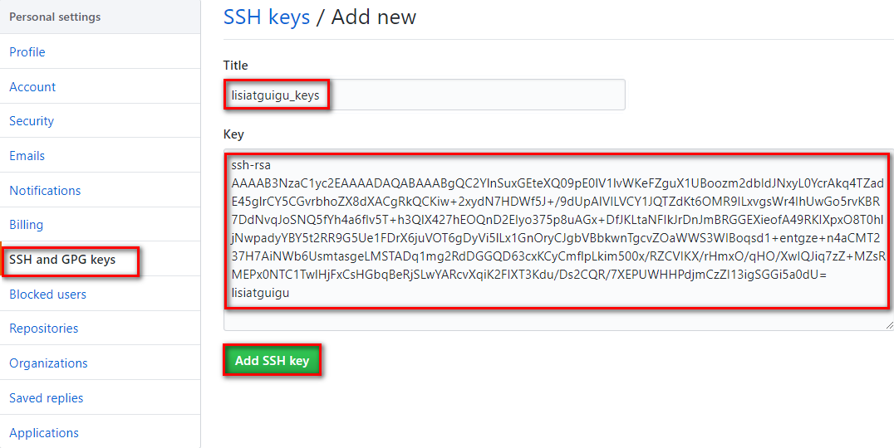

④重新建立github连接,如果之前配置过则删除，重新配置
命令：
`git remote add originssh sshpath`
`git push originssh master`

修改文件，重新提交,不需要再输入用户名和密码了

### 注意问题

一个账户只能设置一个默认密码.
如果有多个账号存在的话，只能选择设置其中某一个

## 配置Git忽略文件

### 哪些文件要忽略

#### Eclipse特定文件

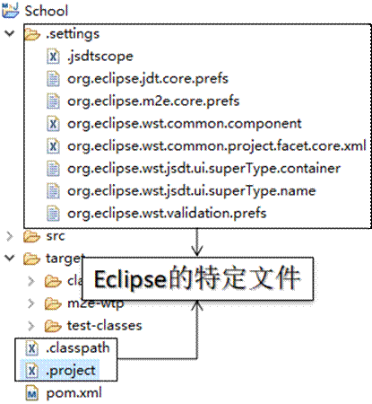

####  IDEA特定文件

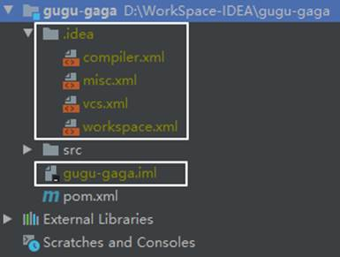

#### Maven工程的target目录

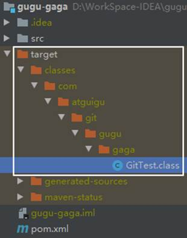

### 为什么要忽略它们

与项目的实际功能无关，不参与服务器上部署运行。把它们忽略掉能够屏蔽IDE工具之间的差异。

### 怎么忽略

#### 创建忽略规则文件（git.ignore）

这个文件的存放位置原则上在哪里都可以，为了便于让`~/.gitconfig`文件引用，建议也放在用户家目录下

```text
# Compiled class file
*.class
 
# Log file
*.log
 
# BlueJ files
*.ctxt
 
# Mobile Tools for Java (J2ME)
.mtj.tmp/
 
# Package Files #
*.jar
*.war
*.nar
*.ear
*.zip
*.tar.gz
*.rar
 
# virtual machine crash logs, see http://www.java.com/en/download/help/error_hotspot.xml
hs_err_pid*
 
.classpath
.project
.settings
target
.idea
*.iml
```

####  在.gitconfig文件中引用忽略规则文件

```纯文本
[user]
name = peter
email = peter@atguigu.com
[core]
excludesfile = C:/Users/xxxxx/git.ignore
```

注意：这里要使用“正斜线（/）”，不要使用“反斜线（\）”
