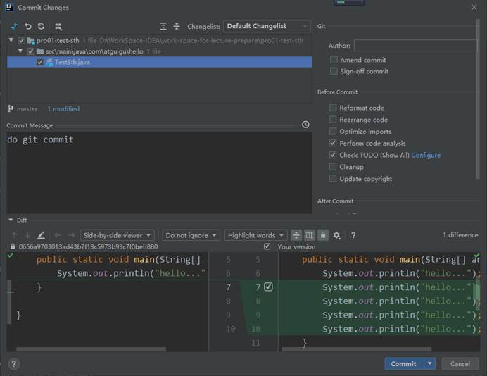

## IDEA集成Git

### 配置Git程序

### 初始化本地库

### 添加到暂存区

### 提交到本地库

### 创建分支

### 切换分支

在IDEA窗口的右下角

### 合并分支

### 解决冲突

在和远程库交互过程中也有可能发生冲突，因为解决办法一样，所以这里按照分支操作过程中产生的冲突来演示。

#### 冲突的产生

仍然是同一个文件在同一个位置有不同内容。

#### 合并分支

#### 看到冲突提示

这里可以直接点“Accept Yours”或者“Accept Theirs”来解决冲突。这代表完全使用我们的内容或完全使用他们的内容。

如果我们想要详细修改冲突内容则点击Close。此时IDEA会提示Resolve

#### 冲突的表现

#### 点击Resolve

#### 点击Merge...

根据需要调整完成后点击“Save changes and finish merging”

然后提交到本地库就好啦！

## 在IDEA中连接GitHub

### 保存GitHub账号

### 分享工程到GitHub

### Clone

### Push

### Pull

