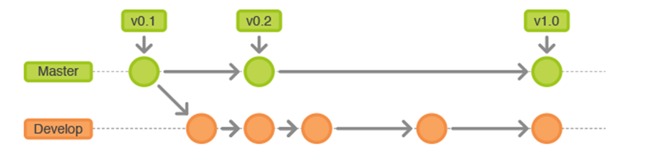
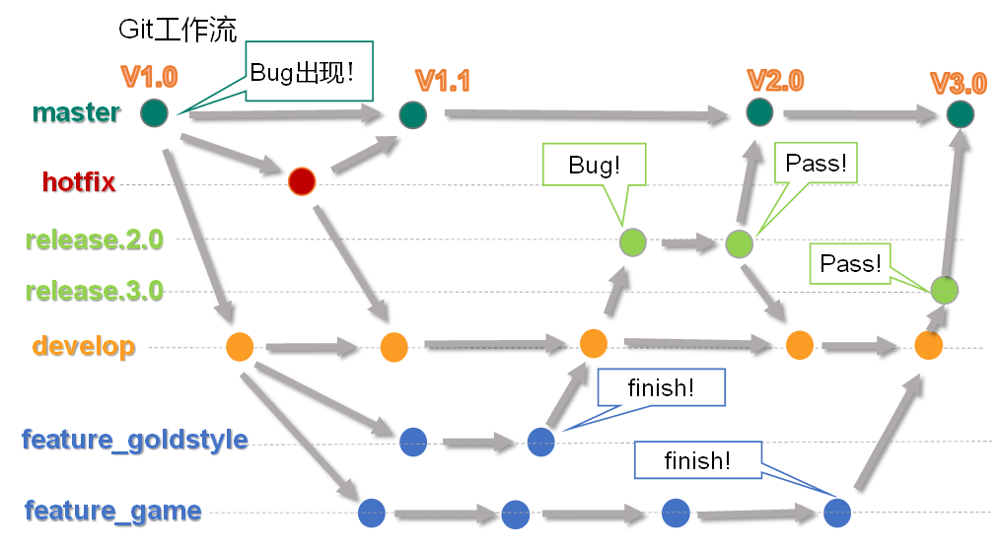
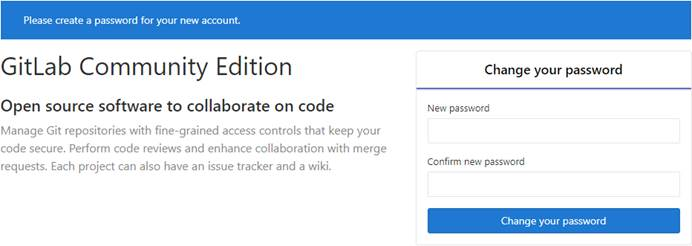

## Git工作流

简单来说就是，一个项目的成员们在工作中统一使用Git的工作方式。

Gitflow工作流通过为功能开发、发布准备和维护设立了独立的分支，让发布迭代过程更流畅。严格的分支模型也为大型项目提供了一些非常必要的结构。

### 分支案例

#### 简单的分支



#### 复杂分支



### 分支种类

#### 主干分支 master

主要负责管理正在运行的生产环境代码。永远保持与正在运行的生产环境完全一致。

#### 开发分支   develop

主要负责管理正在开发过程中的代码。一般情况下应该是最新的代码。

#### bug修理分支  hotfix

要负责管理生产环境下出现的紧急修复的代码。 从主干分支分出，修理完毕并测试上线后，并回主干分支。并回后，视情况可以删除该分支。

#### 发布版本分支  release

较大的版本上线前，会从开发分支中分出发布版本分支，进行最后阶段的集成测试。该版本上线后，会合并到主干分支。生产环境运行一段阶段较稳定后可以视情况删除。

#### 功能分支    feature

为了不影响较短周期的开发工作，一般把中长期开发模块，会从开发分支中独立出来。 开发完成后会合并到开发分支。

## Gitlab私服

注意：要使用CentOS7版本安装，CentOS6版本不行。

### 官网地址

首页：https://about.gitlab.com/
安装说明：https://about.gitlab.com/installation/

### 提前下载所需rpm

yum安装gitlab-ee(或ce)时，需要联网下载几百M的安装文件，非常耗时，所以应提前把所需RPM包下载并安装好。\[ee企业版  ce社区版本]

下载地址是：https://packages.gitlab.com/gitlab/gitlab-ce/packages/el/7/gitlab-ce-10.8.2-ce.0.el7.x86_64.rpm

下载好后上传到Linux系统，习惯上还是放在/opt目录下

### 安装步骤

```Shell
sudo rpm -ivh /opt/gitlab-ce-10.8.2-ce.0.el7.x86_64.rpm
sudo yum install -y curl policycoreutils-python openssh-server cronie
sudo yum install lokkit
sudo lokkit -s http -s ssh
sudo yum install postfix
sudo service postfix start
sudo chkconfig postfix on //设置开机启动
curl "https://packages.gitlab.com/install/repositories/gitlab/gitlab-ce/script.rpm.sh") | sudo bash
sudo EXTERNAL_URL="http://127.0.0.1" yum -y install gitlab-ce
```

当前步骤完成后重启。

> 在安装lokkit -s http -s ss 报错如下，需要关闭防火墙。

### Gitlab服务操作

-   初始化配置 : `gitlab-ctl reconfigure`
-   启动Gitlab服务 : `gitlab-ctl start`
-   停止Gitlab服务 : `gitlab-ctl stop`

### 浏览器访问

访问Linux服务器IP地址即可，如果想访问EXTERNAL_URL指定的域名还需要配置域名服务器或本地hosts文件。
初次登录时需要为gitlab的root用户设置密码。

