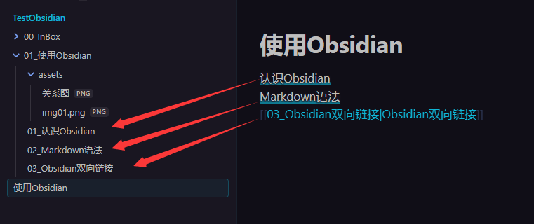
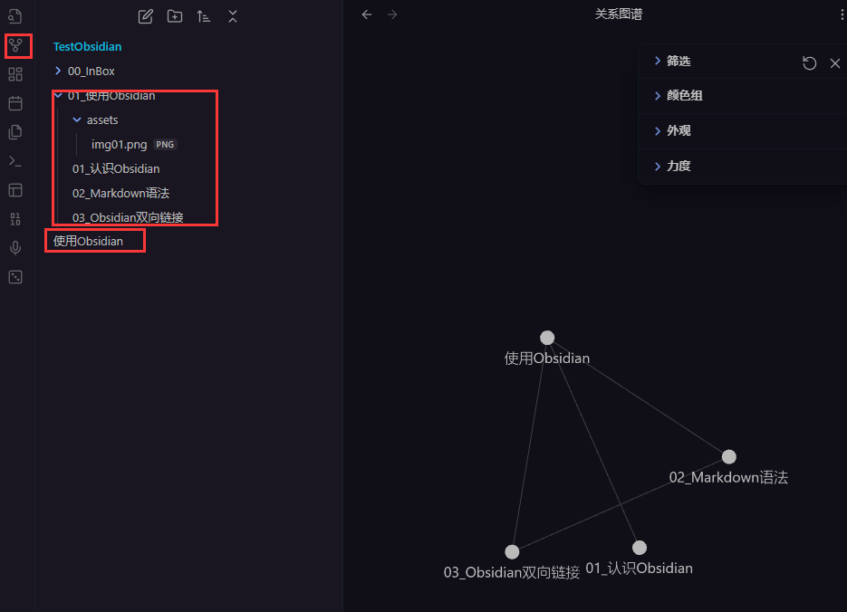

# 了解双向链接

# 语法

## 引入链接

``` txt
	-  链接一个文章 [[02_Markdown语法]]
	-  链接到文章的标题 [[02_Markdown语法#2. 使用Markdown]]
	-  链接到文章的块[[02_Markdown语法#^f261c0]]
		注意块的编号是不能修改的,需要注意一致性
		我们可以手动创建自定义的块编码
	-  链接到文章的字 [[02_Markdown语法#^1d499b|使用]]
```

## 嵌入块


``` txt
	嵌入内容:   ![[02_Markdown语法#^c83780|嵌入]]
```

# 使用

创建目录页,将目录页连接到具体的知识页面,这样建立了完整的链接

