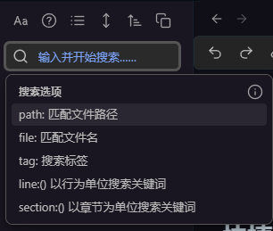
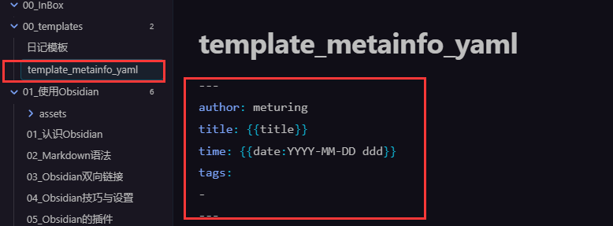
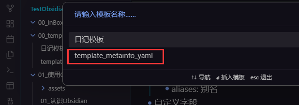
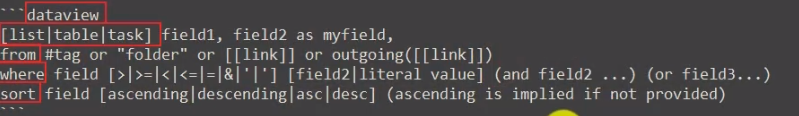
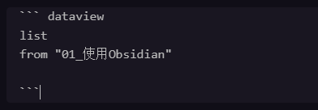
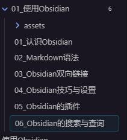
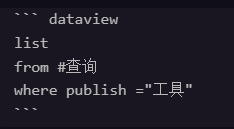
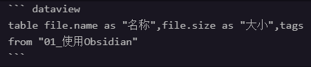
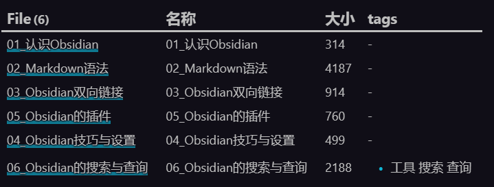

# 搜索

## 快捷键

搜索当前文件: CTRL+F
搜索整个文件夹: CTRL+Shift+F

## 搜索面板

## 搜索的技巧

- 直接搜索
- 搜索多个关键词
	- 空格分隔 : 都包含
	- OR : 只包含其中一个
	- - : 非 包含一个但不包含另一个
- 搜索指定范围
	- 搜索文件名: file:word
	- 搜索文件内容: content:word
	- 搜索标签: tag:word
	- 搜索同一行的多个关键词: line:word1 word2
	- 搜索同意章节中的多个关键词: section:word1 word2
	- 搜索同一段落(块)中的多个关键词 block:word1 word2
- 搜索任务
	- 搜索任务: task:""
	- 搜索未完成任务: task-todo:""
	- 搜索已完成任务: task-done:""
- 保存查询结果
	- 代码 query
		

# 查询

将你的资料库作为一个数据库,使用语法进行查询

## 定义

Obsidian资料库的查询
- 查询对象: Obsidian资料库
- 查询依据: YAML数据/Meatainfo(元数据)

## 场景

- 什么时候使用搜索
	- 条件单一
	- 无需保存结果
- 什么时候使用查询
	- 条件复杂
	- 需要保存结果

## YAML

- 位于Markdown文件开头
- 首尾三个-
	
- Obsidian支持的YAML字段
	- tags: 标签
	- publish: 出版
	- cssclass: 分类
	- aliases: 别名
- 自定义字段
	- category: 范围
	- date: 日期
	- time: 时间
	- title: 标题
	- raling: 评分
- 创建模板
	
	
- 行内标记
	- One Field:Value
	- 这分文档可以打[rating::5] 分
- Obsidian的文件属性
	- file.name: 文件标题(字符串) 
	- file.folder: 文件所属文件夹路径 
	- file.path: 文件路径 
	- file.size: (in bytes) 文件大小 
	- file.ctime: 文件的创建时间（包含日期和时间） 
	- file.mtime: 文件的修改时间 
	- file.cday: 文件创建的日期
	- file.mday: 文件修改的日期
	- file.tags: 笔记中所有标签数组 
	- file.etags: 除去子标签的数组 
	- file.inlinks: 指向此文件的所有传入链接的数组 
	- file.outlinks: 此文件所有出站的链接数组 
	- file.aliases: 文件别名数组 
	- file.day：如果文件名中有日期，那么会以这个字段显示。比如文 件名中包含 yyyy-mm-dd（年-月-日，例如2021-03-21），那么 就会存在这个 metadata。
- 任务属性
	- Task 会继承所在文件的所有字段，比如 Task 所在的页面中已经包 含了 rating 信息了，那么 task 也会有 
	- completed: 任务是否完成 
	- fullyCompleted: 任务以及所有的子任务是否完成 
	- text: 任务名
	- line: task 所在行 
	- path: task 所在路径 
	- section: 连接到任务所在区块
	- link: 连接到距离任务最近的可连接的区块 
	- subtasks: 子任务 
	- real: 如果为 
	- true, 则是一个真正的任务，否则就是一个任务之前 或之后的元素列表 
	- completion: 任务完成的日期 
	- due: 任务到期时间 
	- created: 创建日期 
	- annotated: 如果任务有自定义标记则为 True，否则为 False
- DataView
	- 展示方式
		- Table
		- List 
		- Task

## DataView语法

基本和SQL的语法一致

### 简单的查询语法

### 带条件的查询

### 进阶查询

### 使用建议

可以自动化创建索引
可以根据标签更好的管理自己的页面

注意: Obsidian中使用dataview并不会影响到关系图谱