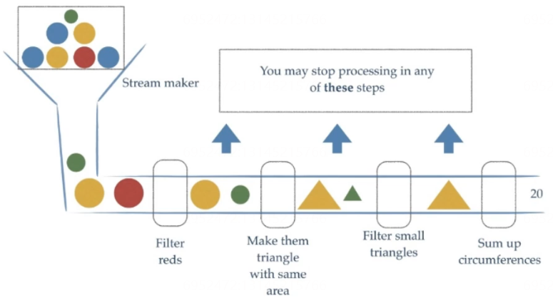
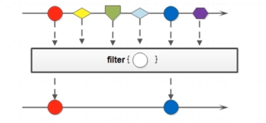
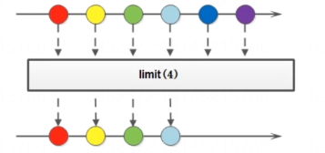
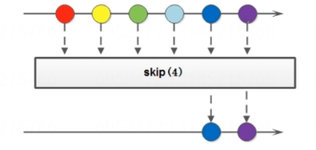
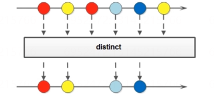
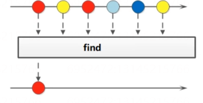
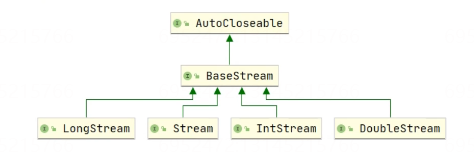
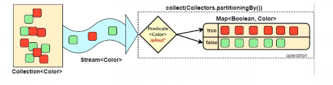

## 集合处理数据的弊端

当我们需要对集合中的元素进行操作的时候, 除了必须的添加\删除\获取 外,比较常用的就是集合的循环

```java
public class demo01 {
    public static void main(String[] args) {
        //素材
        List<String> nameList = Arrays.asList("张三", "张三丰", "李四", "王五");
        //获取所有姓张的名字并且长度为3
        ArrayList<String> arrayList = new ArrayList();
        for (String name : nameList) {
            if (name.startsWith("张")&&name.length()==3) {
                arrayList.add(name);
            }
        }
        for (String s : arrayList) {
            System.out.println(s);
        }
    }
}
```

上面的代码针对与我们不同的需求总是一次次的循环循环循环.  这时我们希望有更加高效的处理方式， 这时我们就可以通过JDK8中提供的Stream API来解决这个问题了。

Stream更加优雅的解决方案:

```java
public class demo01 {
    public static void main(String[] args) {
        //素材
        List<String> nameList = Arrays.asList("张三", "张三丰", "李四", "王五");
        //使用Lambda表达式优化
        List<String> arrayList1 = nameList.stream()
                    .filter(s -> s.startsWith("张"))//过滤张开头的
                    .filter(s -> s.length()==3)//过滤长度等于3
                    .collect(Collectors.toList());//转换成新的List数组
        arrayList1.stream().forEach(System.out::println);//引用方法
    }
}
```

## Stream流式编程思想

Stream流和IO流是没有任何关系的,Stream流式编程思想类似于工厂车间的`生产流水线`,Stream流不是一种数据结构,不保存数据,而是对于数据进行加工处理.&#x20;

我们可以将Stream看做流水线上的一个工序,通过Stream流的多个工序加工得到我们想要的商品.



Stream API能让我们快速完成许多复杂的操作，如筛选、切片、映射、查找、去除重复，统计，匹配和归约。

## Stream流的获取方式

### 根据Collection获取

首先, `Java.Collection`中加入了默认方法:  **`default Stream<E> stream()`**   也就是说 Collection接口下面所有的实现都可以通过该方法获取流

```java
public class demo02 {
    public static void main(String[] args) {
        ArrayList<String> strings = new ArrayList<>();
        Stream<String> stream = strings.stream();

        HashSet<String> strings1 = new HashSet<>();
        Stream<String> stream1 = strings1.stream();

        Vector<String> strings2 = new Vector<>();
        Stream<String> stream2 = strings2.stream();
    }
}
```

但是Map接口并没有实现Collection接口,所以我们需要特殊处理

```java
public class demo02 {
    public static void main(String[] args) {
        HashMap<String, String> stringStringHashMap = new HashMap<>();
        Set<String> strings3 = stringStringHashMap.keySet();//获取全部的Key集合
        Stream<String> stream3 = strings3.stream();
        Collection<String> values = stringStringHashMap.values();//获取全部的Values集合
        Stream<String> stream4 = values.stream();
        Set<Map.Entry<String, String>> entries = stringStringHashMap.entrySet();//获取entrySet集合
        Stream<Map.Entry<String, String>> stream5 = entries.stream();
    }
}
```

### 根据Stream的of方法获取

在一些特殊情况下,我们可以通过Stream方法中的of()静态方法来获取流

```java
public class demo03 {
    public static void main(String[] args) {
        Stream<String> stream1 = Stream.of("张三", "李四");
        stream1.forEach(System.out::println);

        String[] names2 = {"张三","李四"};
        Stream<String> stream2 = Stream.of(names2);
        stream2.forEach(System.out::println);

        // 注意:基本数据类型的数组是不行的,此时我们需要借助Arrays静态类中的stream方法
        int[] names3 = {1,2,3,4};
//        Stream<int[]> stream3 = Stream.of(names3); //获取的是地址信息
        IntStream stream3 = Arrays.stream(names3); //IntStream 
        stream3.forEach(System.out::println);
    }
}
```

> 注意:  
>  基本数据类型的数组使用Stream中的静态方法of是不行的,此时我们需要借助Arrays静态类中的stream方法

## Stream流中的常用方法

Stream流模型的操作很丰富，这里介绍一些常用的APl。这些方法可以被分成两种：

| 方法名      | 方法作用  | 返回值类型  | 方法种类 |
| -------- | ----- | ------ | ---- |
| count    | 统计个数  | long   | 终结   |
| forEach  | 逐一处理  | void   | 终结   |
| fifilter | 过滤    | Stream | 函数拼接 |
| limit    | 取用前几个 | Stream | 函数拼接 |
| skip     | 跳过前几个 | Stream | 函数拼接 |
| map      | 映射    | Stream | 函数拼接 |
| concat   | 组合    | Stream | 函数拼接 |

-   终结方法：
    返回值类型不再是Stream类型的方法，不再支持链式调用。常见终结方法包括count和forEach方法。
-   非终结方法：
    返回值类型仍然是Stream类型的方法，支持链式调用。（除了终结方法外，其余方法均为非终结方法。）

**Stream**注意事项 **(重要)**
1.  Stream只能操作一次
2.  Stream方法返回的是新的流
3.  Stream不调用终结方法，中间的操作不会执行

### ForEach

ForEach用来遍历流中的数据的

```java
void forEach(Consumer<? super T> action);
```

该方法接收一个Consumer接口,会将每一个流元素交给函数处理

```java
public class demo04 {
    public static void main(String[] args) {
        Stream.of("张三", "李四")
                .forEach(System.out::println);
    }
}
```

### Count

Stream流中的Count方法,用来统计流中元素的个数

```java

    long count();
```

返回long类型数据,代表元素的个数

```java
public class demo04 {
    public static void main(String[] args) {
        long count = Stream.of("张三", "李四").count();
        System.out.println(count);
    }
}

```

### Filter

Filter方法的作用是用来过滤数据的,返回符合条件的数据



可以通过Filter方法将一个流转换成另一个子集流

```java

    Stream<T> filter(Predicate<? super T> predicate);
```

该接口接收一个Predicate接口的参数作为筛选的条件

```java
public class demo04 {
    public static void main(String[] args) {
        Stream.of("张三", "李四")
                .filter(s -> s.startsWith("张"))//张三
                .forEach(System.out::println);
    }
}
```

### Limit

Limit方法可以对流进行截取处理,只取前n个数据



```java
    Stream<T> limit(long maxSize);
```

参数是一个long类型的数值,如果当前集合长度大于参数则进行截取,否则不进操作

```java
public class demo04 {
    public static void main(String[] args) {
        Stream.of("张三", "李四")
                .limit(1)//张三
                .forEach(System.out::println);
    }
}
```

### Skip

如果希望跳过前面几个元素,则可以使用Skip进行截取获取一个新的流



```java
    Stream<T> skip(long n);
```

参数是一个long类型的数值,如果当前集合长度大于参数则进行截取,否则按照流最大长度进行截取跳过

```java
public class demo04 {
    public static void main(String[] args) {
        Stream.of("张三", "李四")
                .skip(1)//李四
                .forEach(System.out::println);
    }
}
```

### Map

如果我们需要将流中的元素映射到另一个流中,我们可以使用Map:


```java
    <R> Stream<R> map(Function<? super T, ? extends R> mapper);
```

该方法需要一个Function接口参数,可以将一个T类型的参数转换成R类型的参数,并返回转换后的流

```java
public class demo04 {
    public static void main(String[] args) {
        Integer integer1 = Stream.of("1", "2", "3", "4", "5")
                .map(msg -> Integer.parseInt(msg))
                .reduce(Integer::sum).get();
        System.out.println(integer1);//15
        Integer integer = Stream.of("1", "2", "3", "4", "5")
                .map(Integer::parseInt)
                .reduce(Integer::sum).get();
        System.out.println(integer);//15
    }
}
```

### Sorted

如果需要将数据排序,可以使用sorted方法:

```java

    Stream<T> sorted();

    Stream<T> sorted(Comparator<? super T> comparator);
```

在使用时,可以根据自然排序,也可以根据比较器进行指定排序:

```java
public class demo04 {
    public static void main(String[] args) {
        //根据自然规则排序
        Stream.of("11", "121", "31", "14", "5")
                .map(Integer::parseInt)
                .sorted()//根据数据的自然排序
                .forEach(System.out::println);// 5 11 14 31 121
        //根据比较器排序
        Stream.of("11", "121", "31", "14", "5")
                .map(Integer::parseInt)
                .sorted((o1, o2) -> o2-o1)//根据数据的自然倒序
                .forEach(System.out::println);// 121 31 14 11 5
    }
}
```

### Distinct

如果需要去除重复的数据,可以使用Distinct方法:



```java
    Stream<T> distinct();
```

使用:

```java
public class demo04 {
    public static void main(String[] args) {
        Stream.of("1", "12", "31", "12", "5")
                .distinct()
                .forEach(System.out::println);//1 12 31 5
        //自定义类型需要重新 equals 和 hashCode 方法才可以生效
        Stream.of(new Student("张三",19),
                new Student("李四",19),
                new Student("张三",19))
                .distinct()
                .forEach(System.out::println);
    }
}
```

Stream流中的distinct方法对于基本数据类型是可以直接去重的,对于**自定义数据类型需要重新equals 和 hashCode 方法才可以生效.**

### Match

如果需要判断数据是否匹配指定的条件,可以使用match相关的方法:

```java
    boolean anyMatch(Predicate<? super T> predicate); // 元素是否有任意一个满足条件
    boolean allMatch(Predicate<? super T> predicate);// 元素是否都满足条件
    boolean noneMatch(Predicate<? super T> predicate);// 元素是否都不满足条件
```

使用:

```java
public class demo04 {
    public static void main(String[] args) {
        boolean b1 = Stream.of("1", "12", "31", "12", "5")
                .map(Integer::parseInt)
                .allMatch(s -> s > 0);
        System.out.println(b1);//true
        
        boolean b2 = Stream.of("1", "12", "31", "12", "5")
                .map(Integer::parseInt)
                .anyMatch(s -> s > 0);
        System.out.println(b2);//true
        
        boolean b3 = Stream.of("1", "12", "31", "12", "5")
                .map(Integer::parseInt)
                .noneMatch(s -> s > 0);
        System.out.println(b3);//false
    }
}

```

Match是一个终结方法

### Find

如果我们需要找到某些数据,可以使用find方法来实现:



```java
    Optional<T> findFirst();
    Optional<T> findAny();
```

使用:

```java
public class demo04 {
    public static void main(String[] args) {
             Stream<String> stringStream1 = Stream.of("1", "12", "31", "12", "5");
        Optional<String> first = stringStream1.findFirst();
        System.out.println(first.get());//1
        
        Stream<String> stringStream2 = Stream.of("1", "12", "31", "12", "5");
        Optional<String> any = stringStream2.findAny();
        System.out.println(any.get());//1
    }
}
```

### Max和Min

获取最大值和最小值

```java
    Optional<T> min(Comparator<? super T> comparator);
    
    Optional<T> max(Comparator<? super T> comparator);
```

使用:

```java
public class demo04 {
    public static void main(String[] args) {
        Stream<Integer> integerStream1 = Stream.of("1", "12", "31", "12", "5").map(Integer::parseInt);
        Integer integerMax = integerStream1.max((o1, o2) -> o1 - o2).get();
        System.out.println(integerMax);//31
        
        Stream<Integer> integerStream2 = Stream.of("1", "12", "31", "12", "5").map(Integer::parseInt);
        Integer integerMin = integerStream2.min((o1, o2) -> o1 - o2).get();
        System.out.println(integerMin);//1
    }
}
```

### Reduce

如果需要将所有数据归纳得到一个数据,可以使用Reduce方法:

```java

    T reduce(T identity, BinaryOperator<T> accumulator);

    Optional<T> reduce(BinaryOperator<T> accumulator);

    <U> U reduce(U identity,
                 BiFunction<U, ? super T, U> accumulator,
                 BinaryOperator<U> combiner);
```

使用:

```java
public class demo04 {
    public static void main(String[] args) {
        //求和
        Integer integer2 = Stream.of("1", "2", "3", "4", "5")
                .map(msg -> Integer.parseInt(msg))
                .reduce(0,(x,y) -> x + y);
        System.out.println(integer2);//15
        
        // 获取最大值
        Integer integer3 = Stream.of("1", "2", "3", "4", "5")
                .map(msg -> Integer.parseInt(msg))
                .reduce(0,(x,y) -> {
                    return x>y?x:y;
                });
        System.out.println(integer3);//5
        
        //求和
        Integer integer1 = Stream.of("1", "2", "3", "4", "5")
                .map(msg -> Integer.parseInt(msg))
                .reduce(Integer::sum).get();
        System.out.println(integer1);//15
    }
}
```

```java
public class demo06 {
    public static void main(String[] args) {
        // 统计全部的年龄合
        Stream<Student> studentStream = Stream.of(new Student("张三", 19),
                new Student("李四", 11),
                new Student("王五", 22));
//        Integer reduce = studentStream.map(p -> p.getAge()).reduce(0, (x, y) -> x + y);
        //简化代码
        Integer reduce = studentStream.map(Student::getAge).reduce(0, Integer::sum);
        System.out.println(reduce);//52
    }
}
```

```java
public class demo06 {
    public static void main(String[] args) {
        //统计a出现的次数
        Stream<String> stream1 = Stream.of("a", "v", "a", "2");
        Integer reduce1 = stream1.map(msg -> "a".equals(msg) ? 1 : 0)
                .reduce(0, Integer::sum);
        System.out.println(reduce1);//2
    }
}
```

### MapToInt/MapToDouble/MapToLong

在Stream流中使用包装类Integer时,由于Integer占用的内存会比int高很多,所以会自动装箱和拆箱.

所以为了提高效率,我们可以现将Stream流中的Integer类型数据转换成Int类型,然后再操作



```java
public class demo07 {
    public static void main(String[] args) {
        //原始写法:由Stream进行操作时自动装箱拆箱
        Integer arr[] = {1,2,34,5};
        Stream.of(arr)
                .filter(s->s>0)
                .forEach(System.out::println);
                
        //优化代码:将包装类提前拆箱
        IntStream intStream = Stream.of(arr).mapToInt(Integer::intValue);
        intStream.filter(i->i>0).forEach(System.out::println);
    }
```

### Concat

如果有两个流希望何必成为一个流,可以使用Stream接口的静态方法

```java
public static <T> Stream<T> concat(Stream<? extends T> a, Stream<? extends T> b) {
	Objects.requireNonNull(a);
	Objects.requireNonNull(b);
	
	@SuppressWarnings("unchecked")
	Spliterator<T> split = new Streams.ConcatSpliterator.OfRef<>(
			(Spliterator<T>) a.spliterator(), (Spliterator<T>) b.spliterator());
	Stream<T> stream = StreamSupport.stream(split, a.isParallel() || b.isParallel());
	return stream.onClose(Streams.composedClose(a, b));
}
```

代码:

```java
public class demo08 {
    public static void main(String[] args) {
        //原始写法:由Stream进行操作时自动装箱拆箱
        Stream<String> stream1 = Stream.of("1", "2");
        Stream<String> stream2 = Stream.of("3", "4");
        
        Stream<String> concat = Stream.concat(stream1, stream2);
        concat.forEach(System.out::println);//1 2 3 4
    }
}
```

## 综合案例

定义两个队伍进行操作:
-   1\. 第一个队伍只保留姓名长度为3的成员 &#x20;
-   2\. 第一个队伍筛选之后只要前3人 &#x20;
-   3\. 第二个队伍只要姓张的成员 &#x20;
-   4\. 第二个队伍筛选之后不要前两个人 &#x20;
-   5\. 将两个队伍合并成为一个队伍 &#x20;
-   6\. 根据姓名创建Student对象 &#x20;
-   7\. 打印整个Student信息

```java
public class demo09 {
    public static void main(String[] args) {
        List<String> list1 = new ArrayList<String>();
        list1.add("张三");
        list1.add("张三封");
        list1.add("李四");
        list1.add("王二妹");
        list1.add("赵麻子");
        list1.add("李旺旺");
        Stream<String> list1Stream = list1.stream()
                .filter(name -> name.length() == 3)//第一个队伍只保留姓名长度为3的成员
                .limit(3);//第一个队伍筛选之后只要前3人
        List<String> list2 =  new ArrayList<String>();
        list2.add("张二");
        list2.add("张二妹");
        list2.add("张大脸");
        list2.add("赵旺");
        list2.add("孙火旺");
        list2.add("张无忌");
        Stream<String> list2Stream = list2.stream()
                .filter(name -> name.startsWith("张"))//第二个队伍只要姓张的成员
                .skip(2);//第二个队伍筛选之后不要前两个人
        Stream<String> concat = Stream.concat(list1Stream, list2Stream);//将两个队伍合并成为一个队伍
        Stream<Student> studentStream = concat.map(s -> new Student(s));//根据姓名创建Student对象
        studentStream.forEach(System.out::println);//打印整个Student信息
    }
}
```

输出结果:

```java
Student{name='张三封', age=0}
Student{name='王二妹', age=0}
Student{name='赵麻子', age=0}
Student{name='张大脸', age=0}
Student{name='张无忌', age=0}
```

## Stream结果收集

### 结果收集到集合

```java
   /**
     * Stream结果收集到集合中
     */
    @Test
    public void test(){
        //转换成List
        List<String> collect1 = Stream.of("aa", "bb", "cc","aa")
                .collect(Collectors.toList());
        System.out.println(collect1);//[aa, bb, cc, aa]
        
        //转换成set
        Set<String> collect2 = Stream.of("aa", "bb", "cc","aa")
                .collect(Collectors.toSet());
        System.out.println(collect2);//[aa, bb, cc]
        
        //如果需要获取的类型为具体的实现,比如Arraylist hashset
        ArrayList<String> arr1=Stream.of("aa", "bb", "cc","aa")
                .collect(Collectors.toCollection(ArrayList::new));
        System.out.println(arr1);//[aa, bb, cc, aa]
        
        HashSet<String> arr2 = Stream.of("aa", "bb", "cc", "aa")
                .collect(Collectors.toCollection(HashSet::new));
        System.out.println(arr2);//[aa, bb, cc]
    }
```

### 结果收集到数组

```java
    /**
     * Stream结果收集到集合中
     */
    @Test
    public void test02(){
        Object[] objects = Stream.of("aa", "bb", "cc", "aa").toArray();//返回的元素是object
        System.out.println(Arrays.toString(objects));//[aa, bb, cc, aa]
        
        String[] strings = Stream.of("aa", "bb", "cc", "aa").toArray(String[]::new);//指定返回的类型
        System.out.println(Arrays.toString(strings));//[aa, bb, cc, aa]
    }
```

### 流中的数据进行聚合计算

当我们使用Stream流处理数据后,可以像数据库的聚合函数一样对某个字段进行操作. 比如: 最大值 最小值 求和 平均值  统计数量....

```java
/**
     * Stream流数据聚合计算
     */
    @Test
    public void test03(){
        //获取年龄最大值
   /*     //之前的写法
        Integer integer = Stream.of(
                new Student("张三", 19),
                new Student("李四", 11),
                new Student("王五", 22)
        ).map(Student::getAge).max((p1, p2) -> p1 - p2).get();
        System.out.println(integer);*/
        //使用collect
        //最大值
        Student student = Stream.of(
                new Student("张三", 19),
                new Student("李四", 11),
                new Student("王五", 22)
        ).collect(Collectors.maxBy((p1, p2) -> p1.getAge() - p2.getAge())).get();
        System.out.println("年龄最大的是:"+student);//年龄最大的是:Student{name='王五', age=22}
        //最小值
        Student student1 = Stream.of(
                new Student("张三", 19),
                new Student("李四", 11),
                new Student("王五", 22)
        ).collect(Collectors.minBy((p1, p2) -> p1.getAge() - p2.getAge())).get();
        System.out.println("年龄最小的是:"+student1);//年龄最小的是:Student{name='李四', age=11}
        //求和
        Integer collect = Stream.of(
                new Student("张三", 19),
                new Student("李四", 11),
                new Student("王五", 22)
        ).collect(Collectors.summingInt(Student::getAge));
        System.out.println("年龄和:"+collect);//年龄和:52
        //平均值
        Double collect1 = Stream.of(
                new Student("张三", 19),
                new Student("李四", 11),
                new Student("王五", 22)
        ).collect(Collectors.averagingDouble(Student::getAge));
        System.out.println("年龄平均值:"+collect1);//年龄平均值:17.333333333333332
        
        //数量
        Long collect2 = Stream.of(
                new Student("张三", 19),
                new Student("李四", 11),
                new Student("王五", 22)
        ).collect(Collectors.counting());
        System.out.println("数量:"+collect2);//数量:3
        
    }
```

### 流中的数据进行分组操作

当我们使用Stream流处理数据后,可以根据某个属性将数据分组

```java
   /**
     * 分组计算
     */
    @Test
    public void test04(){
        //根据姓名分组
        Map<String, List<Student>> collect = Stream.of(
                new Student("张三", 19),
                new Student("李四", 11),
                new Student("王五", 22),
                new Student("张三", 29)
        ).collect(Collectors.groupingBy(Student::getName));
//        {
//            李四=[Student{name='李四', age=11}],
//            张三=[Student{name='张三', age=19},
//                 Student{name='张三', age=29}],
//            王五=[Student{name='王五', age=22}]
//        }
        System.out.println(collect);

        //根据年龄分组
        Map<String, List<Student>> collect1 = Stream.of(
                new Student("张三", 19),
                new Student("李四", 11),
                new Student("王五", 22),
                new Student("张三", 29)
        ).collect(Collectors.groupingBy(p -> {
            return p.getAge() >= 18 ? "成年" : "未成年";
        }));
//        {
//            未成年=[Student{name='李四', age=11}],
//            成年=[Student{name='张三', age=19},
//                Student{name='王五', age=22},
//                Student{name='张三', age=29}]
//        }
        System.out.println(collect1);
    }
```

多级分组的操作:

```java
    /**
     * 多级分组计算
     */
    @Test
    public void test05(){
        //先根据姓名分组 再根据年龄分组
        Map<String, Map<String, List<Student>>> collect = Stream.of(
                new Student("张三", 19),
                new Student("李四", 11),
                new Student("王五", 22),
                new Student("张三", 29)
        ).collect(
                Collectors.groupingBy(
                        Student::getName,
                        Collectors.groupingBy(
                                p -> p.getAge() >= 18 ? "成年" : "未成年"
                        )
                )
        );
        System.out.println(collect);
//        {
//            李四={
//                    未成年=[Student{name='李四', age=11}]
//            },
//            张三={
//                    成年=[Student{name='张三', age=19}, Student{name='张三', age=29}]
//            },
//            王五={成年=[Student{name='王五', age=22}]}
//        }
    }
```

### 流中的数据进行分区操作

Collectors.partitioningBy会根据流中的值是否为true,把集合中的数据分割成两个列表: true 和 false



```java
   /**
     * 分区操作
     */
    @Test
    public void test06(){
        Map<Boolean, List<Student>> collect = Stream.of(
                new Student("张三", 19),
                new Student("李四", 11),
                new Student("王五", 22),
                new Student("张三", 29)
        ).collect(Collectors.partitioningBy(p -> p.getAge() > 18));
        System.out.println(collect);
//        {
//            false=[ 
//                    Student{name='李四', age=11}  
//            ], 
//            true=[  
//                    Student{name='张三', age=19}, 
//                    Student{name='王五', age=22},
//                    Student{name='张三', age=29}
//            ]
//        }
    }
```

### 流中的数据进行拼接操作

Collectors.joining会根据指定的方式将流中的所有元素连接成一个字符串

```java
    /**
     * 拼接操作
     */
    @Test
    public void test07(){
        String collect = Stream.of(
                new Student("张三", 19),
                new Student("李四", 11),
                new Student("王五", 22),
                new Student("张三", 29)
        ).map(Student::getName).collect(Collectors.joining());
        System.out.println(collect);//张三李四王五张三
        
        String collect1 = Stream.of(
                new Student("张三", 19),
                new Student("李四", 11),
                new Student("王五", 22),
                new Student("张三", 29)
        ).map(Student::getName).collect(Collectors.joining(","));
        System.out.println(collect1);//张三,李四,王五,张三
        
        String collect2 = Stream.of(
                new Student("张三", 19),
                new Student("李四", 11),
                new Student("王五", 22),
                new Student("张三", 29)
        ).map(Student::getName).collect(Collectors.joining(",","[","]"));
        System.out.println(collect2);//[张三,李四,王五,张三]
    }
```

## 并行的Stream流

### 串行的Stream流

在前面的使用中,我们使用的都是串行的Stream流,在一个线程中一次执行.

```java
    /**
     * 串行流
     */
    @Test
    public void test01(){
        Stream.of(1,2,3,4,5).filter(s->{
            System.out.println(Thread.currentThread()+"/"+s);
            return s>2;
        }).count();
    }
```

输出:

```java
Thread[main,5,main]/1
Thread[main,5,main]/2
Thread[main,5,main]/3
Thread[main,5,main]/4
Thread[main,5,main]/5
```

### 获取并行的Stream流

parallelStream其实就是一个并行执行的流,他通过默认的ForkJoinPool,可以提高多线程任务的速度

```java
    /**
     * 获取并行流的两种方法
     */
    @Test
    public void test02(){
        ArrayList<Integer> list = new ArrayList<>();
        //一: 通过List直接获取并行的流
        Stream<Integer> integerStream = list.parallelStream();
        
        //二: 将已有的Stream流转换成并行流
        Stream<Integer> parallel = Stream.of(1, 2, 3, 4, 5).parallel();
    }
```

我们可以通过两种方法来获取并行的流:
1.  通过List接口中的parallelStream方法来获取
2.  通过已有的串行流转换为并行流

### 并行流的操作

```java
 /**
     * 并行流的操作
     */
    @Test
    public void test03(){
        //将已有的Stream流转换成并行流
        Stream<Integer> parallel = Stream.of(1, 2, 3, 4, 5).parallel();
        parallel.filter(s->{
            System.out.println(Thread.currentThread()+"/"+s);
            return s>2;
        }).count();
    }
```

输出:

```java
Thread[ForkJoinPool.commonPool-worker-11,5,main]/1
Thread[ForkJoinPool.commonPool-worker-9,5,main]/2
Thread[ForkJoinPool.commonPool-worker-2,5,main]/5
Thread[main,5,main]/3
Thread[ForkJoinPool.commonPool-worker-4,5,main]/4
```

我们发现此时,流是通过多个线程进行处理的,并非单一线程,这样可以提高处理的速度.

### 并行流和串行流的对比

通过for循环,串行流 并行流 分别对500000000的数据进行求和,比对执行的时间

```java
public class test03 {
    private static long times = 500000000;

    private long start;
    private long end;

    @Before
    public void before() {
        start = System.currentTimeMillis();
    }

    @After
    public void end() {
        end = System.currentTimeMillis();
        System.out.println("消耗时间:" + (end - start));
    }

    /**
     * 普通for循环
     * 消耗时间:125
     */
    @Test
    public void test01() {
        System.out.println("普通for循环:");
        long res = 0;
        for (long i = 0; i <= times; i++) {
            res += i;
        }
        System.out.println(res);
    }

    /**
     * 串行流
     * 消耗时间:217
     */
    @Test
    public void test02() {
        //rangeClosed 生成初始化的流
        System.out.println("串行流:");
        LongStream.rangeClosed(0, times).reduce(Long::sum);
    }

    /**
     * 并行流
     * 消耗时间:88
     */
    @Test
    public void test03() {
        System.out.println("并行流");
        LongStream.rangeClosed(0, times).parallel().reduce(Long::sum);
    }
}
```

输出:

```java
普通for循环:
消耗时间:125

串行流:
消耗时间:217

并行流
消耗时间:88

```

通过上面的对比,我们发现parallelStream的执行效率是最高的:

因为:Stream并行处理的过程会分而治之,将一个大任务分割成多个小任务,这表示每个任务都由一个线程独立完成

### 并行流的线程安全问题

在多线程的处理下,一定会出现多线程的安全问题:&#x20;

```java
    /**
     * 并行流的数据安全问题
     */
    @Test
    public void test02(){
        //将初始化结果通过异步添加到新数组arrayList 
        ArrayList<Integer> arrayList = new ArrayList<>();
        IntStream.rangeClosed(1,1000)
                .parallel()
                .forEach(arrayList ::add);
        System.out.println(arrayList.size());
    }
```

输出:

```java
972//并没有完全增加

```

或者直接抛出异常


**针对这些问题,我们可以采用以下方法进行处理:**

1. 添加同步锁
```java
/**
 * 并行流的数据安全问题
 */
@Test
public void test02(){
	//将初始化结果通过异步添加到新数组arrayList 
	ArrayList<Integer> arrayList = new ArrayList<>();
	Object o = new Object();
	IntStream.rangeClosed(1,1000)
			.parallel()
			.forEach(s->{
					//同步代码块
					synchronized(o){
						arrayList.add(s);
					}
			 });
	System.out.println(arrayList.size());
}
```

2.   使用线程安全的容器
```java
/**
 * 使用线程安全的容器
 */
@Test
public void test03(){
	Vector vector = new Vector();
	IntStream.rangeClosed(1,1000)
			.parallel()
			.forEach(vector::add);
	System.out.println(vector.size());
}
```

3.  将线程不安全容器转换成线程安全容器
```java
/**
 * 将线程不安全容器转换成线程安全容器
 */
@Test
public void test04(){
	//将arrays结果通过异步添加到新数组
	ArrayList<Integer> arrayList = new ArrayList<>();
	//将线程不安全容器转换成线程安全容器
	List<Integer> integers = Collections.synchronizedList(arrayList);
	IntStream.rangeClosed(1,1000)
			.parallel()
			.forEach(integers::add);
	System.out.println(arrayList.size());
}
```

4. 使用Stream流中的toArray方法或collect方法来操作
```java
/**
 * 我们还可以使用Stream流中的toArray方法或collect方法来操作
 * 满足线程安全的要求
 */
@Test
public void test05(){
	//将arrays结果通过异步添加到新数组
	List<Integer> arrayList = new ArrayList<>();
	arrayList = IntStream.rangeClosed(1, 1000)
			.parallel()
			.boxed()//boxed() 装箱操作,将intStream转换成 Integer类型
			.collect(Collectors.toList());
	System.out.println(arrayList.size());
}
```
