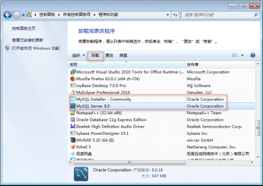

## 数据库基本概念

### 数据

所谓数据（Data）是指对客观事物进行描述并可以鉴别的符号，这些符号是可识别的、抽象的。它不仅仅指狭义上的数字，而是有多种表现形式：字母、文字、文本、图形、音频、视频等。现在计算机存储和处理的数据范围十分广泛，而描述这些数据的符号也变得越来越复杂了。

### 数据库

数据库（Database，DB）指的是以一定格式存放、能够实现多个用户共享、与应用程序彼此独立的数据集合。

### 数据库管理系统

数据库管理系统（Database Management System，DBMS）是用来定义和管理数据的软件。如何科学的组织和存储数据，如何高效的获取和维护数据，如何保证数据的安全性和完整性，这些都需要靠数据库管理系统完成。目前，比较流行的数据库管理系统有：Oracle、MySQL、SQL Server、DB2等。

### 数据库应用程序

数据库应用程序（Database Application System，DBAS）是在数据库管理系统基础上，使用数据库管理系统的语法，开发的直接面对最终用户的应用程序，如学生管理系统、人事管理系统、图书管理系统等。

### 数据库管理员

数据库管理员（Database Administrator，DBA）是指对数据库管理系统进行操作的人员，其主要负责数据库的运营和维护。

### 最终用户

最终用户（User）指的是数据库应用程序的使用者。用户面向的是数据库应用程序（通过应用程序操作数据），并不会直接与数据库打交道。

###  数据库系统

数据库系统（Database System，DBS）一般是由数据库、数据库管理系统、数据库应用程序、数据库管理员和最终用户构成。其中DBMS是数据库系统的基础和核心。

## 数据库类型

### 常见的数据库类型

数据库经过几十年的发展，出现了多种类型。根据数据的组织结构不同，主要分为网状数据库、层次数据库、关系型数据库和非关系型数据库四种。目前最常见的数据库模型主要是：关系型数据库和非关系型数据库。

#### 关系型数据库

关系型数据库模型是将复杂的数据结构用较为简单的二元关系（二维表）来表示，如图1-4所示。在该类型数据库中，对数据的操作基本上都建立在一个或多个表格上，我们可以采用结构化查询语言（SQL）对数据库进行操作。关系型数据库是目前主流的数据库技术，其中具有代表性的数据库管理系统有：Oracle、DB2、SQL Server、MySQL等。


#### 非关系型数据库NOSQL

NOSQL（Not Only SQL）泛指非关系型数据库。关系型数据库在超大规模和高并发的web2.0纯动态网站已经显得力不从心，暴露了很多难以克服的问题。NOSQL数据库的产生就是为了解决大规模数据集合多重数据种类带来的挑战，尤其是大数据应用难题。常见的非关系型数据库管理系统有Memcached、MongoDB，redis，HBase等。&#x20;

### 关系型数据库和非关系数据库

虽然非关系型数据库的优点很多，但是由于其并不提供SQL支持、学习和使用成本较高并且无事务处理，所以本书的重点是关系型数据库。下面我们将介绍一下常用的关系型数据库管理系统。

1.  **Oracle**
    Oracle数据库是由美国的甲骨文（Oracle）公司开发的世界上第一款支持SQL语言的关系型数据库。经过多年的完善与发展，Oracle数据库已经成为世界上最流行的数据库，也是甲骨文公司的核心产品。
    Oracle数据库具有很好的开放性，能在所有的主流平台上运行，并且性能高、安全性高、风险低；但是其对硬件的要求很高、管理维护和操作比较复杂而且价格昂贵，所以一般用在满足对银行、金融、保险等行业大型数据库的需求上。
2.  **DB2**
    DB2是IBM公司著名的关系型数据库产品。DB2无论稳定性，安全性，恢复性等等都无可挑剔，而且从小规模到大规模的应用都可以使用，但是用起来非常繁琐，比较适合大型的分布式应用系统。
3.  **SQL Server**
    SQL Server是由Microsoft开发和推广的关系型数据库，SQL Server的功能比较全面、效率高，可以作为中型企业或单位的数据库平台。SQL Server可以与Windows操作系统紧密继承，无论是应用程序开发速度还是系统事务处理运行速度，都能得到大幅度提升。但是，SQL Server只能在Windows系统下运行，毫无开放性可言。
4.  **MySQL**
    MySQL是一种开放源代码的轻量级关系型数据库，MySQL数据库使用最常用的结构化查询语言（SQL）对数据库进行管理。由于MySQL是开放源代码的，因此任何人都可以在General Public License的许可下下载并根据个人需要对其缺陷进行修改。
    由于MySQL数据库体积小、速度快、成本低、开放源码等优点，现已被广泛应用于互联网上的中小型网站中，并且大型网站也开始使用MySQL数据库，如网易、新浪等。 &#x20;

## MySQL介绍

MySQL数据库最初是由瑞典MySQL AB公司开发，2008年1月16号被Sun公司收购。2009年，SUN又被Oracle收购。MySQL是目前IT行业最流行的开放源代码的数据库管理系统，同时它也是一个支持多线程高并发多用户的关系型数据库管理系统。MySQL之所以受到业界人士的青睐，主要是因为其具有以下几方面优点：

1.  **开放源代码**
    MySQL最强大的优势之一在于它是一个开放源代码的数据库管理系统。开源的特点是给予了用户根据自己需要修改DBMS的自由。MySQL采用了General Public License，这意味着授予用户阅读、修改和优化源代码的权利，这样即使是免费版的MySQL的功能也足够强大，这也是为什么MySQL越来越受欢迎的主要原因。
2.  **跨平台**
    MySQL可以在不同的操作系统下运行，简单地说，MySQL可以支持Windows系统、UNIX系统、Linux系统等多种操作系统平台。这意味着在一个操作系统中实现的应用程序可以很方便地移植到其他的操作系统下。
3.  **轻量级**
    MySQL的核心程序完全采用多线程编程，这些线程都是轻量级的进程，它在灵活地为用户提供服务的同时，又不会占用过多的系统资源。因此MySQL能够更快速、高效的处理数据。
4.  **成本低**
    MySQL分为社区版和企业版，社区版是完全免费的，而企业版是收费的。即使在开发中需要用到一些付费的附加功能，价格相对于昂贵的Oracle、DB2等也是有很大优势的。其实免费的社区版也支持多种数据类型和正规的SQL查询语言，能够对数据进行各种查询、增加、删除、修改等操作，所以一般情况下社区版就可以满足开发需求了，而对数据库可靠性要求比较高的企业可以选择企业版。

**另外，PHP中提供了一整套的MySQL函数，对MySQL进行了全方位的强力支持。**

总体来说，MySQL是一款开源的、免费的、轻量级的关系型数据库，其具有体积小、速度快、成本低、开放源码等优点，其发展前景是无可限量的。

社区版与企业版主要的区别是：
1.  社区版包含所有MySQL的最新功能，而企业版只包含稳定之后的功能。换句话说，社区版可以理解为是企业版的测试版
2.  MySQL官方的支持服务只是针对企业版，如果用户在使用社区版时出现了问题，MySQL官方是不负责任的

## MySQL安装

官方下载地址：[https://dev.mysql.com/downloads/windows/installer/8.0.html](https://dev.mysql.com/downloads/windows/installer/8.0.html "https://dev.mysql.com/downloads/windows/installer/8.0.html")

### 安装步骤

1.  双击MySQL安装文件mysql-installer-community-8.0.18.0.msi，出现安装类型选项:
	
	Developer Default：开发者默认
	Server only：只安装服务器端&#x20;
	Client only：只安装客户端
	Full：安装全部选项
	Custom：自定义安装
2.  选择，然后继续：
	
3.  进入产品配置向导，配置多个安装细节，点击Next按钮即可:
	
4.  高可靠性High Availability，采用默认选项即可:
	
	InnoDB Cluster:InnoDB集群
	Standalone MySQL Server/Classic MySQL Replication:独立MySQL服务器/经典MySQL复制
5.  类型和网络 Type and Networking，采用默认选项即可。记住MySQL的监听端口默认是3306
	
6.  身份验证方法Authentication Method，采用默认选项即可:
	
7.  账户和角色 Accounts and Roles。MySQL管理员账户名称是root，在此处指定root用户的密码。还可以在此处通过Add User按钮添加其他新账户，此处省略该操作。
	
8.  Windows服务：Windows Service
	
	Configure MySQL Server as a Windows Service:给MySQL服务器配置一个服务项
	Windows Service Name:服务名称，采用默认名称MySQL80即可
	Start the MySQL at System Startup：系统启动时开启MySQL服务
9.  Apply Configuration：点击Execute按钮执行开始应用这些配置项
	
	Writing configuration file: 写配置文件。
	Updating Windows Firewall rules：更新Windows防火墙规则
	Adjusting Windows services：调整Windows服务
	Initializing database：初始化数据库
	Starting the server： 启动服务器
	Applying security setting：应用安全设置
	Updating the Start menu link：更新开始菜单快捷方式链接
	如果配置出错，查看右侧的log，查看对应错误信息:
	执行完成后，如下图所示。单击Finish完成安装，进入产品配置环节。
	
10. 产品配置Product Configuration到此结束：点击Next按钮
	
11. 安装完成 Installation Complete。点击Finish按钮完成安装
	

### 检测安装是否成功

1.  安装了Windows Service：MySQL80，并且已经启动
	
2.  安装了MySQL软件。安装位置为：C:\Program Files\MySQL
	
	（MySQL文件下放的是软件的内容）
3.  安装了MySQL数据文件夹，用来存放MySQL基础数据和以后新增的数据。安装位置为C:\ProgramData\MySQL\MySQL Server 8.0
	
	（ProgramData文件夹可能是隐藏的，显示出来即可）
	（MySQL文件下的内容才是真正的MySQL中数据）
4.  在MySQL数据文件夹中有MySQL的配置文件：my.ini。它是MySQL数据库中使用的配置文件，修改这个文件可以达到更新配置的目的。以下几个配置项需要大家特别理解
```txt
port=3306：//监听端口是3306
basedir="C:/Program Files/MySQL/MySQL Server 8.0/"：//软件安装位置
datadir=C:/ProgramData/MySQL/MySQL Server 8.0/Data：//数据文件夹位置
default_authentication_plugin=caching_sha2_password：//默认验证插件
default-storage-engine=INNODB：//默认存储引擎
（这些内容在Linux下可能会手动更改）
```

## MySQL访问

### 登录


访问MySQL服务器对应的命令：mysql.exe ,位置：C:\Program Files\MySQL\MySQL Server 8.0\bin
（mysql.exe需要带参数执行，所以直接在图形界面下执行该命令会自动结束）

打开控制命令台：`win+r`:


执行mysql.exe命令的时候出现错误：


需要配置环境变量path:


注意：控制命令台必须重启才会生效：

登录的命令：**`mysql  -hlocalhost -uroot –p`**

mysql：bin目录下的文件mysql.exe。mysql是MySQL的命令行工具，是一个客户端软件，可以对任何主机的mysql服务（即后台运行的mysqld）发起连接。
```txt
-h：host主机名。后面跟要访问的数据库服务器的地址；如果是登录本机，可以省略
-u：user 用户名。后面跟登录数据的用户名，第一次安装后以root用户来登录，是MySQL的管理员用户
-p: password 密码。一般不直接输入，而是回车后以保密方式输入。
```


### 访问数据库

显示MySQL中的数据库列表：`show databases; `  默认有四个自带的数据库，每个数据库中可以有多个数据库表、视图等对象。

切换当前数据库的命令：`use mysql;`
MySQL下可以有多个数据库，如果要访问哪个数据库，需要将其置为当前数据库。

该命令的作用就是将数据库mysql（默认提供的四个数据库之一的名字）置为当前数据库
显示当前数据库的所有数据库表：`show tables;`

MySQL 层次：不同项目对应不同的数据库组成 - 每个数据库中有很多表  - 每个表中有很多数据


### 退出数据库

退出数据库可以使用quit或者exit命令完成，也可以用\q;  完成退出操作


## MySQL卸载

1.  停止MySQL服务：在命令行模式下执行`net stop mysql`或者在Windows服务窗口下停止服务
    
2.  在控制面板中删除MySQL软件
    
3.  删除软件文件夹：直接删除安装文件夹`C:\Program Files\MySQL`，其实此时该文件夹已经被删除或者剩下一个空文件夹。
4.  删除数据文件夹：直接删除文件夹`C:\ProgramData\MySQL`。此步不要忘记，否则会影响MySQL的再次安装。
    （ProgramData文件夹可能是隐藏的，显示出来即可）
    （MySQL文件下的内容才是真正的MySQL中数据）
5.  删除path环境变量中关于MySQL安装路径的配置

# 虚拟机网络配置(Windows)

我们将Mysql安装到虚拟机环境中,此时我们需要执行以下配置

1.  配置VMware的网络
    配置NAT模式 以及子网:
    
    配置网关:
    
    将虚拟机镜像设置为NAT
    
2.  配置虚拟机的网络
    虚拟机内部IPV4
    
3.  配置Mysql的远程访问
    在cmd命令行连接数据库：`mysql -uroot -p`
    切换mysql数据库：`use mysql;`
    查看user表中的host信息：`select host,user from user;`
    
    可以看到root对应的host是localhost，我们将它改成%即可：`update user set host = '%' where user = 'root';`
    
    刷新权限：`flush privileges;`
4.  测试远程访问
    